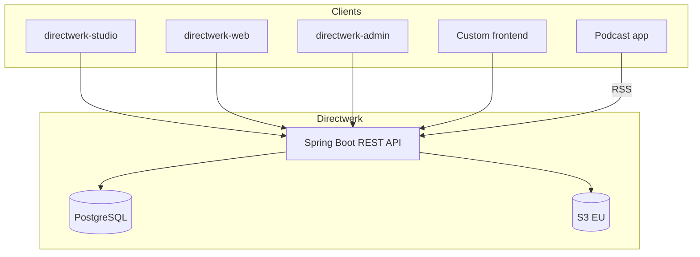

# Directwerk

Multi-tenant, API-first publishing platform for podcast creators and digital publishers who want
their own domain, subscribers, and distribution — without renting Patreon, Steady, or a closed CMS.

**Primary users:** creators in [`directwerk-studio`](directwerk-studio/) and audiences on
[`directwerk-web`](directwerk-web/). **Integrators and agencies** use the same public REST API and
OpenAPI spec; no private shortcuts.

| Layer | What ships | Who uses it |
|-------|------------|-------------|
| **Backend** | Spring Boot API, PostgreSQL, jobs, S3, module gating | All clients |
| **Creator tools** | `directwerk-studio` — Write + Podcast desks, media, products | Tenant admins & editors |
| **Platform ops** | `directwerk-admin` — tenants, modules, audit | `PLATFORM_ADMIN` |
| **Public site** | `directwerk-web` — catalog, auth, subscriber portal, feeds UI | Visitors & subscribers |
| **End-customer UI** | Commissioned site or BYO frontend | Optional per tenant |

Detailed product and architecture reference:
[`docs/platform-design.md`](docs/platform-design.md). Internal doc index:
[`docs/README.md`](docs/README.md).

---

## Monorepo layout

| Path | Role |
|------|------|
| [`Directwerk/`](Directwerk/) | Gradle backend — Spring Boot 4.1, Java 21, Flyway, PostgreSQL |
| [`directwerk-studio/`](directwerk-studio/) | Creator dashboard (port **3003**) |
| [`directwerk-web/`](directwerk-web/) | Public + subscriber site (port **3004**) |
| [`directwerk-admin/`](directwerk-admin/) | Platform superadmin (port **3001**) |
| [`homepage/`](homepage/) | Marketing site + `/developers` API excerpt (port **3005**) |
| [`directwerk-docs/`](directwerk-docs/) | Public VitePress docs (dev **5173**, container **8088**) |
| [`packages/ui`](packages/ui), [`packages/api`](packages/api) | Shared Next.js UI and typed API client |
| [`example-fe/`](example-fe/) | Retained API demo harness (port **3000**) |
| [`docs/`](docs/) | Internal implementation and product docs |

Package namespace: `de.pnnit.directwerk`.

---

## Quick start

**API (day-to-day):** from [`Directwerk/`](Directwerk/) — Postgres + Mailpit via Compose, app via Gradle.

```sh
cd Directwerk
cp .env.example .env          # DB password + OAuth / seed secrets
docker compose up -d          # Postgres :5433, Mailpit SMTP :1025 / UI :8025
./gradlew :directwerk-app:bootRun
```

| URL | Purpose |
|-----|---------|
| http://localhost:8080/actuator/health | Health |
| http://localhost:8080/swagger-ui.html | OpenAPI UI |
| http://127.0.0.1:8025 | Mailpit (captured email) |

**Frontends:** `pnpm install` at repo root, then `pnpm dev` in each app (see app READMEs).

**Full stack in Docker** (API + all frontends + docs):

```sh
docker compose --env-file Directwerk/.env -f docker-compose.full-stack.yaml up --build
```

Authoritative run/deploy guide:
[`Directwerk/docs/build-and-deploy.md`](Directwerk/docs/build-and-deploy.md).

---

## Documentation

| Document | Use when |
|----------|----------|
| [`Directwerk/docs/build-and-deploy.md`](Directwerk/docs/build-and-deploy.md) | Running, building, or deploying the API |
| [`Directwerk/docs/multi-tenancy.md`](Directwerk/docs/multi-tenancy.md) | Host routing, tenant isolation, JWT |
| [`Directwerk/docs/jobs-and-email.md`](Directwerk/docs/jobs-and-email.md) | Job queue, transactional email |
| [`docs/platform-design.md`](docs/platform-design.md) | Full product/architecture design spec |
| [`docs/poc-alpha-setup.md`](docs/poc-alpha-setup.md) | Alpha setup + HTTP harness run order |
| [`docs/directwerk-studio.md`](docs/directwerk-studio.md) | Creator dashboard product context |
| [`docs/asset-storage.md`](docs/asset-storage.md) | S3 upload/confirm, entitlements, CDN |
| [`docs/content-subscriptions-and-entitlements.md`](docs/content-subscriptions-and-entitlements.md) | LEVEL/PACKAGE products and access |
| [`docs/payment.md`](docs/payment.md) | Stripe Connect |
| [`directwerk-docs/`](directwerk-docs/) | **Public** install, operators, API reference |
| [`Directwerk/bruno/`](Directwerk/bruno/) + [`Directwerk/http/`](Directwerk/http/) | Manual API tests — keep in sync with controllers |
| [`AGENTS.md`](AGENTS.md) | Agent-oriented commands, security, domain summary |
| [`docs/README.md`](docs/README.md) | What is current vs historical |

**Regenerate public API docs** after controller changes:

```sh
./Directwerk/gradlew :directwerk-app:exportOpenApi
pnpm --filter directwerk-docs build
```

---

## Platform at a glance



**Core ideas:**

- **Multi-tenancy** — verified `Host` → tenant context; Hibernate tenant filter + JWT cross-check.
- **Feature modules** — `DIGITAL_CONTENT` → `PODCAST` → `PODCAST_RSS` → `FEED_BUILDER`, and in
  parallel → `ARTICLES` → `ARTICLE_RSS` → `ARTICLE_FEED_BUILDER`, and → `BONUS_CONTENT`
  (subscriber downloads); gated with `@RequiresModule`.
- **API-first** — every capability has REST endpoints; OpenAPI is a product deliverable.
- **Entitlements** — `SUBSCRIBER` role ≠ paid access; LEVEL + PACKAGE rules on content and feeds.
- **Assets** — tenant-prefixed S3 keys; private media only via signed URLs after entitlement check.

Roles: `PLATFORM_ADMIN`, `TENANT_ADMIN`, `EDITOR`, `SUBSCRIBER`, `GUEST`.

Billing sources (unified model): `STRIPE`, `PATREON`, `STEADY`, `MANUAL`.

---

## Status (2026-08)

**Shipped:** multi-tenant API, auth, module gates, media upload, podcast + newsletter desks, public
and private RSS, feed builder, subscription products and entitlements, reference studio/web/admin UIs,
Stripe scaffold.

**In progress / env-dependent:** live Stripe billing in production, Patreon/Steady dual-run,
subscriber email notifications, backend CI on every PR.

Historical phase notes: [`docs/poc-alpha-setup.md`](docs/poc-alpha-setup.md).

---

## Stack

Java 21 · Spring Boot 4.1 · Gradle 9 · Flyway 12+ · PostgreSQL 19 (beta) · Hetzner/Bunny S3 (EU) ·
Next.js 16 + Tailwind v4 (`@directwerk/ui`) · Stripe Connect · Patreon/Steady (planned)

---

## Development

```sh
# Backend tests (from Directwerk/)
./gradlew test

# Frontend workspace (from repo root)
pnpm install
pnpm test && pnpm typecheck && pnpm build
```

CI ([`.github/workflows/ci.yml`](.github/workflows/ci.yml)): pnpm test, typecheck, and build for
Next.js apps. Run `./gradlew test` locally before merging backend changes.

---

*Last updated: 2026-08*
