# Whitelabel Publisher Platform

<!-- TOC -->
    * [Whitelabel Publisher Platform](#whitelabel-publisher-platform)
    * [Documentation](#documentation)
    * [Overview](#overview)
        * [Intro](#intro)
        * [MVP Scope](#mvp-scope)
        * [Goals](#goals)
        * [Non-Goals (MVP)](#non-goals-mvp)
        * [Open Decisions](#open-decisions)
    * [Requirements](#requirements)
        * [Functional](#functional)
        * [Non-Functional](#non-functional)
    * [Architecture](#architecture)
        * [System Overview](#system-overview)
        * [Component Responsibilities](#component-responsibilities)
        * [Request Flows](#request-flows)
        * [End-User Journey (Example: Project X)](#end-user-journey-example-project-x)
    * [API as Primary Product](#api-as-primary-product)
        * [Design Principles](#design-principles)
        * [API Consumers](#api-consumers)
        * [Reference Frontends](#reference-frontends)
        * [Tenant Integration](#tenant-integration)
    * [Multi-Tenancy and Whitelabel](#multi-tenancy-and-whitelabel)
        * [Tenant Resolution](#tenant-resolution)
        * [Branding and Domains](#branding-and-domains)
        * [Data Isolation](#data-isolation)
        * [Roles and Permissions](#roles-and-permissions)
    * [Feature Modules](#feature-modules)
        * [Design Principles](#design-principles)
        * [Module Catalog](#module-catalog)
        * [Module Dependencies](#module-dependencies)
        * [Data Model](#data-model)
        * [Backend Implementation](#backend-implementation)
        * [Frontend Integration](#frontend-integration)
        * [Platform Admin API](#platform-admin-api)
        * [Activation Rules](#activation-rules)
    * [Content Model](#content-model)
        * [Publication Types](#publication-types)
        * [Entities](#entities)
        * [Relationships](#relationships)
        * [Publication Workflow](#publication-workflow)
        * [Media Storage and Asset Access](#media-storage-and-asset-access)
            * [S3 Layout](#s3-layout)
            * [Public vs Private Assets](#public-vs-private-assets)
            * [Upload Flow](#upload-flow)
            * [Download and RSS Enclosures](#download-and-rss-enclosures)
            * [MediaAsset Entity](#mediaasset-entity)
        * [Access Control](#access-control)
    * [Patreon and Steady Onboarding](#patreon-and-steady-onboarding)
        * [Migration Strategy](#migration-strategy)
        * [Membership Sync](#membership-sync)
        * [Onboarding Flow](#onboarding-flow)
    * [Podcast and RSS](#podcast-and-rss)
        * [Feed Types](#feed-types)
        * [Feed Endpoints](#feed-endpoints)
        * [RSS Specification](#rss-specification)
        * [Per-Subscriber Private Feeds](#per-subscriber-private-feeds)
        * [Caching](#caching)
    * [Feed Builder](#feed-builder)
        * [Formats and Categories](#formats-and-categories)
        * [Custom Feed Model](#custom-feed-model)
        * [Feed Generation Rules](#feed-generation-rules)
        * [Subscriber UX](#subscriber-ux)
    * [Payments and Billing](#payments-and-billing)
        * [Stripe Connect Model](#stripe-connect-model)
        * [Product Types](#product-types)
        * [Checkout Flow](#checkout-flow)
        * [Subscriptions](#subscriptions)
        * [Entitlements](#entitlements)
        * [Webhooks](#webhooks)
        * [Platform SaaS Billing (Optional)](#platform-saas-billing-optional)
    * [API Design](#api-design)
        * [Conventions](#conventions)
        * [Public API](#public-api)
        * [Admin API](#admin-api)
        * [Billing API](#billing-api)
        * [Feed API](#feed-api)
    * [Authentication and Authorization](#authentication-and-authorization)
        * [Spring Security Architecture](#spring-security-architecture)
        * [Subscriber Identity](#subscriber-identity)
        * [Auth Flows](#auth-flows)
        * [Protected Route Policy](#protected-route-policy)
    * [Reference Frontend (directwerk-web)](#reference-frontend-directwerk-web)
    * [Reference Frontend (directwerk-studio)](#reference-frontend-directwerk-studio)
    * [Platform Superadmin Dashboard](#platform-superadmin-dashboard)
        * [Scope and Separation](#scope-and-separation)
        * [Dashboard Areas](#dashboard-areas)
        * [Dashboard API Endpoints](#dashboard-api-endpoints)
        * [Auth and Security](#auth-and-security)
        * [Deployment](#deployment-1)
    * [Security](#security)
    * [Database and Migrations](#database-and-migrations)
    * [Local Development](#local-development)
    * [Deployment](#deployment)
    * [CI/CD](#cicd)
    * [Testing Strategy](#testing-strategy)
    * [Implementation Checklist](#implementation-checklist)
    * [Flyway](#flyway)
        * [Dependencies](#dependencies)
        * [Configuration](#configuration)
        * [Migration Files](#migration-files)
        * [Example Migrations](#example-migrations)
        * [Development Workflow](#development-workflow)
        * [Gradle Flyway Tasks](#gradle-flyway-tasks)
        * [Testing Migrations](#testing-migrations)
        * [Production and CI](#production-and-ci)
        * [Troubleshooting](#troubleshooting)
    * [Relationship to Existing Projects](#relationship-to-existing-projects)
<!-- TOC -->

## Documentation

This README is the **full platform design spec**. Companion documents drill into implementation,
product strategy, and UI — read them before coding a slice.

| Document | Purpose | When to read |
|----------|---------|--------------|
| [`Directwerk/docs/build-and-deploy.md`](Directwerk/docs/build-and-deploy.md) | **How to run / deploy** — local Gradle + Compose (Postgres, Mailpit), Docker image, Coolify/prod | **Start here to run the API** |
| [`Directwerk/docs/jobs-and-email.md`](Directwerk/docs/jobs-and-email.md) | Postgres job queue, transactional email, worker scaling | Jobs / SMTP / invites |
| [`Directwerk/docs/multi-tenancy.md`](Directwerk/docs/multi-tenancy.md) | Host-based tenancy, isolation, proxy headers | Auth / domain routing |
| [`docs/poc-alpha-setup.md`](docs/poc-alpha-setup.md) | **Alpha POC blueprint** — vertical slices, auth, tenancy, module gates, HTTP harness | Implementation planning |
| [`docs/asset-storage.md`](docs/asset-storage.md) | S3 layout (Hetzner/Bunny EU), upload/confirm, `AssetAccessService`, group entitlements | Phase 2+; alpha storage foundation |
| [`docs/content-subscriptions-and-entitlements.md`](docs/content-subscriptions-and-entitlements.md) | **Operator guide** — FREE/PAID, LEVEL vs PACKAGE, grants, public vs private RSS | Creating public vs entitled content |
| [`docs/directwerk-studio.md`](docs/directwerk-studio.md) | Creator dashboard — audience, journeys, three-app model | Product / frontend planning |
| [`docs/directwerk-studio-implementation.md`](docs/directwerk-studio-implementation.md) | Studio implementation — screens, API mappings, scaffold, auth | Building `directwerk-studio` |
| [`docs/content-creation-implementation.md`](docs/content-creation-implementation.md) | Content backend — libraries, services, workflow engine | Backend + content editors |
| [`docs/content-platform-strategy.md`](docs/content-platform-strategy.md) | Publication platform vs CMS; blog/newsletter scope | Product scope for articles/email |
| [`docs/publication-desks-model.md`](docs/publication-desks-model.md) | Shared Publication rails + Writing vs Podcast desks | Studio UX / domain split |
| [`docs/ghost-positioning.md`](docs/ghost-positioning.md) | Competitive positioning vs Ghost | Sales, prioritization |
| [`docs/product-naming.md`](docs/product-naming.md) | Public product name strategy and naming history | Before public marketing |
| [`Directwerk/http/`](Directwerk/http/) | JetBrains HTTP Client manual API tests | After the API runs locally |
| [`Directwerk/bruno/`](Directwerk/bruno/) | Bruno API collection (full REST surface) — **update on/after every controller or API change** | Manual API testing; keep in sync with controllers |
| [`AGENTS.md`](AGENTS.md) | Agent-oriented summary — commands, security, domain model | AI assistants / quick reference |

**Implementation order:** Alpha backend ([`poc-alpha-setup.md`](docs/poc-alpha-setup.md)) → Studio v0
(settings/team) → media upload (Phase 2c) → podcast CRUD + Studio v2 (Phase 3) → RSS,
subscriptions, billing (post-MVP). See [MVP implementation phases](#mvp-implementation-phases) and
[`poc-alpha-setup.md` § Recommended work sequence](docs/poc-alpha-setup.md#recommended-work-sequence).

---

## Overview

### Intro

**Directwerk** is an API-first, multi-tenant whitelabel platform for podcast creators and digital
publishers who want to own their stack — content, subscribers, and distribution — instead of
renting it from Patreon, Steady, or a closed CMS.

**Primary audience:** non-technical German creators (podcasters, newsletter writers) who create
content in **`directwerk-studio`**, publish to their domain, and reach audiences via **`directwerk-web`**,
RSS, and subscriber email — without APIs or external tools. Agencies and custom frontends integrate
via the same REST contract.

Creators onboard as **tenants** with their own domain and branding. End users register, subscribe
to tenant-defined products, and consume podcasts via RSS in their own podcatcher — or through the
subscriber portal on `directwerk-web`. We handle auth, entitlements, asset storage, and billing
plumbing; tenants own the brand and (optionally) customize the public site.

**The product is the backend** — multi-tenant platform, REST API, **`directwerk-studio`** (content
management), **`directwerk-admin`** (platform ops), plus database, jobs, cache, S3, and CDN. Per tenant,
the **end-customer frontend** is optional: we build it on commission (e.g. `directwerk-web`) or the
customer brings their own — both connect to the same API. Non-technical creators use **`directwerk-studio`**
out of the box; audiences reach content via the tenant frontend, RSS, or email.

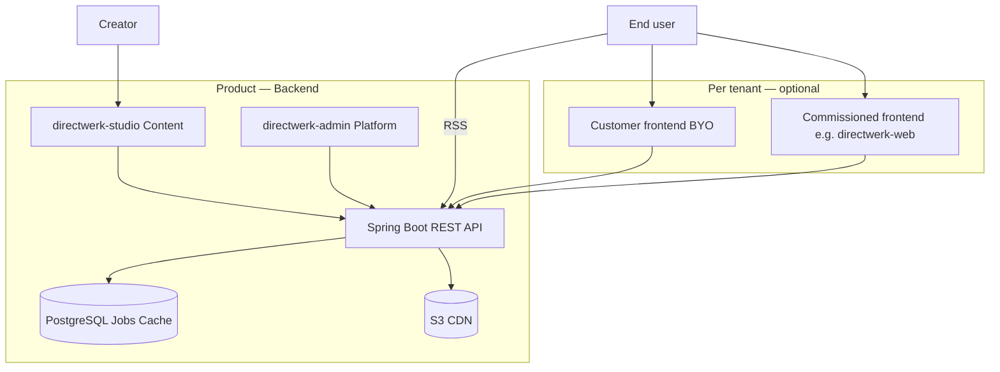

### Elevator pitch

> Fully **multi-tenant / whitelabel** — with optional per-customer frontends.
>
> **The product is the backend:**
> - **Studio** — creator content management (`directwerk-studio`)
> - **Admin dashboard** — platform operations (`directwerk-admin`)
> - **Infrastructure** — database, jobs, cache, S3 asset storage, CDN
> - **API** — REST for everything (content, entitlements, billing, feeds)
>
> **End-customer frontend:** Per tenant, either **built for them** (e.g. `directwerk-web`) or **they
> bring their own** — both integrate via the same API contract.

| Layer | What we ship | Who uses it |
|-------|--------------|-------------|
| **Backend (the product)** | API, Studio, Admin, PostgreSQL, jobs, cache, S3, CDN | Creators (Studio), platform team (Admin), all frontends (API) |
| **End-customer frontend (optional per tenant)** | Commissioned site or customer-built UI | Subscribers, visitors, checkout |

**One-liner (DE):** *Multi-Tenant-Whitelabel-Backend für digitales Publishing — Studio, Admin, API
und Infrastruktur inklusive; Endkunden-Frontend pro Kunde optional (Auftrag oder BYO).*

**One-liner (EN):** *Multi-tenant whitelabel publishing backend — Studio, admin, API, and
infrastructure included; end-customer frontend optional per tenant (commissioned or BYO).*

#### Required features (hard scope)

These must exist for the platform to function — MVP foundation plus the core publishing loop:

| # | Feature | Why it's required |
|---|---------|-------------------|
| 1 | **Multi-tenant whitelabel** | Isolated tenants, custom domains, branding — the business model |
| 2 | **Module system** | Enable capabilities per tenant without forking deployments |
| 3 | **User accounts & role hierarchy** | `SUBSCRIBER` → `EDITOR` → `TENANT_ADMIN` → `PLATFORM_ADMIN` via Spring Security |
| 4 | **Digital content + S3 hosting** | All assets in tenant-scoped object storage; public vs private enforcement |
| 5 | **REST API + OpenAPI** | Every capability exposed as a versioned HTTP contract — no UI-only workflows |
| 6 | **Podcast content management** | Series, episodes, formats, categories — primary content type at launch |
| 7 | **Publish workflow** | Draft, schedule, publish, archive — shared across content types |

#### Optional addons (enable per tenant, later phases)

Tenants activate these via the module system as they grow — not required for MVP:

| Addon | Module(s) | What it unlocks |
|-------|-----------|-----------------|
| **Public + private RSS** | `PODCAST_RSS` | Free discovery feed + per-subscriber private feeds |
| **Subscription products** | `SUBSCRIPTION` | LEVEL (tier ladder) and PACKAGE (scoped access) products |
| **Feed builder** | `FEED_BUILDER` | Subscribers compose custom RSS by format |
| **Stripe billing** | `STRIPE_BILLING` | Checkout, Customer Portal, Connect payouts |
| **Patreon migration** | `PATREON_SYNC` | Import members, dual-run sync, shadow-user claim |
| **Steady migration** | `STEADY_SYNC` | Same for Steady publishers |
| **Digital bonus files** | `DIGITAL_CONTENT` + `SUBSCRIPTION` | PDFs, ebooks behind package rules |
| **Platform superadmin UI** | `directwerk-admin` | Full ops console (MVP: minimal tenant/module CRUD) |
| **Reference creator dashboard** | `directwerk-studio` | Default publisher back-office for non-technical creators |
| **Reference whitelabel UI** | `directwerk-web` | Default public site + subscriber portal — agencies may replace |
| **Articles, video, ebooks** | `DIGITAL_CONTENT` extensions | Additional publication types |
| **One-time purchases** | `STRIPE_BILLING` | Single episode / file sales |
| **Platform SaaS billing** | Post-MVP | Tenants pay us; modules tied to platform plan |
| **Email notifications** | Post-MVP | New episode alerts via Mailgun |
| **Outbound webhooks** | Post-MVP | Tenant automation hooks |
| **GDPR export/delete** | Post-MVP | Compliance hardening |

**Stack (planned):** Java 21 · Spring Boot 4.1.0 · Gradle 9.x · Flyway 12+ · PostgreSQL 19 (beta) ·
S3-compatible object storage · Stripe Connect · Patreon/Steady API sync

| Component | Version | Notes |
|-----------|---------|-------|
| Spring Boot | **4.1.0** | Spring Framework 7.x; Jakarta EE 11 baseline |
| Gradle | **9.x** (8.14+ min) | Required by Spring Boot 4.1 Gradle plugin |
| Flyway | **12+** | Via `spring-boot-starter-flyway` BOM (SB 4.1 ships 12.4.0) |
| PostgreSQL | **19 (beta)** | Dev: `postgres:19beta1-alpine`; production TBD at GA |
| Java | **21** | Spring Boot 4.1 supports JDK 17–26; we target 21 |

**Reference frontends:** Next.js 16 — `directwerk-studio` (creator dashboard), `directwerk-web` (public +
subscriber site), `directwerk-admin` (platform ops)

**Package:** `de.pnnit.directwerk`

**Status:** Alpha backend in active development. Multi-tenant Spring Boot app, module gates, storage
plumbing, podcast content (series/episodes/formats), episode streaming, public + private subscriber
RSS, and real LEVEL/PACKAGE entitlements are implemented — see
[`docs/poc-alpha-setup.md`](docs/poc-alpha-setup.md) and
[`docs/phase-2e-4-4b-implementation.md`](docs/phase-2e-4-4b-implementation.md) for what's shipped vs.
open. Still design-only: feed builder, Stripe/Patreon/Steady billing, `EMAIL_NOTIFY`, articles, and the
`directwerk-admin`/`directwerk-web` reference frontends. Full doc index: [Documentation](#documentation).

### MVP Scope

The **MVP** is the platform foundation tenants and integrators need before paid distribution
features (RSS, subscriptions, billing sync) ship. Everything else in this document builds on
these four pillars.

#### MVP pillars

| # | Pillar | MVP delivers | Implementation phase |
|---|--------|--------------|----------------------|
| 1 | **Multi-tenant** | Tenant isolation, whitelabel domains, branding, `TenantContext` via `Host` + JWT | Phase 1 |
| 2 | **Module system** | Runtime gating per tenant (`FeatureModule`, `TenantModuleActivation`, `@RequiresModule`) | Phase 1 |
| 3 | **User accounts & roles** | Spring Security; subscriber → editor → tenant admin → superadmin | Phase 1 + 4b |
| 4 | **Digital content + S3** | Upload, store, publish, serve assets via S3-compatible storage | Phase 2–3 |

#### MVP role model

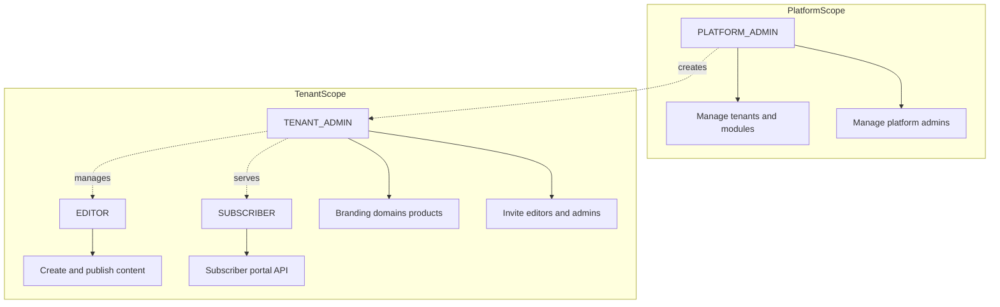

| Role | Scope | MVP capabilities |
|------|-------|------------------|
| `SUBSCRIBER` | Single tenant | Register/login, view public content; portal APIs when modules active |
| `EDITOR` | Single tenant | Create, edit, schedule, publish digital content |
| `TENANT_ADMIN` | Single tenant | Editor capabilities + branding, domains, formats/categories |
| `PLATFORM_ADMIN` | Platform (no tenant) | Create/suspend tenants, activate modules, invite tenant admins |

#### MVP vs full platform

| Area | MVP (ship first) | Post-MVP |
|------|------------------|----------|
| Tenancy & whitelabel | Yes | — |
| Module activations | Yes | Platform SaaS billing tied to modules |
| Spring Security + roles | Yes | Shadow-user claim (Patreon import) |
| S3 content pipeline | Yes | Video-on-demand |
| Podcast CRUD | Yes | Articles, ebooks |
| Public + private RSS | No | Phase 4 |
| Subscription products | No | Phase 4b/8 |
| Feed builder | No | Phase 7 |
| Stripe / Patreon / Steady | No | Phase 6/8 |
| `directwerk-admin` dashboard | Minimal API (alpha) | Full audit, health views |
| `directwerk-studio` creator dashboard | Studio v0–v2 with podcast publish | Subscribers, products, articles |
| `directwerk-web` public + subscriber site | Bundled default for creators (may trail Studio v2 slightly) | Feed builder UI, full portal |

#### Alpha POC (before MVP content)

The **alpha slice** ([`docs/poc-alpha-setup.md`](docs/poc-alpha-setup.md)) proves pillars 1–3 plus
storage **plumbing** in one runnable backend — **no** podcast CRUD, upload endpoints, RSS, or UI yet.

| Alpha delivers | Deferred to post-alpha |
|----------------|------------------------|
| Multi-tenant isolation (`Host` + JWT, row-level guards) | Full upload/confirm pipeline (Phase 2c) |
| Module catalog, presets, dependency/cascade rules | Podcast series/episodes (Phase 3) |
| Spring Security (OAuth2 AS + RS, all five roles) | Real entitlements LEVEL/PACKAGE (Phase 4b) |
| `MediaAsset` schema + S3 beans + `AssetAccessApi` stub | `directwerk-studio` / `directwerk-web` UI |
| Platform + tenant admin API surface | Private signed URLs, RSS feeds |

Alpha success = all [`http/*.http`](http/) scenarios green against local dev seed.

#### MVP implementation phases

0. **Alpha** — [`docs/poc-alpha-setup.md`](docs/poc-alpha-setup.md): bootstrap, tenancy, auth, modules, storage foundation, HTTP harness
1. **Phase 1** — *(folded into alpha)* Gradle, Flyway V1–V5, OpenAPI, vertical slice layout
2. **Phase 2** — Digital content: pre-signed upload/confirm, `AssetAccessService`, **Studio v1** media library
3. **Phase 3** — Podcast: series, episodes, formats, categories, publish workflow, **Studio v2**
4. **Studio v0** — Settings + team UI (can parallel Phase 2 once alpha API is green)
5. **Phase 4** — Public + private RSS feeds
6. **Phase 4b** — Subscription products, `EntitlementService`, subscriber `/me/*` APIs
7. **Phase 5** — `directwerk-admin` superadmin UI (alpha ships platform API only)
8. **Phase 6** — Patreon/Steady onboarding + dual-run sync
9. **Phase 7** — Feed builder
10. **Phase 8** — Stripe Connect billing
11. **Phase 9** — `directwerk-web` default tenant site + subscriber portal
12. **Post-MVP** — Articles, `EMAIL_NOTIFY`, analytics, `CMS_SYNC` integrator tier

Phases 4–8 are **post-MVP** for a podcast-only creator loop; **Studio v2 + directwerk-web** are the
creator-facing MVP per [`docs/directwerk-studio.md`](docs/directwerk-studio.md).

#### MVP success criteria

- [ ] Two tenants on one deployment with zero cross-tenant data leakage
- [ ] Superadmin creates tenant, activates `DIGITAL_CONTENT` + `PODCAST`, invites tenant admin
- [ ] Tenant admin uploads audio via pre-signed URL; asset lands in correct S3 prefix
- [ ] Editor publishes episode; public metadata available via `GET /api/v1/public/episodes`
- [ ] Subscriber registers on tenant domain; JWT contains correct `tenant_id` and `ROLE_SUBSCRIBER`
- [ ] Module disabled → API returns `403 FEATURE_NOT_ENABLED`
- [ ] `GET /api/v1/public/site-config` returns branding + `enabledModules`

### Goals

Full-platform goals (MVP + post-MVP addons):

1. **API as the product** — complete REST surface for every feature; no capability requires our UI
2. **Podcast-first** — episode ingest, scheduling, publish, and RSS distribution are the core loop
3. **Patreon/Steady onboarding** — import creators, products, and subscribers; sync or migrate membership
4. **Dual feed model** — public free feed + private per-subscriber feed URL (unguessable token)
5. **Feed builder** — subscribers self-compose custom RSS feeds by selecting formats/categories
6. **Multi-tenant whitelabel** — custom domains, branding, and isolated tenant data
7. **Subscription management** — recurring access via subscription products (LEVEL + PACKAGE); Stripe primary billing
8. **Modular features** — selectively enable capability bundles per tenant
9. **Platform dashboard** — web UI for superadmins to manage tenants, modules, and tenant admins
10. **Documented integration** — OpenAPI spec, versioned endpoints, predictable error contracts for customer-built frontends
11. **S3-only assets** — all files in tenant-scoped object storage; public vs private visibility enforced at key prefix and URL layer

### Non-Goals (MVP)

Items below are **post-MVP** or explicitly out of scope for the initial release. See [MVP vs full platform](#mvp-vs-full-platform).

- Public/private RSS feeds, subscription products, feed builder, Stripe/Patreon/Steady — post-MVP phases
- Advanced non-podcast publication types (articles, ebooks, video-on-demand UI)
- Live streaming / webinar hosting
- Built-in email marketing (integrate via webhooks later)
- Mobile native apps (podcast apps consume RSS)
- Replacing Patreon/Steady community features (comments, DMs, polls)
- Shipping a mandatory bundled UI for every tenant — API is sufficient for agencies; **`directwerk-studio` + `directwerk-web` are the default** for non-technical creators
- Course booking / slot management (belongs in [`projects/courses/`](../courses/))

### Open Decisions

Record decisions here before implementation begins.

| # | Decision | Recommended | Alternative | Chosen |
|---|----------|-------------|-------------|--------|
| 1 | Project placement | New `projects/directwerk/` | Extend `projects/courses/` | TBD |
| 2 | Tenant payouts | Stripe Connect | Platform Stripe account + manual settlement | TBD |
| 3 | Tenant-facing UI | **`directwerk-studio` + `directwerk-web` bundled default**; API for agencies/custom frontends | API-only; customer builds everything | **Bundled default** |
| 4 | Superadmin dashboard | **Separate app** (`projects/directwerk-admin/`) | Section inside directwerk-web | **Separate app** |
| 5 | Publisher admin for tenants | **`directwerk-studio`** (default); API for integrators | Customer builds via API only | **`directwerk-studio`** |
| 6 | Premium distribution | **Per-subscriber private feed URL** (token) + public free-only feed | Signed enclosure URLs in public feed | **Private feeds** |
| 7 | Patreon/Steady during migration | **Dual-run sync** — OAuth + webhook membership sync while billing transitions | Big-bang cutover with CSV import only | TBD |
| 8 | Format vs category | **Format** = episode content type (Interview, Bonus); **Category** = optional second axis (Season, Topic) | Single tagging dimension only | TBD |
| 9 | Custom feed limit | Max 5 custom feeds per subscriber | Unlimited | TBD |
| 10 | Module implementation | **Runtime gating** in single monolith (`@RequiresModule` + DB activations) | Separate deployable per module | **Runtime gating** |
| 11 | Multiple active subscriptions | **Cumulative (union)** — combined access from all active products | Exclusive single product | **Union** |
| 12 | User accounts | **Spring Security** — Authorization Server + Resource Server in monolith | Custom JWT stack | **Spring Security** |
| 13 | CMS / editorial | **Publication platform + integrate ESP** — not a block-editor CMS | Build full CMS; Ghost as default backend | **Integrate** — see [`docs/content-platform-strategy.md`](docs/content-platform-strategy.md) |
| 14 | Public product name | **Directwerk** (see [`docs/product-naming.md`](docs/product-naming.md)) | Keep “Publish” as codename only; **Eigenplatz** as backup | **Directwerk** |

---

## Requirements

### Functional

1. **Creator onboarding** — sign up tenant, connect Patreon and/or Steady OAuth, optional Stripe Connect
2. **Migration import** — pull subscription products, member list, and historical metadata from Patreon/Steady
3. **Membership sync** — keep subscriber status in sync during dual-run (webhooks + periodic poll)
4. **Episode management** — CRUD podcast episodes; assign formats/categories and access level
5. **Media upload** — all files in S3-compatible storage; tenant-scoped; public vs subscription-private
6. **Publishing** — draft, schedule, publish; slug uniqueness per tenant
7. **Public free RSS** — tenant/series feed with `FREE` episodes only (for Apple Podcasts / Spotify discovery)
8. **Private subscriber RSS** — one default private feed URL per subscriber (all entitled episodes)
9. **Feed builder** — subscriber creates named custom feeds by selecting formats/categories (self-service)
10. **Entitlement engine** — episode inclusion in any feed filtered by subscription product access
11. **Subscriptions** — LEVEL and PACKAGE products (Stripe primary; Patreon/Steady mapped during migration)
12. **Stripe webhooks** — idempotent billing events; Patreon/Steady webhook handlers for membership changes
13. **Subscriber portal API** — feed URLs, feed builder CRUD, subscription status (UI-agnostic)
14. **Publisher API** — episode management, analytics endpoints (UI-agnostic)
15. **Complete OpenAPI documentation** — every public, subscriber, and publisher endpoint documented
16. **Machine-readable site config** — `site-config` for customer frontends to bootstrap branding and modules
17. **Subscriber registration** — end users register per tenant via Spring Security; global account with tenant membership
18. **Subscription products** — tenants define LEVEL (tier ladder) or PACKAGE (scoped access) products
19. **Entitlement portal** — subscribers see what they can access via `GET /api/v1/me/access`
20. **Customer-built frontends** — tenants integrate via API for catalog, checkout, feed builder, billing self-service (see [End-User Journey](#end-user-journey-example-project-x))

### Non-Functional

1. **Tenant isolation** — no cross-tenant data leakage (DB + cache + **S3 key prefix per tenant**)
2. **Availability** — stateless API; horizontal scaling behind Traefik
3. **Performance** — paginated APIs; cached RSS; CDN for public media
4. **Security** — OWASP-aligned; secrets in env vars; webhook signature verification
5. **Observability** — structured logs, Actuator health, metrics (Micrometer)
6. **Compliance** — GDPR-friendly data export/delete hooks (Post-MVP hardening)
7. **Backup** — automated PostgreSQL backups (align with [`deployment/configs.md`](../../deployment/configs.md))
8. **API stability** — versioned paths (`/api/v1/`); breaking changes only in new major version
9. **Integrator experience** — consistent JSON envelope, stable error codes, OpenAPI export, example flows in docs

---

## Architecture

### System Overview

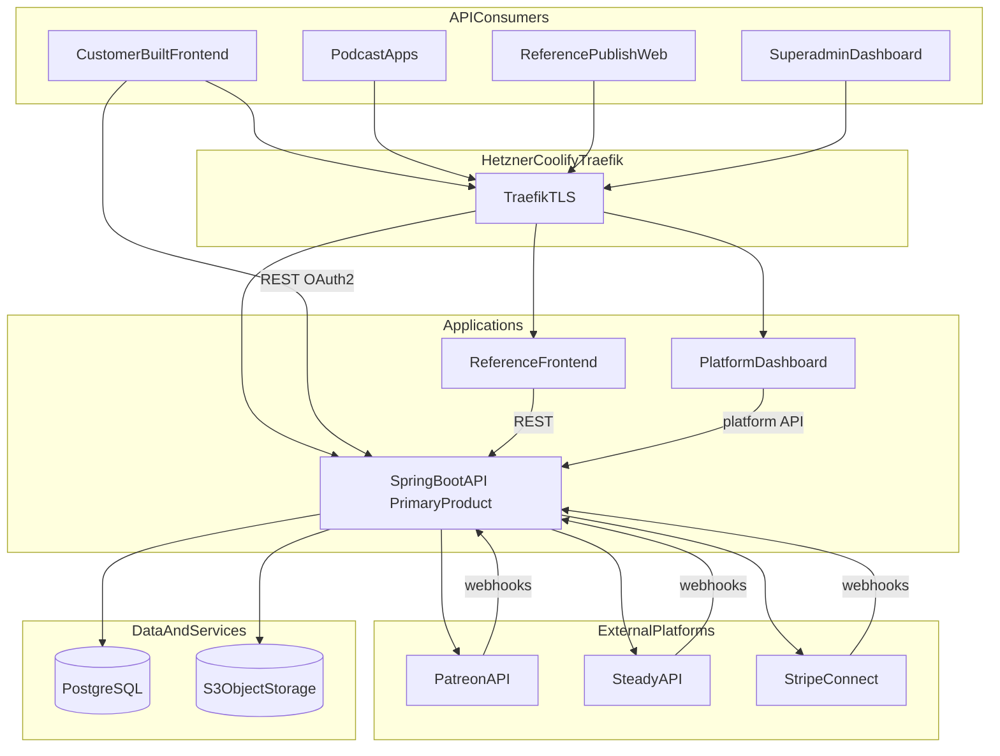

### Component Responsibilities

| Component | Role | Required? |
|-----------|------|-----------|
| **Spring Boot API** (`projects/directwerk/`) | **Core backend** — business logic, feeds, billing, entitlements, jobs, cache | Yes |
| **`directwerk-studio`** | Creator content management — part of the backend product | Yes (shipped with platform) |
| **`directwerk-admin`** | Platform superadmin operations | Yes (for platform team) |
| **PostgreSQL, S3, CDN** | Database, asset storage, public media delivery | Yes |
| **End-customer frontend** | Per tenant: commissioned (`directwerk-web`) or customer-built (BYO) | Optional per tenant |
| **Podcast apps** | Consume RSS feeds directly — no custom UI needed | External |

### Request Flows

Flows below are **API-centric** — any step marked "UI" is one possible consumer; customers may
implement their own.

**Subscriber adds custom feed (API flow)**

1. Subscriber authenticates → `POST /oauth2/token` → JWT
2. `GET /api/v1/me/feeds` — list existing feeds
3. `GET /api/v1/public/formats` — available formats for feed builder
4. `POST /api/v1/me/feeds` — create custom feed with `{ title, formatIds }`
5. Response includes `feedUrl: "https://feeds.client-a.de/u/{token}.xml"`
6. Subscriber pastes URL into podcast app (no platform UI required)

**Public discovery feed**

1. Anyone (or podcast directories) fetches `GET /feeds/client-a/podcast.xml`
2. Response contains **free episodes only** — no paid audio enclosures
3. Paid episodes may appear as entries with teaser description and upsell link (optional)

**Patreon/Steady dual-run**

1. Creator connects Patreon OAuth during onboarding
2. Platform imports products → maps to internal `SubscriptionProduct` entities
3. Patreon `members:pledge:create` webhook → upsert `Subscription` + refresh private feed access
4. Creator gradually moves new members to Stripe; Patreon sync continues until disconnected

### End-User Journey (Example: Project X)

**Project X** is a podcast creator onboarded to the platform. They built their own branded frontend at
`projectx.de` using **only the publish REST API** (no bundled UI required). You are a listener who
discovers their show.

#### Actors

| Actor | Role |
|-------|------|
| **You** (end user) | Listener / subscriber |
| **Project X frontend** | Customer-built site at `projectx.de` — calls `/api/v1/` on the platform |
| **Directwerk API** | Spring Boot monolith — auth, content, billing, RSS, entitlements |
| **Your podcatcher** | Apple Podcasts, Overcast, etc. — consumes RSS URLs |

#### Journey (step by step)

```mermaid
sequenceDiagram
    participant You
    participant Frontend as ProjectXFrontend
    participant API as PublishAPI
    participant Stripe
    participant Podcatcher

    You->>Frontend: Visit projectx.de
    Frontend->>API: GET /api/v1/public/site-config
    Frontend->>API: GET /api/v1/public/episodes
    API-->>Frontend: Free episodes + locked paid episodes metadata
    Frontend-->>You: Show catalog; link to public RSS

    You->>Podcatcher: Subscribe to public RSS URL
    Note over Podcatcher: Free episodes only

    You->>Frontend: Browse subscription levels
    Frontend->>API: GET /api/v1/public/products
    API-->>Frontend: LEVEL products with pricing
    Frontend-->>You: Supporter / Producer tiers

    You->>Frontend: Register account
    Frontend->>API: POST /api/v1/auth/register
    Frontend->>API: POST /oauth2/token
    API-->>Frontend: JWT

    You->>Frontend: Subscribe to Supporter level
    Frontend->>API: POST /api/v1/checkout/sessions
    API-->>You: Redirect to Stripe Checkout
    You->>Stripe: Pay
    Stripe->>API: Webhook subscription.created
    API->>API: Create Subscription + default private feed

    You->>Frontend: Open subscriber portal
    Frontend->>API: GET /api/v1/me/access
    Frontend->>API: GET /api/v1/me/feeds
    Frontend->>API: GET /api/v1/me/downloads
    API-->>Frontend: Entitled episodes, feed URLs, digital files
    Frontend-->>You: Your access dashboard

    You->>Frontend: Build custom RSS feed
    Frontend->>API: POST /api/v1/me/feeds
    Note over API: include_categories selected
    API-->>Frontend: Unique feed URL with token
    Frontend-->>You: Copy RSS link

    You->>Podcatcher: Add custom private feed URL
    Podcatcher->>API: GET /feeds/projectx/u/{token}.xml
    API-->>Podcatcher: Entitled episodes matching category filter

    You->>Frontend: Manage subscription
    Frontend->>API: POST /api/v1/billing/portal
    API-->>You: Stripe Customer Portal
```

#### Step 1 — Discovery (anonymous)

You visit `projectx.de`. Project X's frontend bootstraps from the platform:

| API call | Purpose |
|----------|---------|
| `GET /api/v1/public/site-config` | Branding, active modules, public RSS URL |
| `GET /api/v1/public/episodes` | Episode list with `accessPolicy` (`FREE` / `PAID`) and `requiredLevel` metadata |
| `GET /feeds/projectx/podcast.xml` | **Public free RSS** — only `FREE` episodes; usable in any podcatcher for discovery |

Paid episodes appear in the frontend catalog as **locked** (title, description, artwork) but have no
playable audio or enclosure until you subscribe.

#### Step 2 — Choose a subscription level

Project X offers **LEVEL** products (e.g. "Supporter" €5/mo, "Producer" €15/mo). Frontend loads
`GET /api/v1/public/products` and displays pricing cards with what each level unlocks.

You pick **Supporter**.

#### Step 3 — Register and subscribe (platform-handled)

1. **Register:** `POST /api/v1/auth/register` (email + password, tenant resolved from `Host: projectx.de`)
2. **Login:** `POST /oauth2/token` → JWT stored by Project X frontend
3. **Checkout:** `POST /api/v1/checkout/sessions` with `{ "productId": <supporter> }` → Stripe Checkout
4. **Webhook:** `customer.subscription.created` → platform creates `Subscription` + default private feed

All account and billing mechanics run on **our platform**; Project X frontend only orchestrates API calls.

#### Step 4 — Subscriber portal ("what can I access?")

| API call | What you see |
|----------|--------------|
| `GET /api/v1/me/access` | Summary: active products, entitled series/formats/categories, episode count |
| `GET /api/v1/me/subscriptions` | Active level(s), billing source, renewal date |
| `GET /api/v1/me/feeds` | Default private feed URL + any custom feeds |
| `GET /api/v1/me/episodes` | Paginated entitled episodes (stream URLs gated server-side) |
| `GET /api/v1/me/downloads` | Entitled digital files with download links |

Frontend renders a **"Your access"** dashboard — entirely driven by API responses, no hardcoded entitlements.

Example `GET /api/v1/me/access` response:

```json
{
  "activeProducts": [
    {"slug": "supporter", "name": "Supporter", "offeringType": "LEVEL", "sortOrder": 1}
  ],
  "entitledEpisodeCount": 42,
  "entitledSeries": [{"slug": "main-show", "title": "Project X Podcast"}],
  "entitledCategories": [{"slug": "interviews", "name": "Interviews"}],
  "feeds": {"default": "https://projectx.de/feeds/projectx/u/abc…xml", "customCount": 1},
  "downloadsCount": 3
}
```

#### Step 5 — Feed builder (custom RSS for podcatcher)

1. `GET /api/v1/public/categories` — categories available to your level
2. You select categories (e.g. "Interviews", "Season 3")
3. `POST /api/v1/me/feeds` with `{ "title": "My Interviews", "includeCategories": [3, 7] }`
4. API returns unique URL: `https://projectx.de/feeds/projectx/u/{feedToken}.xml`

`EntitlementService` ensures the feed never includes episodes above your subscription level.

#### Step 6 — Self-service subscription management

| Action | API |
|--------|-----|
| View invoices / update card | `POST /api/v1/billing/portal` → Stripe Customer Portal |
| Check status | `GET /api/v1/me/subscriptions` |
| Upgrade level | New checkout session for higher `productId` (or portal plan change) |

On cancel → grace period → private/custom feeds stop serving paid enclosures.

#### What Project X built vs what the platform provides

| Concern | Owner |
|---------|-------|
| Branded website UI | **Project X** (customer frontend) |
| Auth, billing, entitlements, RSS generation | **Platform API** |
| Stripe Connect payouts | **Platform** (Project X's connected account) |
| Episode CMS | **Platform API** (Project X admin uses API or their own admin UI) |
| Feed builder UX | **Project X frontend** (thin client over `/api/v1/me/feeds`) |
| Digital content library UI | **Project X frontend** (over `/api/v1/me/downloads`) |

This is the **API-first** model: Project X is the reference pattern for how any onboarded tenant integrates.

---

## API as Primary Product

The Spring Boot API is what we sell and deliver. Every feature — episode CRUD, feed builder,
subscription checks, module gating — must be fully operable via HTTP without a first-party UI.

### Design Principles

| Principle | Implementation |
|-----------|----------------|
| **Complete surface** | If a feature exists, it has API endpoints — no UI-only workflows |
| **Headless by default** | Business logic in services; controllers are thin; no server-rendered tenant pages in API |
| **Versioned contract** | `/api/v1/` today; breaking changes only in `/api/v2/` with deprecation period |
| **Documented** | OpenAPI 3 spec generated from code; published as integration artifact |
| **Predictable errors** | Machine-readable `code` field (e.g. `FEATURE_NOT_ENABLED`, `ENTITLEMENT_DENIED`) |
| **Tenant context via API** | Verified `Host` header; JWT `tenant_id` cross-check on authenticated tenant routes |
| **Module-aware responses** | `site-config` and error responses tell integrators which modules are active |

### API Consumers

| Consumer | Auth | Typical use |
|----------|------|-------------|
| **Customer publisher frontend** | OAuth2 JWT (`TENANT_ADMIN`, `EDITOR`) | Episode editor, format manager, release workflow |
| **`directwerk-studio`** (default) | Same as above | Primary creator dashboard — see [`docs/directwerk-studio.md`](docs/directwerk-studio.md) |
| **Customer subscriber frontend** | OAuth2 JWT (`SUBSCRIBER`) | Feed builder, feed URL display, account |
| **Customer marketing site** | None + `Host` | `GET /api/v1/public/*` for show info, free episodes, pricing |
| **Podcast apps** | Feed token in URL | `GET /feeds/...` — RSS only |
| **Patreon / Steady / Stripe** | Webhook signatures | Inbound membership and payment events |
| **Reference `directwerk-web`** | Same as above | Our optional implementation |

### Reference Frontends

`projects/directwerk-studio/`, `projects/directwerk-web/`, and `projects/directwerk-admin/` are **not** the
API contract — they prove it works and ship the **default creator experience**. See
[`docs/directwerk-studio.md`](docs/directwerk-studio.md) for the creator dashboard in detail.

| App | Purpose | When to build |
|-----|---------|---------------|
| `directwerk-studio` | **Creator dashboard** — create, publish, manage members (primary audience) | MVP Studio v0–v2 |
| `directwerk-web` | **Public site + subscriber portal** — marketing, pricing, feeds, checkout | MVP / Phase 9 |
| `directwerk-admin` | Internal platform operations | Once for our team |

**Default tenant onboarding:** Deploy `directwerk-studio` + `directwerk-web` on the tenant domain.
Creators use studio; audiences use the public site and subscriber portal.

**Per-customer frontend workflow (agencies):**

1. Customer (or we on their behalf) builds a frontend against `/api/v1/` — replaces `directwerk-web`
2. Frontend uses `GET /api/v1/public/site-config` for branding and `enabledModules`
3. OAuth2 for publisher (`directwerk-studio` or custom) and subscriber flows
4. Deploy on tenant's domain; Traefik routes `/api` and `/feeds` to Spring Boot
5. Custom UI, custom UX — API contract stays stable. **`directwerk-studio` can still be the publisher UI.**

### Tenant Integration

Deliverables for API integrators (included in every tenant onboarding):

| Artifact | Description |
|----------|-------------|
| **OpenAPI spec** | `GET /v3/api-docs` or checked-in `openapi.yaml` per release |
| **Integration guide** | Auth flow, tenant resolution, module checks, feed URLs |
| **Example flows** | cURL or HTTPie recipes: publish episode, create feed, checkout |
| **Webhook docs** | Outbound events (Post-MVP) for customer automation |
| **Sandbox tenant** | Staging environment with test Patreon/Stripe credentials |

**CORS:** Per-tenant allow-list of frontend origins, configured in platform dashboard when
customer domain is registered.

**Rate limits:** Documented per API key / per tenant; return `429` with `Retry-After`.

**No private/undocumented endpoints** — if `directwerk-web` uses it, it's in OpenAPI and available to customers.

---

## Multi-Tenancy and Whitelabel

Reuse the **shared-database, row-level `tenant_id` isolation** pattern from
[`projects/courses/README.md`](../courses/README.md). Do **not** share the courses domain model.

### Tenant Resolution

| Context | Resolution method |
|---------|-------------------|
| Public API / RSS | `Host` → **verified** `tenant_domains.host` |
| Authenticated tenant API | `Host` (request tenant) + Spring Security `principal.tenantId` (membership) must match; DB ACTIVE membership re-check |
| Platform API | No tenant context (`/api/v1/platform/**`) |
| Stripe webhooks | Metadata on session/subscription (`tenant_id`) — planned |
| Background jobs | `QueueJob.tenantId` → `TenantContext` in `QueueWorker` |

**Not used:** `X-Tenant-Id` header (do not add client-supplied tenant switching). Multi-membership users login per Host to get the matching token.

Implementation details: [`Directwerk/docs/multi-tenancy.md`](Directwerk/docs/multi-tenancy.md).

### Branding and Domains

| Entity | Fields |
|--------|--------|
| `Tenant` | `id`, `slug`, `name`, `status`, `stripe_connect_account_id`, `created_at` |
| `TenantDomain` | `tenant_id`, `host` (unique), `is_primary`, `verified`, `verification_token`, `verified_at` |
| `TenantBranding` | `tenant_id`, `logo_url`, `favicon_url`, `primary_color`, `secondary_color`, `font_family`, `footer_html`, `social_links` (JSON) |

Domain verification: DNS TXT (`directwerk-verify=<token>`) before an added host serves traffic.
Bootstrap primary domains are trusted (`verified=true`). Local/HTTP harness may use token body verify when
`directwerk.security.allow-token-domain-verification=true`.

### Data Isolation

1. Every tenant-owned table has `tenant_id NOT NULL`
2. `TenantContext` (ThreadLocal) set per request and per queue job
3. Hibernate `tenantFilter` on `TenantOwned` entities + `TenantWriteGuardListener` on write
4. S3 keys **always** prefixed by tenant: `{tenant_slug}/...` — validate with `TenantAssetKeys`
5. Cache keys include tenant id / host as appropriate
6. Isolation tests: `TenantHibernateFilterIT`, `TenantContextFilterTest`, `http/15-multi-tenant-isolation.http`

### Roles and Permissions

| Role | Scope | Capabilities |
|------|-------|--------------|
| `PLATFORM_ADMIN` | Global | Manage tenants, platform config |
| `TENANT_ADMIN` | Tenant | Users, branding, domains, Stripe onboarding, all content |
| `EDITOR` | Tenant | Create/edit/publish content |
| `SUBSCRIBER` | Tenant | Manage private feed URLs, feed builder, subscription status |
| `GUEST` | Tenant | Access public free feed only |

Enforce with `@PreAuthorize` and method-level checks. Never rely on client-side gating alone.

---

## Feature Modules

Tenants receive only the capabilities they need. Features are packaged as **modules** — logical
bundles of API endpoints, services, and UI surfaces — activated per tenant by platform admins
(or automatically via platform SaaS billing, Post-MVP).

This follows the `FeatureModule` / `TenantModuleActivation` pattern from
[`projects/courses/README.md`](../courses/README.md), adapted for the publisher domain.

### Design Principles

| Principle | Decision |
|-----------|----------|
| Deployment model | **Single Spring Boot monolith** at MVP — modules are runtime gates, not separate JARs |
| Gating layer | AOP `@RequiresModule` on controllers/services + explicit checks in feed generators |
| Default posture | **Fail closed** — disabled module → HTTP 403 `FEATURE_NOT_ENABLED` |
| Caching | `@Cacheable("tenantModules")` keyed by `tenantId`; invalidate on activation change |
| Code organization | Package per module under `de.pnnit.directwerk.modules.{name}` — always compiled, conditionally reachable |
| Frontend | `site-config` returns `enabledModules[]`; UI hides unavailable nav and routes |

**Why not separate deployables per module?** Per-tenant toggles need runtime resolution. Separate
services add network hops, deployment complexity, and cross-module transactions (e.g. subscription
activation creating a private feed). A monolith with strict module boundaries in code is the right
MVP trade-off. Extract to services later if a module needs independent scaling.

### Module Catalog

Seed `feature_modules` via Flyway. Each module has a stable `module_key` (SCREAMING_SNAKE).

Modules form a **capability hierarchy**: `DIGITAL_CONTENT` is the foundation for all content and
media; vertical modules (podcast, RSS, feed builder) stack on top.

| module_key | Name | Description | MVP |
|------------|------|-------------|-----|
| `DIGITAL_CONTENT` | Digital Content | Media upload, publish workflow, content storage — **foundation for all content** | Yes (base) |
| `PODCAST` | Podcast | Series, episodes, formats, categories (podcast vertical) | Yes |
| `PODCAST_RSS` | Podcast RSS | Public free feeds + per-subscriber private feeds | Yes |
| `FEED_BUILDER` | Feed Builder | Subscriber custom RSS feeds by format | Yes |
| `SUBSCRIPTION` | Subscriptions | Products, entitlements, subscriber portal | Yes |
| `STRIPE_BILLING` | Stripe Billing | Stripe Connect checkout + Customer Portal | Yes |
| `PATREON_SYNC` | Patreon Sync | OAuth import, membership webhooks | Yes |
| `STEADY_SYNC` | Steady Sync | API import, subscription webhooks | Yes |
| `WHITELABEL` | Whitelabel | Custom domains, branding, themed frontend | Yes |
| `ANALYTICS` | Analytics | Downloads, subscriber metrics | Post-MVP |
| `EMAIL_NOTIFY` | Email Notifications | New episode alerts to subscribers | Post-MVP |

`DIGITAL_CONTENT` is **mandatory** — every tenant gets it on creation. It cannot be deactivated.
All other modules are optional and respect the dependency chain below.

**Storage:** S3 upload, `MediaAsset`, and media library endpoints require `DIGITAL_CONTENT` (always
on). Episode streams require `PODCAST`; paid private presign paths require `SUBSCRIPTION`. Full
endpoint matrix: [`docs/asset-storage.md` § Module gating](docs/asset-storage.md#module-gating).

**What lives in `DIGITAL_CONTENT` vs `PODCAST`:**

| Concern | Module |
|---------|--------|
| S3 media upload, asset metadata | `DIGITAL_CONTENT` |
| Draft / schedule / publish workflow | `DIGITAL_CONTENT` |
| Generic `Publication` entity primitives | `DIGITAL_CONTENT` |
| Podcast series, episodes, formats, categories | `PODCAST` |
| RSS feed generation | `PODCAST_RSS` |
| Custom subscriber feeds | `FEED_BUILDER` |

Post-MVP article/ebook/video types are added to `DIGITAL_CONTENT` without a new module.

### Module Dependencies

Dependencies are enforced in `ModuleActivationService` — cannot activate a module without its prerequisites.

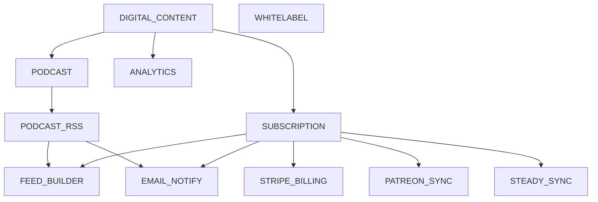

| Module | Requires | Rationale |
|--------|----------|-----------|
| `PODCAST` | `DIGITAL_CONTENT` | Episodes need media upload and publish workflow |
| `PODCAST_RSS` | `PODCAST` | Feeds distribute podcast episodes |
| `FEED_BUILDER` | `PODCAST_RSS`, `SUBSCRIPTION` | Custom feeds filter entitled podcast episodes |
| `SUBSCRIPTION` | `DIGITAL_CONTENT` | Monetization gates access to published content |
| `STRIPE_BILLING` | `SUBSCRIPTION` | Stripe implements subscription billing |
| `PATREON_SYNC` | `SUBSCRIPTION` | Patreon memberships map to subscription products |
| `STEADY_SYNC` | `SUBSCRIPTION` | Steady subscriptions map to products |
| `ANALYTICS` | `DIGITAL_CONTENT` | Tracks content consumption |
| `EMAIL_NOTIFY` | `PODCAST_RSS`, `SUBSCRIPTION` | Notifies subscribers of new feed items |
| `WHITELABEL` | — | Independent; domains/branding only |

**Deactivation cascades** (dependents disabled first):

| Deactivate | Also disables |
|------------|---------------|
| `PODCAST` | `PODCAST_RSS`, `FEED_BUILDER`, `EMAIL_NOTIFY` |
| `PODCAST_RSS` | `FEED_BUILDER`, `EMAIL_NOTIFY` |
| `SUBSCRIPTION` | `FEED_BUILDER`, `STRIPE_BILLING`, `PATREON_SYNC`, `STEADY_SYNC`, `EMAIL_NOTIFY` |
| `DIGITAL_CONTENT` | **Not allowed** — core module |

### Data Model

#### FeatureModule

| Column | Type | Notes |
|--------|------|-------|
| `id` | BIGINT PK | |
| `module_key` | VARCHAR | Unique, e.g. `PODCAST_RSS` |
| `name` | VARCHAR | Human-readable |
| `description` | TEXT | |
| `is_core` | BOOLEAN | `true` for `DIGITAL_CONTENT` — cannot deactivate |
| `depends_on` | JSONB | Array of `module_key` strings |
| `sort_order` | INT | Admin UI display |
| `active` | BOOLEAN | Platform-wide kill switch (disable module for all tenants) |

#### TenantModuleActivation

| Column | Type | Notes |
|--------|------|-------|
| `id` | BIGINT PK | |
| `tenant_id` | BIGINT FK | |
| `module_id` | BIGINT FK | |
| `is_active` | BOOLEAN | Default true |
| `activated_at` | TIMESTAMPTZ | |
| `deactivated_at` | TIMESTAMPTZ | Nullable |
| `activated_by` | BIGINT FK | Platform admin user id |
| `source` | ENUM | `MANUAL`, `ONBOARDING`, `BILLING` |

Unique constraint: `(tenant_id, module_id)`.

### Backend Implementation

#### ModuleService (central gate)

> **Alpha implementation note:** Split read vs write into **`ModuleGateApi`** (`isEnabled`,
> `enabledModuleKeys`) and **`ModuleActivationApi`** (activate, deactivate, presets, cascade) in
> `modules/core/api/`. Controllers depend on interfaces only — see
> [`docs/poc-alpha-setup.md`](docs/poc-alpha-setup.md). The sketch below uses `ModuleService` as a
> single-class shorthand for this README.

```java
@Service
public class ModuleService {

    @Cacheable(value = "tenantModules", key = "#tenantId")
    public Set<String> enabledModuleKeys(Long tenantId) {
        return activationRepository.findActiveModuleKeysByTenantId(tenantId);
    }

    public boolean isEnabled(Long tenantId, String moduleKey) {
        if (moduleKey == null || moduleKey.isBlank()) return false;
        return enabledModuleKeys(tenantId).contains(moduleKey);
    }

    public boolean isEnabledForCurrentTenant(String moduleKey) {
        Long tenantId = TenantContext.getTenantId();
        if (tenantId == null) return false;
        return isEnabled(tenantId, moduleKey);
    }
}
```

#### @RequiresModule annotation + AOP aspect

```java
@Target({ElementType.METHOD, ElementType.TYPE})
@Retention(RetentionPolicy.RUNTIME)
public @interface RequiresModule {
    String value();           // module_key
    boolean allOf() default true;  // true = AND; false = any one of (value as comma-sep)
}

@Aspect
@Component
public class ModuleProtectionAspect {

    @Before("@annotation(requiresModule)")
    public void checkModule(JoinPoint jp, RequiresModule requiresModule) {
        if (SecurityUtils.isPlatformAdmin()) return; // support bypass

        String[] keys = requiresModule.value().split(",");
        boolean enabled = requiresModule.allOf()
            ? Arrays.stream(keys).allMatch(moduleService::isEnabledForCurrentTenant)
            : Arrays.stream(keys).anyMatch(moduleService::isEnabledForCurrentTenant);

        if (!enabled) {
            throw new ModuleNotEnabledException(requiresModule.value());
        }
    }
}
```

`ModuleNotEnabledException` → `@ControllerAdvice` → HTTP 403 with `{ "code": "FEATURE_NOT_ENABLED", "module": "PODCAST_RSS" }`.

#### Apply at controller and service layer

```java
@RestController
@RequestMapping("/api/v1/me/feeds")
@RequiresModule("FEED_BUILDER")
public class CustomFeedController { ... }

@RestController
@RequestMapping("/feeds")
public class RssFeedController {

    @GetMapping("/{tenantSlug}/podcast.xml")
    @RequiresModule("PODCAST_RSS")
    public ResponseEntity<String> publicFeed(...) { ... }
}

@Service
public class PatreonSyncService {

    @RequiresModule("PATREON_SYNC")
    public void handleWebhook(PatreonEvent event) { ... }
}
```

#### ModuleActivationService (admin operations)

```java
@Service
public class ModuleActivationService {

    @Transactional
    public void activateModule(Long tenantId, String moduleKey, Long activatedBy) {
        FeatureModule module = moduleRepository.findByModuleKey(moduleKey)
            .orElseThrow(() -> new ModuleNotFoundException(moduleKey));

        // Enforce dependencies
        for (String dep : module.getDependsOn()) {
            if (!moduleService.isEnabled(tenantId, dep)) {
                throw new DependencyNotActiveException(moduleKey, dep);
            }
        }

        activationRepository.upsertActive(tenantId, module.getId(), activatedBy);
        cacheManager.evict("tenantModules", tenantId);
    }

    @Transactional
    public void deactivateModule(Long tenantId, String moduleKey) {
        if (moduleRepository.findByModuleKey(moduleKey).map(FeatureModule::isCore).orElse(false)) {
            throw new CannotDeactivateCoreModuleException(moduleKey);
        }

        // Cascade: deactivate dependents first
        List<String> dependents = moduleRepository.findDependentsOf(moduleKey);
        for (String dep : dependents) {
            if (moduleService.isEnabled(tenantId, dep)) {
                deactivateModule(tenantId, dep);
            }
        }

        activationRepository.deactivate(tenantId, moduleKey);
        cacheManager.evict("tenantModules", tenantId);
    }
}
```

#### Package structure (code boundaries)

Vertical slices with `api/` / `internal/` / `web/` per module — see
[`docs/poc-alpha-setup.md` § Module boundaries](docs/poc-alpha-setup.md#module-boundaries-vertical-slices).

```
src/main/java/de/pnnit/publish/
  modules/
    core/
      api/          # TenantQueryApi, ModuleGateApi, ModuleActivationApi, …
      internal/     # entities, services, ModuleProtectionAspect
      web/          # site-config, auth, /me
    digital/        # DIGITAL_CONTENT — MediaAsset, AssetAccessApi, workflow
    podcast/        # PODCAST — series, episodes (Phase 3)
    rss/            # PODCAST_RSS (post-MVP)
    feedbuilder/    # FEED_BUILDER (post-MVP)
    subscription/   # SUBSCRIPTION (post-MVP)
    billing/        # stripe, patreon, steady (post-MVP)
  multitenancy/ security/ storage/
  controller/
    platform/       # orchestrates core/api only
    tenant/
```

Feature modules **must not** import each other's `internal/` or `web/` packages — only `{module}/api/`.
Cross-module calls go through public service interfaces in `modules/{name}/api/`.

### Frontend Integration

`GET /api/v1/public/site-config` includes:

```json
{
  "tenant": { "slug": "my-show", "name": "My Show" },
  "enabledModules": ["DIGITAL_CONTENT", "PODCAST", "PODCAST_RSS", "SUBSCRIPTION", "FEED_BUILDER", "PATREON_SYNC"],
  "branding": { ... }
}
```

Next.js (`projects/directwerk-web/`) uses `enabledModules` to:

- Show/hide nav items (Feed Builder, Pricing, Integrations)
- Guard routes (`/account/feeds` requires `FEED_BUILDER`)
- Skip rendering unavailable sections (no dead links)

Never rely on frontend alone — API returns 403 if module disabled.

### Platform Admin API

See [Platform Superadmin Dashboard](#platform-superadmin-dashboard) for the full API and UI spec.
Summary endpoints used by module management:

| Method | Path | Role | Description |
|--------|------|------|-------------|
| GET | `/api/v1/platform/modules` | PLATFORM_ADMIN | List all modules + dependencies |
| GET | `/api/v1/platform/tenants/{id}/modules` | PLATFORM_ADMIN | Tenant's active modules |
| POST | `/api/v1/platform/tenants/{id}/modules/{moduleKey}/activate` | PLATFORM_ADMIN | Activate module |
| DELETE | `/api/v1/platform/tenants/{id}/modules/{moduleKey}` | PLATFORM_ADMIN | Deactivate (cascades dependents) |

Tenant onboarding preset example — "Patreon podcast migrator":

```
DIGITAL_CONTENT + PODCAST + PODCAST_RSS + SUBSCRIPTION + PATREON_SYNC + WHITELABEL
```

### Activation Rules

| Event | Modules activated |
|-------|-------------------|
| Tenant created | `DIGITAL_CONTENT` (automatic) |
| Onboarding wizard: "Patreon podcast" | Patreon migrator preset (see above) |
| Onboarding wizard: "Free podcast only" | `DIGITAL_CONTENT`, `PODCAST`, `PODCAST_RSS`, `WHITELABEL` |
| Platform admin manual | Any valid combination respecting dependencies |
| Platform SaaS billing (Post-MVP) | Module activation tied to platform subscription tier |

---

## Patreon and Steady Onboarding

Primary acquisition channel: **podcast creators already monetizing on Patreon or Steady** who
want owned RSS distribution with format-based custom feeds.

### Migration Strategy

Three phases — tenants can stay in any phase; platform supports dual-run.

| Phase | Billing | Membership source | Feed access |
|-------|---------|-------------------|-------------|
| **A — Import** | Patreon/Steady only | OAuth import + webhooks | Map external product → entitlements |
| **B — Dual-run** | Patreon/Steady + Stripe (new members) | Both APIs synced | Unified entitlement layer |
| **C — Owned** | Stripe Connect only | Stripe webhooks | Patreon/Steady disconnected |

**Phase A (week 1):** Creator connects Patreon/Steady, imports subscription products and active members, publishes
episodes, distributes private feed URLs to existing members manually (email / Patreon post).

**Phase B (transition):** New subscribers via Stripe Checkout; existing Patreon/Steady members
retain access via sync. Creator communicates migration timeline.

**Phase C (steady state):** All billing on Stripe; Patreon/Steady OAuth revoked; optional CSV
archive of historical member data.

### Membership Sync

#### Patreon integration

- OAuth 2.0 creator authorization (Patreon API v2)
- Import: campaigns, tiers (`tier`), members (`member` + `currently_entitled_tiers`)
- Webhooks: `members:pledge:create`, `members:pledge:delete`, `members:pledge:update`
- Store `external_membership_id`, `external_platform` (`PATREON`), `last_synced_at`
- Map Patreon tier id → internal `SubscriptionProduct.external_product_id`
- Imported members → **shadow users** (`User.status = PENDING_VERIFICATION`) until `POST /api/v1/auth/claim`

#### Steady integration

- OAuth or API token (Steady publisher API)
- Import: subscription plans, active subscriptions
- Webhook: subscription created / cancelled / renewed
- Same `external_membership_id` pattern with `external_platform` = `STEADY`

#### Unified entitlement layer

Regardless of billing source, `EntitlementService` checks (union-based — see [Entitlements](#entitlements)):

```
activeProducts(user, tenant) = all Subscription where status=ACTIVE

hasAccess(user, episode) =
  episode.access_policy == FREE
  OR any p in activeProducts grants episode via:
    - p.offering_type == LEVEL  AND p.sort_order >= episode.required_level_sort_order
    - p.offering_type == PACKAGE AND matching ProductAccessRule
```

`Subscription` entity:

| Column | Notes |
|--------|-------|
| `source` | `STRIPE`, `PATREON`, `STEADY`, `MANUAL` |
| `external_subscription_id` | Nullable; Patreon member id or Steady sub id |
| `product_id` | FK to internal `SubscriptionProduct` |
| `status` | ACTIVE, CANCELED, PAST_DUE |

Periodic reconciliation job (every 6h): poll Patreon/Steady for drift; flag desync for admin review.

### Onboarding Flow

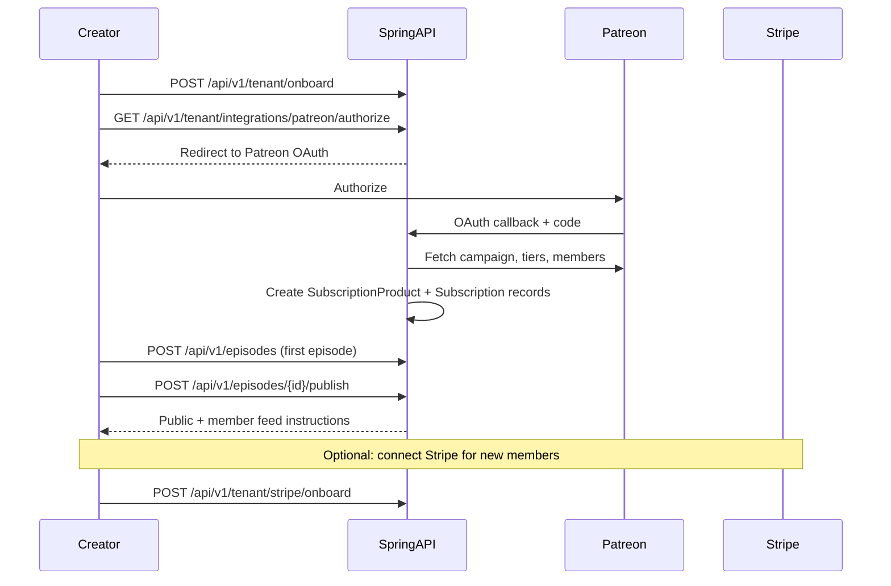

---

## Content Model

Content primitives (media, publish workflow) belong to the **`DIGITAL_CONTENT`** module.
Podcast-specific entities (series, episodes, formats) belong to the **`PODCAST`** module and
require `DIGITAL_CONTENT` to be active.

Podcast episodes are the primary content unit at MVP. Each episode belongs to a **PodcastSeries** (tenant
may have one or many series) and is tagged with **formats** and optional **categories**.

### Publication Types

| Type | Module | MVP | Description |
|------|--------|-----|-------------|
| `PODCAST_SERIES` | `PODCAST` | Yes | Show container — cover art, description, default access level |
| `ARTICLE` | `DIGITAL_CONTENT` | Post-MVP | Blog / show notes page |
| `EBOOK` | `DIGITAL_CONTENT` | Post-MVP | Downloadable bonus material |
| `VIDEO` | `DIGITAL_CONTENT` | Post-MVP | Video bonus content |

### Entities

#### PodcastSeries (Publication with type PODCAST_SERIES)

| Column | Type | Notes |
|--------|------|-------|
| `id` | BIGINT PK | |
| `tenant_id` | BIGINT FK | NOT NULL |
| `slug` | VARCHAR | Unique per tenant |
| `title` | VARCHAR | Show name |
| `description` | TEXT | Show description |
| `cover_asset_id` | BIGINT FK | MediaAsset |
| `language` | CHAR(2) | e.g. `de` |
| `itunes_category` | VARCHAR | Apple Podcasts category |
| `default_required_level_sort_order` | INT | Default LEVEL sort_order for new episodes |
| `status` | ENUM | DRAFT, PUBLISHED |
| `created_at`, `updated_at` | TIMESTAMPTZ | |

#### Episode

| Column | Type | Notes |
|--------|------|-------|
| `id` | BIGINT PK | |
| `tenant_id` | BIGINT FK | |
| `series_id` | BIGINT FK | PodcastSeries |
| `episode_number` | INT | Display order |
| `slug` | VARCHAR | Unique per series |
| `title` | VARCHAR | |
| `description` | TEXT | Show notes (HTML, sanitized) |
| `audio_asset_id` | BIGINT FK | MediaAsset |
| `duration_seconds` | INT | |
| `access_policy` | ENUM | FREE, PAID |
| `required_level_sort_order` | INT | Nullable; minimum LEVEL sort_order when PAID |
| `status` | ENUM | DRAFT, SCHEDULED, PUBLISHED, ARCHIVED |
| `published_at` | TIMESTAMPTZ | |
| `scheduled_at` | TIMESTAMPTZ | |
| `created_at`, `updated_at` | TIMESTAMPTZ | |

#### Format (tenant-defined content type for feed builder)

| Column | Type | Notes |
|--------|------|-------|
| `id` | BIGINT PK | |
| `tenant_id` | BIGINT FK | |
| `slug` | VARCHAR | e.g. `interview`, `bonus` |
| `name` | VARCHAR | Display: "Interview", "Bonus Episode" |
| `description` | TEXT | Optional |
| `required_level_sort_order` | INT | Optional; format only visible to LEVEL+ subscribers |
| `sort_order` | INT | UI ordering |
| `active` | BOOLEAN | |

Examples: `Interview`, `Solo`, `Listener Q&A`, `Bonus`, `Uncut`.

#### Category (optional second axis)

| Column | Type | Notes |
|--------|------|-------|
| `id` | BIGINT PK | |
| `tenant_id` | BIGINT FK | |
| `slug` | VARCHAR | e.g. `season-2`, `politics` |
| `name` | VARCHAR | Display name |
| `parent_id` | BIGINT FK | Nullable; hierarchical categories |
| `active` | BOOLEAN | |

#### EpisodeFormat / EpisodeCategory (join tables)

| Table | Columns |
|-------|---------|
| `episode_formats` | `episode_id`, `format_id` |
| `episode_categories` | `episode_id`, `category_id` |

An episode may have **multiple formats** and **multiple categories** (e.g. Format: Bonus + Category: Season 3).

#### SubscriptionProduct (replaces Tier — what tenants sell)

| Column | Type | Notes |
|--------|------|-------|
| `id` | BIGINT PK | |
| `tenant_id` | BIGINT FK | |
| `slug` | VARCHAR | Unique per tenant |
| `name` | VARCHAR | e.g. "Supporter", "Producer", "All Access Package" |
| `description` | TEXT | Public marketing copy |
| `offering_type` | ENUM | `LEVEL` (cumulative ladder) or `PACKAGE` (explicit scopes) |
| `sort_order` | INT | **LEVEL only** — higher = more access |
| `price_cents` | INT | |
| `currency` | CHAR(3) | Default EUR |
| `billing_interval` | ENUM | MONTH, YEAR (ONE_TIME post-MVP) |
| `stripe_product_id` | VARCHAR | Nullable |
| `stripe_price_id` | VARCHAR | Nullable |
| `external_platform` | ENUM | PATREON, STEADY, STRIPE, MANUAL |
| `external_product_id` | VARCHAR | Patreon tier id, Steady plan id |
| `active` | BOOLEAN | |

**LEVEL** products behave like traditional tiers: episodes with `required_level_sort_order <= subscriber's max active LEVEL sort_order` are accessible.

**PACKAGE** products use `ProductAccessRule` rows for scoped access (specific podcasts, formats, digital files).

#### ProductAccessRule (PACKAGE scoping)

| Column | Type | Notes |
|--------|------|-------|
| `id` | BIGINT PK | |
| `product_id` | BIGINT FK | |
| `scope_type` | ENUM | See table below |
| `scope_id` | BIGINT FK | Nullable depending on type |
| `effect` | ENUM | `GRANT` (MVP) |

| scope_type | Meaning | scope_id |
|------------|---------|----------|
| `ALL_PODCASTS` | Every published episode in tenant | null |
| `PODCAST_SERIES` | One show | `series_id` |
| `FORMAT` | Episodes tagged with format | `format_id` |
| `CATEGORY` | Episodes tagged with category | `category_id` |
| `DIGITAL_ASSET` | Standalone file (bonus PDF, ebook) | `media_asset_id` or `digital_publication_id` |
| `FEED_BUILDER` | Unlocks custom feed creation | null |

#### DigitalPublication (bonus files)

| Column | Type | Notes |
|--------|------|-------|
| `id` | BIGINT PK | |
| `tenant_id` | BIGINT FK | |
| `slug` | VARCHAR | Unique per tenant |
| `title` | VARCHAR | |
| `asset_id` | BIGINT FK | MediaAsset (DOCUMENT type) |
| `access_policy` | ENUM | FREE, PAID |
| `status` | ENUM | DRAFT, PUBLISHED |

#### User (global account)

| Column | Type | Notes |
|--------|------|-------|
| `id` | BIGINT PK | |
| `email` | VARCHAR | Unique globally |
| `password_hash` | VARCHAR | BCrypt via Spring Security `PasswordEncoder` only |
| `email_verified_at` | TIMESTAMPTZ | Nullable |
| `status` | ENUM | ACTIVE, PENDING_VERIFICATION, DISABLED |

#### TenantMembership (user ↔ tenant)

| Column | Type | Notes |
|--------|------|-------|
| `id` | BIGINT PK | |
| `user_id` | BIGINT FK | |
| `tenant_id` | BIGINT FK | Unique pair with user_id |
| `roles` | JSONB / join table | SUBSCRIBER, EDITOR, TENANT_ADMIN |
| `joined_at` | TIMESTAMPTZ | |

#### ExternalIdentity (Patreon/Steady/Stripe link)

| Column | Type | Notes |
|--------|------|-------|
| `id` | BIGINT PK | |
| `user_id` | BIGINT FK | |
| `tenant_id` | BIGINT FK | |
| `platform` | ENUM | PATREON, STEADY, STRIPE |
| `external_id` | VARCHAR | Platform-specific member/customer id |

> **Deprecated:** `Tier` entity — replaced by `SubscriptionProduct` with `offering_type = LEVEL`.
> Migration maps existing `tier_id` references to `product_id`.

#### MediaAsset

See [Media Storage and Asset Access](#media-storage-and-asset-access) for S3 layout, upload, and URL rules.

| Column | Type | Notes |
|--------|------|-------|
| `id` | BIGINT PK | |
| `tenant_id` | BIGINT FK | Must match S3 key prefix |
| `s3_key` | VARCHAR | `{tenant_slug}/public\|private\|staging/...` |
| `visibility` | ENUM | `PUBLIC`, `PRIVATE` |
| `status` | ENUM | `PENDING`, `READY`, `ARCHIVED` |
| `asset_type` | ENUM | `AUDIO`, `IMAGE`, `VIDEO`, `DOCUMENT` |
| `mime_type` | VARCHAR | Allow-list per asset_type |
| `file_size_bytes` | BIGINT | |
| `checksum_sha256` | VARCHAR | Verified on confirm |
| `original_filename` | VARCHAR | |
| `episode_id` | BIGINT FK | Nullable; set when attached to episode |
| `created_at` | TIMESTAMPTZ | |

**Rule:** All asset bytes in S3 only — never PostgreSQL BLOBs or local filesystem.

#### SubscriberFeed (default private feed per user)

| Column | Type | Notes |
|--------|------|-------|
| `id` | BIGINT PK | |
| `tenant_id` | BIGINT FK | |
| `user_id` | BIGINT FK | One default per user per tenant |
| `feed_token` | VARCHAR | Unguessable UUID; unique globally |
| `title` | VARCHAR | Default: "{Show name} — Full Feed" |
| `is_default` | BOOLEAN | true for auto-created feed |
| `created_at` | TIMESTAMPTZ | |

Issued on first subscription activation. Token rotated on security event (password reset, explicit revoke).

#### CustomFeed (feed builder — user-created)

| Column | Type | Notes |
|--------|------|-------|
| `id` | BIGINT PK | |
| `tenant_id` | BIGINT FK | |
| `user_id` | BIGINT FK | Owner |
| `feed_token` | VARCHAR | Unguessable; unique globally |
| `title` | VARCHAR | User-chosen name, e.g. "My Interviews" |
| `include_formats` | JSONB | Array of `format_id` (OR logic) |
| `include_categories` | JSONB | Array of `category_id` (OR logic); empty = all |
| `match_mode` | ENUM | `ANY` (format OR category), `ALL` (must match both axes) |
| `created_at`, `updated_at` | TIMESTAMPTZ | |

### Relationships

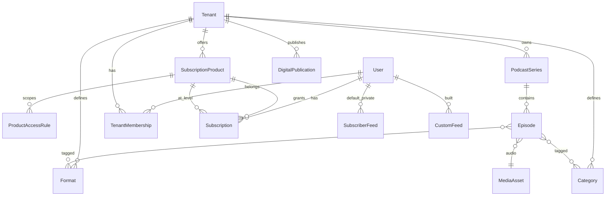

### Publication Workflow

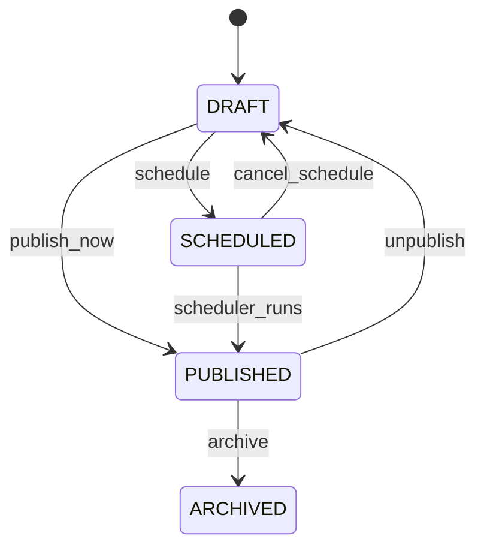

On transition to `PUBLISHED`:

1. Set `published_at` if null
2. Invalidate RSS caches: public feed, all affected subscriber/custom feeds
3. Optionally notify subscribers (Post-MVP email)

### Media Storage and Asset Access

**Full specification:** [`docs/asset-storage.md`](docs/asset-storage.md) — providers, scopes,
per-asset entitlements, [module gating](docs/asset-storage.md#module-gating),
[access control model](docs/asset-storage.md#access-control-model), upload/confirm, error codes.

**All assets live in S3-compatible object storage** (Hetzner Object Storage or Bunny.net Storage, EU).
No files on application servers, no BLOB columns in PostgreSQL.

Storage is split on two axes:

1. **Per tenant** — every object key starts with `{tenant_slug}/`
2. **Per visibility** — `public/` (world-readable) vs `private/` (entitlement-gated)

This enables free podcast marketing assets and paid audio in private feeds without a single
leaky URL scheme.

### S3 Layout

Single bucket (recommended MVP) with prefix-based isolation:

```
{bucket}/
  {tenant_slug}/
    public/
      audio/{asset_uuid}.mp3
      images/
        covers/{asset_uuid}.jpg
        artwork/{asset_uuid}.png
    private/
      audio/{asset_uuid}.mp3
      images/{asset_uuid}.jpg
      documents/{asset_uuid}.pdf
    staging/
      {upload_session_id}/{filename}   # pre-confirm uploads only; lifecycle-expire after 24h
```

| Prefix | Who can read | Typical content |
|--------|--------------|-----------------|
| `{tenant}/public/` | Anyone (CDN or direct public URL) | Free episode audio, show cover on website, marketing images |
| `{tenant}/private/` | Entitled subscribers only (signed URL) | Paid episode audio, subscriber-only bonus files |
| `{tenant}/staging/` | Upload session only (pre-signed PUT) | In-progress uploads before confirm |

**Tenant isolation:** IAM/bucket policy denies cross-prefix access. Application never generates
URLs for another tenant's keys. `AssetService` always validates `asset.tenant_id == TenantContext`.

Optional Post-MVP: dedicated bucket per tenant for largest customers — same key layout inside.

Env vars: `S3_ENDPOINT`, `S3_BUCKET`, `S3_ACCESS_KEY`, `S3_SECRET_KEY`, `S3_REGION`,
`S3_PUBLIC_BASE_URL` (CDN origin for `public/` objects).

Reference: [`projects/strapi/cffc-v5/config/plugins.js`](../strapi/cffc-v5/config/plugins.js).

### Public vs Private Assets

| `visibility` | Stored under | How clients access |
|--------------|--------------|-------------------|
| `PUBLIC` | `{tenant}/public/...` | Stable URL: `{S3_PUBLIC_BASE_URL}/{s3_key}` or CDN; cacheable |
| `PRIVATE` | `{tenant}/private/...` | **Never** a stable public URL; signed URL only after entitlement check |

**Visibility assignment:**

| Trigger | Visibility |
|---------|------------|
| Episode `access_policy = FREE` → audio published | `PUBLIC` (move from staging/private → `public/audio/`) |
| Episode `access_policy = TIER` → audio published | `PRIVATE` (remains under `private/audio/`) |
| Show cover art for public site | `PUBLIC` |
| Bonus PDF for subscribers only | `PRIVATE` |
| Draft / unpublished | `staging/` or `private/` until publish |

On publish transition, `AssetService.promoteForPublish(asset, episode)` moves or copies the
object to the correct visibility prefix and updates `MediaAsset.visibility` + `s3_key`.

### Upload Flow

**Never** stream uploads through the API. Pre-signed URLs only.

1. Client `POST /api/v1/media/upload-url` with `{ filename, mimeType, sizeBytes, assetType, intendedVisibility }`
2. API validates tenant, mime allow-list, max size; creates `MediaAsset` (status `PENDING`)
3. API returns pre-signed **PUT** URL targeting `{tenant}/staging/{sessionId}/{filename}`
4. Client uploads directly to S3
5. Client `POST /api/v1/media/{assetId}/confirm` with `{ checksumSha256 }`
6. API verifies object exists, checksum, moves to `{tenant}/private/...` or `{tenant}/public/...` based on `intendedVisibility`
7. `MediaAsset.status` → `READY`

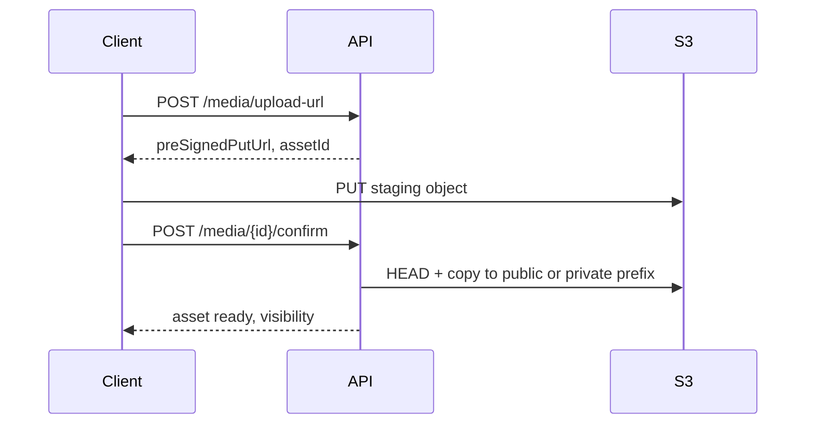

### Download and RSS Enclosures

**Public assets** — return permanent CDN URL in API responses and public RSS enclosures.

**Private assets** — access only through gated URL generation:

| Consumer | Gate | URL issued |
|----------|------|------------|
| Public RSS feed | Episode is `FREE` only | Public CDN URL |
| Private/custom RSS feed | Valid `feedToken` + entitlement check per episode | Pre-signed GET URL (TTL 24h), embedded in `enclosure` |
| Subscriber API | JWT + `EntitlementService` | `GET /api/v1/me/episodes/{slug}/stream` → 302 to pre-signed URL |
| Publisher API | JWT + `EDITOR` role | Pre-signed URL for admin playback |

```java
// AssetAccessService — single gate for private URLs
public URL signedDownloadUrl(MediaAsset asset, UserPrincipal principal) {
    assert asset.getTenantId().equals(TenantContext.getTenantId());
    if (asset.getVisibility() == PUBLIC) {
        return publicCdnUrl(asset.getS3Key());
    }
    if (!entitlementService.hasAccess(principal.getId(), asset.getEpisodeId())) {
        throw new EntitlementDeniedException();
    }
    return s3Presigner.presignGet(asset.getS3Key(), Duration.ofHours(24));
}
```

**RSS feed generation** calls `AssetAccessService` per enclosure — private feed tokens prove
subscriber identity; entitlements filter episodes before URLs are signed.

**Security rules:**

- Pre-signed GET TTL: 24h for RSS (regenerated each feed fetch); 1h for direct API stream
- Never emit `private/` URLs without signature
- Never log pre-signed URLs (contain credentials)
- Rotate signing credentials via env vars; no hardcoded keys

### Access Control (content)

| Policy | Behavior | In public feed | In private/custom feed |
|--------|----------|----------------|------------------------|
| `FREE` | Everyone | Public CDN enclosure | Public CDN or signed if mirrored private |
| `PAID` | Active subscription grants access | Teaser only — **no audio enclosure** | Signed private enclosure via `AssetAccessService` |

`EntitlementService.hasAccess(userId, episodeId)` — used by all feed generators and stream URLs.

**Format-level gates:** If a `Format` has `required_level_sort_order`, episodes with that format are only
included in a subscriber's custom feed when the subscriber's LEVEL qualifies — even if the episode
itself has a lower requirement.

---

## Podcast and RSS

RSS is the **primary delivery channel**. Three feed types serve different audiences.

### Feed Types

| Feed type | URL pattern | Audience | Episodes included |
|-----------|-------------|----------|-------------------|
| **Public free** | `/feeds/{tenantSlug}/podcast.xml` | Anyone, podcast directories | `FREE` only |
| **Series public** | `/feeds/{tenantSlug}/{seriesSlug}.xml` | Anyone | `FREE` in that series |
| **Default private** | `/feeds/{tenantSlug}/u/{feedToken}.xml` | One subscriber | All entitled episodes |
| **Custom (feed builder)** | `/feeds/{tenantSlug}/u/{feedToken}.xml` | One subscriber | Entitled episodes matching selected formats |

Private and custom feeds share the same URL structure; `feedToken` resolves to a `SubscriberFeed` (`is_default` distinguishes default vs custom).

### Feed Endpoints

| Route | Auth | Description |
|-------|------|-------------|
| `GET /feeds/{tenantSlug}/podcast.xml` | None | Tenant-wide public free feed |
| `GET /feeds/{tenantSlug}/{seriesSlug}.xml` | None | Series public free feed |
| `GET /feeds/{tenantSlug}/u/{feedToken}.xml` | Token | Private or custom subscriber feed |

Token validation: lookup feed by token → verify `user_id` has active subscription → generate episode list.

**Do not** put subscriber id in URL. Token is 128-bit+ random, rotatable.

### RSS Specification

Generate **RSS 2.0** with namespaces:

- `xmlns:itunes="http://www.itunes.com/dtds/podcast-1.0.dtd"`
- `xmlns:atom="http://www.w3.org/2005/Atom"` (self link)
- `xmlns:content="http://purl.org/rss/1.0/modules/content/"` (encoded show notes)
- `xmlns:podcast="https://podcastindex.org/namespace/1.0"` (optional; `podcast:transcript`, `podcast:chapters`)

**Channel elements:** `title`, `link`, `description`, `language`, `itunes:author`, `itunes:image`,
`itunes:category`, `itunes:explicit`, `atom:link rel="self"`

**Item elements (per episode):** `title`, `description`, `pubDate`, `guid` (permanent, never changes),
`enclosure` (url, length, type), `itunes:duration`, `itunes:episode`, `content:encoded`

**Custom feed channel title:** Use `CustomFeed.title` so podcast apps show "My Interviews" as a separate subscription.

### Per-Subscriber Private Feeds

Every active subscriber receives a **default private feed** on subscription activation:

1. Create `SubscriberFeed` with `feed_token = secureRandom()`
2. Expose in subscriber portal: copy-to-clipboard URL
3. Feed contains all `PUBLISHED` episodes where `hasAccess(subscriber, episode)`
4. Enclosure URLs: **public** assets use CDN URL; **private** assets use pre-signed URL (24h TTL) after feed-token + entitlement check

**Token rotation:** `POST /api/v1/me/feeds/default/rotate-token` invalidates old URL immediately.

**Revocation:** On subscription cancel → feed returns `401` or empty feed with explanatory channel description (configurable grace period, e.g. 7 days).

### Caching

| Feed type | Cache strategy |
|-----------|----------------|
| Public free | `@Cacheable` + `ETag`; `max-age=300` |
| Private/custom | Short cache keyed by `feedToken + max(episode.published_at) + subscription.status`; `max-age=60` |
| Invalidation | On episode publish/unpublish, product change, subscription status change |

Never cache private feed responses in shared CDN without varying on token.

---

## Feed Builder

Subscribers self-manage **custom RSS feeds** by selecting which **formats** to include. Category
filters and `match_mode` are deferred. This is a core differentiator for podcast projects with
varied content types (main show, bonus, interviews, seasonal arcs).

### Formats and Categories

**Publishers (tenant admins)** define the available taxonomy:

- **Formats** — content shape, e.g. `Main Episode`, `Bonus`, `Interview`, `Q&A`
- **Categories** — thematic or structural grouping, e.g. `Season 1`, `Politics`, `Behind the Scenes`

Each episode is tagged with ≥1 format and optionally ≥1 category at publish time.

Publishers may set `Format.required_level_sort_order` to restrict who can *hear* that format via
LEVEL entitlements. Feed builder still allows selecting the format; episodes the subscriber is not
entitled to are simply omitted from the custom feed.

### Custom Feed Model

Custom feeds reuse `subscriber_feeds` (`is_default = false`) plus `subscriber_feed_formats`.
Constraints (v1):

| Rule | Value |
|------|-------|
| Max custom feeds per subscriber | 5 per tenant |
| Min formats selected | 1 (active formats only) |
| Match | OR — episode is included if it has ≥1 selected **active** format |
| Categories / `match_mode` | Deferred |

### Feed Generation Rules

Custom feeds always apply the entitlement filter, then the format OR-match. They never leak
episodes the subscriber has not paid for. A PAID enclosure URL on a custom token 404s when the
episode does not match that feed’s formats.

### Subscriber UX

Subscriber portal (`directwerk-web` `/feeds`):

1. **Default feed** — unfiltered private feed with URL + disable + rotate token
2. **My custom feeds** — list with edit/disable/rotate/delete
3. **Create feed** — name (1–80 chars, unique per user) + multi-select formats
4. **Preview** — episode count + sample titles before saving
5. **Podcast app help** — paste the URL in Overcast / Apple Podcasts / etc.

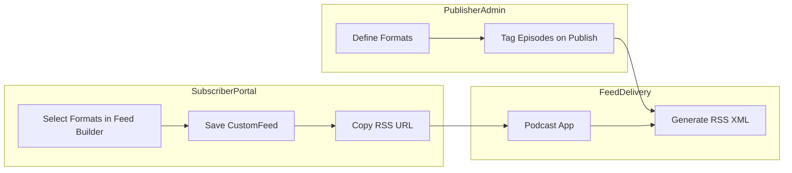

### Feed Builder API

| Method | Path | Auth | Description |
|--------|------|------|-------------|
| GET | `/api/v1/me/feeds` | JWT | List default + custom feeds with URLs, `formatIds`, `formats` |
| POST | `/api/v1/me/feeds` | JWT | Create custom feed (`FEED_BUILDER`) |
| PUT | `/api/v1/me/feeds/{id}` | JWT | Update title/formats (`FEED_BUILDER`) |
| GET | `/api/v1/me/feeds/preview` | JWT | Preview by `formatIds` (`FEED_BUILDER`) |
| GET | `/api/v1/me/feeds/{id}/preview` | JWT | Preview an owned custom feed (`FEED_BUILDER`) |
| PUT | `/api/v1/me/feeds/{id}/enabled` | JWT | Disable/enable (custom or default) |
| POST | `/api/v1/me/feeds/{id}/rotate-token` | JWT | Rotate a custom feed token |
| DELETE | `/api/v1/me/feeds/{id}` | JWT | Delete custom feed (not default) |
| POST | `/api/v1/me/feeds/default/rotate-token` | JWT | Rotate default feed token |
| GET | `/api/v1/public/formats` | Host | Formats available on tenant |

Error `code`s: `FEED_LIMIT_REACHED`, `FEED_TITLE_DUPLICATE`, `FEED_TITLE_INVALID`,
`FEED_FORMATS_REQUIRED`, `FEED_FORMAT_INVALID`, `DEFAULT_FEED_NOT_DELETABLE`,
`DEFAULT_FEED_NOT_FILTERABLE`. Public custom RSS URLs return **404** when `FEED_BUILDER` is off.

---

## Payments and Billing

Billing supports **three sources** during migration; Stripe Connect is the long-term target.

| Source | When | Mechanism |
|--------|------|-----------|
| **Patreon** | Phase A/B | OAuth + membership webhooks → `Subscription.source = PATREON` |
| **Steady** | Phase A/B | API token/webhooks → `Subscription.source = STEADY` |
| **Stripe Connect** | Phase B/C | Checkout + webhooks → `Subscription.source = STRIPE` |

### Stripe Connect Model

Each tenant onboards as a **Stripe Connected Account** for new/direct subscribers.

| Actor | Stripe object |
|-------|---------------|
| Platform | Stripe Platform account |
| Tenant | Connected Account (`acct_...`) |
| End customer | Customer on connected account |
| Product | Product + Price on connected account |

Env vars: `STRIPE_SECRET_KEY`, `STRIPE_WEBHOOK_SECRET`, `STRIPE_CONNECT_CLIENT_ID`

Reference naming from legacy [`projects/strapi/cffc-v3/api/payment-data/`](../strapi/cffc-v3/api/payment-data/)
(`stripeId`, `isSubscription`) — reimplement with Stripe Java SDK v2+.

### Product Types

Tenants sell **`SubscriptionProduct`** records — not a separate Stripe-only entity.

| offering_type | Stripe Price | Example |
|---------------|--------------|---------|
| `LEVEL` | `type=recurring` | Monthly "Supporter" level (cumulative ladder) |
| `PACKAGE` | `type=recurring` | "Podcast A only" or "All podcasts + bonus files" |
| One-time | `type=one_time` | Post-MVP: single bonus episode purchase |

MVP focuses on **LEVEL and PACKAGE subscriptions** aligned with Patreon/Steady product mapping.

#### SubscriptionProduct (billing fields)

See [SubscriptionProduct entity](#subscriptionproduct-replaces-tier--what-tenants-sell) in Content Model.
Stripe `Product` + `Price` are created on the tenant's connected account via
`POST /api/v1/products/{id}/sync-stripe`.

### Checkout Flow

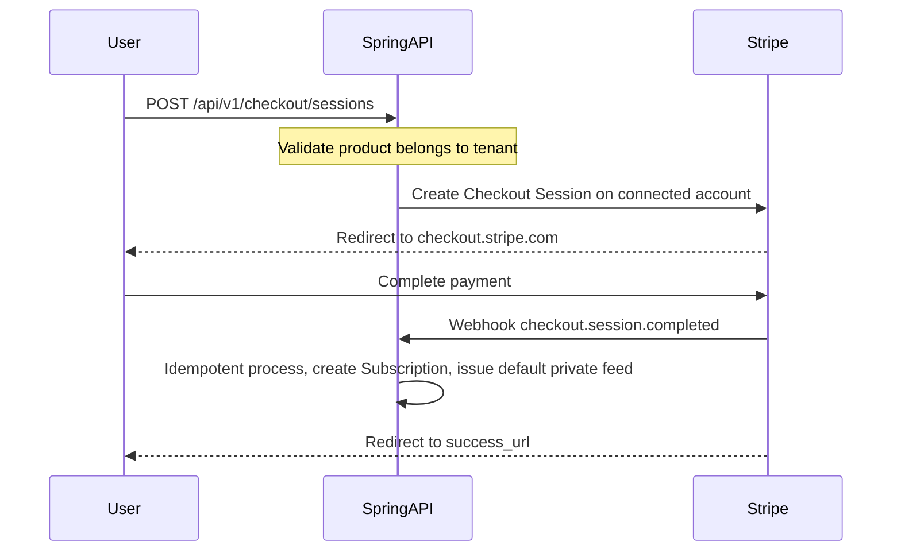

`POST /api/v1/checkout/sessions` body:

```json
{
  "productId": 42,
  "successUrl": "https://client-a.de/purchase/success",
  "cancelUrl": "https://client-a.de/purchase/cancel"
}
```

Use Stripe Checkout `client_reference_id` and metadata: `tenant_id`, `user_id`, `product_id`.

### Subscriptions

- Stripe Checkout `mode: subscription` for new members (Phase B+)
- Patreon/Steady webhooks create/update/cancel `Subscription` records (Phase A/B)
- On activation → create `SubscriberFeed` (default private feed) if not exists
- On cancel → grace period then invalidate feed tokens
- `POST /api/v1/billing/portal` → Stripe Customer Portal (Stripe-sourced subs only)

#### Subscription (entity)

| Column | Type | Notes |
|--------|------|-------|
| `id` | BIGINT PK | |
| `tenant_id` | BIGINT FK | |
| `user_id` | BIGINT FK | |
| `source` | ENUM | STRIPE, PATREON, STEADY, MANUAL |
| `external_subscription_id` | VARCHAR | Patreon member id, Steady sub id, or Stripe sub id |
| `product_id` | BIGINT FK | Maps to `SubscriptionProduct` |
| `status` | ENUM | ACTIVE, PAST_DUE, CANCELED, INCOMPLETE |
| `current_period_end` | TIMESTAMPTZ | |

### Entitlements

Entitlements are **derived from active subscriptions** (union model) rather than stored per-episode
(except manual grants):

```
activeProducts(user, tenant) = all Subscription where status=ACTIVE

hasAccess(user, episode) =
  episode.access_policy == FREE
  OR any p in activeProducts grants episode via:
    - p.offering_type == LEVEL  AND p.sort_order >= episode.required_level_sort_order
    - p.offering_type == PACKAGE AND ∃ rule in p.rules matching episode

hasAccess(user, digitalAsset) =
  asset.visibility == PUBLIC
  OR any PACKAGE rule with scope_type=DIGITAL_ASSET and scope_id=asset.id
```

Multiple active subscriptions → **cumulative (union)** access.

Optional `Entitlement` table for manual grants (complimentary access, contest winners):

| Column | Type | Notes |
|--------|------|-------|
| `id` | BIGINT PK | |
| `tenant_id` | BIGINT FK | |
| `user_id` | BIGINT FK | |
| `product_id` | BIGINT FK | Granted product access |
| `source` | ENUM | MANUAL, PROMO |
| `expires_at` | TIMESTAMPTZ | Nullable |

### Webhooks

| Endpoint | Source | Events |
|----------|--------|--------|
| `POST /api/v1/webhooks/stripe` | Stripe | `checkout.session.completed`, `customer.subscription.*`, `invoice.*` |
| `POST /api/v1/webhooks/patreon` | Patreon | `members:pledge:create`, `update`, `delete` |
| `POST /api/v1/webhooks/steady` | Steady | subscription lifecycle (per Steady docs) |

Shared handler rules:

1. Verify platform signature header (Stripe-Signature, Patreon signature, etc.)
2. Parse event; lookup `external_event_id` in `processed_webhook_events` — skip if exists
3. Dispatch to handler; transactional where possible
4. Record event id; return 200 quickly

**Never** log full webhook body or card details.

### Platform SaaS Billing (Optional)

Tenants pay the platform for using the publisher SaaS. Link platform subscription tiers to
**module bundles** via `TenantModuleActivation.source = BILLING`:

| Platform plan | Modules included |
|---------------|------------------|
| Starter | `DIGITAL_CONTENT`, `PODCAST`, `PODCAST_RSS`, `WHITELABEL` |
| Pro | Starter + `SUBSCRIPTION`, `FEED_BUILDER`, one billing source |
| Enterprise | Pro + `PATREON_SYNC`, `STEADY_SYNC`, `STRIPE_BILLING`, `ANALYTICS` |

Defer to Post-MVP unless required at launch.

---

## API Design

The API is the **authoritative product interface**. This section defines the contract all consumers
(customer frontends, reference apps, podcast apps via RSS) depend on.

### Conventions

- Base path: `/api/v1/`
- Standard wrapper (from courses spec):

```json
{
  "statusCode": 200,
  "statusMessage": "OK",
  "data": { },
  "errors": [],
  "metadata": { "page": 0, "size": 20, "total": 100 }
}
```

- Pagination: `?page=0&size=20&sort=publishedAt,desc`
- Errors: appropriate HTTP status + `errors` array with field-level detail
- OpenAPI 3 + Swagger UI at `/swagger-ui.html` — **required deliverable**, not optional tooling
- Export `openapi.yaml` in CI artifact per release tag
- Validate all input with Bean Validation (`@Valid`, `@NotBlank`, etc.)

### Error contract (for integrators)

```json
{
  "statusCode": 403,
  "statusMessage": "Forbidden",
  "data": null,
  "errors": [
    {
      "code": "FEATURE_NOT_ENABLED",
      "message": "Module FEED_BUILDER is not active for this tenant",
      "field": null
    }
  ],
  "metadata": {}
}
```

Standard error codes: `FEATURE_NOT_ENABLED`, `ENTITLEMENT_DENIED`, `MODULE_DEPENDENCY_MISSING`,
`TENANT_SUSPENDED`, `VALIDATION_ERROR`, `RATE_LIMITED`.

### API surface summary

| Audience | Base path | Auth |
|----------|-----------|------|
| Public (headless CMS data) | `/api/v1/public/*` | `Host` header |
| Subscriber | `/api/v1/me/*` | OAuth2 JWT |
| Publisher | `/api/v1/episodes`, `/series`, `/formats`, etc. | OAuth2 JWT + role |
| Platform ops | `/api/v1/platform/*` | `PLATFORM_ADMIN` JWT |
| Feeds | `/feeds/*` | None or feed token |
| Webhooks (inbound) | `/api/v1/webhooks/*` | Provider signature |

### Public API

| Method | Path | Auth | Description |
|--------|------|------|-------------|
| GET | `/api/v1/public/site-config` | Host | Branding, show info, **enabledModules** |
| GET | `/api/v1/public/series` | Host | Podcast series list |
| GET | `/api/v1/public/episodes` | Host | Episode catalog with `accessPolicy` + lock metadata |
| GET | `/api/v1/public/series/{slug}/episodes` | Host | Episodes for series (free + locked metadata) |
| GET | `/api/v1/public/formats` | Host | Format list (for marketing / feed builder) |
| GET | `/api/v1/public/categories` | Host | Category list |
| GET | `/api/v1/public/products` | Host | Active subscription products + pricing |
| GET | `/api/v1/public/products/{slug}` | Host | Single product detail |

### Publisher API

| Method | Path | Role | Description |
|--------|------|------|-------------|
| CRUD | `/api/v1/series` | EDITOR+ | Podcast series management |
| CRUD | `/api/v1/episodes` | EDITOR+ | Episode management |
| POST | `/api/v1/episodes/{id}/publish` | EDITOR+ | Publish now |
| POST | `/api/v1/episodes/{id}/schedule` | EDITOR+ | Schedule release |
| CRUD | `/api/v1/formats` | TENANT_ADMIN | Define feed-builder formats |
| CRUD | `/api/v1/categories` | TENANT_ADMIN | Define categories |
| CRUD | `/api/v1/products` | TENANT_ADMIN | Subscription products (LEVEL + PACKAGE) |
| CRUD | `/api/v1/products/{id}/access-rules` | TENANT_ADMIN | PACKAGE access scopes |
| POST | `/api/v1/products/{id}/sync-stripe` | TENANT_ADMIN | Create/update Stripe Product+Price |
| POST | `/api/v1/media/upload-url` | EDITOR+ | Pre-signed audio upload |
| POST | `/api/v1/media/{id}/confirm` | EDITOR+ | Confirm upload |
| GET | `/api/v1/tenant/integrations/patreon/authorize` | TENANT_ADMIN | Start Patreon OAuth |
| GET | `/api/v1/tenant/integrations/steady/authorize` | TENANT_ADMIN | Start Steady OAuth |
| POST | `/api/v1/tenant/integrations/sync` | TENANT_ADMIN | Force membership resync |
| POST | `/api/v1/tenant/stripe/onboard` | TENANT_ADMIN | Stripe Connect onboarding |
| GET/PUT | `/api/v1/tenant/branding` | TENANT_ADMIN | Branding |
| CRUD | `/api/v1/tenant/domains` | TENANT_ADMIN | Domain management |

### Auth API

| Method | Path | Auth | Description |
|--------|------|------|-------------|
| POST | `/api/v1/auth/register` | Host | Create user + tenant membership |
| POST | `/oauth2/token` | Client creds | Login (password grant) or refresh token |
| POST | `/api/v1/auth/claim` | Host | Shadow user claim (Patreon/Steady migration) |
| POST | `/api/v1/auth/forgot-password` | Host | Request password reset email |
| POST | `/api/v1/auth/reset-password` | Host | Reset password with token |
| GET | `/api/v1/me` | JWT | Current user profile |

### Subscriber API

| Method | Path | Auth | Description |
|--------|------|------|-------------|
| GET | `/api/v1/me/access` | JWT | Entitlement summary ("what can I access") |
| GET | `/api/v1/me/subscriptions` | JWT | All active products + billing source |
| GET | `/api/v1/me/episodes` | JWT | Paginated entitled episodes |
| GET | `/api/v1/me/downloads` | JWT | Entitled digital files |
| GET | `/api/v1/me/feeds` | JWT | Default + custom feed URLs |
| POST | `/api/v1/me/feeds` | JWT | Create custom feed (feed builder) |
| PUT | `/api/v1/me/feeds/{id}` | JWT | Update title/format selection |
| PUT | `/api/v1/me/feeds/{id}/enabled` | JWT | Disable/enable an owned feed |
| POST | `/api/v1/me/feeds/{id}/rotate-token` | JWT | Rotate a custom feed token |
| DELETE | `/api/v1/me/feeds/{id}` | JWT | Delete custom feed |
| GET | `/api/v1/me/feeds/preview` | JWT | Preview by formatIds |
| GET | `/api/v1/me/feeds/{id}/preview` | JWT | Preview episode count |
| POST | `/api/v1/me/feeds/default/rotate-token` | JWT | Rotate default private feed token |
| GET | `/api/v1/me/episodes/{slug}/stream` | JWT | 302 to signed S3 URL if entitled |

### Platform API

Full endpoint list in [Platform Superadmin Dashboard — Dashboard API Endpoints](#dashboard-api-endpoints).

### Billing API

| Method | Path | Auth | Description |
|--------|------|------|-------------|
| POST | `/api/v1/checkout/sessions` | JWT / anonymous | Start Stripe Checkout for `productId` |
| POST | `/api/v1/billing/portal` | JWT | Stripe Customer Portal |
| POST | `/api/v1/webhooks/stripe` | Stripe sig | Stripe events |
| POST | `/api/v1/webhooks/patreon` | Patreon sig | Patreon membership events |
| POST | `/api/v1/webhooks/steady` | Steady sig | Steady subscription events |

### Feed API

| Method | Path | Auth | Description |
|--------|------|------|-------------|
| GET | `/feeds/{tenantSlug}/podcast.xml` | None | Public free feed |
| GET | `/feeds/{tenantSlug}/{seriesSlug}.xml` | None | Series public free feed |
| GET | `/feeds/{tenantSlug}/u/{feedToken}.xml` | Token | Private or custom subscriber feed |

---

## Authentication and Authorization

**All user account handling is implemented via Spring Security** — no bespoke JWT libraries, no parallel auth stack.

Follow the dual OAuth2 pattern from [`projects/courses/README.md`](../courses/README.md).

### Spring Security Architecture

The publish monolith wears two Spring Security hats:

| Role | Starter | Responsibility |
|------|---------|----------------|
| **Authorization Server** | `spring-boot-starter-oauth2-authorization-server` | Authenticate users, issue JWT access + refresh tokens |
| **Resource Server** | `spring-boot-starter-oauth2-resource-server` | Validate JWTs on protected API routes, enforce roles |

| Component | Implementation |
|-----------|----------------|
| `PublishUserDetailsService` | Implements `UserDetailsService`; loads `User` + `TenantMembership` roles |
| `PublishUserPrincipal` | Wraps user id, email, tenant-scoped `GrantedAuthority` list |
| `PasswordEncoder` | `BCryptPasswordEncoder` (strength 12+) |
| `DaoAuthenticationProvider` | Password verification on login |
| `AuthorizationServerConfig` | OAuth2 client registrations, JWT signing keys, `/oauth2/token` |
| `ResourceServerConfig` | `oauth2ResourceServer().jwt()`, issuer/audience validation |
| `SecurityFilterChain` | Stateless sessions; public vs protected path matchers |
| `@EnableMethodSecurity` | `@PreAuthorize("hasRole('TENANT_ADMIN')")` on service/controller methods |

**Package layout:** `de.pnnit.directwerk.security/` — configs, `UserDetailsService`, JWT customizers, tenant-aware `AuthenticationConverter`.

### Subscriber Identity

See [User](#user-global-account), [TenantMembership](#tenantmembership-user--tenant), and
[ExternalIdentity](#externalidentity-patreonsteadystripe-link) entities in Content Model.

**Shadow user flow** (Patreon/Steady migration): On import, create `User` with email from platform,
`status=PENDING_VERIFICATION`, no `password_hash`. Send magic-link email →
`POST /api/v1/auth/claim` sets password via `PasswordEncoder` and activates account.

**Global account model:** One email can hold `TenantMembership` rows for multiple tenants.

### Auth Flows

#### Registration

`POST /api/v1/auth/register` — creates account; client logs in separately via `/oauth2/token`.

1. Resolve tenant from `Host` header
2. Validate email/password
3. `PasswordEncoder.encode(password)` → persist `User` + `TenantMembership(ROLE_SUBSCRIBER)`
4. Return `201`

#### Login

`POST /oauth2/token` — OAuth2 **password grant** for first-party clients:

```
grant_type=password&username={email}&password={password}&client_id={tenant_frontend_client}
```

JWT claims: `sub` (user id), `tenant_id`, `roles[]`, `email`.

Refresh: standard OAuth2 refresh token grant.

#### Account claim / password reset

- `POST /api/v1/auth/claim` — one-time migration token → set password, activate shadow user
- `POST /api/v1/auth/forgot-password` → email reset link
- `POST /api/v1/auth/reset-password` → `PasswordEncoder` update; invalidate refresh tokens

### Protected Route Policy

| Path pattern | Spring Security rule |
|--------------|---------------------|
| `/api/v1/public/**`, `/feeds/**`, `/swagger-ui/**`, `/actuator/health` | `permitAll` |
| `/oauth2/token`, `/.well-known/**` | Authorization Server public endpoints |
| `/api/v1/platform/**` | `hasRole('PLATFORM_ADMIN')` |
| `/api/v1/episodes`, `/series`, `/products`, etc. | `hasRole('TENANT_ADMIN')` or `EDITOR` |
| `/api/v1/me/**` | `authenticated` + `ROLE_SUBSCRIBER` (or admin roles) |
| `/api/v1/webhooks/**` | Provider signature verification (not JWT) |

Tenant isolation: `TenantContext` from JWT `tenant_id` claim + `Host` cross-check on each request.

**What we do NOT do:** custom JWT utilities outside Spring Security; session-based login; client-side-only entitlement checks.

---

## Reference Frontend (directwerk-web)

**Not the API contract** — default **public site and subscriber portal** for non-technical creators.
Agencies may replace with a custom frontend against the same API.

**Planned location:** `projects/directwerk-web/` (Phase 9 — after core API; may ship earlier for MVP demo)

| Area | Pages |
|------|-------|
| **Public** | Show landing, free episode list, article archive (post-MVP), product pricing, register/login |
| **Subscriber portal** | Access dashboard (`/me/access`), feed URLs, **feed builder**, subscription management |

Publisher back-office lives in **`directwerk-studio`** — not `directwerk-web`. See
[Reference Frontend (directwerk-studio)](#reference-frontend-directwerk-studio).

| Concern | Approach |
|---------|----------|
| Data source | 100% via `/api/v1/` — no direct DB, no BFF bypassing public API |
| Tenant resolution | Middleware reads `Host` → `GET /api/v1/public/site-config` |
| Feed builder UI | Thin client over `/api/v1/me/feeds` |
| Styling | CSS Modules; customer frontends may use any stack |
| Deploy | Bundled with `directwerk-studio` on tenant domain by default |

Reference static-site patterns: [`projects/complete/pilates/src/site/identity.ts`](../complete/pilates/src/site/identity.ts)
(branding loaded from `site-config` API instead of hardcoded).

**When to skip:** Agency provides their own public/subscriber frontend — API-only deployment is
valid. **`directwerk-studio` can remain the creator dashboard.**

---

## Reference Frontend (directwerk-studio)

**Default creator app** for non-technical tenants. Full product overview:
[`docs/directwerk-studio.md`](docs/directwerk-studio.md). Implementation guide (screens, scaffold, auth):
[`docs/directwerk-studio-implementation.md`](docs/directwerk-studio-implementation.md). Content backend
(libraries, workflow): [`docs/content-creation-implementation.md`](docs/content-creation-implementation.md).

**Planned location:** `projects/directwerk-studio/` (dedicated app) or `/studio/**` in `directwerk-web`

| Area | Screens |
|------|---------|
| **Overview** | Drafts awaiting publish, recent activity, integration health |
| **Content** | Podcast series/episodes, articles (post-MVP), bonus files |
| **Media library** | Upload audio/images, attach to content |
| **Audience** | Subscribers (admin), team invites |
| **Monetization** | Products, Stripe/Patreon/Steady, email ESP |
| **Settings** | Branding, domains, formats/categories |

| Concern | Approach |
|---------|----------|
| Data source | 100% via `/api/v1/` — same contract agencies use |
| Auth | OAuth2 JWT on tenant domain (`EDITOR`, `TENANT_ADMIN`) |
| i18n | German first when UI ships |
| Deploy | `https://studio.{tenant}` or `https://{tenant}/studio` |

**MVP target:** Studio v2 — creator publishes a podcast episode entirely in the UI without API knowledge.

---

## Platform Superadmin Dashboard

Web-based **platform operations console** for `PLATFORM_ADMIN` users (superadmins). Manages
tenants, module assignments, tenant admins, and platform health — separate from tenant-facing UIs.

### Scope and Separation

| App | Path | Audience | Tenant resolution |
|-----|------|----------|-------------------|
| `projects/directwerk-admin/` | `https://admin.{platform-domain}.de` | Platform superadmins | **None** — platform-scoped only |
| `projects/directwerk-studio/` | `https://studio.{tenant-domain}.de` | Publishers, editors | Host-based |
| `projects/directwerk-web/` | `https://{tenant-domain}.de` | Subscribers, guests | Host-based |

**Why a separate app?**

1. **Security isolation** — superadmin UI not deployed on tenant domains; smaller attack surface
2. **Auth boundary** — `PLATFORM_ADMIN` JWT only; no `Host` header tenant confusion
3. **Independent deploy** — ship platform ops features without touching whitelabel sites
4. **Fixed UI** — no per-tenant theming; consistent ops experience

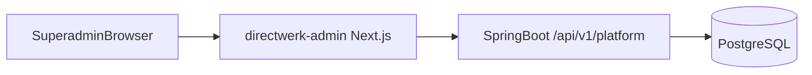

### Dashboard Areas

#### 1. Overview (home)

- Total tenants (active / suspended / trial)
- Module adoption counts (how many tenants use `FEED_BUILDER`, etc.)
- Recent platform audit events
- Integration health alerts (failed Patreon syncs, webhook errors)

#### 2. Tenant management

| Screen | Capabilities |
|--------|--------------|
| **Tenant list** | Search, filter by status/module, sort by created date; paginated table |
| **Create tenant** | Name, slug, primary domain; select onboarding preset (Patreon migrator, free podcast, custom) |
| **Tenant detail** | Overview tab: status, slug, domains, created date, subscriber count, episode count |
| **Suspend / reactivate** | Disable all tenant feeds and API access without deleting data |

#### 3. Module management (per tenant)

Primary screen for assigning capability bundles.

| UI element | Behavior |
|------------|----------|
| Module grid | All modules with on/off toggle; disabled if dependency missing |
| Dependency hints | e.g. "Requires SUBSCRIPTION" shown greyed until prerequisite active |
| Preset buttons | Quick-apply: Patreon migrator, Pro bundle, Free podcast |
| Cascade warning | Confirm dialog when deactivating a module that will disable dependents |
| Activation log | Who activated/deactivated, when (`TenantModuleActivation.activated_by`) |

#### 4. Tenant admin management

Manage publisher-side admins (`TENANT_ADMIN`, `EDITOR`) without logging into tenant site.

| Action | Description |
|--------|-------------|
| List users | Filter by role; show last login |
| Invite tenant admin | Email invite → set-password link scoped to tenant |
| Assign / revoke role | Promote editor to tenant admin, demote, deactivate |
| Resend invite | For pending invitations |

Does **not** manage subscribers (`SUBSCRIBER` role) — that remains tenant admin responsibility.

#### 5. Platform admin users

Manage who can access this dashboard (`PLATFORM_ADMIN` role).

| Action | Description |
|--------|-------------|
| List platform admins | Email, name, last login |
| Invite platform admin | Email invite (separate from tenant invites) |
| Deactivate | Revoke platform access |

Post-MVP: enforce MFA for `PLATFORM_ADMIN`.

#### 6. Audit log

| Column | Example |
|--------|---------|
| `timestamp` | 2026-07-15T14:00:00Z |
| `actor` | admin@pnn-it.de |
| `action` | `MODULE_ACTIVATED`, `TENANT_CREATED`, `USER_INVITED` |
| `tenant_id` | 42 (nullable for platform-level actions) |
| `details` | JSON: `{ "moduleKey": "FEED_BUILDER" }` |

Store in `platform_audit_events` table. Retain 12 months minimum.

#### 7. Support tools (Post-MVP)

- **View as tenant** — read-only impersonation of tenant admin session (audit logged)
- **Force membership resync** — trigger Patreon/Steady sync for a tenant
- **Feed URL lookup** — find subscriber feed by email (support requests)

### Dashboard API Endpoints

All routes require `ROLE_PLATFORM_ADMIN`. Base path: `/api/v1/platform/`.

#### Tenants

| Method | Path | Description |
|--------|------|-------------|
| GET | `/tenants` | List tenants (paginated, filterable) |
| POST | `/tenants` | Create tenant + apply module preset |
| GET | `/tenants/{id}` | Tenant detail + stats |
| PATCH | `/tenants/{id}` | Update name, status, slug |
| POST | `/tenants/{id}/suspend` | Suspend tenant |
| POST | `/tenants/{id}/reactivate` | Reactivate tenant |

`POST /tenants` body example:

```json
{
  "name": "My Podcast Show",
  "slug": "my-show",
  "primaryDomain": "podcasts.my-show.de",
  "modulePreset": "PATREON_MIGRATOR",
  "inviteTenantAdmin": {
    "email": "creator@example.com",
    "name": "Jane Creator"
  }
}
```

#### Modules

| Method | Path | Description |
|--------|------|-------------|
| GET | `/modules` | All modules with `depends_on` graph |
| GET | `/tenants/{id}/modules` | Tenant active modules |
| POST | `/tenants/{id}/modules/{moduleKey}/activate` | Activate (validates dependencies) |
| DELETE | `/tenants/{id}/modules/{moduleKey}` | Deactivate + cascade |
| POST | `/tenants/{id}/modules/preset/{presetKey}` | Apply preset bundle |

Preset keys and their module bundles:

| Preset | Modules activated |
|--------|-------------------|
| `PATREON_MIGRATOR` | `DIGITAL_CONTENT`, `PODCAST`, `PODCAST_RSS`, `SUBSCRIPTION`, `PATREON_SYNC`, `WHITELABEL` |
| `FREE_PODCAST` | `DIGITAL_CONTENT`, `PODCAST`, `PODCAST_RSS`, `WHITELABEL` |
| `PRO` | `FREE_PODCAST` + `SUBSCRIPTION`, `FEED_BUILDER`, `STRIPE_BILLING` |
| `ENTERPRISE` | `PRO` + `PATREON_SYNC`, `STEADY_SYNC`, `ANALYTICS` |

#### Tenant users

| Method | Path | Description |
|--------|------|-------------|
| GET | `/tenants/{id}/users` | List tenant admins and editors |
| POST | `/tenants/{id}/users/invite` | Invite user with role |
| PATCH | `/tenants/{id}/users/{userId}` | Change role or deactivate |
| DELETE | `/tenants/{id}/users/{userId}` | Remove user from tenant |

#### Platform admins

| Method | Path | Description |
|--------|------|-------------|
| GET | `/admins` | List platform admins |
| POST | `/admins/invite` | Invite new platform admin |
| DELETE | `/admins/{userId}` | Revoke platform admin access |

#### Audit

| Method | Path | Description |
|--------|------|-------------|
| GET | `/audit` | Paginated audit log (filter by tenant, actor, action) |

### Auth and Security

| Concern | Implementation |
|---------|----------------|
| Login | Email + password; JWT with `roles: ["PLATFORM_ADMIN"]` only |
| Route guard | Next.js middleware checks role; redirect to login |
| API guard | `@PreAuthorize("hasRole('PLATFORM_ADMIN')")` on all `/api/v1/platform/**` |
| CORS | Allow-list `admin.{platform-domain}.de` only |
| Session | Short-lived access token (15 min) + refresh token (HttpOnly cookie) |
| Audit | Every mutating platform action writes `platform_audit_events` |
| IP allow-list | Optional Post-MVP restriction for production dashboard |

Superadmin accounts are **never** created via public registration — invite-only.

### Deployment

| Concern | Value |
|---------|-------|
| Project | `projects/directwerk-admin/` |
| Stack | Next.js 16, React 19, TypeScript, CSS Modules (no Tailwind) |
| Host | `admin.{platform-domain}.de` (single fixed domain) |
| API target | `https://api.{platform-domain}.de/api/v1/platform` |
| Coolify | Separate app from `directwerk-web` and Spring API |
| Env | `NEXT_PUBLIC_PLATFORM_API_URL`, no tenant env vars |

```
projects/directwerk-admin/
  app/
    (auth)/login/
    (dashboard)/
      page.tsx              # Overview
      tenants/
        page.tsx            # Tenant list
        new/page.tsx        # Create tenant
        [id]/
          page.tsx          # Tenant detail
          modules/page.tsx  # Module toggles
          users/page.tsx    # Tenant admin management
      admins/page.tsx       # Platform admin users
      audit/page.tsx        # Audit log
  src/components/
  src/lib/platformApi.ts
  AGENTS.md
```

UI conventions: data tables with pagination, confirmation modals for destructive actions,
module dependency graph as simple tree (not full graph viz at MVP).

---

## Security

Apply monorepo [security rules](../../.cursor/rules/security-global-base.mdc) and courses security checklist:

1. No raw user input in SQL, file paths, or shell commands
2. Parameterized queries / JPA only
3. Pre-signed S3 uploads with content-type, size, and **tenant-scoped key** constraints
4. Private assets (`{tenant}/private/`) never served without entitlement check + signed URL
5. Sanitize HTML in show notes before RSS `content:encoded` and storage
6. Stripe webhook signature verification mandatory
7. Rate limit `/api/v1/checkout/sessions` and auth endpoints
8. CORS: allow-list tenant domains per environment
9. No secrets in repo; Coolify env injection
10. Do not log tokens, passwords, webhook card data, PII, or **pre-signed S3 URLs**
11. `enabledModules` in `site-config` for frontend gating
12. Module dependency validation on activate/deactivate
13. `AssetAccessService` is the only path to generate download URLs — no direct S3 key exposure in API

---

## Database and Migrations

- **PostgreSQL 19 (beta)**, database name `publishdb`
- **Flyway 12+** for all schema changes (version managed by Spring Boot BOM); `ddl-auto: validate` in production
- Migration naming: `V{n}__description.sql`
- Indexes: all `tenant_id` columns; `(tenant_id, slug)` unique; `published_at`; `stripe_*` ids

### Initial migration outline

**Alpha POC** uses a smaller set first — see [`docs/poc-alpha-setup.md` § Database migrations](docs/poc-alpha-setup.md#database-migrations-alpha)
(V1–V5 + `R__alpha_dev_seed.sql`). Merge with the full outline below when implementing post-alpha phases.

- `V1__create_tenants.sql` — tenants, tenant_domains, tenant_branding
- `V2__create_users_and_memberships.sql` — users, tenant_memberships, external_identities
- `V3__create_feature_modules.sql` — feature_modules (seed with dependency graph), tenant_module_activations
- `V4__create_digital_content.sql` — media_assets, digital_publications, publication workflow tables
- `V5__create_podcast.sql` — series, episodes, formats, categories
- `V6__create_subscription_products.sql` — subscription_products, product_access_rules, subscriptions, subscriber_feeds
- `V7__create_custom_feeds.sql` — custom_feeds (feed builder)
- `V8__create_integrations.sql` — external_oauth_tokens, processed_webhook_events
- `V9__create_manual_entitlements.sql` — optional manual entitlements
- `V10__create_platform_audit.sql` — platform_audit_events

See [Flyway](#flyway) for full integration guide, configuration, development workflow, and examples.

---

## Local Development

**Authoritative runbook:** [`Directwerk/docs/build-and-deploy.md`](Directwerk/docs/build-and-deploy.md)
(Postgres + Mailpit via Compose, host `bootRun`, full `stack` profile, env vars, troubleshooting).

### Quick start

```sh
cd projects/directwerk/Directwerk
cp .env.example .env          # set DB password + OAuth / seed secrets
docker compose up -d          # Postgres :5433, Mailpit SMTP :1025 / UI :8025
./gradlew :directwerk-app:bootRun
```

| URL | Purpose |
|-----|---------|
| `http://localhost:8080/actuator/health` | Health |
| `http://localhost:8080/swagger-ui.html` | OpenAPI UI |
| `http://127.0.0.1:8025` | Mailpit (captured email) |

Frontends: `example-fe` (:3000), `directwerk-admin` (:3001), `directwerk-studio` (:3003), and
`directwerk-web` (:3004). HTTP harness: [`Directwerk/http/`](Directwerk/http/).

Object storage (when implementing uploads) uses Hetzner or Bunny.net (EU) — not a local container.
See [`docs/asset-storage.md`](docs/asset-storage.md). Stripe webhook forwarding (when billing ships):

```sh
stripe listen --forward-to localhost:8080/api/v1/webhooks/stripe
```

---

## Deployment

**Authoritative deploy guide:** [`Directwerk/docs/build-and-deploy.md`](Directwerk/docs/build-and-deploy.md)
(Docker image, Coolify on Hetzner, required prod env vars including JWT PEMs, Mailgun SMTP, email base URLs).

Target topology: **Docker on Hetzner Cloud via Coolify** (same as other monorepo apps).

### Production topology

| Service | Notes |
|---------|-------|
| Spring Boot API (`Directwerk`) | 1+ containers behind Traefik / Coolify proxy |
| PostgreSQL | Managed or Coolify database service (not Compose) |
| SMTP | Mailgun (or equivalent) — not Mailpit |
| S3 | Hetzner Object Storage or Bunny.net Storage (EU) — when media ships |
| Next.js | Separate Coolify apps (`directwerk-admin` / studio / web) |
| Traefik | TLS via Let's Encrypt; per-tenant `Host()` rules |

### Routing example

| Host / Path | Target |
|-------------|--------|
| `admin.{platform}.de` | `directwerk-admin` (superadmin dashboard) |
| `api.{platform}.de` | Spring Boot API |
| `client-a.de`, etc. | `directwerk-web` (whitelabel) |
| `api.{platform}.de/api/v1/platform/*` | Spring Boot (platform routes) |
| `*/feeds/*` on tenant domains | Spring Boot |

Future billing/storage secrets (`S3_*`, Stripe, Patreon, Steady) will be documented alongside those
features; current API secrets are listed in [`Directwerk/.env.example`](Directwerk/.env.example)
and the build-and-deploy guide.

---

## CI/CD

Extend [`.github/workflows/projects-ci.yml`](../../.github/workflows/projects-ci.yml):

```yaml
publish:
  needs: changes
  if: needs.changes.outputs.publish == 'true'
  runs-on: ubuntu-latest
  defaults:
    run:
      working-directory: projects/directwerk
  services:
    postgres:
      image: postgres:19beta1-alpine
      env:
        POSTGRES_DB: publishdb_test
        POSTGRES_USER: test
        POSTGRES_PASSWORD: test
      ports:
        - 5432:5432
  steps:
    - uses: actions/checkout@v4
    - uses: actions/setup-java@v4
      with:
        distribution: temurin
        java-version: '21'
    - run: ./gradlew test build
```

Path filter: `projects/directwerk/**`

---

## Testing Strategy

| Layer | Tool | Focus |
|-------|------|-------|
| Unit | JUnit 5 + Mockito | `EntitlementService`, `RssFeedService`, `CustomFeedService`, `FormatFilter` |
| Integration | Testcontainers (PostgreSQL) | Repositories, tenant isolation, feed generation |
| API | MockMvc / WebTestClient | Feed endpoints, feed builder CRUD, episode publish |
| Webhooks | Stripe/Patreon test fixtures | Idempotency, subscription sync, feed token issuance |
| Contract | OpenAPI snapshot | API stability |

**Critical test scenarios:**

### End-user journey (Project X)

1. Anonymous user sees free episodes + locked paid metadata on `GET /public/episodes`
2. Public RSS contains only FREE episodes; paid episodes absent
3. Register on projectx.de → JWT scoped to projectx tenant only
4. Subscribe to "Supporter" LEVEL → default private feed created; `GET /me/access` reflects entitlements
5. Custom feed with category filter → podcatcher fetch returns only entitled matching episodes
6. `POST /billing/portal` opens Stripe self-service; cancel revokes paid feed after grace
7. Customer frontend never bypasses API — all entitlement checks server-side

### Entitlement and access

8. Tenant A subscriber cannot access Tenant B private feed token
9. PACKAGE "Podcast A only" → private feed contains only series A episodes
10. Two active PACKAGE subscriptions → union access (cumulative)
11. LEVEL sort_order 2 includes episodes requiring sort_order 1
12. Patreon import creates shadow user → claim link → `/oauth2/token` login → private feed works
13. Invalid/expired JWT rejected by Resource Server on `/api/v1/me/**`
14. Digital file in PACKAGE rule → appears in `/me/downloads`; absent without subscription
15. Checkout for PACKAGE product → webhook creates `Subscription` with correct `product_id`

### RSS and feeds

16. Default private feed includes all entitled episodes for subscriber level
17. Custom feed with formats `[Interview]` excludes `Bonus` episodes
18. Custom feed never includes episodes above subscriber's level (entitlement filter)
19. Patreon `members:pledge:create` webhook creates subscription + default private feed
20. Subscription cancel revokes private feed after grace period
21. Feed token rotation invalidates old URL immediately
22. `match_mode=ALL` requires both format and category match
23. Format with `required_level_sort_order` hidden from feed builder for lower-level subscribers

### Modules and assets

24. Activating `FEED_BUILDER` without `SUBSCRIPTION` returns `DependencyNotActiveException`
25. Deactivating `SUBSCRIPTION` cascades to `FEED_BUILDER` and billing modules
26. Request to `PODCAST_RSS` endpoint with module disabled returns 403 `FEATURE_NOT_ENABLED`
27. `site-config` returns only active modules for tenant
28. Cannot activate `PODCAST` without `DIGITAL_CONTENT`; cannot activate `FEED_BUILDER` without `PODCAST_RSS`
29. Private S3 asset URL without entitlement returns 403; cross-tenant asset key rejected
30. FREE episode audio lands under `{tenant}/public/`; PAID episode audio under `{tenant}/private/`
31. RSS private feed enclosures use signed URLs only; URLs expire and differ per feed fetch

---

## Implementation Checklist

### Phase 1 — Project bootstrap

- [ ] Gradle 9.x + Spring Boot 4.1.0 project scaffold
- [ ] Flyway integration — `db/migration/`, dev/prod config, see [Flyway](#flyway) section
- [ ] `Tenant`, `TenantDomain`, `TenantBranding` entities + V1 migration
- [ ] **`FeatureModule`, `TenantModuleActivation` + V3 seed migration**
- [ ] **`ModuleService`, `ModuleActivationService`, `@RequiresModule` aspect**
- [x] `TenantContext`, `TenantResolver`, Hibernate `tenantFilter` + write guard (see `Directwerk/docs/multi-tenancy.md`)
- [ ] Global exception handler + `Response` wrapper (+ structured error `code` field)
- [ ] **OpenAPI 3 + Swagger UI — treat as product deliverable**
- [ ] **Integration guide stub in `docs/directwerk-api-integration.md`**
- [ ] Platform admin API for module activate/deactivate
- [x] `Directwerk/compose.yaml` (Postgres + Mailpit), `Dockerfile`, [`docs/build-and-deploy.md`](Directwerk/docs/build-and-deploy.md), `AGENTS.md`
- [ ] Actuator health endpoint
- [ ] Auto-activate `DIGITAL_CONTENT` on tenant creation
- [ ] Spring Security starters + `security/` package scaffold (`AuthorizationServerConfig`, `ResourceServerConfig`)

### Phase 2 — Digital content foundation

- [ ] `DIGITAL_CONTENT` module package — media upload, publish workflow primitives
- [ ] `MediaAsset` entity + S3 key layout (`{tenant}/public|private|staging/`)
- [ ] `AssetAccessService` — public CDN URLs vs entitlement-gated signed URLs
- [ ] Pre-signed PUT upload + confirm + promote on publish
- [ ] Draft / schedule / publish state machine (shared by all content types)
- [ ] `@RequiresModule("DIGITAL_CONTENT")` on base content endpoints
- [ ] Staging prefix lifecycle rule (expire after 24h)

### Phase 3 — Podcast module

- [ ] `PODCAST` module — `PodcastSeries`, `Episode`, `Format`, `Category` entities + migration
- [ ] Publisher admin CRUD for series, episodes, formats, categories
- [ ] `@RequiresModule("PODCAST")` on podcast endpoints
- [ ] HTML sanitization for show notes

### Phase 4 — RSS feeds (public + private)

- [ ] `PODCAST_RSS` module — `RssFeedService` (RSS 2.0 + iTunes)
- [ ] Public free feed endpoints
- [ ] `SubscriberFeed` — auto-create on subscription with feed token
- [ ] Private feed endpoint `/feeds/{tenantSlug}/u/{feedToken}.xml`
- [ ] `EntitlementService` union-based access checks (LEVEL + PACKAGE)
- [ ] ETag caching + invalidation on publish

### Phase 4b — Auth, products, and subscriber portal API

- [ ] `User`, `TenantMembership`, `ExternalIdentity` entities + migration
- [ ] `PublishUserDetailsService`, `SecurityFilterChain`, OAuth2 Authorization + Resource Server
- [ ] Auth endpoints: register, claim, forgot/reset password
- [ ] `SubscriptionProduct`, `ProductAccessRule`, `DigitalPublication` entities + admin CRUD
- [ ] Public product catalog + `GET /api/v1/me/access` entitlement summary
- [ ] `GET /api/v1/public/episodes` with lock metadata

### Phase 5 — Platform superadmin dashboard

- [ ] `projects/directwerk-admin/` Next.js scaffold (fixed domain, no tenant middleware)
- [ ] Superadmin login (PLATFORM_ADMIN JWT)
- [ ] Tenant list + create + detail views
- [ ] Module management UI (toggles, presets, dependency hints, cascade confirm)
- [ ] Tenant admin invite and role management
- [ ] Platform admin user management
- [ ] Audit log viewer
- [ ] `platform_audit_events` entity + write on all mutating platform actions
- [ ] Expand platform REST API (tenants CRUD, users, audit)
- [ ] Coolify deploy at `admin.{platform-domain}.de`

### Phase 6 — Patreon and Steady onboarding

- [ ] Patreon OAuth flow + token storage
- [ ] Import campaign, subscription products, active members (shadow users)
- [ ] Patreon webhook handler + idempotency
- [ ] Steady OAuth/API integration + webhooks
- [ ] `Subscription` multi-source model (PATREON, STEADY, STRIPE)
- [ ] Periodic membership reconciliation job
- [ ] Publisher UI: integration status + manual resync

### Phase 7 — Feed builder

- [x] Custom feeds reuse `subscriber_feeds` (`is_default=false`) + format join + CRUD API
- [x] Format OR-match filtering with entitlement gate
- [x] Feed preview endpoint (episode count + sample titles)
- [x] Custom feed RSS generation (shared token URL path)
- [x] Max 5 custom feeds per subscriber
- [x] Token rotation for default and custom private feeds

### Phase 8 — Stripe billing

- [ ] Stripe Connect tenant onboarding
- [ ] Checkout session for subscription products (`productId`)
- [ ] Stripe webhook handler
- [ ] Dual-run: Stripe + Patreon/Steady subscriptions coexist
- [ ] Customer Portal for Stripe-sourced subs

### Phase 9 — Reference frontend (optional)

- [ ] `projects/directwerk-web/` — optional reference; **customer-built frontends are the primary model**
- [ ] Demonstrate Project X journey: register, catalog, checkout, portal, feed builder
- [ ] Per-customer fork/customize as needed

### Phase 10 — Hardening

- [ ] Testcontainers integration test suite (see critical scenarios)
- [ ] Rate limiting on feed token endpoints and webhooks
- [ ] Domain verification flow
- [ ] PostgreSQL backup automation
- [ ] CI job in `projects-ci.yml`
- [ ] OpenAPI contract tests (snapshot or schemathesis)
- [ ] API integration examples (cURL collection or `.http` files)

### Post-MVP

- [ ] Article, ebook, video publication types (extend `DIGITAL_CONTENT`, no new module)
- [ ] One-time episode purchases
- [ ] Platform SaaS billing (tenant pays for platform)
- [ ] Email notifications to subscribers on new episode (Mailgun)
- [ ] Podcast Index / Spotify Open Submission helpers
- [ ] Full data export (GDPR)
- [ ] Outbound webhooks for tenant integrations

---

## Flyway

[Flyway](https://documentation.red-gate.com/flyway/) manages all PostgreSQL schema changes for
`projects/directwerk/`. **Flyway owns the schema; Hibernate only validates against it.**

Stack: Flyway 12+ (version from Spring Boot 4.1.0 BOM) · PostgreSQL 19 (beta) ·
`spring-boot-starter-flyway`

### Dependencies

`build.gradle.kts`:

```kotlin
plugins {
    id("org.springframework.boot") version "4.1.0"
    id("io.spring.dependency-management") version "1.1.7"
    java
}

dependencies {
    implementation("org.springframework.boot:spring-boot-starter-data-jpa")
    implementation("org.springframework.boot:spring-boot-starter-flyway")
    runtimeOnly("org.flywaydb:flyway-database-postgresql")
    runtimeOnly("org.postgresql:postgresql")

    // Optional: run Flyway tasks from Gradle CLI without starting the app
    implementation("org.flywaydb:flyway-core")
}
```

Do **not** pin a Flyway version unless overriding the BOM — Spring Boot 4.1.0 manages compatibility
(currently Flyway 12.4.0; latest engine 12.11.x).

### Configuration

**`src/main/resources/application.yml`** (shared defaults):

```yaml
spring:
  datasource:
    url: jdbc:postgresql://${DB_HOST:localhost}:${DB_PORT:5432}/${DB_NAME:publishdb}
    username: ${DB_USER:publish}
    password: ${DB_PASSWORD:publish}
  jpa:
    hibernate:
      ddl-auto: validate
    open-in-view: false
    properties:
      hibernate:
        jdbc:
          time_zone: UTC
  flyway:
    enabled: true
    locations: classpath:db/migration
    baseline-on-migrate: true
    baseline-version: 0
    validate-on-migrate: true
    clean-disabled: true
```

**`application-dev.yml`** (local development):

```yaml
spring:
  datasource:
    url: jdbc:postgresql://localhost:5432/publishdb
    username: publish
    password: publish
  jpa:
    show-sql: true
    properties:
      hibernate:
        format_sql: true
  flyway:
    clean-disabled: false   # allow ./gradlew flywayClean locally only
    out-of-order: false
```

**`application-prod.yml`** (staging / production):

```yaml
spring:
  jpa:
    hibernate:
      ddl-auto: validate    # mandatory — never create/update in prod
  flyway:
    clean-disabled: true    # mandatory — never wipe production
    validate-on-migrate: true
```

| `ddl-auto` | Dev (main workflow) | Staging / prod |
|------------|---------------------|----------------|
| `validate` | **Use this** — fails fast if entities ≠ Flyway schema | **Mandatory** |
| `update` / `create` | Never for shared DBs; discard after prototyping | **Never** |

### Migration Files

**Location:** `src/main/resources/db/migration/`

**Naming:**

| Pattern | Example | Use |
|---------|---------|-----|
| Versioned | `V1__create_tenants.sql` | DDL/DML applied once, in order |
| Repeatable | `R__refresh_views.sql` | Re-applied when checksum changes |
| Undo | `U1__drop_tenants.sql` | Teams (Flyway Teams) — not MVP |

Rules:

1. **Never edit** a migration after it has run on any shared environment — add `V{n+1}__...` instead
2. Version numbers are **integers** (`V1`, `V2`, …) — no duplicate versions (see [initial outline](#initial-migration-outline))
3. Use `snake_case` descriptions; keep scripts **idempotent-safe** only when using repeatable migrations
4. Always include `tenant_id` indexes and FK constraints in the same migration that creates tenant-scoped tables
5. Seed data for `feature_modules` belongs in a versioned migration (e.g. `V3__create_feature_modules.sql`)

### Example Migrations

**`V1__create_tenants.sql`** — foundation tables:

```sql
-- V1__create_tenants.sql
CREATE TABLE tenants (
    id              BIGSERIAL PRIMARY KEY,
    slug            VARCHAR(64)  NOT NULL,
    name            VARCHAR(255) NOT NULL,
    status          VARCHAR(32)  NOT NULL DEFAULT 'ACTIVE',
    created_at      TIMESTAMPTZ  NOT NULL DEFAULT NOW(),
    updated_at      TIMESTAMPTZ  NOT NULL DEFAULT NOW(),
    CONSTRAINT uq_tenants_slug UNIQUE (slug)
);

CREATE TABLE tenant_domains (
    id              BIGSERIAL PRIMARY KEY,
    tenant_id       BIGINT       NOT NULL REFERENCES tenants(id) ON DELETE CASCADE,
    host            VARCHAR(255) NOT NULL,
    verified        BOOLEAN      NOT NULL DEFAULT FALSE,
    is_primary      BOOLEAN      NOT NULL DEFAULT FALSE,
    created_at      TIMESTAMPTZ  NOT NULL DEFAULT NOW(),
    CONSTRAINT uq_tenant_domains_host UNIQUE (host)
);

CREATE INDEX idx_tenant_domains_tenant_id ON tenant_domains(tenant_id);

CREATE TABLE tenant_branding (
    tenant_id       BIGINT PRIMARY KEY REFERENCES tenants(id) ON DELETE CASCADE,
    logo_url        VARCHAR(512),
    primary_color   CHAR(7),
    site_title      VARCHAR(255),
    updated_at      TIMESTAMPTZ NOT NULL DEFAULT NOW()
);
```

**`V3__create_feature_modules.sql`** — module catalog + seed (excerpt):

```sql
CREATE TABLE feature_modules (
    id              BIGSERIAL PRIMARY KEY,
    module_key      VARCHAR(64)  NOT NULL,
    name            VARCHAR(128) NOT NULL,
    description     TEXT,
    depends_on      JSONB        NOT NULL DEFAULT '[]',
    CONSTRAINT uq_feature_modules_key UNIQUE (module_key)
);

CREATE TABLE tenant_module_activations (
    id              BIGSERIAL PRIMARY KEY,
    tenant_id       BIGINT       NOT NULL REFERENCES tenants(id) ON DELETE CASCADE,
    module_key      VARCHAR(64)  NOT NULL,
    active          BOOLEAN      NOT NULL DEFAULT TRUE,
    activated_at    TIMESTAMPTZ  NOT NULL DEFAULT NOW(),
    source          VARCHAR(32)  NOT NULL DEFAULT 'MANUAL',
    CONSTRAINT uq_tenant_module UNIQUE (tenant_id, module_key)
);

CREATE INDEX idx_tenant_module_activations_tenant_id ON tenant_module_activations(tenant_id);

INSERT INTO feature_modules (module_key, name, depends_on) VALUES
    ('DIGITAL_CONTENT', 'Digital Content', '[]'),
    ('PODCAST',         'Podcast',         '["DIGITAL_CONTENT"]'),
    ('PODCAST_RSS',     'Podcast RSS',     '["PODCAST"]'),
    ('SUBSCRIPTION',    'Subscriptions',   '["DIGITAL_CONTENT"]'),
    ('FEED_BUILDER',    'Feed Builder',    '["PODCAST_RSS", "SUBSCRIPTION"]');
```

**Java migration** (optional — complex seed logic):

```java
package de.pnnit.directwerk.config.flyway;

import org.flywaydb.core.api.migration.BaseJavaMigration;
import org.flywaydb.core.api.migration.Context;

import java.sql.PreparedStatement;

public class V99__seed_dev_tenant extends BaseJavaMigration {
    @Override
    public void migrate(Context context) throws Exception {
        try (PreparedStatement ps = context.getConnection().prepareStatement("""
            INSERT INTO tenants (slug, name) VALUES ('demo', 'Demo Tenant')
            ON CONFLICT (slug) DO NOTHING
            """)) {
            ps.execute();
        }
    }
}
```

Place under `src/main/java/.../` — Flyway discovers `V99__seed_dev_tenant.java` automatically.

### Development Workflow

Typical loop when adding a JPA entity or column:

```mermaid
flowchart LR
    EditEntity[Edit JPA entity]
    RunApp[./gradlew bootRun]
    FailValidate[Hibernate validate fails]
    WriteSQL[Write Vn__migration.sql]
    Rerun[./gradlew bootRun]
    FlywayApply[Flyway applies migration]
    Success[App starts]

    EditEntity --> RunApp
    RunApp --> FailValidate
    FailValidate --> WriteSQL
    WriteSQL --> Rerun
    Rerun --> FlywayApply
    FlywayApply --> Success
```

**Step by step:**

1. Start dependencies from `Directwerk/`: `docker compose up -d` (PostgreSQL + Mailpit) — see
   [`Directwerk/docs/build-and-deploy.md`](Directwerk/docs/build-and-deploy.md)
2. Configure `S3_*` env vars for Hetzner or Bunny dev bucket when working on uploads (see [`docs/asset-storage.md`](docs/asset-storage.md))
3. Run app: `./gradlew :directwerk-app:bootRun` (`SPRING_PROFILES_ACTIVE=local`)
4. On first run, Flyway applies `V1`…`Vn` in order, then Hibernate validates entities
5. When you change an entity, app fails with schema mismatch — **expected**
6. Create `directwerk-app/src/main/resources/db/migration/V{n}__describe_change.sql` with DDL
7. Re-run app; Flyway applies only the new script
8. Commit the migration with the entity change in the same PR

**Reset local database** (dev only — `clean-disabled: false` on profile `local`):

```sh
cd projects/directwerk/Directwerk
set -a && source .env && set +a
./gradlew :directwerk-app:flywayClean :directwerk-app:flywayMigrate
# or: docker compose down -v && docker compose up -d
```

**Inspect migration state:**

```sh
./gradlew flywayInfo
```

**Never** use `flywayClean` against staging or production.

### Gradle Flyway Tasks

Add the Flyway Gradle plugin for CLI migrations without booting Spring:

```kotlin
// build.gradle.kts
plugins {
    id("org.flywaydb.flyway") version "11.8.2"
}

flyway {
    url = "jdbc:postgresql://localhost:5432/publishdb"
    user = "publish"
    password = "publish"
    locations = arrayOf("filesystem:src/main/resources/db/migration")
    cleanDisabled = false
}
```

| Task | Purpose |
|------|---------|
| `./gradlew flywayMigrate` | Apply pending migrations |
| `./gradlew flywayInfo` | Show applied / pending versions |
| `./gradlew flywayValidate` | Check migration checksums |
| `./gradlew flywayClean` | Drop all objects (**dev only**) |
| `./gradlew flywayRepair` | Fix `flyway_schema_history` after failed migration |

Prefer **automatic migrate on startup** (`spring.flyway.enabled: true`) for deployed environments;
use Gradle tasks for local debugging and CI validation.

### Testing Migrations

Integration test with Testcontainers (PostgreSQL 19 beta):

```java
@SpringBootTest
@Testcontainers
class FlywayMigrationIT {

    @Container
    static PostgreSQLContainer<?> postgres = new PostgreSQLContainer<>("postgres:19beta1-alpine")
        .withDatabaseName("publishdb_test")
        .withUsername("test")
        .withPassword("test");

    @DynamicPropertySource
    static void datasource(DynamicPropertyRegistry registry) {
        registry.add("spring.datasource.url", postgres::getJdbcUrl);
        registry.add("spring.datasource.username", postgres::getUsername);
        registry.add("spring.datasource.password", postgres::getPassword);
    }

    @Test
    void contextLoadsAndMigrationsApply() {
        // Spring Boot starts → Flyway migrates → Hibernate validates
    }
}
```

CI (`projects-ci.yml`) runs `./gradlew test build` with a PostgreSQL service container — migrations
must pass before merge.

### Production and CI

**Deployment order on container start:**

1. Spring Boot connects to PostgreSQL
2. Flyway runs pending `V*` scripts (transactional where supported)
3. Hibernate `ddl-auto: validate` checks entity mapping
4. Application accepts traffic

**Rules:**

- Migrations ship **in the same artifact** as the code that depends on them
- Backward-compatible migrations when zero-downtime deploys matter (add column nullable first, backfill, then constrain in `V{n+1}`)
- `flyway_schema_history` table is the audit trail — never hand-edit without `flywayRepair`
- Coolify env vars: `SPRING_DATASOURCE_URL`, `SPRING_DATASOURCE_USERNAME`, `SPRING_DATASOURCE_PASSWORD`

### Troubleshooting

| Problem | Cause | Fix |
|---------|-------|-----|
| `Validate failed: migration checksum mismatch` | Edited an applied migration file | Revert edit or `flywayRepair` (dev); never in prod without ops review |
| `Found non-empty schema without metadata table` | Existing DB, first Flyway run | `baseline-on-migrate: true` (already set) or manual `flyway baseline` |
| Hibernate `Schema-validation: missing column` | Entity ahead of Flyway | Add `V{n}__...sql` migration |
| `Relation already exists` | Re-running DDL manually | Use `flywayClean` locally or fix migration idempotency |
| Migration fails mid-deploy | Bad SQL in new version | Fix script, use `flywayRepair`, redeploy; test in CI first |

Reference: [`projects/courses/README.md`](../courses/README.md) — Flyway Integration with Spring Boot
(section on `ddl-auto` strategy).

---

## Relationship to Existing Projects

| Project | Relationship |
|---------|--------------|
| [`projects/courses/`](../courses/) | Reuse multitenancy, security, Flyway, Docker **patterns** — separate domain (booking vs publishing) |
| [`projects/strapi/cffc-v3`](../strapi/cffc-v3) | Reference Stripe `payment-data` naming; do not port Strapi |
| [`projects/strapi/cffc-v5`](../strapi/cffc-v5) | S3 upload configuration reference |
| [`projects/complete/pilates`](../complete/pilates/), [`projects/cffc`](../cffc/) | Whitelabel UI conventions (`identity`, CSS modules, SEO) |
| [`projects/directwerk-admin/`](../directwerk-admin/) | Platform superadmin dashboard (not yet created) |
| [`projects/directwerk-studio/`](../directwerk-studio/) | Default creator dashboard — see [`docs/directwerk-studio.md`](docs/directwerk-studio.md) |
| [`projects/directwerk-web/`](../directwerk-web/) | Default public site + subscriber portal — agencies may replace |
| [`docs/ghost-positioning.md`](docs/ghost-positioning.md) | Competitive positioning vs Ghost — not a feature-parity target |
| Root [`AGENTS.md`](../../AGENTS.md) | Monorepo conventions; independent subproject build |

---

*Last updated: 2026-07-19 — Stack: Spring Boot 4.1.0, Gradle 9.x, Flyway 12+, PostgreSQL 19 beta. Run/deploy: [`Directwerk/docs/build-and-deploy.md`](Directwerk/docs/build-and-deploy.md). Doc index: [Documentation](#documentation).*
