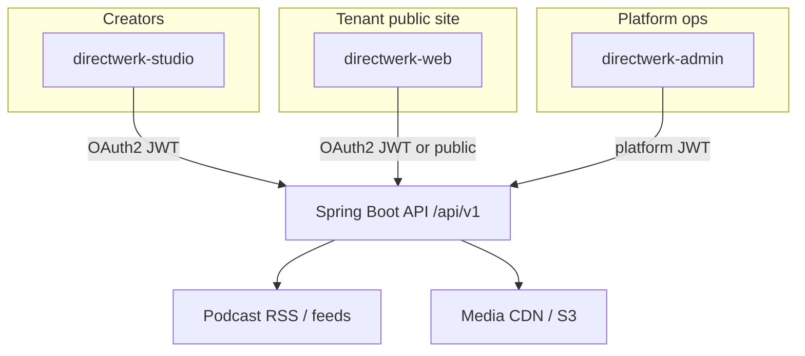

<!-- source: docs/directwerk-studio.md -->

# Directwerk apps

Directwerk ships as one **Spring Boot API** plus several **Next.js frontends**. Creators use studio; subscribers use web; platform operators use admin. All tenant-facing apps call the same `/api/v1/` REST contract.

## App overview

| App | Dev port | Audience | Role |
|-----|----------|----------|------|
| [**directwerk-studio**](#directwerk-studio) | 3003 | `EDITOR`, `TENANT_ADMIN` | Creator dashboard — publish content, manage products and subscribers |
| [**directwerk-web**](#directwerk-web) | 3004 | `GUEST`, `SUBSCRIBER` | Public site + subscriber portal on the tenant domain |
| [**directwerk-admin**](#directwerk-admin) | 3001 | `PLATFORM_ADMIN` | Platform superadmin — tenants, modules, job queue |
| [**homepage**](#homepage) | 3005 | Public | Directwerk marketing site (not tenant-scoped) |
| [**directwerk-docs**](#directwerk-docs) | 5173 | Public | This documentation site |
| **example-fe** | 3000 | Demo | Legacy API harness / subscriber demo |

The API runs on **8080** (`Directwerk/directwerk-app`).



## directwerk-studio

**Publisher back-office** for non-technical creators — the default path for creating and running a show.

Typical URL: `https://studio.example.com` or `https://example.com/studio` (tenant-configured).

Creators use studio to:

- Upload audio and images (media library)
- Create and publish podcast episodes and articles (Write + Podcast desks)
- Set free vs paid access on content
- Manage subscription products, subscribers, and manual grants
- Connect Stripe for live billing
- Configure branding and domains (where UI exists)

Studio **does not** replace a full CMS — it is structured publisher ops (workflow, entitlements, delivery), not a block editor or theme marketplace.

**Run locally:**

```sh
cd directwerk-studio
pnpm dev   # http://localhost:3003
```

Requires the API on `:8080` and OAuth client secret matching `DIRECTWERK_TENANT_CLIENT_SECRET`.

## directwerk-web

**Subscriber-facing site** on the tenant's domain — catalog, pricing, login, account portal, entitled feeds and downloads.

Typical URL: `https://example.com`

Subscribers use web to:

- Browse public episodes and publications
- View pricing and subscribe (Stripe checkout when configured)
- Register, log in, and manage their account
- Access private RSS feeds and entitled downloads

Agencies may replace `directwerk-web` with a custom frontend against the same public and `/me/*` API.

**Run locally:**

```sh
cd directwerk-web
pnpm dev   # http://localhost:3004
```

Use seeded tenant hosts such as `alpha-a.localhost` (see [Local development](/install/local-development)).

## directwerk-admin

**Platform superadmin** — internal operators only, not exposed to tenant creators.

Typical URL: `https://admin.{platform-domain}`

Operators use admin to:

- Create and manage tenants
- Activate/deactivate feature modules per tenant
- Invite platform and tenant admins
- Inspect background job queues (email, RSS snapshots, …)
- Force-verify custom domains

Requires `PLATFORM_ADMIN` role and the platform OAuth client.

**Run locally:**

```sh
cd directwerk-admin
cp .env.local.example .env.local   # set platform OAuth secret
pnpm dev   # http://localhost:3001
```

## homepage

Marketing site for Directwerk the product (not tenant-scoped). Includes platform positioning and a developer/API excerpt at `/developers`.

```sh
cd homepage
pnpm dev   # http://localhost:3005
```

## directwerk-docs

This VitePress site — install guides, operator docs, architecture, and OpenAPI reference.

```sh
pnpm --filter directwerk-docs dev   # http://localhost:5173
```

## Shared UI package

All Next.js apps use **`@directwerk/ui`** — shared shadcn/Tailwind components, shells, and theme tokens. Business logic stays in each app.

## Running the full stack

From the repo root:

```sh
# API + infra
cd Directwerk && docker compose up -d && ./gradlew :directwerk-app:bootRun

# All frontends (tmux)
./run-dev.sh
```

Or start individual apps as needed. See [Quickstart](/guide/quickstart).

## Related

- [Introduction](/guide/introduction) — platform concepts
- [Multi-tenancy](/architecture/multi-tenancy) — how Host-based routing ties apps to tenants
- [API integration](/api/integration) — building a custom frontend
