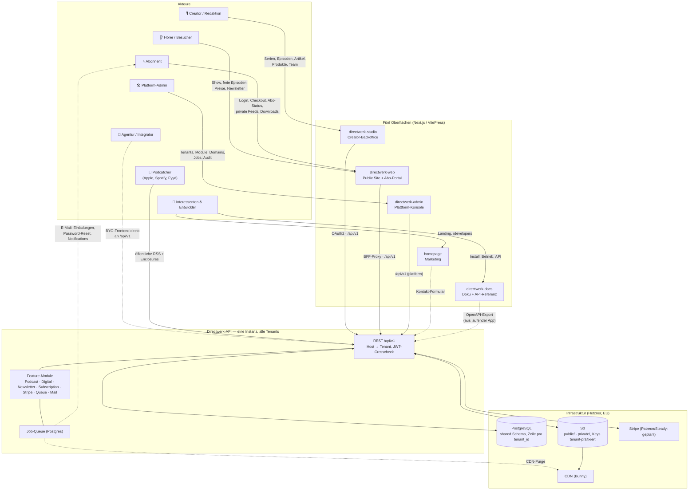

# Directwerk — Architektur im Überblick (Akteure × Oberflächen × Plattform)

Für Blog-Post / Vorstellung. Quelle: [`README.md`](../README.md), [`docs/platform-design.md`](platform-design.md), [`docs/blog-directwerk-vorstellung.md`](blog-directwerk-vorstellung.md).

## Was jeder Akteur tut

| Akteur | Oberfläche | Rolle in der API | Typischer Job |
|--------|-----------|------------------|---------------|
| **Creator / Redaktion** | `directwerk-studio` | `TENANT_ADMIN`, `EDITOR` | Serien & Formate anlegen, Audio/Cover hochladen, Episoden/Artikel schreiben und (gesteuert) publizieren, LEVEL-/PACKAGE-Produkte pflegen, Team einladen |
| **Hörer / Besucher** | `directwerk-web` (öffentliche Flächen) | `GUEST` (ohne Login) | Show ansehen, freie Episoden hören, Preise prüfen, Newsletter abonnieren |
| **Abonnent** | `directwerk-web` (Portal) | `SUBSCRIBER` | Registrieren, Checkout, Abo-Status, persönliche Feed-URLs, Bonus-Downloads |
| **Podcatcher** | RSS direkt an der API | — (kein User) | Öffentliche Feeds ziehen; Enclosure-Redirects nach Analytics-Tracking |
| **Platform-Admin** | `directwerk-admin` | `PLATFORM_ADMIN` | Tenants anlegen/suspenden, Module schalten, Domains verifizieren, Queue-Jobs & Audit beobachten |
| **Agentur / Integrator** | eigenes Frontend → API | je nach Anbindung | BYO-UI gegen denselben `/api/v1`-Vertrag, OpenAPI als Basis |
| **Interessenten / Entwickler** | `homepage`, `directwerk-docs` | — | Produkt verstehen, aufsetzen, integrieren |

## Ein Request, high-level

1. **Tenant-Auflösung** — Die Request-`Host` muss eine verifizierte Tenant-Domain sein (DNS-TXT); JWT und Host müssen denselben Tenant ergeben, sonst `403 TENANT_MISMATCH`.
2. **Module-Gate** — Fehlt dem Tenant das passende Modul (z. B. `PODCAST`), antwortet die API mit `403 FEATURE_NOT_ENABLED`.
3. **Entitlement-Filter** — `FREE`-Content geht offen raus; `PAID`-Content nur gegen aktive Subscriptions (LEVEL/PACKAGE). Free Audio wandert auf den public CDN-Prefix, Paid bleibt auf signierten URLs.
4. **RSS-Spalten** — Öffentliche Feeds (Reichweite: Apple, Spotify, Fyyd) und tokenisierte Private Feeds pro Abonnent kommen aus derselben Snapshot-Logik — der Entitlement-Filter ist dabei nie abschaltbar.

**Kernaussage für den Post:** Sieben Akteure, fünf Oberflächen, eine API. Jede Oberfläche ist ein Client desselben Vertrags; Akteure ohne eigene Oberfläche (Podcatcher, BYO-Frontend) hängen direkt am Vertrag an.
