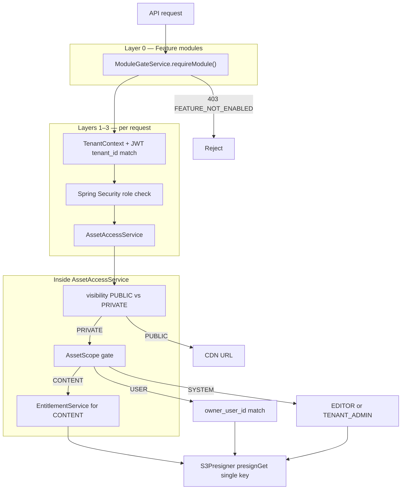
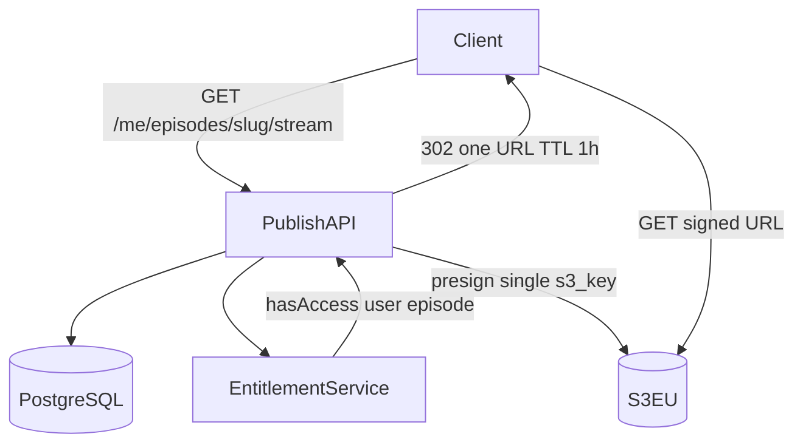
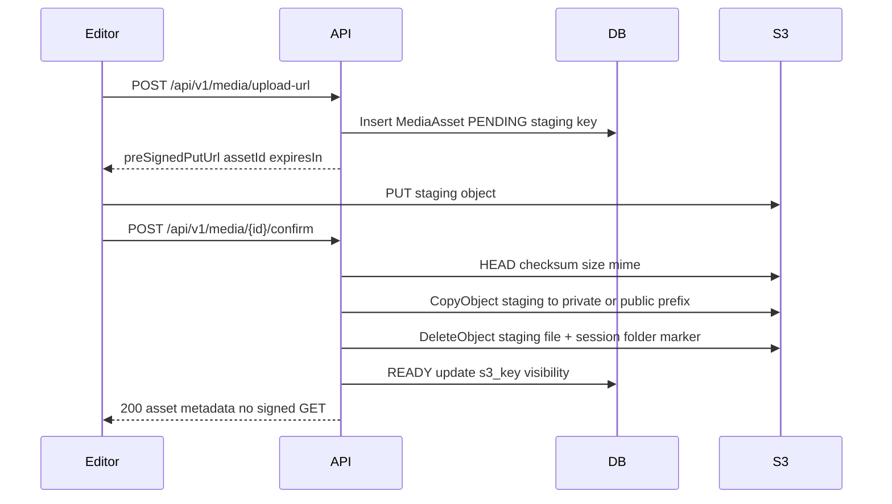

# Directwerk — Asset Storage & Retrieval

Companion to [`README.md`](../README.md) (full design),
[`poc-alpha-setup.md`](poc-alpha-setup.md) (alpha bootstrap), and
[`product-naming.md`](product-naming.md) (public product name history).

| | |
|---|---|
| **Spec status** | Design — Phase 2 target |
| **Alpha today** | Tenancy, auth, module gates, LEVEL `EntitlementService` for `/me/access`; Phase **2c/2d** media upload + private presign in `directwerk-digital` |
| **Alpha bootstrap** | [`poc-alpha-setup.md` § Asset storage foundation](poc-alpha-setup.md#asset-storage-foundation-alpha) |
| **Operator how-to** | [`../Directwerk/docs/media-upload-howto.md`](../Directwerk/docs/media-upload-howto.md) — enable storage, upload-url, PUT, confirm, read |

This document specifies **how assets are stored, scoped, and served** using S3-compatible object
storage in **Europe** — with Hetzner Object Storage as the primary target and Bunny.net Storage
as an alternative.

## Quick reference

```text
Bucket: directwerk-{env}   (or dual: directwerk-{env}-public / -private)
Key:    {tenant_slug}/{public|private|staging}/{type}/{uuid}.{ext}

Public  → CDN URL (immutable, cacheable)
Private → ModuleGate → AssetAccessService → presignGet (1h API / 24h RSS)
Upload  → presignPut to staging → confirm → promote to the final prefix

Never: prefix-wide credentials, ListObjects for clients, logging presigned URLs
```

**Core rule:** Private bytes are never world-readable. Access to one private asset does **not**
grant access to any other private asset — enforcement is **per asset**, via `AssetAccessService`,
not via bucket policies or user-prefix browsing.

---

## Goals

| Goal | How we achieve it |
|------|-------------------|
| Tenant isolation | Every object key starts with `{tenant_slug}/`; DB + app validate `tenant_id` |
| Public vs private | Separate key prefixes (`public/` vs `private/`); different URL strategies |
| Per-asset entitlements | `EntitlementService.hasAccess(userId, contentId)` before every private signed URL |
| No “one unlocks all” | Never issue prefix-scoped credentials; never sign URLs without asset-level check |
| EU data residency | Hetzner DE/FI or Bunny EU regions only |
| No API upload proxy | Pre-signed PUT for uploads; pre-signed GET for private downloads |
| CDN for public | Stable URLs on public pull zone; cacheable `public/` objects; edge-block `private/` |
| CDN for private | Second pull zone + Advanced Token Auth; see [`bunny-net-integration.md`](bunny-net-integration.md#implementation-guide-cdn-pull-zones) |

---

## Provider choice (Europe)

Both providers expose an **S3-compatible API** compatible with AWS SDK v2 for Java
(`software.amazon.awssdk:s3`, `S3Presigner`).

### Recommended: Hetzner Object Storage

| Aspect | Detail |
|--------|--------|
| **Regions (EU)** | Falkenstein `fsn1`, Nuremberg `nbg1` (Germany); Helsinki `hel1` (Finland) |
| **Endpoint** | `https://{location}.your-objectstorage.com` (e.g. `https://fsn1.your-objectstorage.com`) |
| **DNS-style** | `https://{bucket}.{location}.your-objectstorage.com` |
| **GDPR** | German operator; DPA available |
| **Fit** | Same vendor as Coolify/Hetzner Cloud deployment; simple pricing (ingress + API free) |
| **CDN** | Pair with [Hetzner CDN](https://docs.hetzner.com/networking/cdn/) or Cloudflare in front of `public/` |

**Recommendation:** Primary region **`nbg1`** (Nuremberg) or **`fsn1`** (Falkenstein) for German
data residency; use **`hel1`** only if Finland is acceptable for a tenant’s DPA.

### Alternative: Bunny.net Storage (S3-compatible)

| Aspect | Detail |
|--------|--------|
| **EU regions** | Frankfurt `de`, London `uk`, Stockholm `se` |
| **Endpoint** | `https://{region}-s3.storage.bunnycdn.com` (path-style **only**) |
| **Credentials** | Access Key = storage zone name; Secret = zone password |
| **S3 mode** | Must enable **S3 compatibility at zone creation** (cannot enable later) |
| **CDN** | Built-in Bunny CDN pull zones — strong fit if public media is CDN-heavy |
| **Caveat** | S3 API is public preview; path-style + SigV4 required (`forcePathStyle=true`) |

**Recommendation:** Choose Bunny when **integrated CDN + storage** in one product outweighs
Hetzner stack simplicity. For API-only origin with separate CDN, Hetzner is simpler.

### Dev / local / CI

**No local object-storage emulator.** All environments — including developer laptops — use a
**dedicated dev bucket** on Hetzner Object Storage or Bunny.net Storage (EU region). Same key
layout as staging and production; only bucket name and credentials differ.

| Environment | Storage |
|-------------|---------|
| Local dev | Hetzner or Bunny **dev** bucket (`directwerk-dev`) — credentials in `.env.local` (never commit) |
| CI unit tests | Mock `S3Client` / `S3Presigner` — no network calls |
| CI integration (optional) | Nightly job against dev bucket with CI secrets |
| Staging / prod | Hetzner (default) or Bunny per deployment |

Local infra is `Directwerk/compose.yaml` (PostgreSQL + Mailpit) — see
[`../Directwerk/docs/build-and-deploy.md`](../Directwerk/docs/build-and-deploy.md). S3 is **not** in
Compose; configure a Hetzner or Bunny **dev** bucket via env vars (`S3_ENDPOINT`, `S3_BUCKET`,
`S3_ACCESS_KEY`, `S3_SECRET_KEY`) when implementing uploads.

Create the dev bucket once in Hetzner Console or Bunny dashboard; enable S3 compatibility on
Bunny at zone creation if using Bunny.

### Decision matrix

| Criterion | Hetzner Object Storage | Bunny.net Storage |
|-----------|------------------------|-------------------|
| EU regions | DE (×2), FI | DE, UK, SE |
| S3 maturity | Production | Public preview |
| Path-style | Both | Path-style only |
| Built-in CDN | Separate product | Integrated |
| Coolify alignment | High (same ecosystem) | Medium |
| **Default for Directwerk** | **Yes** | Optional per deployment |

Record the chosen provider per environment in deployment config — the application layer stays
provider-agnostic.

---

## Bucket strategy

### MVP: single bucket, prefix isolation (recommended)

One bucket (e.g. `directwerk-prod`) with tenant and visibility prefixes:

```
{bucket}/
  {tenant_slug}/
    public/          # world-readable via CDN
    private/         # never directly listable; signed GET only
    staging/         # upload scratch; purged app-side after staging-lifecycle-hours
    user/            # optional per-user private subtree (see below)
```

**Why not separate physical buckets per tenant?** Operational overhead at scale. Prefix isolation
+ application guards + optional IAM condition keys are sufficient for MVP.

### Optional: dual bucket per environment

| Bucket | Contents | Bucket policy |
|--------|----------|---------------|
| `directwerk-{env}-public` | All `{tenant}/public/**` | Public read (or CDN origin only) |
| `directwerk-{env}-private` | All `{tenant}/private/**`, `staging/**`, `user/**` | Deny all public access; app credentials only |

Use dual buckets when compliance requires a hard network boundary between public and private
objects. The **key layout inside each bucket stays identical**; `S3StorageProperties` holds two
bucket names.

---

## Key layout and asset scopes

Storage is split on **three axes**:

1. **Tenant** — `{tenant_slug}/` root prefix (mandatory)
2. **Visibility** — `public/` vs `private/` vs `staging/`
3. **Scope** — what entitlement check applies before signing a URL

### Scope types (`AssetScope`)

| Scope | Key pattern | Entitlement check |
|-------|-------------|-------------------|
| `TENANT_PUBLIC` | `{tenant}/public/{type}/{uuid}.{ext}` | None — CDN URL |
| `CONTENT` | `{tenant}/private/{type}/{uuid}.{ext}` | `EntitlementService.hasAccess(userId, episodeId \| publicationId)` |
| `USER` | `{tenant}/private/user/{user_id}/{uuid}.{ext}` | `principal.userId == asset.ownerUserId` **plus** any content link |
| `SYSTEM` | `{tenant}/private/system/{purpose}/{uuid}.{ext}` | Role-based (`EDITOR+`), not subscriber |

**Critical:** A user with access to **one** `CONTENT`-scoped episode must receive a signed URL
**only for that episode’s `MediaAsset`**, never a listing or prefix grant under
`{tenant}/private/`. The application does not expose `ListObjects` to clients.

### Per-user private prefix

Use `{tenant}/private/user/{user_id}/` only for assets that are **personally owned**, e.g.:

- Exported GDPR data package (one zip per user)
- User avatar (if subscribers can upload)
- Personal feed-builder export cache (Post-MVP)

Do **not** store shared paid episode audio under `user/` — that belongs under `private/audio/`
with `CONTENT` scope and product entitlements.

```
alpha-show-a/
  public/
    audio/7c9e6679-7425-40de-944b-e07fc1f90ae7.mp3      # FREE episode
    images/covers/3fa85f64-5717-4562-b3fc-2c963f66afa6.jpg
  private/
    audio/2f6b8c1a-9e3d-4a1f-b8c7-1d2e3f4a5b6c.mp3      # PAID episode (CONTENT)
    documents/8b4c2d1e-0f9a-4b3c-8d7e-6f5a4b3c2d1e.pdf   # bonus file (CONTENT)
    user/
      42/9a8b7c6d-5e4f-3a2b-1c0d-9e8f7a6b5c4d.json      # USER scope — only user 42
  staging/
    {upload_session_id}/recording.wav
```

### `MediaAsset` fields (storage-relevant)

| Column | Purpose |
|--------|---------|
| `tenant_id` | Row-level isolation |
| `s3_key` | Full key within bucket |
| `visibility` | `PUBLIC`, `PRIVATE` |
| `scope` | `TENANT_PUBLIC`, `CONTENT`, `USER`, `SYSTEM` |
| `owner_user_id` | Required when `scope = USER` |
| `episode_id` / `publication_id` | Required when `scope = CONTENT` |
| `asset_type` | `AUDIO`, `IMAGE`, `VIDEO`, `DOCUMENT` |
| `status` | `PENDING`, `READY`, `ARCHIVED` |

Unique index: `(tenant_id, s3_key)`. Never reuse `s3_key` across tenants or assets.

---

## Module gating

Per-tenant feature modules control **which asset flows are reachable** before any S3 presign runs.
See [`README.md` § Feature Modules](../README.md#feature-modules) for the full catalog and
dependency graph; this section covers storage implications only.

**There is no separate `ASSET_STORAGE` module.** S3 upload, `MediaAsset`, and the media library
are owned by **`DIGITAL_CONTENT`**, which is a **core module** — auto-activated on tenant creation
and **cannot be deactivated**. Optional modules gate vertical flows on top of that foundation.

| Concern | Module |
|---------|--------|
| S3 media upload, asset metadata, presign flows | `DIGITAL_CONTENT` (core) |
| Episode-linked audio (`CONTENT` scope) | `DIGITAL_CONTENT` + **`PODCAST`** |
| Entitlement-gated private stream/download | `DIGITAL_CONTENT` + **`SUBSCRIPTION`** |
| Private RSS enclosures | `DIGITAL_CONTENT` + `PODCAST` + `PODCAST_RSS` (+ `SUBSCRIPTION`) |
| Custom subscriber feeds | + `FEED_BUILDER` |
| Branding `logoUrl` (external URL) | `WHITELABEL` (URL only — not S3 upload in MVP) |

### Gating principles

| Principle | Storage implication |
|-----------|---------------------|
| Fail closed | Disabled module → `403 FEATURE_NOT_ENABLED` before any S3 presign |
| Check at API boundary | `@RequiresModule` on controllers **and** explicit checks in feed generators / `AssetAccessService` |
| No orphan bytes | Do not issue upload presigns for modules the tenant lacks |
| Frontend sync | `GET /api/v1/public/site-config` → `enabledModules[]` hides media library, upload, stream routes |
| Deactivation cascade | Deactivating `PODCAST` disables episode assets; deactivating `SUBSCRIPTION` disables paid-stream endpoints (existing S3 objects retained until archival — see below) |

**Module gate runs before `AssetAccessService`.** A tenant without `SUBSCRIPTION` must not reach
entitlement presign logic for paid `CONTENT` assets — the endpoint returns `403 FEATURE_NOT_ENABLED`
(module), not `ENTITLEMENT_DENIED`.

### Endpoint → module matrix

| Endpoint / flow | Required module(s) | When module off |
|-----------------|-------------------|-----------------|
| `POST /api/v1/media/upload-url` | `DIGITAL_CONTENT` | 403 — no upload presign |
| `POST /api/v1/media/{id}/confirm` | `DIGITAL_CONTENT` | 403 |
| `GET /api/v1/media` (library) | `DIGITAL_CONTENT` | 403 |
| `GET /api/v1/media/{id}/preview-url` | `DIGITAL_CONTENT` | 403 |
| Episode audio attach / stream | `DIGITAL_CONTENT` + `PODCAST` | 403 if `PODCAST` off |
| Paid episode stream | above + `SUBSCRIPTION` | 403 if `SUBSCRIPTION` off |
| Private RSS enclosure presign | `DIGITAL_CONTENT` + `PODCAST` + `PODCAST_RSS` + `SUBSCRIPTION` | 403 |
| Public free episode CDN URL | `DIGITAL_CONTENT` + `PODCAST` (+ `PODCAST_RSS` for feed) | Public site may hide podcast section |
| `USER`-scoped personal assets | `DIGITAL_CONTENT` | 403 |
| Branding `logoUrl` (external URL) | `WHITELABEL` | Falls back to default branding |

### Where checks live

```java
Controller:  @RequiresModule("DIGITAL_CONTENT")     // HTTP 403 FEATURE_NOT_ENABLED
Service:     moduleGateService.requireModule(...)   // feed generators, AssetAccessService entry
AssetAccess: require SUBSCRIPTION before EntitlementService on paid CONTENT assets
```

Alpha implementation: [`ModuleGateService`](../Directwerk/src/main/java/de/pnnit/directwerk/modules/core/service/ModuleGateService.java),
[`ModuleManagementService.deactivateModule()`](../Directwerk/src/main/java/de/pnnit/directwerk/modules/core/service/ModuleManagementService.java)
(rejects `is_core` modules with `CannotDeactivateCoreModuleException`), and
[`poc-alpha-setup.md` § Module system](poc-alpha-setup.md#multi-tenancy-alpha).

### S3 objects when module deactivated

| Scenario | Behaviour |
|----------|-----------|
| `PODCAST` deactivated | API stops serving episode stream URLs; S3 objects retained (no auto-delete in MVP) |
| `SUBSCRIPTION` deactivated | Paid stream endpoints 403; free/public assets unaffected |
| `DIGITAL_CONTENT` | **Cannot be deactivated** — `deactivateModule` returns `409 CANNOT_DEACTIVATE_CORE_MODULE`; upload/library remain available while active |
| Tenant offboarded | Platform admin archival job (post-MVP) — prefix delete `{tenant_slug}/` |

---

## Access control model

Authorization is evaluated in **layers**. Feature modules (above) run first; the tables below
describe layers inside `AssetAccessService` after module and role checks pass.



### Four independent axes

| Axis | Source | What it controls |
|------|--------|------------------|
| **Feature module** | `TenantModuleActivation` + `ModuleGateService` | Which asset *flows* exist (podcast, paid content, RSS) |
| **Tenant** | `TenantContext` + `MediaAsset.tenant_id` | Row/key isolation — no cross-tenant reads |
| **Visibility** | `PUBLIC` / `PRIVATE` on `MediaAsset` | CDN-stable URL vs presigned GET only |
| **Authorization** | `AssetScope` + role and/or subscription | Who may obtain a presigned URL |

**Critical distinction:** `SUBSCRIBER` **role** ≠ paid access. Role answers “what kind of user are
you on this tenant?” Subscription answers “which products/tiers unlock this content?” A user can be
`SUBSCRIBER` with no active subscription (public + locked content only).

### Access matrix (role + subscription)

| Asset scope | Storage path | Anonymous / GUEST | SUBSCRIBER (no sub) | SUBSCRIBER (entitled) | EDITOR | TENANT_ADMIN |
|-------------|--------------|-------------------|---------------------|----------------------|--------|--------------|
| `TENANT_PUBLIC` | `{tenant}/public/...` | CDN | CDN | CDN | CDN | CDN |
| `CONTENT` (paid) | `{tenant}/private/audio/{uuid}` | 403 | 403 | presign if `hasAccess` | preview draft only* | full tenant preview* |
| `CONTENT` (free, published) | promoted to `public/` | CDN | CDN | CDN | CDN | CDN |
| `USER` | `{tenant}/private/user/{userId}/...` | 403 | owner only | owner only | owner only** | admin override optional*** |
| `SYSTEM` | `{tenant}/private/system/...` | 403 | 403 | 403 | presign | presign |

\* Draft preview: explicit `previewDraft=true` API flag — never bypass entitlements on published paid content.  
\** Editors do not automatically see another user’s `USER`-scoped files.  
\*** Optional `TENANT_ADMIN` GDPR/support access — document as audited, explicit, post-MVP if needed.

### Subscriber tier / product (subscription sub-level)

**Subscription granularity lives in PostgreSQL**, not in S3 paths:

| Mechanism | Model | Example |
|-----------|-------|---------|
| **Tier ladder** | `OfferingType.LEVEL` + `sort_order` | “Producer €15” unlocks episodes with `required_level_sort_order <= 2` |
| **Named bundle** | `OfferingType.PACKAGE` + `ProductAccessRule` | “Season 3 Pass” → `CATEGORY` rule |
| **Union** | Multiple active `subscriptions` rows | Two packages → access to both scopes |

`AssetAccessService` always calls `hasAccess(userId, episodeId)` for `CONTENT` assets — it never
inspects S3 keys for category or level. See [Group entitlements](#group-entitlements-level-vs-package).

### User-scoped private assets — when to use

| Use case | Scope | Why not `CONTENT`? |
|----------|-------|-------------------|
| GDPR export zip | `USER` | Not tied to a product; one owner |
| Subscriber avatar upload | `USER` (or `TENANT_PUBLIC` if public) | Personal, not episodic |
| Personal feed-builder cache | `USER` | Post-MVP; per-user artifact |
| Paid episode MP3 | `CONTENT` | Entitlement-driven, shared asset |
| Bonus PDF for a product | `CONTENT` + `DIGITAL_ASSET` rule | Product-scoped, not user-scoped |

**Anti-pattern:** storing paid media under `{tenant}/private/user/{userId}/` — breaks the
entitlement model and enables IDOR if keys are predictable.

### Entitlement API contract (storage layer)

The storage layer calls a narrow entitlement interface — it does not re-implement LEVEL or
PACKAGE rules:

```java
// modules/digital/api/EntitlementApi.java
boolean hasAccess(Long tenantId, Long userId, Long episodeId);
boolean hasDigitalAssetAccess(Long tenantId, Long userId, Long mediaAssetId);
```

**Alpha today:** [`EntitlementService`](../Directwerk/directwerk-subscription/src/main/java/de/pnnit/directwerk/modules/subscription/service/EntitlementService.java)
exposes `resolveAccess` / `hasLevelAtLeast` only (LEVEL summary). Full `hasAccess(contentId)` and
`ProductAccessRule` support are **Phase 4b** — see [`poc-alpha-setup.md`](poc-alpha-setup.md).
Until then, `AssetAccessService` uses a fail-closed stub for paid `CONTENT` assets.

---

## Preventing “access to one → download all private”

This is the most important security property of the storage layer.

### What we do **not** do

| Anti-pattern | Why it fails |
|--------------|--------------|
| IAM policy allowing `s3:GetObject` on `{tenant}/private/*` for “subscribers” | Any leaked URL or token exposes entire prefix |
| Long-lived signed URL for a **directory** | S3 does not support this; even “folder” APIs leak keys |
| Same signed URL for all enclosures in a private RSS feed | One captured URL must not work for other episodes |
| Client-side “hidden” S3 URLs in API responses | Scraping enumerates all private keys |
| Trusting `user_id` in key path without DB check | Path guessing / IDOR if keys are predictable |

### What we **do**



1. **Single gate:** `AssetAccessService` is the only class that calls `S3Presigner.presignGet()`.
2. **Per-request, per-asset:** Load `MediaAsset` by id; verify `tenant_id`; run scope-specific check.
3. **Short TTL:** 1h for API stream; 24h for RSS enclosures (regenerated each feed fetch).
4. **Opaque keys:** UUID filenames — no sequential ids in paths.
5. **No list API:** Subscribers never receive `ListObjectsV2` credentials or key listings.
6. **Audit optional:** Log access decisions (asset id, user id) — never log signed URLs.

```java
@Service
@RequiredArgsConstructor
public class AssetAccessService {

    private final EntitlementService entitlementService;
    private final S3Presigner presigner;
    private final S3PublicUrlBuilder publicUrlBuilder;

    public URL resolveDownloadUrl(MediaAsset asset, PublishUserPrincipal principal) {
        assertTenantMatch(asset);

        if (asset.getVisibility() == Visibility.PUBLIC) {
            return publicUrlBuilder.cdnUrl(asset.getS3Key());
        }

        authorizePrivateAsset(asset, principal);

        return presigner.presignGet(
            PresignRequest.builder()
                .signatureDuration(ttlFor(asset))
                .getObjectRequest(b -> b.bucket(bucket).key(asset.getS3Key()))
                .build()
        ).url();
    }

    private void authorizePrivateAsset(MediaAsset asset, PublishUserPrincipal principal) {
        switch (asset.getScope()) {
            case CONTENT -> {
                boolean entitled = asset.getEpisodeId() != null
                        ? entitlementService.hasAccess(
                                asset.getTenantId(), principal.getUserId(), asset.getEpisodeId())
                        : entitlementService.hasDigitalAssetAccess(
                                asset.getTenantId(), principal.getUserId(), asset.getId());
                if (!entitled) {
                    throw new EntitlementDeniedException(asset.getId());
                }
            }
            case USER -> {
                if (!principal.getUserId().equals(asset.getOwnerUserId())) {
                    throw new EntitlementDeniedException(asset.getId());
                }
            }
            case SYSTEM -> {
                if (!principal.hasAnyRole("EDITOR", "TENANT_ADMIN")) {
                    throw new AccessDeniedException();
                }
            }
            default -> throw new IllegalStateException("Unexpected scope: " + asset.getScope());
        }
    }
}
```

**RSS private feeds:** For each episode in the feed XML, call `resolveDownloadUrl` individually.
Episodes the subscriber is not entitled to are **omitted** — not included with a locked placeholder
URL.

**Publisher preview:** `EDITOR` role bypasses entitlement for **draft** assets in tenant only via
explicit `previewDraft` flag — never for published `CONTENT` assets owned by another product line.

---

## Group entitlements (LEVEL vs PACKAGE)

Subscribers often need access to a **set** of content — e.g. all episodes in category “Season 3”,
or everything at the “Supporter” tier. That is modelled in **PostgreSQL** (`SubscriptionProduct`,
`ProductAccessRule`, `EntitlementService`), not in S3 prefixes.

**Important distinction:**

| Layer | Responsibility |
|-------|----------------|
| **Entitlement layer** | Answers “may this user access this episode/publication?” — can grant **many** items via rules |
| **Storage layer** | Answers “here is a signed URL for **this one** `MediaAsset`” — only after entitlement passes |

Group access does **not** mean group signing or prefix-wide S3 credentials. A subscriber with a
category PACKAGE can stream **every entitled episode** in that category, but each stream request
still runs `hasAccess` + `presignGet` for **one** asset.

### Product types

| `offering_type` | Use case | How access is computed |
|-----------------|----------|------------------------|
| `LEVEL` | Patreon-style tier ladder — higher tier unlocks more across the catalog | `subscriber.maxLevelSortOrder >= episode.required_level_sort_order` |
| `PACKAGE` | Named bundle — specific series, format, category, or file | `ProductAccessRule` rows match episode metadata |

Both types can be active for one user. Access is the **union** of all active subscriptions.

### `ProductAccessRule` scopes (PACKAGE)

| `scope_type` | Grants access to | `scope_id` |
|--------------|------------------|------------|
| `ALL_PODCASTS` | Every published episode in tenant | null |
| `PODCAST_SERIES` | One show | `series_id` |
| `FORMAT` | Episodes tagged with format | `format_id` |
| `CATEGORY` | Episodes tagged with category | `category_id` |
| `DIGITAL_ASSET` | Standalone bonus file | `media_asset_id` or `digital_publication_id` |
| `FEED_BUILDER` | Custom feed creation (not media bytes) | null |

Episodes link to categories via `episode_categories`; formats via `episode_formats`.

### Entitlement algorithm

```java
boolean hasAccess(Long tenantId, Long userId, Long episodeId) {
    Episode episode = episodeRepository.findById(episodeId).orElseThrow();

    if (episode.getAccessPolicy() == FREE) {
        return true;
    }

    Set<SubscriptionProduct> active = subscriptionService.activeProducts(userId, episode.getTenantId());

    for (SubscriptionProduct product : active) {
        if (product.getOfferingType() == LEVEL) {
            if (product.getSortOrder() >= episode.getRequiredLevelSortOrder()) {
                return true;
            }
        }
        if (product.getOfferingType() == PACKAGE) {
            if (packageRulesGrant(product, episode)) {
                return true;
            }
        }
    }
    return false;
}

boolean packageRulesGrant(SubscriptionProduct product, Episode episode) {
    for (ProductAccessRule rule : product.getAccessRules()) {
        switch (rule.getScopeType()) {
            case ALL_PODCASTS -> { return true; }
            case PODCAST_SERIES -> {
                if (rule.getScopeId().equals(episode.getSeriesId())) return true;
            }
            case FORMAT -> {
                if (episode.hasFormat(rule.getScopeId())) return true;
            }
            case CATEGORY -> {
                if (episode.hasCategory(rule.getScopeId())) return true;
            }
        }
    }
    return false;
}
```

`AssetAccessService` calls `hasAccess(tenantId, userId, episodeId)` for episode-linked `CONTENT`
assets, or `hasDigitalAssetAccess(tenantId, userId, mediaAssetId)` for standalone digital files —
it does not re-implement category or level logic.

### Recipe table

| Business rule | Model |
|---------------|--------|
| “Supporter €5/mo — all paid episodes at tier 1” | `LEVEL` product `sort_order = 1`; episodes `required_level_sort_order = 1` |
| “Producer €15/mo — tier 1 + tier 2 content” | `LEVEL` `sort_order = 2` (cumulative — also satisfies tier 1 episodes) |
| “€8/mo — **Season 3** episodes only” | `PACKAGE` + `ProductAccessRule(CATEGORY, season_3_category_id)` |
| “€12/mo — **Interview** format across all series” | `PACKAGE` + `ProductAccessRule(FORMAT, interview_format_id)` |
| “One show spin-off subscription” | `PACKAGE` + `ProductAccessRule(PODCAST_SERIES, series_id)` |
| “Two packages — combined access” | Two active `PACKAGE` subs → union |
| “LEVEL 2 + only Bonus category” | `PACKAGE` with `CATEGORY` rule, **or** tag Bonus episodes with `required_level_sort_order <= 2` only |

### Example: category-scoped product

Tenant creates category **“Season 3”** (`category_id = 7`) and product **“Season Pass”**:

```json
{
  "slug": "season-3-pass",
  "name": "Season 3 Pass",
  "offeringType": "PACKAGE",
  "priceCents": 800,
  "currency": "EUR",
  "billingInterval": "MONTH",
  "accessRules": [
    { "scopeType": "CATEGORY", "scopeId": 7, "effect": "GRANT" }
  ]
}
```

Subscriber with active `season-3-pass` can:

- `GET /api/v1/me/episodes` — lists all published episodes where `hasAccess` is true (includes
  every Season 3 episode, excludes other categories)
- `GET /api/v1/me/episodes/{slug}/stream` — 302 per request; each call presigns **that** episode’s
  `MediaAsset` only
- Private RSS — enclosures only for entitled episodes; each enclosure gets its own signed URL

Subscriber **without** the product gets `403 ENTITLEMENT_DENIED` on stream — even if they guess
another episode slug in the same category.

### LEVEL vs category — when to use which

| Choose **LEVEL** when | Choose **PACKAGE** when |
|-----------------------|-------------------------|
| Classic tier ladder (more money → more content everywhere) | Access is tied to a **slice** (one season, one format, one show) |
| Episode difficulty is uniform per “tier” | Same price unlocks a **named bundle** regardless of global sort order |
| Patreon tier migration | “Season pass”, “Interview-only”, “Spin-off podcast” SKUs |

LEVEL does **not** filter by category natively — scope is `required_level_sort_order` on each
episode. To approximate “level 2 + category X only”, use PACKAGE or set level metadata only on
episodes in that category.

### What we do **not** do for group access

| Anti-pattern | Correct approach |
|--------------|------------------|
| S3 prefix `{tenant}/private/category/{id}/*` shared by subscribers | Keep all paid audio under `private/audio/{uuid}.mp3`; category lives on `Episode` |
| One long-lived signed URL for “all Season 3” | Presign per episode per request |
| Skip `hasAccess` because user “has a subscription” | Always evaluate rules against **this** episode |
| Cache signed URLs across episodes in RSS | Regenerate per enclosure on each feed build |

### Listings vs downloads

| API | Behaviour |
|-----|-----------|
| `GET /api/v1/me/access` | Summary of active products + unlocked scopes (for portal UI) |
| `GET /api/v1/me/episodes` | Paginated episodes where `hasAccess(user, episodeId)` |
| `GET /api/v1/me/downloads` | Digital publications / bonus files via `DIGITAL_ASSET` rules |
| `GET /api/v1/public/episodes` | All episodes with lock metadata — **no** private URLs |

Feed builder applies **additional** format/category filters on top of `hasAccess` — filtering is
UX; entitlement remains the security boundary.

### Testing checklist (group entitlements)

| # | Scenario |
|---|----------|
| 13 | `PACKAGE` + `CATEGORY` rule — subscriber streams episode in category |
| 14 | Same subscriber denied episode **outside** category |
| 15 | `LEVEL` sort_order 2 grants episode with `required_level_sort_order` 1 and 2, not 3 |
| 16 | Two active PACKAGE products — union grants episodes from both scopes |
| 17 | Private RSS for category subscriber — only entitled category episodes, unique signed URLs |
| 18 | Revoked subscription — next stream returns `ENTITLEMENT_DENIED` (existing URLs expire via TTL) |

---

## Upload flow

Never stream file bytes through the Spring API.



### `POST /api/v1/media/upload-url`

Request:

```json
{
  "filename": "episode-42.mp3",
  "mimeType": "audio/mpeg",
  "sizeBytes": 52428800,
  "assetType": "AUDIO",
  "intendedVisibility": "PRIVATE",
  "scope": "CONTENT",
  "episodeId": null
}
```

Validations:

| Check | Rule |
|-------|------|
| Tenant | `TenantContext.getTenantId()` |
| Role | `EDITOR` or `TENANT_ADMIN` |
| Mime allow-list | Per `assetType` (e.g. audio: `audio/mpeg`, `audio/mp4`) |
| Max size | e.g. 500 MB audio, 10 MB images |
| Key | `{tenant}/staging/{uploadSessionUuid}/{sanitizedFilename}` — session id server-generated |

Response:

```json
{
  "data": {
    "assetId": 1001,
    "uploadUrl": "https://...",
    "expiresAt": "2026-07-16T08:00:00Z",
    "headers": { "Content-Type": "audio/mpeg" }
  }
}
```

Pre-signed PUT conditions (SigV4 policy):

- `Content-Type` must match declared mime
- `Content-Length` max = declared `sizeBytes`
- Key must equal the issued staging key exactly

### Confirm and promote

On `POST /api/v1/media/{id}/confirm`:

1. `HEAD` staging object — verify exists, size, checksum SHA-256
2. `CopyObject` → final key under `public/` or `private/` based on `intendedVisibility` and publish rules
3. `DeleteObject` staging file **and** its session folder marker (`{tenant}/staging/{session}/`). Bunny creates
   explicit folder objects for key prefixes, so deleting the file alone leaves an empty directory behind.
   `StagingCleanupService.deleteStagingKeyAndFolder` removes the file plus the folder marker with and
   without a trailing slash. If S3 is unavailable, a `MEDIA_STAGING_CLEANUP` queue job retries the delete
   later instead of rolling back the confirm.
4. Update `MediaAsset.s3_key`, `status = READY`

On episode publish (`access_policy = FREE`), `AssetPromotionService` moves audio from
`private/audio/` → `public/audio/` and updates visibility.

---

## Retrieval flow

### Public assets

| Consumer | Response |
|----------|----------|
| `GET /api/v1/public/episodes` | `audioUrl: "https://cdn.example.com/alpha-show-a/public/audio/{uuid}.mp3"` |
| Public RSS | Permanent CDN URL in `<enclosure url="...">` |
| Website | Direct CDN URL from `site-config` / episode payload |

CDN origin points at bucket path `{tenant}/public/` or a dedicated public bucket. Cache-Control:
`public, max-age=31536000, immutable` for UUID-keyed media.

### Private assets

| Consumer | Endpoint | Gate |
|----------|----------|------|
| Subscriber app | `GET /api/v1/me/episodes/{slug}/stream` | JWT + per-episode entitlement |
| Subscriber downloads | `GET /api/v1/me/downloads` | JWT; list only entitled publications |
| Private RSS | `GET /feeds/{tenant}/u/{feedToken}.xml` | Feed token + per-episode entitlement |
| Publisher | `GET /api/v1/media/{id}/preview-url` | JWT + `EDITOR` + tenant match |

All private paths return **302 Redirect** to a fresh pre-signed URL (or JSON with short-lived URL
if client prefers XHR).

### User-scoped assets

`GET /api/v1/me/assets/{id}` — only when `asset.scope == USER` and
`asset.owner_user_id == principal.userId`.

---

## Spring configuration

### Dependencies (`build.gradle.kts`)

```kotlin
implementation("software.amazon.awssdk:s3")
implementation("software.amazon.awssdk:s3-transfer-manager") // optional multipart
```

### Properties (`S3StorageProperties`)

```yaml
directwerk:
  storage:
    provider: hetzner          # hetzner | bunny
    region: eu-central
    bucket: directwerk-prod
    public-bucket:             # optional dual-bucket mode
    endpoint: https://nbg1.your-objectstorage.com
    force-path-style: false    # true for Bunny
    access-key: ${S3_ACCESS_KEY}
    secret-key: ${S3_SECRET_KEY}
    public-cdn-base-url: https://cdn.directwerk.example.com
    presign-upload-ttl: 15m
    presign-download-ttl-api: 1h
    presign-download-ttl-rss: 24h
    staging-lifecycle-hours: 24
    staging-cleanup-interval-ms: 3600000
```

### Hetzner client bean

```java
@Bean
S3Client s3Client(S3StorageProperties props) {
    return S3Client.builder()
        .endpointOverride(URI.create(props.getEndpoint()))
        .region(Region.of("eu-central-1"))   // SDK requires a region; endpoint drives routing
        .credentialsProvider(StaticCredentialsProvider.create(
            AwsBasicCredentials.create(props.getAccessKey(), props.getSecretKey())))
        .forcePathStyle(props.isForcePathStyle())
        .build();
}
```

### Bunny client bean

```java
// endpoint: https://de-s3.storage.bunnycdn.com
// forcePathStyle: true
// accessKey: storage zone name
// secretKey: zone password
```

### Dev profile (`application-dev.yml`)

Use the same provider as production, pointing at a **dev bucket**. Credentials via env vars
(see `.env.local.example` — never commit secrets).

**Hetzner (recommended):**

```yaml
directwerk:
  storage:
    provider: hetzner
    endpoint: https://nbg1.your-objectstorage.com
    force-path-style: false
    bucket: directwerk-dev
    access-key: ${S3_ACCESS_KEY}
    secret-key: ${S3_SECRET_KEY}
    public-cdn-base-url: ${S3_PUBLIC_CDN_BASE_URL:https://directwerk-dev.nbg1.your-objectstorage.com}
```

**Bunny.net:**

```yaml
directwerk:
  storage:
    provider: bunny
    endpoint: https://de-s3.storage.bunnycdn.com
    force-path-style: true
    bucket: directwerk-dev          # storage zone name
    access-key: ${S3_ACCESS_KEY} # zone name
    secret-key: ${S3_SECRET_KEY} # zone password
    public-cdn-base-url: ${S3_PUBLIC_CDN_BASE_URL}
```

| Variable | Purpose |
|----------|---------|
| `S3_ENDPOINT` | Provider endpoint (region-specific) |
| `S3_BUCKET` | Bucket / storage zone name |
| `S3_ACCESS_KEY` | Hetzner access key or Bunny zone name |
| `S3_SECRET_KEY` | Hetzner secret key or Bunny zone password |
| `S3_PUBLIC_CDN_BASE_URL` | CDN origin for `{tenant}/public/` URLs |

---

## CDN setup

### Hetzner + CDN / Cloudflare

1. Origin: bucket public endpoint or `directwerk-{env}-public` bucket
2. Pull zone / Cloudflare CNAME: `cdn.{platform-domain}.de`
3. Cache only `/{tenant}/public/**`
4. **Never** cache `private/`, `staging/`, or `user/` paths — block at CDN edge via path rules

### Bunny

1. Storage zone (S3-enabled) in `de`
2. Pull zone linked to zone; custom host `cdn.tenant.example`
3. Same path rules — public prefixes only

Tenant branding may use per-tenant CDN hostnames (Post-MVP) — still backed by same key layout.

---

## IAM and credentials

Application credentials (Coolify env):

| Permission | Scope |
|------------|-------|
| `s3:PutObject` | `{bucket}/{tenant}/staging/*` only via presigned PUT (app signs) |
| `s3:GetObject` | Full bucket (app signs per key after entitlement) |
| `s3:DeleteObject` | Staging + admin delete |
| `s3:ListBucket` | **Application internal only** — never exposed to tenants/users |

Do not create per-tenant IAM users. One service account per environment.

Bucket policy (private bucket): deny `s3:GetObject` for `Principal: *`.

---

## Lifecycle rules

Bunny.net Storage does **not** support S3 bucket lifecycle policies, and Hetzner does not expire
keys by prefix either. Staging cleanup is therefore **application-side**, not a bucket rule:

| Prefix | Rule |
|--------|------|
| `{tenant}/staging/` | App purges objects (files **and** folder markers) older than `directwerk.storage.staging-lifecycle-hours` (default 24h) |
| `{tenant}/private/` | No auto-expire; delete via app on asset archive |
| Incomplete multipart uploads | Abort after 7 days (provider/ops-level, post-MVP) |

### Staging cleanup job

A recurring Quartz job (`MediaStagingCleanupJob`) calls `StagingCleanupService.cleanupExpiredStaging()`
on an interval derived from `directwerk.storage.staging-cleanup-interval-ms` (minimum 60s). It lists
`{tenant}/staging/` per tenant (`ListObjectsV2`), deletes every expired object including Bunny folder
markers, and tombstones any still-`PENDING` `MediaAsset` whose staging object was purged as `ARCHIVED`.

`staging-lifecycle-hours` therefore has two uses:

1. **Inline cleanup:** a successful confirm deletes the staging file and its session folder immediately.
2. **Background sweep:** abandoned staging objects (failed uploads, never-confirmed assets) are removed
   by the Quartz job once they are older than the configured hours.

Both are idempotent — missing objects (`NoSuchKey` / HTTP 404) are ignored.

---

## Error codes

| Code | HTTP | When |
|------|------|------|
| `FEATURE_NOT_ENABLED` | 403 | Required feature module not active for tenant (before S3 presign) |
| `ASSET_NOT_FOUND` | 404 | Unknown asset id or wrong tenant |
| `ENTITLEMENT_DENIED` | 403 | Private `CONTENT` asset without subscription |
| `ASSET_ACCESS_DENIED` | 403 | `USER` scope — wrong user |
| `UPLOAD_VALIDATION_FAILED` | 400 | Mime, size, checksum mismatch |
| `STAGING_EXPIRED` | 410 | Confirm after staging TTL |

---

## Testing checklist

| # | Scenario |
|---|----------|
| 1 | Upload confirm moves object from `staging/` to `private/audio/` |
| 2 | FREE episode publish promotes asset to `public/audio/` |
| 3 | Subscriber entitled to episode A gets 302 for A only |
| 4 | Same subscriber denied episode B stream → 403 `ENTITLEMENT_DENIED` |
| 5 | Captured signed URL for A does not work for B’s key |
| 6 | Tenant A credentials cannot `GetObject` on tenant B key (integration test) |
| 7 | `USER` scope asset readable only by owner |
| 8 | Public RSS never contains `private/` URL |
| 9 | Private RSS regenerates new signed URLs on each fetch |
| 10 | Staging object deleted after 24h lifecycle |
| 11 | Pre-signed PUT rejects wrong `Content-Type` |
| 12 | No pre-signed URL appears in application logs |
| 13 | `PACKAGE` + `CATEGORY` rule — subscriber streams episode in category |
| 14 | Same subscriber denied episode outside category |
| 15 | `LEVEL` sort_order 2 grants episodes at levels 1–2, not 3 |
| 16 | Two active PACKAGE products — union grants episodes from both scopes |
| 17 | Private RSS — only entitled category episodes, unique signed URLs per enclosure |
| 18 | Revoked subscription — next stream returns `ENTITLEMENT_DENIED` |
| 19 | Tenant without `PODCAST` → episode stream returns `FEATURE_NOT_ENABLED` |
| 20 | Tenant without `SUBSCRIPTION` → paid stream returns `FEATURE_NOT_ENABLED` (not `ENTITLEMENT_DENIED`) |

Unit tests mock the S3 client. Optional nightly integration job uses the Hetzner/Bunny dev bucket
with CI-injected credentials.

Group entitlement scenarios (13–18): see [Group entitlements](#group-entitlements-level-vs-package).

---

## Implementation phases

| Phase | Deliverable |
|-------|-------------|
| **2a** | `S3StorageProperties`, `S3Client`/`S3Presigner` beans (Hetzner + Bunny profiles) |
| **2b** | `MediaAsset` entity + Flyway `V4__create_digital_content.sql` |
| **2c** | `UploadService` — presigned PUT + confirm + promote |
| **2d** | `AssetAccessService` + `EntitlementService` interface (stub until Phase 4b) |
| **2e** | Public CDN URL builder; episode stream 302 endpoint |
| **2f** | Bunny provider profile (`forcePathStyle`) + deployment doc |
| **4** | RSS enclosure signing via `AssetAccessService` per episode |

---

## Related documents

- [`README.md`](../README.md) — Media Storage, S3 Layout, Upload Flow, Entitlements, Feature Modules
- [`poc-alpha-setup.md`](poc-alpha-setup.md) — Alpha bootstrap + storage foundation (`MediaAsset` schema, Hetzner/Bunny dev bucket)
- [`product-naming.md`](product-naming.md) — Directwerk public product name
- [Hetzner Object Storage docs](https://docs.hetzner.com/storage/object-storage/)
- [Bunny.net S3 compatibility](https://docs.bunny.net/storage/s3)
