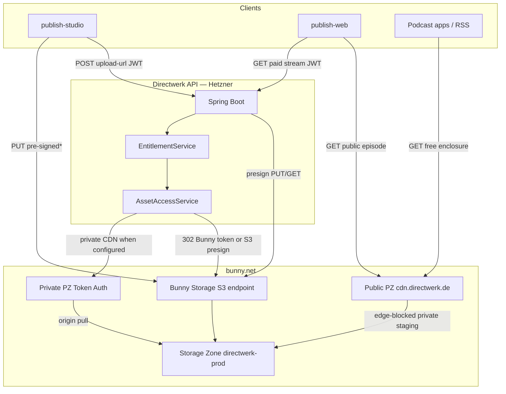

# Directwerk — bunny.net Product Fit & Integration Guide

Companion to [`asset-storage.md`](asset-storage.md) (S3 layout, upload/retrieve, entitlements) and
[`poc-alpha-setup.md`](poc-alpha-setup.md) (alpha bootstrap). This document evaluates **bunny.net**
products against Directwerk’s architecture and, where they fit, provides a **first implementation
guide**.

**Context:** Directwerk is a multi-tenant podcast/publication SaaS (Spring Boot on Hetzner/Coolify,
PostgreSQL, pre-signed S3 uploads, entitlement-gated private media). bunny.net is already listed
as an alternative EU object-storage provider in [`asset-storage.md`](asset-storage.md). The account
has access to **Bunny Storage S3 compatibility** (preview).

**Canonical S3 reference:** [bunny.net Storage S3 docs](https://docs.bunny.net/storage/s3)

---

## Summary

| bunny.net product | Fit for Directwerk | When to use |
|-------------------|-------------------|-------------|
| **Storage (S3 API)** | **Strong — recommended** | All `MediaAsset` bytes; pre-signed PUT/GET |
| **CDN (Pull Zone)** | **Strong — recommended** | Public PZ for `public/`; optional private PZ + Token Auth for paid audio |
| **DNS** | **Moderate — useful** | Tenant custom domains (`podcast.example.de`) |
| **Optimizer** | **Optional — later** | On-the-fly image resizing for covers/OG images |
| **Shield** | **Optional — later** | WAF/rate limits on CDN or public API edge |
| **Perma-Cache** | **Optional — later** | Long-tail cache for immutable public MP3s |
| **Stream** | **Weak for MVP** | Video episodes with transcoding/HLS — not podcast-first |
| **Edge Scripting** | **No** | Directwerk API is Spring Boot; no edge compute need |
| **Magic Containers** | **No** | App already deploys via Coolify on Hetzner |
| **Edge Database** | **No** | PostgreSQL is the system of record |

**Recommended stack:** One Bunny Storage zone (S3, `de` primary) + **two Pull Zones** on that
same zone:

1. **Public PZ** — unsigned; edge rules **block** `private/`, `staging/`, `user/`.
2. **Private PZ** — [Token Authentication](https://docs.bunny.net/cdn/security/token-authentication)
   enabled; used only for entitlement-gated paid delivery.

Keep a **single** storage zone so FREE ↔ PAID stays a same-zone `CopyObject` (already implemented
in `promoteToPublic` / `demoteToPrivate`). Dual storage zones are optional for compliance only
(see [`asset-storage.md`](asset-storage.md) dual-bucket note).

**Today in code:** paid 302s use **Bunny Advanced Token Auth** on the private pull zone when
`private-cdn-base-url` and `cdn-token-auth-key` are configured; otherwise **S3 pre-signed GET**.
Operator setup todos below. See [Architecture](#recommended-architecture) and
[CDN Pull Zones — operator todos](#implementation-guide-cdn-pull-zones).

---

## Why bunny.net makes sense for Directwerk

1. **Integrated storage + CDN** — One vendor for object storage and global delivery of free podcast
   episodes and public images. Hetzner Object Storage needs a separate CDN layer.
2. **EU regions** — Frankfurt (`de`), London (`uk`), Stockholm (`se`) align with EU-first positioning.
3. **S3-compatible API** — Fits the existing `software.amazon.awssdk:s3` plan in
   [`asset-storage.md`](asset-storage.md) with `forcePathStyle=true`.
4. **Private-by-default storage** — Storage zones are not meant for direct public traffic; CDN
   pull is the intended public path — matches Directwerk’s `public/` vs `private/` split.
5. **Beta access** — S3 compatibility is available on this account; good time to validate against
   the real upload/confirm/presign flows before Phase 2c.

**Caveats to plan for:**

| Limitation | Impact on Directwerk |
|------------|---------------------|
| S3 in [public preview](https://docs.bunny.net/storage/s3); enable **only at zone creation** | Create dev/stage/prod zones correctly the first time |
| Path-style URLs only | `forcePathStyle=true` on `S3Client` / `S3Presigner` |
| No `Cache-Control` / `Content-Disposition` on S3 `PutObject` | Set CDN cache behaviour via Pull Zone edge rules, not object metadata |
| No S3 lifecycle policies | Staging cleanup (`{tenant}/staging/`) via app cron or HTTP API |
| 500 RPS / 1 Gbps per zone (S3) | Fine for MVP; monitor before high-traffic tenants |
| Max 4 replication regions with S3 | Pick `de` + one backup EU region (e.g. `uk`) |
| Presigned URL TTL 1 s – 7 days | API 1h and RSS 24h are within limits |
| No batch `DeleteObjects` | Delete staging objects one-by-one |
| CORS not on S3 endpoint | Configure CORS on the Pull Zone if browsers upload directly |
| Presigned URL edge cache | Objects ≤256 MB may be cached after 2+ hits — fine for public; private uses short TTL |
| Public traffic must use CDN | Per [Bunny S3 docs](https://docs.bunny.net/storage/s3): presigned URLs “fronted by CDN” need a Pull Zone |

---

## Recommended architecture



\*Browser PUT to Bunny S3 is blocked without CORS on the storage endpoint
([known limitation](https://docs.bunny.net/storage/s3#known-limitations)); use a same-origin
proxy or non-browser client. Hetzner Object Storage can allow browser PUT with bucket CORS.

| Path | Delivery | Auth |
|------|----------|------|
| `{tenant}/public/**` | Public PZ (`public-cdn-base-url`) | None |
| `{tenant}/private/**` | Bunny private PZ + Advanced token URL when configured; else S3 pre-signed GET via API 302 | JWT / feed token + `EntitlementService` per asset |
| `{tenant}/staging/**` | S3 pre-signed PUT only; blocked on both PZs | Editor JWT; short TTL |

**Path-reuse invariant:** A client who sees `…/tenant/private/audio/{uuid}.mp3` on a private
token URL must **not** be able to fetch the same key on the public PZ. Enforce with public PZ
edge rules (403 on `*/private/*`, `*/staging/*`, `*/user/*`). Token Auth alone does not hide
paths or bind objects to one hostname.

**Do not** enable Token Auth on the **public** PZ (breaks FREE podcast URLs). Bunny tokens never
replace per-asset entitlement checks in Directwerk — the API still mints one URL per entitled
asset ([`asset-storage.md`](asset-storage.md)).

---

## Product evaluations

### Storage (S3-compatible) — **use**

**Role:** System of record for all media bytes (`MediaAsset.s3_key`).

**Why it fits:** Directwerk already designs around S3 pre-signed PUT (upload) and GET (private
stream). Bunny’s S3 API supports `PutObject`, `GetObject` (with range requests for seeking),
`CopyObject` (staging → final), `HeadObject`, multipart upload (>100 MB), and presigned URLs.

**S3 preview notes** ([official docs](https://docs.bunny.net/storage/s3)):

- Storage zones are **private by default** — API/S3 access only until a Pull Zone is linked.
- S3 compatibility must be toggled **when creating the zone**; it cannot be added later.
- Zone name: minimum 4 characters; letters, numbers, and dashes only.
- Credentials (Storage zone → **Access** → S3):
  - **Access Key ID** = storage zone name (bucket name)
  - **Secret Access Key** = storage zone password
  - **Endpoint** = `https://{region}-s3.storage.bunnycdn.com`
  - **Region code** = `de`, `uk`, `se`, `ny`, `sg`, `la`, `jh`, `syd` (use EU codes for Directwerk)
- URLs are **path-style only**: `https://{region}-s3.storage.bunnycdn.com/{bucket}/{key}` — virtual-hosted style is not supported.
- If S3 was not enabled at creation, API returns `503 ServiceUnavailable`.

See [S3 API reference (Directwerk-relevant)](#s3-api-reference-directwerk-relevant) and
[Implementation guide: Storage + S3](#implementation-guide-storage--s3).

---

### CDN (Pull Zone) — **use**

**Role:** Fast, cacheable delivery of **public** assets; Token-Auth PZ for **private** paid
audio when `private-cdn-base-url` and `cdn-token-auth-key` are configured.

**Why it fits:**

- Free podcast episodes (`access_policy = FREE`) use permanent CDN URLs in public RSS and APIs.
- Cover images and branding assets are read-heavy and benefit from edge caching.
- Bunny requires public delivery through CDN (serving hot files straight from the storage HTTP
  endpoint for end users violates ToS).
- A second PZ with Advanced Token Auth CDN-accelerates paid audio without dual storage zones,
  **if** the public PZ edge-blocks `private/` / `staging/` / `user/` (path-reuse invariant).

**Configuration highlights:**

- Origin type: **Bunny Storage Zone** → select `publish-{env}` / `directwerk-{env}` zone (same
  zone for both PZs).
- Public hostname: `cdn.directwerk.de` (platform) or per-tenant CNAME (post-MVP).
- Long cache for public UUID-keyed media via **Pull Zone edge rules** (S3 `PutObject` does not
  support `Cache-Control` — see [S3 known limitations](https://docs.bunny.net/storage/s3#known-limitations)).
- **Public PZ edge rules:** Block `*/private/*`, `*/staging/*`, `*/user/*` (required).
- **Private PZ:** Advanced Token Authentication on; never enable Token Auth on the public PZ.

**Paid delivery:** When private CDN env vars are set, API → Bunny Advanced token URL on the
private PZ. When they are absent, API → S3 presign (fallback). Operator checklist:
[CDN Pull Zones](#implementation-guide-cdn-pull-zones).

See also [Implementation guide: CDN Pull Zones](#implementation-guide-cdn-pull-zones).

---

### DNS — **consider**

**Role:** Host DNS for tenant custom domains (`TenantDomain.host`).

**Why it might fit:**

- Tenants point `podcast.creator.de` CNAME → platform edge (Pull Zone or reverse proxy).
- Bunny DNS supports API-managed records, DNSSEC, and wildcard certs for pull zones.
- Keeps media CDN and customer domain tooling in one vendor.

**Why it might not:**

- If the platform already uses Hetzner DNS / Cloudflare for `api.*` and `studio.*`, splitting
  DNS across vendors adds complexity.
- Tenant domain verification (TXT/CNAME) can be implemented provider-agnostically.

**Recommendation:** Use Bunny DNS **if** consolidating CDN + tenant CNAMEs; otherwise keep DNS at
Hetzner/Cloudflare and only CNAME to Bunny pull hostnames.

See [Implementation guide: DNS (optional)](#implementation-guide-dns-optional).

---

### Optimizer — **optional (Phase 2+)**

**Role:** Dynamic image resize/format (WebP/AVIF) for cover art and OG images.

**Why it might fit:** Creators upload large cover PNGs; Optimizer can resize at the edge without
storing multiple variants in S3.

**Why defer:** Adds cost and URL signing complexity. MVP can serve original images from CDN; add
Optimizer when publish-studio ships responsive image pickers.

**If adopted:** Enable on the public Pull Zone; use Optimizer URL parameters in
`S3PublicUrlBuilder` for `asset_type = IMAGE` only.

---

### Shield — **optional (production hardening)**

**Role:** WAF, bot detection, rate limiting on the **Pull Zone** (public media) or an API
reverse-proxy pull zone.

**Why it might fit:** Protects against scraping hot-linked MP3s, CDN billing abuse, and basic bots.

**Why defer:** Directwerk’s API runs on Hetzner behind Coolify — Shield does not replace Spring
Security. Most valuable after public launch when CDN traffic is meaningful.

**If adopted:** Attach Shield Zone to the public Pull Zone; configure rate limits per IP on
`/*.mp3` paths.

---

### Perma-Cache — **optional**

**Role:** Keep immutable public episode files permanently at the edge (100% cache HIT).

**Why it might fit:** Podcast back catalog is write-once-read-often; reduces origin egress.

**Why defer:** Standard Pull Zone caching with long `max-age` is enough for MVP. Evaluate when
storage egress costs matter.

---

### Stream — **not for MVP**

**Role:** Video upload, transcoding, HLS/DASH, player.

**Why it does not fit now:** Directwerk MVP is **podcast-first** (MP3/M4A in S3). Stream optimizes
for video libraries, DRM, and adaptive bitrate — a different asset pipeline than
`UploadService` + `MediaAsset`.

**Revisit when:** Video episodes or paid video courses ship; then compare Stream vs storing MP4
in S3 with manual encoding.

---

### Edge Scripting / Magic Containers / Edge Database — **skip**

| Product | Reason to skip |
|---------|----------------|
| Edge Scripting | Business logic belongs in Directwerk API (entitlements, tenancy) |
| Magic Containers | Coolify + Hetzner already hosts Spring Boot |
| Edge Database | PostgreSQL + Flyway is established; no edge SQLite need |

---

## S3 API reference (Directwerk-relevant)

Summarised from [docs.bunny.net/storage/s3](https://docs.bunny.net/storage/s3). Read the official
page for the full compatibility matrix.

### Operations Directwerk will use

| Operation | Directwerk use |
|-----------|----------------|
| `PutObject` / presigned PUT | Editor upload to `{tenant}/staging/`; post-validation upload to final key |
| `HeadObject` | Confirm upload (size, existence) after PUT |
| `CopyObject` | **Not recommended** for promotion — use direct upload to final key after validation to ensure Content-Type is preserved |
| `GetObject` + presigned GET | Private stream/download; **range requests** supported (podcast seeking) |
| `DeleteObject` | Staging cleanup, asset archive |
| `ListObjectsV2` | App-internal staging sweeps only — never exposed to clients |
| Multipart upload | Audio files **>100 MB** (max 10 000 parts; sessions expire after 10 days) |

### Content-Type on upload

When uploading via S3, Content-Type is resolved in order:

1. `Content-Type` request header (Directwerk sets this in presigned PUT policy)
2. File extension detection
3. Fallback `binary/octet-stream`

Always include `Content-Type` in the upload-url response headers so podcast MIME types are correct.

### Checksums

SHA-256 validation is available via `x-amz-checksum-sha256` (Base64). Optional for confirm step;
`HeadObject` returns `Content-Length` but not ETag on Bunny S3.

### Presigned URLs

| Property | Value |
|----------|-------|
| Algorithm | `AWS4-HMAC-SHA256` (SigV4) |
| TTL | 1 second – 7 days (`604800` s) |
| Default | 1 hour if unset |
| CDN + presign | For **public** delivery via CDN, attach a Pull Zone to the storage zone ([docs](https://docs.bunny.net/storage/s3)) |

Directwerk uses **direct S3 presigned GET** for private assets until Bunny Token Auth minting
lands. The **public** pull zone must edge-block `private/` / `staging/` / `user/` so path reuse
from a private token URL cannot open objects on the public hostname — see
[CDN Pull Zones — operator todos](#implementation-guide-cdn-pull-zones).

**Presigned URL cache:** Bunny may cache presigned responses for objects ≤256 MB after 2+ accesses.
Private streams use short TTLs (1h API / 24h RSS) so this is acceptable; do not rely on cache for
access control.

### Not supported (plan around these)

| Feature | Workaround |
|---------|------------|
| `DeleteObjects` (batch) | Loop `DeleteObject` |
| Lifecycle policies | App scheduled job for `staging/` |
| ACLs, object tagging, versioning | Tenant isolation via key prefix + `AssetAccessService` |
| SSE / SSE-C encryption | **Not provided** — sensitive media requires application-side encryption or a provider with documented at-rest encryption guarantee; EU region choice addresses residency separately |
| `Cache-Control` on `PutObject` | Pull Zone cache rules for `public/` paths |
| CORS on S3 | **Not supported on the storage endpoint** — [Bunny docs](https://docs.bunny.net/storage/s3#known-limitations): CORS “must be handled at the CDN level”. Browser PUTs to `*-s3.storage.bunnycdn.com` fail; use an API/server proxy (`publish-admin` does) or non-browser clients (curl/SDK) |
| Cross-zone `CopyObject` | Copy within same storage zone only |

### S3 error codes

| Code | HTTP | When |
|------|------|------|
| `NoSuchKey` | 404 | Staging object missing on confirm |
| `InvalidSecurity` | 403 | Wrong zone name, access key, or signature |
| `InvalidRequest` | 400 | Bad presign params or headers |
| `ServiceUnavailable` | 503 | S3 compatibility not enabled on zone |
| `InternalError` | 500 | Retry with backoff |

### Official best practices (from Bunny)

1. Use an SDK (`software.amazon.awssdk:s3` for Directwerk).
2. Enable replication in at least one additional EU region.
3. Retry transient `500` responses.
4. Multipart for objects >100 MB.
5. Set `Content-Type` on upload.
6. Paginate `ListObjectsV2` (max 1000 keys per page).
7. Abort abandoned multipart uploads (10-day session expiry).
8. Set presign expiry explicitly (`--expires-in` / `signatureDuration`).

---

## Implementation guide: Storage + S3

**Prerequisites:** S3 compatibility enabled on your bunny.net account ([request access](https://bunny.net/blog/whats-happening-with-s3-compatibility/) if the dashboard option is missing).

### 1. Create storage zones

Create one zone per environment. **Enable S3 compatibility on creation.**

| Environment | Zone name | Primary region | Replication |
|-------------|-----------|----------------|-------------|
| Dev | `directwerk-dev` | `de` (Frankfurt) | `uk` (optional) |
| Stage | `directwerk-stage` | `de` | `uk` |
| Prod | `directwerk-prod` | `de` | `uk`, `se` (max 4 with S3) |

- Tier: **Standard** (HDD) is sufficient for podcast audio; **Edge SSD** only if latency-sensitive
  origin reads matter (Frankfurt-only primary).
- Do **not** enable S3 on a zone that already exists without it — create a new zone instead.

### 2. Configure Coolify / env vars

Add to Directwerk deployment (see also [`.env.example`](../Directwerk/.env.example) — storage vars
to be added in Phase 2a):

```bash
# Bunny S3 — dev example (see https://docs.bunny.net/storage/s3)
S3_ENDPOINT=https://de-s3.storage.bunnycdn.com
S3_REGION=de                          # must match endpoint region
S3_BUCKET=directwerk-dev
S3_ACCESS_KEY=directwerk-dev          # zone name = Access Key ID
S3_SECRET_KEY=<zone-password>         # zone password = Secret Access Key
S3_FORCE_PATH_STYLE=true
S3_PUBLIC_CDN_BASE_URL=https://directwerk-dev.b-cdn.net
```

### 3. Spring configuration

Add to `application.yaml` (or profile-specific) when implementing Phase 2a:

```yaml
directwerk:
  storage:
    provider: bunny
    endpoint: ${S3_ENDPOINT}
    region: ${S3_REGION:de}            # Bunny region code, not AWS region name
    bucket: ${S3_BUCKET}
    force-path-style: true
    access-key: ${S3_ACCESS_KEY}
    secret-key: ${S3_SECRET_KEY}
    public-cdn-base-url: ${S3_PUBLIC_CDN_BASE_URL}
    presign-upload-ttl: 15m
    presign-download-ttl-api: 1h
    presign-download-ttl-rss: 24h
```

### 4. Gradle dependency

```kotlin
// build.gradle.kts — when storage module lands
implementation("software.amazon.awssdk:s3")
```

### 5. Java beans

```java
@Bean
S3Client s3Client(DirectwerkStorageProperties props) {
    // Region must match Bunny endpoint (e.g. "de" for de-s3.storage.bunnycdn.com)
    // https://docs.bunny.net/storage/s3#authentication-and-credentials
    return S3Client.builder()
        .endpointOverride(URI.create(props.getEndpoint()))
        .region(Region.of(props.getRegion()))
        .credentialsProvider(StaticCredentialsProvider.create(
            AwsBasicCredentials.create(props.getAccessKey(), props.getSecretKey())))
        .forcePathStyle(true)
        .build();
}

@Bean
S3Presigner s3Presigner(DirectwerkStorageProperties props) {
    return S3Presigner.builder()
        .endpointOverride(URI.create(props.getEndpoint()))
        .region(Region.of(props.getRegion()))
        .credentialsProvider(StaticCredentialsProvider.create(
            AwsBasicCredentials.create(props.getAccessKey(), props.getSecretKey())))
        .serviceConfiguration(S3Configuration.builder()
            .pathStyleAccessEnabled(true)
            .build())
        .build();
}
```

### 6. Verify with AWS CLI

```bash
# From https://docs.bunny.net/storage/s3 — AWS CLI example
aws configure --profile directwerk-bunny
# AWS Access Key ID: directwerk-dev
# AWS Secret Access Key: <zone-password>
# Default region name: de
# Default output format: json

aws s3 cp ./test.mp3 s3://directwerk-dev/alpha-show-a/staging/test-session/test.mp3 \
  --profile directwerk-bunny \
  --endpoint-url https://de-s3.storage.bunnycdn.com

aws s3 ls s3://directwerk-dev/alpha-show-a/ --recursive \
  --profile directwerk-bunny \
  --endpoint-url https://de-s3.storage.bunnycdn.com

# Presigned GET (max 7 days)
aws s3 presign s3://directwerk-dev/alpha-show-a/private/audio/test.mp3 \
  --profile directwerk-bunny \
  --endpoint-url https://de-s3.storage.bunnycdn.com \
  --expires-in 3600
```

### 7. Key layout

Use the layout from [`asset-storage.md`](asset-storage.md) unchanged:

```text
directwerk-prod/
  {tenant_slug}/
    public/audio/{uuid}.mp3
    public/images/covers/{uuid}.jpg
    private/audio/{uuid}.mp3
    staging/{upload_session_id}/{filename}
```

### 8. Staging lifecycle (no S3 lifecycle API)

Bunny S3 does not support lifecycle policies. Implement one of:

- **App job:** Quartz/`@Scheduled` task deletes `staging/` objects older than 24h (list by prefix
  per tenant, or track `MediaAsset` `PENDING` rows).
- **Manual:** Bunny dashboard / HTTP API for dev cleanup.

### 9. Integration test checklist

| # | Test |
|---|------|
| 1 | Presigned PUT to `{tenant}/staging/...` succeeds |
| 2 | `HeadObject` after upload returns correct size |
| 3 | `CopyObject` staging → `private/audio/{uuid}.mp3` |
| 4 | Presigned GET for private key works; expires after TTL |
| 5 | Path-style URL format in presigned links |
| 6 | Multipart upload for file >100 MB (optional) |

---

## Implementation guide: CDN Pull Zones

One storage zone, **two** pull zones. Operator checklist first; app wiring listed as follow-up.

### A. Public Pull Zone (unsigned FREE / covers)

#### Todo — create / confirm public PZ

- [ ] **CDN** → **Add Pull Zone** (or open existing `directwerk-{env}`).
- [ ] Name e.g. `directwerk-prod` → hostname `directwerk-prod.b-cdn.net`.
- [ ] Origin type: **Storage Zone** → same zone as S3 (`directwerk-prod`).
- [ ] **Hostnames** → add `cdn.directwerk.de` (or env equivalent); CNAME + free TLS.
- [ ] Set `DIRECTWERK_STORAGE_PUBLIC_CDN_BASE_URL=https://cdn.directwerk.de` (Coolify / `.env`).
- [ ] **Do not** enable Token Authentication on this PZ.

#### Todo — edge rules (required for path-reuse invariant)

On the **public** Pull Zone → **Edge Rules**, add and enable:

| # | When URL path matches | Action | Notes |
|---|----------------------|--------|-------|
| 1 | `*/private/*` | **Block request** (403) | Blocks paid keys if someone copies a path from a private URL |
| 2 | `*/staging/*` | **Block request** (403) | Upload scratch must never be CDN-readable |
| 3 | `*/user/*` | **Block request** (403) | Per-user private subtree |
| 4 | `*/public/*` (optional) | Override cache / long TTL | Prefer caching only public media |

Bunny UI: create rule → condition **Request URL** / path match → action **Block Request**.
Order so block rules win before any catch-all cache rules.

#### Todo — verify public PZ

```bash
# Public object (expect 200, then HIT on repeat)
curl -I "https://cdn.directwerk.de/{tenant}/public/audio/test.mp3"

# Private / staging must be 403 even if the object exists in storage
curl -I "https://cdn.directwerk.de/{tenant}/private/audio/test.mp3"
curl -I "https://cdn.directwerk.de/{tenant}/staging/audio/test.mp3"
```

### B. Private Pull Zone (Token Auth — paid CDN target)

Same storage zone origin; separate hostname; Token Auth **on**.

#### Todo — create private PZ

- [ ] **CDN** → **Add Pull Zone** e.g. `directwerk-prod-private`.
- [ ] Origin: **same** Storage Zone as the public PZ (`directwerk-prod`).
- [ ] Hostname e.g. `cdn-private.directwerk.de` → CNAME to `….b-cdn.net` + TLS
      (or use `directwerk-prod-private.b-cdn.net` for stage/dev).
- [ ] Optional edge rules: block `*/staging/*` here too; allow `*/private/*` (required for paid).
- [ ] Optional: block `*/public/*` on the private PZ so paid delivery cannot be confused with FREE
      CDN URLs (public assets stay on the public hostname only).

#### Todo — enable Token Authentication

Require **Advanced** Token Authentication (HMAC-SHA256). The app mints `HS256-…` URLs via
`BunnyTokenUrlSigner` and will not validate Basic MD5 tokens.

Docs: [Advanced Token Authentication](https://docs.bunny.net/cdn/security/token-authentication/advanced)
([overview](https://docs.bunny.net/cdn/security/token-authentication);
[official Java signer](https://github.com/BunnyWay/BunnyCDN.TokenAuthentication/tree/master/java)).

- [ ] Private PZ → **Security** → enable **Token Authentication** (Advanced / HMAC-SHA256).
- [ ] Copy **URL Token Authentication Key** into Coolify secrets
      (e.g. `DIRECTWERK_STORAGE_CDN_TOKEN_AUTH_KEY`) — never commit; never log.
- [ ] Note: enabling Token Auth disables IPv6 on that PZ (Bunny behaviour).
- [ ] Decide TTL policy to mirror app: API downloads ~1h, RSS enclosure redirects ~24h
      (`presign-download-ttl-api` / `presign-download-ttl-rss`).

#### Todo — verify private PZ + path-reuse

```bash
# Without token → expect 403
curl -I "https://cdn-private.directwerk.de/{tenant}/private/audio/test.mp3"

# With an Advanced HS256 token (app-minted or BunnyCDN.TokenSigner) → expect 200
curl -I "https://cdn-private.directwerk.de/{tenant}/private/audio/test.mp3?token=HS256-…&expires=…"

# Critical: same private key on PUBLIC PZ must still be 403
curl -I "https://cdn.directwerk.de/{tenant}/private/audio/test.mp3"
```

### C. Public URL builder (unchanged)

```java
public URL cdnUrl(String s3Key) {
    // s3Key example: alpha-show-a/public/audio/7c9e6679-....mp3
    return URI.create(props.getPublicCdnBaseUrl())
        .resolve("/" + s3Key)
        .toURL();
}
```

Public RSS stable enclosure proxies and `GET /api/v1/public/episodes` resolve FREE audio to the
**public** PZ (via Directwerk 302) — never embed raw storage or S3 endpoints in feeds.

### D. App wiring (Directwerk) — implemented

Paid 302s use Bunny Advanced Token Auth when both env vars are set; otherwise S3 presign
(Hetzner / Bunny without private PZ).

- [x] Config: `private-cdn-base-url` + `cdn-token-auth-key`
      (`DIRECTWERK_STORAGE_PRIVATE_CDN_BASE_URL`, `DIRECTWERK_STORAGE_CDN_TOKEN_AUTH_KEY`)
- [x] Mint Advanced HMAC-SHA256 token URLs in `AssetAccessService` via `BunnyTokenUrlSigner`
      (after entitlement) for download, RSS enclosure redirects, and publisher preview
- [x] Keep Directwerk enclosure proxy as the stable RSS URL; only the **redirect target** changes
- [x] Partial config (only one of base URL / key) fails closed with `StorageNotConfiguredException`
- [ ] Never log token URLs; rotate the Token Auth key if leaked (`Reset Token Key` in Bunny)
- [ ] On demote public → private: purge public PZ cache for the old `public/` key
      (`BunnyCdnPurgeClient` already exists)
- [ ] Document Coolify secrets per environment for the private PZ token key

Refs: [Advanced Token Authentication](https://docs.bunny.net/cdn/security/token-authentication/advanced),
[How to sign URLs](https://support.bunny.net/hc/en-us/articles/360016055099-How-to-sign-URLs-for-BunnyCDN-Token-Authentication).

### E. What we are *not* doing

- Dual storage zones for MVP (visibility flips would need cross-zone copy; Bunny `CopyObject` is
  same-zone only).
- Token Auth on the **public** PZ.
- Treating Bunny tokens as entitlement — still one minted URL per entitled asset after
  `EntitlementService` / feed-token checks.

## Implementation guide: DNS (optional)

Use when tenant custom domains should CNAME to the platform CDN or app edge.

### 1. Platform zone

1. **DNS** → Add zone `directwerk.de` (or your platform domain).
2. Records:
   - `api.directwerk.de` A/AAAA → Hetzner app IP (or CNAME to Coolify)
   - `cdn.directwerk.de` CNAME → `directwerk-prod.b-cdn.net`
   - `studio.directwerk.de` CNAME → Vercel/Hetzner frontend

### 2. Tenant custom domain flow

Aligns with `TenantDomain` verification in Directwerk:

1. Tenant adds `podcast.creator.de` in studio.
2. API returns verification CNAME: `podcast.creator.de` → `tenants.directwerk.de` (or unique
   `{tenant}.edge.directwerk.de`).
3. Platform creates Pull Zone hostname or reverse-proxy route for that host.
4. On DNS check success, set `verified = true`.

Bunny DNS API can automate record creation if the tenant delegates NS or uses Bunny as registrar —
otherwise tenants add CNAME manually and Directwerk polls HTTP verification.

### 3. API reference

- [Bunny DNS API](https://docs.bunny.net/api-reference/core/dns-zone/add-dns-zone)
- [Pull Zone custom hostnames](https://docs.bunny.net/api-reference/core/pull-zone/add-custom-hostname)

Defer full automation until Phase B (studio domains UI) is stable.

---

## Decision: Bunny vs Hetzner Object Storage

| Criterion | Hetzner Object Storage | Bunny Storage + CDN |
|-----------|------------------------|---------------------|
| EU residency | DE, FI | DE, UK, SE |
| S3 maturity | Production | [Public preview](https://docs.bunny.net/storage/s3) |
| Built-in CDN | Separate (Hetzner CDN / Cloudflare) | Integrated Pull Zone |
| Coolify alignment | Same ecosystem as app host | External vendor |
| Podcast public delivery | Extra CDN setup | One linking step |
| Private signed GET | Yes | Yes (Bunny Advanced token when private CDN configured; else S3) |
| **When to choose Bunny** | — | Media-heavy, want single vendor CDN+storage, validating beta |
| **When to choose Hetzner** | — | Minimize vendors; S3 production maturity priority |

**Practical path:** Use Bunny for **dev/stage** now (beta access, validate Phase 2c flows). Keep
Hetzner as documented fallback for prod until S3 preview matures or egress pricing is compared at
real traffic.

---

## Environment matrix

| Env | Storage zone | Public PZ | Private PZ (Token Auth) | Public CDN hostname |
|-----|--------------|-----------|-------------------------|---------------------|
| Local / Bunny dev | `directwerk-dev` | `directwerk-dev` | `directwerk-dev-private` | `directwerk-dev.b-cdn.net` |
| Stage | `directwerk-stage` | `directwerk-stage` | `directwerk-stage-private` | `cdn.stage.directwerk.de` |
| Prod | `directwerk-prod` | `directwerk-prod` | `directwerk-prod-private` | `cdn.directwerk.de` |

Private PZ hostnames can stay on `*.b-cdn.net` until a `cdn-private.*` custom hostname is needed.
Credentials: separate zone password per environment; Token Auth key is **per private PZ** — never
share prod keys with dev laptops.

---

## Security reminders

From [`asset-storage.md`](asset-storage.md) and workspace security rules:

1. **Never** log pre-signed URLs or Bunny token URLs.
2. **Never** expose `ListObjects` or prefix-wide credentials to clients.
3. Private access = `AssetAccessService` + `EntitlementService` + single-key signed URL (S3 today;
   Bunny token later).
4. Store `S3_SECRET_KEY` and `CDN_TOKEN_AUTH_KEY` in Coolify secrets only.
5. Public CDN must **403** `private/`, `staging/`, and `user/` paths (edge rules — verify with curl).
6. RSS private feeds: one signed redirect target **per entitled episode**, regenerated each fetch.
7. Path visible in a private token URL must not open the object on the public PZ.

---

## Related documents

- [**Bunny Storage S3 (canonical)**](https://docs.bunny.net/storage/s3) — credentials, operations, limits, errors
- [`asset-storage.md`](asset-storage.md) — Key layout, upload/confirm, `AssetAccessService`, entitlements
- [`poc-alpha-setup.md`](poc-alpha-setup.md) — Phase 2a–2f storage implementation order
- [`content-creation-implementation.md`](content-creation-implementation.md) — Media upload API surfaces
- [Bunny Storage quickstart](https://docs.bunny.net/storage/quickstart)
- [Bunny CDN token authentication](https://docs.bunny.net/cdn/security/token-authentication)

---

## Implementation phases (bunny-specific)

| Phase | Deliverable |
|-------|-------------|
| **2a** | `directwerk-dev` zone + S3 beans; connectivity test |
| **2f** | Bunny profile in `DirectwerkStorageProperties`; document env vars |
| **2c** | Presigned PUT upload flow against Bunny |
| **2e** | Public Pull Zone + `public-cdn-base-url`; public episode URLs |
| **2e.1** | **Ops:** Public PZ edge rules block `private/` / `staging/` / `user/` ([todos](#implementation-guide-cdn-pull-zones)) |
| **2e.2** | **Ops:** Private PZ + Token Auth on same storage zone; curl path-reuse check |
| **4** | Private RSS enclosures via stable proxy → S3 or Bunny private PZ |
| **4b** | **App:** Bunny Advanced token URLs when `private-cdn-base-url` + `cdn-token-auth-key` set |
| **Post-MVP** | Optimizer for images; Shield on public PZ; Bunny DNS automation |
