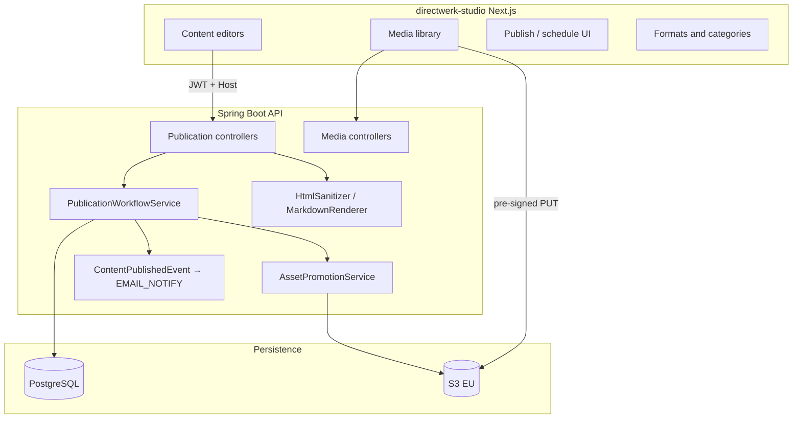
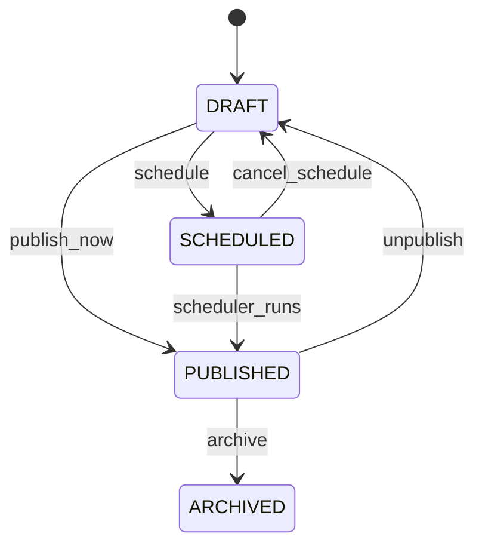
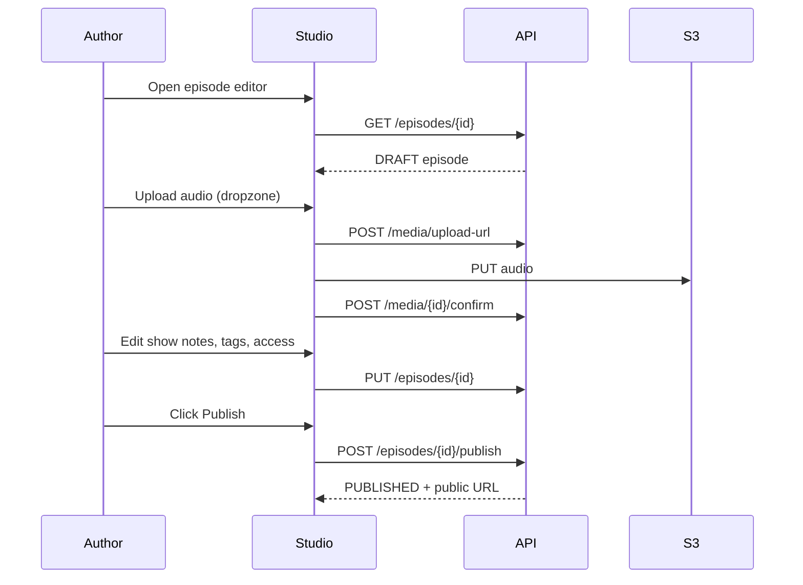

# Directwerk — Content Creation Implementation Guide

Companion to the product and studio specs. This document is the **engineering blueprint** for how
authors create and manage content in **`directwerk-studio`**: data model, API contracts, backend services,
frontend structure, **recommended libraries**, and phased delivery.

| Document | Purpose |
|----------|---------|
| [`directwerk-studio.md`](directwerk-studio.md) | What studio is — audience, journeys, three-app model |
| [`directwerk-studio-implementation.md`](directwerk-studio-implementation.md) | Studio app — screens, scaffold, auth, checklist |
| [`content-platform-strategy.md`](content-platform-strategy.md) | Publication platform vs CMS — scope boundaries |
| [`asset-storage.md`](asset-storage.md) | S3 upload/confirm, visibility, signed URLs |
| [`poc-alpha-setup.md`](poc-alpha-setup.md) | Alpha backend slice (tenancy, auth, modules) |
| [`README.md`](platform-design.md) | Full platform design — entities, phases, OpenAPI |
| **This document** | **How to implement** content creation end-to-end |

**Status (2026-07):** Pre-implementation. Treat library versions as recommendations — verify against
monorepo conventions and security advisories at implementation time.

---

## 1. Scope — what we are and are not building

### We are building

A **self-service publisher dashboard** (`directwerk-studio`) on fixed **publication types**:

| Type | MVP | Authoring surface |
|------|-----|-------------------|
| `PODCAST_SERIES` | Yes | Form (title, description, cover) |
| `Episode` | Yes | Form + show-notes editor + audio picker |
| `ARTICLE` | Post-MVP | Markdown editor + hero image |
| `DigitalPublication` | Post-MVP | File picker + access rules |
| Formats / categories | Yes (with podcast) | Taxonomy manager (tenant admin) |
| Newsletter | Post-MVP | **Checkbox on publish** — not a separate editor |

### We are not building

| Full CMS feature | Why excluded |
|------------------|--------------|
| Block / drag-and-drop layout editor | Scope creep; competes with Ghost/Notion |
| Arbitrary page tree | Headless JSON per publication type only |
| Theme designer in studio | `directwerk-web` + `site-config` branding |
| Plugin / shortcode system | Integrator concern |
| Native email template designer | ESP owns templates; we send variables |
| Version history beyond draft/published | Post-MVP at earliest |

**Mental model:** Studio is a **typed CRUD + workflow UI** over `/api/v1/`, not a general content
authoring product. See [`content-platform-strategy.md`](content-platform-strategy.md).

---

## 2. Architecture overview



### API-first rules (non-negotiable)

1. Studio calls **only** `/api/v1/` — same contract agencies use.
2. **Server-side** validation and sanitization — never trust the editor alone.
3. **OAuth2 JWT** on tenant domain (`directwerk-tenant-frontend` client).
4. Nav gated by `GET /api/v1/public/site-config` → `enabledModules[]`.
5. Upload bytes go **direct to S3** via pre-signed PUT — API never proxies file bodies.

---

## 3. Unified content model

All publication types share a **workflow** and **access policy** pattern. Type-specific fields live
on separate tables — no single-table inheritance in the UI.

### Shared workflow state machine



| Transition | Server responsibilities |
|------------|-------------------------|
| `publish_now` | Set `published_at`; promote linked `MediaAsset` visibility; invalidate RSS caches; emit `ContentPublishedEvent` |
| `schedule` | Set `scheduled_at`; job publishes at time |
| `unpublish` | Revert to `DRAFT`; optionally demote public assets to private |
| `archive` | Hide from public APIs; keep for admin |

Implement once as `PublicationWorkflowService` in `modules/digital/internal/` — episode, article,
and digital publication services **delegate** to it.

### Shared access policy

| `access_policy` | Meaning | Audio/file visibility on publish |
|-----------------|---------|--------------------------------|
| `FREE` | Public catalog + public RSS | `MediaAsset.visibility = PUBLIC` → `{tenant}/public/` |
| `PAID` | Gated by `EntitlementService` | `PRIVATE` → `{tenant}/private/`; signed URLs only |

`required_level_sort_order` (nullable INT) — minimum LEVEL product `sort_order` when `PAID`.

### Entity summary

Full column lists: [`README.md` § Content Model](platform-design.md#content-model).

| Entity | Module | Key relations |
|--------|--------|---------------|
| `MediaAsset` | `DIGITAL_CONTENT` | S3 key, visibility, `episode_id` (optional FK) |
| `PodcastSeries` | `PODCAST` | `cover_asset_id` |
| `Episode` | `PODCAST` | `series_id`, `audio_asset_id`, formats, categories |
| `Format` | `PODCAST` | Tenant-defined; feed-builder axis |
| `Category` | `PODCAST` | Tenant-defined; optional `parent_id` tree |
| `Article` | `DIGITAL_CONTENT` | `body` (Markdown), `hero_asset_id` — post-MVP |
| `DigitalPublication` | `DIGITAL_CONTENT` | Document asset + PACKAGE/LEVEL rules — post-MVP |

---

## 4. Backend implementation

Package layout follows Gradle modules under `Directwerk/` (see [`Directwerk/README.md`](../Directwerk/README.md)).

```
modules/digital/
  api/     PublicationWorkflowApi, UploadApi, MediaAssetQueryApi, ArticleCommandApi, …
  internal/
    entity/   MediaAsset, Article, DigitalPublication
    service/  PublicationWorkflowService, UploadService, ArticleService, HtmlSanitizer, MarkdownService
    repository/
  web/     MediaController, ArticleController, …

modules/podcast/
  api/     EpisodeCommandApi, SeriesQueryApi, …
  internal/
    entity/  PodcastSeries, Episode, Format, Category
    service/ EpisodeService, SeriesService, FormatService, CategoryService
  web/     SeriesController, EpisodeController, FormatController, CategoryController
```

### 4.1 Core services

#### `PublicationWorkflowService`

```java
public interface PublicationWorkflowApi {
    void publish(PublicationRef ref, PublishOptions options);
    void schedule(PublicationRef ref, Instant scheduledAt, PublishOptions options);
    void cancelSchedule(PublicationRef ref);
    void unpublish(PublicationRef ref);
    void archive(PublicationRef ref);
}

public record PublishOptions(
    boolean notifySubscribers,  // EMAIL_NOTIFY module + tenant preference
    Long publishedByUserId
) {}
```

`PublicationRef` = `(PublicationType type, Long id)` — dispatches to type-specific validators and
asset promotion.

#### `AssetPromotionService`

On publish, moves staging/private assets to final keys per [`asset-storage.md`](asset-storage.md):

- `FREE` episode audio: `private/audio/` → `public/audio/` (or direct to public on confirm if known upfront)
- `PAID`: stays under `private/`
- Updates `MediaAsset.s3_key` and `visibility`

#### `ContentPublishedEvent`

Spring `ApplicationEvent` or outbox row:

```java
public record ContentPublishedEvent(
    Long tenantId,
    PublicationType type,
    Long publicationId,
    String slug,
    String title,
    String excerpt,
    boolean notifySubscribers
) {}
```

Listeners (post-MVP):

- `EmailNotifyListener` → ESP adapter (Mailgun/Buttondown)
- `WebhookDispatcher` → `content.published` for Tier B integrators

### 4.2 REST endpoints (publisher)

| Resource | Methods | Role | Module |
|----------|---------|------|--------|
| `/api/v1/media/*` | upload-url, confirm, list, preview-url | `EDITOR+` | `DIGITAL_CONTENT` |
| `/api/v1/series` | CRUD | `EDITOR+` | `PODCAST` |
| `/api/v1/episodes` | CRUD | `EDITOR+` | `PODCAST` |
| `/api/v1/episodes/{id}/publish` | POST | `EDITOR+` | `PODCAST` |
| `/api/v1/episodes/{id}/schedule` | POST | `EDITOR+` | `PODCAST` |
| `/api/v1/formats` | CRUD | `TENANT_ADMIN` | `PODCAST` |
| `/api/v1/categories` | CRUD | `TENANT_ADMIN` | `PODCAST` |
| `/api/v1/articles` | CRUD | `EDITOR+` | `DIGITAL_CONTENT` |
| `/api/v1/articles/{id}/publish` | POST | `EDITOR+` | `DIGITAL_CONTENT` |
| `/api/v1/digital-publications` | CRUD | `EDITOR+` | `DIGITAL_CONTENT` + `SUBSCRIPTION` |

Request/response bodies use the standard JSON envelope from [`README.md`](platform-design.md).

#### Example: create episode (draft)

`POST /api/v1/episodes`

```json
{
  "seriesId": 12,
  "title": "Interview mit Anna",
  "slug": "interview-mit-anna",
  "episodeNumber": 42,
  "description": "<p>Show notes HTML — sanitized server-side</p>",
  "audioAssetId": 1001,
  "accessPolicy": "PAID",
  "requiredLevelSortOrder": 2,
  "formatIds": [3, 7],
  "categoryIds": [1]
}
```

Response `data.status` = `DRAFT`.

#### Example: publish with newsletter

`POST /api/v1/episodes/55/publish`

```json
{
  "notifySubscribers": true
}
```

Server validates `EMAIL_NOTIFY` module active + ESP connected before sending.

### 4.3 Validation rules (server)

| Field | Rule |
|-------|------|
| `slug` | Unique per tenant (articles) or per series (episodes); `[a-z0-9-]+` |
| `title` | Required, max 500 chars |
| `description` / `body` | Required on publish; max size per type (e.g. 512 KB HTML, 1 MB Markdown) |
| `audioAssetId` | Required on episode publish; asset `status=READY`, same tenant |
| `formatIds` | At least one format on episode publish (configurable) |
| `mimeType` / `sizeBytes` | Enforced on upload-url per [`asset-storage.md`](asset-storage.md) |

Use Jakarta Bean Validation (`@Valid`) on request records + domain validators in services.

### 4.4 Backend libraries (Java / Gradle)

| Concern | Library | Version hint | Notes |
|---------|---------|--------------|-------|
| Framework | Spring Boot | 4.1.0 (BOM) | Web, Security, Data JPA, Validation |
| Migrations | Flyway | 12+ (BOM) | Owns schema |
| S3 | `software.amazon.awssdk:s3` | BOM-managed | Pre-signed PUT/GET; Hetzner/Bunny path-style |
| HTML sanitization (show notes) | `com.googlecode.owasp-java-html-sanitizer:owasp-java-html-sanitizer` | 20240325.1+ | **Server-side only** — allow `p`, `br`, `strong`, `em`, `a[href]`, `ul`, `ol`, `li`, `h2`, `h3` |
| Markdown → HTML (articles) | `com.vladsch.flexmark:flexmark-all` | 0.64.8+ | CommonMark + GFM tables; render at read time **or** store both MD + cached HTML |
| Slug generation | `com.github.slugify:slugify` | 3.0.7+ | German transliteration (`setUnderscoreSeparator(true)` → hyphen) |
| Scheduling | Spring `@Scheduled` or Quartz | Boot starter | Publish `SCHEDULED` → `PUBLISHED` |
| HTML parsing (tests) | Jsoup | 1.17+ | Assert sanitized output in unit tests |

**Do not use** client-provided HTML without sanitization. **Do not use** `eval` or runtime template
engines for user content.

#### `HtmlSanitizer` wrapper (sketch)

```java
@Service
class HtmlSanitizer {

    private final PolicyFactory policy = Sanitizers.FORMATTING
        .and(Sanitors.LINKS)
        .and(new HtmlPolicyBuilder()
            .allowElements("p", "br", "h2", "h3", "ul", "ol", "li")
            .toFactory());

    public String sanitizeShowNotes(String rawHtml) {
        if (rawHtml == null || rawHtml.isBlank()) {
            return "";
        }
        return policy.sanitize(rawHtml);
    }
}
```

#### Article body storage strategy

| Approach | Pros | Cons |
|----------|------|------|
| **Store Markdown only** | Single source of truth; re-render if renderer changes | Public API must render HTML on each request or cache |
| **Store MD + rendered HTML** | Fast reads; stable public HTML | Must re-render on update; two fields to keep in sync |

**Recommendation:** Store `body_markdown` + `body_html` (generated on save via Flexmark). Public
gated API returns teaser from `excerpt`; full `body_html` only on `/me/articles/{slug}` when entitled.

### 4.5 Database migrations (content-related)

| Migration | Contents |
|-----------|----------|
| `V5__create_media_assets.sql` | `media_assets` (alpha) |
| `V6__create_podcast_content.sql` | `podcast_series`, `episodes`, `formats`, `categories`, join tables |
| `V7__create_articles.sql` | `articles` (post-MVP) |
| `V8__create_digital_publications.sql` | bonus files (post-MVP) |

All tenant-owned tables: `tenant_id NOT NULL` + Hibernate `tenantFilter` / `TenantOwned` from alpha.

### 4.6 Scheduled publish job

```java
@Scheduled(fixedDelay = 60_000)
void publishDuePublications() {
    var due = episodeRepository.findScheduledBefore(Instant.now());
    due.forEach(ep -> workflowApi.publish(
        new PublicationRef(PODCAST_EPISODE, ep.getId()),
        PublishOptions.defaults()
    ));
}
```

Same job queries `articles` when that entity exists. Use transactional outbox if ESP/webhook
delivery must be reliable.

---

## 5. Frontend implementation (`directwerk-studio`)

Studio app structure, auth, API client, page routes, and screen-by-screen spec:
[`directwerk-studio-implementation.md`](directwerk-studio-implementation.md).

This section covers **content-specific** editor configuration and shared publication components.

### 5.1 Frontend libraries (content editors)

| Concern | Library | Rationale |
|---------|---------|-----------|
| Show notes editor | `@tiptap/react`, `@tiptap/starter-kit`, `@tiptap/extension-link` | **Limited** rich text — not a block builder; outputs HTML |
| Article editor | `@uiw/react-md-editor` | Markdown + split preview; paste-from-Docs friendly |
| Markdown preview (read-only) | `react-markdown`, `remark-gfm` | GFM tables in preview pane |
| Slug from title | `slugify` | Client-side suggestion; **server validates** uniqueness |
| Date/time (schedule) | `date-fns` | `scheduled_at` as ISO UTC |

**Explicitly avoid** for MVP: Lexical full framework, Plate, Novel, Ghost Koenig, CKEditor 5,
TipTap block extensions (columns, embeds).

Full `package.json` starter: [§ 10 Library summary](#10-library-summary-copy-paste-starters).

#### Show notes — TipTap configuration (minimal)

```typescript
import { useEditor, EditorContent } from '@tiptap/react'
import StarterKit from '@tiptap/starter-kit'
import Link from '@tiptap/extension-link'

// Allow only: paragraph, bold, italic, link, bullet/ordered list, h2, h3
const extensions = [
    StarterKit.configure({
        heading: { levels: [2, 3] },
        blockquote: false,
        codeBlock: false,
        horizontalRule: false,
    }),
    Link.configure({ openOnClick: false, autolink: true }),
]
```

Submit **HTML string** to API — server runs OWASP sanitizer. Client may run `sanitize-html` for
preview only; **authoritative strip is server-side**.

#### Article — Markdown editor

Store Markdown in form state; POST raw Markdown in `bodyMarkdown` field. No client-side HTML
generation for storage.

### 5.2 Shared UI components

Build these once — reuse across episode, article, digital file.

| Component | Props / behaviour |
|-----------|-------------------|
| `<PublicationStatusBadge>` | `status: DRAFT \| SCHEDULED \| PUBLISHED \| ARCHIVED` |
| `<PublicationWorkflowActions>` | `publicationId`, `type`, `status`, `onSuccess` — calls publish/schedule/unpublish |
| `<SchedulePicker>` | `value: Date \| null`, `onChange` — datetime-local → ISO UTC |
| `<AccessPolicySelect>` | `policy`, `levelSortOrder`, `products` from API |
| `<SlugField>` | `title` → suggested slug; debounced uniqueness check `GET ...?slug=` |
| `<NotifySubscribersCheckbox>` | Hidden unless `EMAIL_NOTIFY` in modules + ESP connected |
| `<MediaPickerModal>` | Filter by `assetType`; single or multi select |
| `<UploadDropzone>` | Mime/size pre-check → `upload-url` → S3 PUT → `confirm` |
| `<FormatCategoryPicker>` | Multi-select; loads `/api/v1/formats`, `/api/v1/categories` |
| `<ModuleGate module="PODCAST">` | Renders children only if module enabled |

### 5.3 Content page flows

#### Episode editor (`/content/podcasts/episodes/[episodeId]`)



**Autosave:** Debounced `PUT` on field blur or every 30s for drafts — show "Saving…" / "Saved".
Disable autosave when `PUBLISHED` (limited fields only).

**Validation before publish (client + server):**

- Title present
- `audioAssetId` set and `READY`
- Series selected
- At least one format (if tenant requires)

#### Media library (`/media`)

- Grid with thumbnails (images), waveform icon (audio)
- Filters: type, status, unlinked orphans
- Bulk archive for expired `PENDING` uploads
- Row click → detail with preview (`GET /media/{id}/preview-url`)

#### Taxonomy (`/settings/taxonomy`)

Two tabs — **Formats** and **Categories** (`TENANT_ADMIN` only).

| Format fields | Category fields |
|---------------|-----------------|
| name, slug, description | name, slug, parent (tree) |
| `required_level_sort_order` (optional) | `active` |
| `sort_order`, `active` | |

Editors consume taxonomy as read-only pickers on episode form.

#### Article editor (post-MVP)

Same shell as episode editor:

- Replace show notes with `<MarkdownEditor>`
- Replace audio with optional hero image
- Same `<PublicationWorkflowActions>` and `<AccessPolicySelect>`

---

## 6. Newsletter implementation

Newsletter is **not** a content type.

### Author UX

On publish confirmation modal:

```
┌─────────────────────────────────────────┐
│ Publish "Interview mit Anna"?           │
│                                         │
│ [x] Notify subscribers by email         │
│     (~1,240 free · ~380 paid)           │
│                                         │
│         [Cancel]  [Publish]             │
└─────────────────────────────────────────┘
```

### Backend flow

1. `PublishOptions.notifySubscribers = true`
2. `ContentPublishedEvent` emitted after DB commit
3. `EmailNotifyListener` checks `ModuleGateApi.isEnabled(EMAIL_NOTIFY)`
4. `EspAdapter` (Mailgun or Buttondown) sends campaign:
   - Template variables: `title`, `excerpt`, `url`, `tenantName`
   - Segments: all active subscribers or free/paid split
   - **Default:** teaser + link to gated web URL — not full paid body

### ESP setup (tenant admin)

Settings → Integrations → connect Mailgun (EU region) or Buttondown.

| Stored | Location |
|--------|----------|
| ESP API key | Encrypted in DB; never in frontend |
| List IDs / domain | Tenant integration config |

### Libraries

| Layer | Library |
|-------|---------|
| Mailgun (API already in monorepo) | `mailgun.js` on a **server-side** worker or Spring `RestClient` |
| Buttondown | REST via `RestClient` |
| Unsubscribe | ESP-managed List-Unsubscribe headers |

Phase 1 (integrators): webhook only. Phase 2 (creators): native adapter + studio checkbox.

---

## 7. Security checklist (content creation)

| Rule | Implementation |
|------|----------------|
| Sanitize HTML server-side | OWASP HTML sanitizer on every `description` save |
| Markdown XSS | Render via Flexmark; no raw HTML pass-through in Markdown without sanitizer |
| Upload mime allow-list | `upload-url` validates `mimeType` + `sizeBytes` |
| S3 keys server-generated | Never accept client-provided `s3_key` |
| Tenant isolation | JWT `tenant_id` + `Host` match; row-level guards |
| Private asset URLs | Short-lived signed GET only after entitlement check |
| No secrets in studio | ESP/Stripe keys server-only |
| CSRF | Stateless JWT in `Authorization` header |
| Rate limits | Upload-url and publish endpoints per user/IP |

---

## 8. Testing strategy

### Backend (JUnit 5 + Testcontainers)

| Test | Assert |
|------|--------|
| `HtmlSanitizerTest` | Strips `<script>`, `onerror=`, disallowed tags |
| `EpisodePublishTest` | `DRAFT` → `PUBLISHED`; `published_at` set; audio promoted to `public/` when FREE |
| `ScheduleJobTest` | `SCHEDULED` episode publishes at `scheduled_at` |
| `CrossTenantEpisodeTest` | Tenant B cannot CRUD tenant A episode |
| `ModuleGateTest` | `/episodes` returns 403 when `PODCAST` disabled |
| `UploadConfirmTest` | Staging → final key; `PENDING` → `READY` |

### Frontend (Vitest + Testing Library)

| Test | Assert |
|------|--------|
| `WorkflowActions.test` | Publish button disabled without audio |
| `SlugField.test` | Generates `interview-mit-anna` from title |
| `ModuleGate.test` | Hides Podcasts nav when module missing |
| `UploadDropzone.test` | Rejects oversize file before API call |

### E2E (optional Playwright)

1. Login as editor → create draft episode → upload audio → publish → public API returns episode.

### Manual regression

Extend [`Directwerk/http/`](../Directwerk/http/) with `11-media-upload.http`, `12-episodes.http`, `13-articles.http` when APIs ship.

---

## 9. Phased implementation checklist

### Phase 2c — Media (Studio v1)

**Backend**

- [ ] `UploadService` — pre-signed PUT, confirm, promote
- [ ] `MediaController` — upload-url, confirm, list, preview-url
- [ ] Mime/size allow-lists per `assetType`

**Studio**

- [ ] `UploadDropzone` + `directToS3.ts`
- [ ] Media library grid + filters
- [ ] `MediaPickerModal`

### Phase 3 — Podcast (Studio v2) — **MVP creator loop**

**Backend**

- [ ] `PodcastSeries`, `Episode`, `Format`, `Category` + migrations
- [ ] CRUD controllers + `PublicationWorkflowService` integration
- [ ] `HtmlSanitizer` on episode description
- [ ] Publish / schedule endpoints

**Studio**

- [ ] Series list + form
- [ ] Episode list + `EpisodeEditor`
- [ ] `ShowNotesEditor` (TipTap minimal)
- [ ] `FormatCategoryPicker`
- [ ] `PublicationWorkflowActions`
- [ ] Taxonomy manager (formats/categories)
- [ ] Overview widgets (drafts, scheduled)

### Post-MVP — Articles (Studio v4)

**Backend**

- [ ] `Article` entity + Flexmark renderer
- [ ] Public `/public/articles` + gated `/me/articles/{slug}`

**Studio**

- [ ] Article list + `MarkdownEditor`
- [ ] Reuse workflow + access components

### Post-MVP — Newsletter

**Backend**

- [ ] `EMAIL_NOTIFY` module + `EspAdapter`
- [ ] `notifySubscribers` on publish

**Studio**

- [ ] Integrations settings (ESP connect)
- [ ] `NotifySubscribersCheckbox` on publish modal

---

## 10. Library summary (copy-paste starters)

### `directwerk-studio/package.json` (recommended)

```json
{
  "dependencies": {
    "next": "^16.0.0",
    "react": "^19.0.0",
    "react-dom": "^19.0.0",
    "react-hook-form": "^7.56.0",
    "zod": "^3.24.0",
    "@hookform/resolvers": "^5.0.0",
    "@tiptap/react": "^2.11.0",
    "@tiptap/starter-kit": "^2.11.0",
    "@tiptap/extension-link": "^2.11.0",
    "@uiw/react-md-editor": "^4.0.0",
    "react-markdown": "^10.0.0",
    "remark-gfm": "^4.0.0",
    "slugify": "^1.6.6",
    "date-fns": "^4.1.0",
    "sanitize-html": "^2.17.0"
  },
  "devDependencies": {
    "typescript": "^5.8.0",
    "vitest": "^3.0.0",
    "@testing-library/react": "^16.0.0"
  }
}
```

### `Directwerk/build.gradle.kts` (additions)

```kotlin
dependencies {
    implementation("com.googlecode.owasp-java-html-sanitizer:owasp-java-html-sanitizer:20240325.1")
    implementation("com.vladsch.flexmark:flexmark-all:0.64.8")
    implementation("com.github.slugify:slugify:3.0.7")
    testImplementation("org.jsoup:jsoup:1.18.3")
}
```

---

## 11. Alternatives for power users (do not build in studio)

Documented integrator paths — not MVP:

| Tier | Authoring | Integration |
|------|-----------|-------------|
| B | External Markdown | `POST /api/v1/articles` via script |
| C | Strapi admin | Webhook → Directwerk sync worker |
| D | Ghost blog | Hybrid; Directwerk owns podcast + entitlements |

See [`content-platform-strategy.md` § Editorial workflow options](content-platform-strategy.md#editorial-workflow-options).

---

## 12. Open decisions (resolve during implementation)

| # | Question | Options | Recommendation |
|---|----------|---------|----------------|
| 1 | Store article HTML or render on read? | MD only vs MD + HTML | MD + cached HTML on save |
| 2 | Episode autosave interval | 15s / 30s / on blur | 30s debounce + on blur |
| 3 | Require format on publish? | Yes / optional | Yes when tenant has ≥1 format |
| 4 | TipTap vs textarea for show notes | TipTap / Markdown | TipTap minimal (non-technical audience) |
| 5 | `directwerk-studio` standalone vs `/studio` in directwerk-web | Separate deploy / shared | Separate app when customer wants studio without marketing site |

---

## Related reading

- Creator product overview: [`directwerk-studio.md`](directwerk-studio.md)
- Implementation guide: [`directwerk-studio-implementation.md`](directwerk-studio-implementation.md)
- Scope boundaries: [`content-platform-strategy.md`](content-platform-strategy.md)
- Upload and S3: [`asset-storage.md`](asset-storage.md)
- Alpha backend: [`poc-alpha-setup.md`](poc-alpha-setup.md)
- Publisher API tables: [`README.md` § Publisher API](platform-design.md#publisher-api)

---

*Last updated: 2026-07-16*
