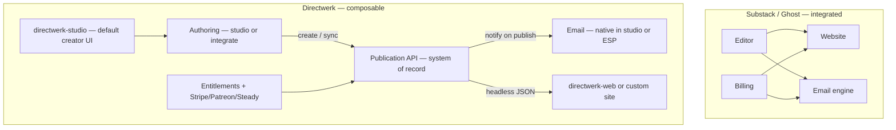
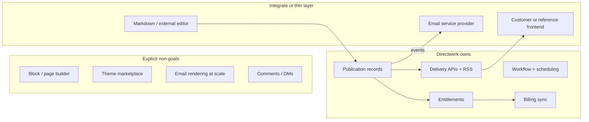
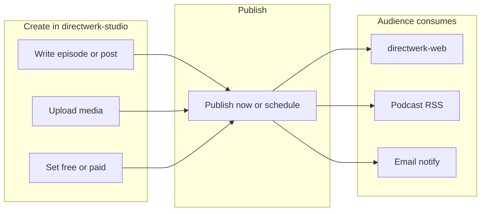
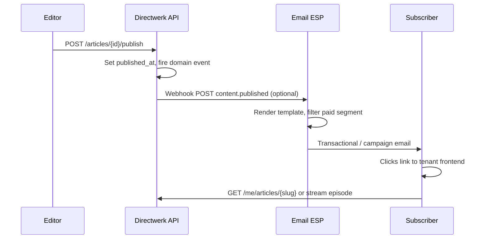
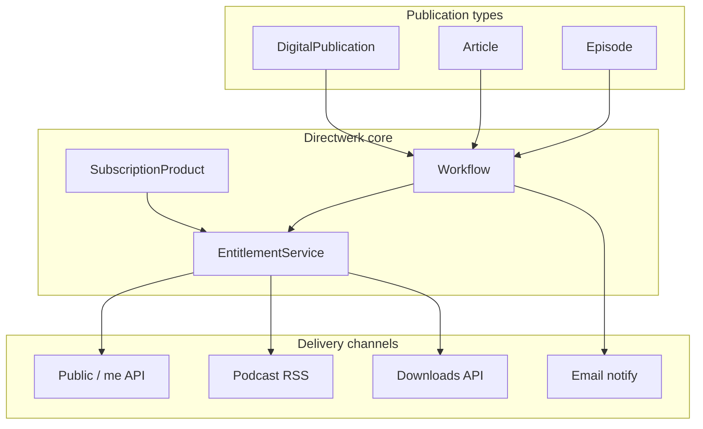

# Directwerk — Content Platform Strategy (Not a CMS)

Companion to [`README.md`](../README.md) (full product design). This document answers a strategic
question that comes up when positioning Directwerk as a **German Substack alternative**:

> *The whole app is about content management — but building a CMS ourselves sounds stupid.*

**Short answer:** Directwerk is a **headless publication and monetization platform**, not a CMS.
We manage **structured publications, access, and delivery** — not authoring UX, page layout, or
email infrastructure. That distinction keeps the product buildable without competing with Ghost,
WordPress, or Strapi on their home turf.

| Document | Purpose |
|----------|---------|
| [`README.md`](../README.md) | Full platform design — entities, APIs, phases |
| [`directwerk-studio.md`](directwerk-studio.md) | Creator dashboard — primary non-technical user experience |
| [`ghost-positioning.md`](ghost-positioning.md) | Competitive positioning vs Ghost |
| [`product-naming.md`](product-naming.md) | Public product name strategy and naming history |
| **This document** | What we own vs integrate for blog + newsletter + paid content |
| [`publication-desks-model.md`](publication-desks-model.md) | **Concrete split** — shared Publication rails + Writing vs Podcast desks |
| [`directwerk-studio-implementation.md`](directwerk-studio-implementation.md) | Studio implementation — screens, scaffold, auth |
| [`content-creation-implementation.md`](content-creation-implementation.md) | Engineering guide — libraries, API, studio build order |
| [`asset-storage.md`](asset-storage.md) | Media pipeline and entitlement-gated delivery |

**Status (2026-07):** Pre-implementation. This doc guides product scope for post-MVP `ARTICLE`
content and newsletter integrations — not a feature-parity checklist with Substack or Ghost.

---

## Primary audience

Our **primary buyer** is a **non-technical creator** — German podcasters and newsletter writers
who want one product to create content, manage members, and publish on their domain. They expect
Substack/Ghost-like simplicity: log in, create, publish — **not** APIs, Zapier, or external CMS
sync.

| Audience | Default experience | “Write where you like” applies? |
|----------|-------------------|--------------------------------|
| **Non-technical creators** (default) | [`directwerk-studio`](directwerk-studio.md) + [`directwerk-web`](../README.md#reference-frontend-directwerk-web) | **No** — they write in studio |
| **Agencies / developers** | REST API + custom or headless frontend | **Yes** — Tier B–D below |

**API-first is architecture, not the creator pitch.** Studio and customer frontends both call the
same `/api/v1/` contract. Creators never need to know that.

**Bundled default for new tenants:** `directwerk-studio` (create/publish) + `directwerk-web` (public site +
subscriber portal). Custom frontends replace `directwerk-web` for agencies — not the entitlement engine.

See [`directwerk-studio.md`](directwerk-studio.md) for the full creator journey.

---

## The “German Substack” framing

[Substack](https://substack.com/) and [Ghost](https://ghost.org/) bundle four jobs into one product:

| Job | What the user experiences |
|-----|---------------------------|
| **Authoring** | Write posts in an editor; format text; add images |
| **Publishing** | Public post pages, SEO, archives, tags |
| **Newsletter** | Email every subscriber when something new ships |
| **Monetization** | Free vs paid tiers; checkout; member-only content |

Directwerk can address the **same creator outcome** — *“I write, my audience reads or listens, some
pay”* — without rebuilding all four layers. Our wedge is **whitelabel + API + EU + Patreon/Steady
exit**, not a turnkey writing app.

**Positioning sentence (internal):** Directwerk is infrastructure for **paid digital publishing on
your domain** — podcast-first today, articles and newsletters as **delivery channels** on the same
entitlement engine tomorrow.

---

## Content management ≠ CMS

The word “CMS” hides two different problems. Conflating them is what makes “we need to build a CMS”
feel inevitable — and wrong.

| Layer | Question it answers | Directwerk stance |
|-------|---------------------|----------------|
| **Publication platform** | What content exists? Who can access it? When is it live? How is it delivered (web, RSS, email, download)? | **We build this** — core product |
| **CMS (authoring product)** | How does the writer compose layout, manage media inline, preview themes, install plugins? | **We do not build this** — integrate or ship a thin ops UI |

Directwerk already plans substantial “content management” that is **not** CMS work:

- Publication workflow (`DRAFT` → `SCHEDULED` → `PUBLISHED` → `ARCHIVED`)
- Tenant-scoped slugs, metadata, taxonomy (formats, categories)
- Media library with S3 upload/confirm ([`asset-storage.md`](asset-storage.md))
- Entitlement-gated APIs and RSS ([`README.md` § Entitlements](../README.md#entitlements))
- Multi-tenant isolation and module gating

None of that requires a block editor, theme system, or plugin marketplace.

---

## What Directwerk must own (system of record)

These capabilities are the **moat** — outsourcing them to a generic CMS breaks multi-tenancy,
entitlements, or migration story.

| Capability | Why we own it |
|------------|---------------|
| **Unified publication model** | Podcast episodes, articles, bonus files share workflow + access rules |
| **Entitlement engine** | LEVEL + PACKAGE products; union of Stripe/Patreon/Steady/MANUAL subs |
| **Per-asset access** | Private audio, PDFs, article bodies gated per request — not CMS role flags |
| **Multi-tenant isolation** | Row-level + S3 prefix + JWT `tenant_id`; one deployment, many creators |
| **Private RSS + feed builder** | Subscriber-specific feeds; format/category filters |
| **Billing source unification** | Patreon/Steady dual-run — no off-the-shelf CMS does this |
| **Headless public API** | `GET /api/v1/public/*` for customer frontends — contract is the product |

If a tenant’s **canonical list of “what is published and who may read it”** lives anywhere else,
Directwerk becomes a sync target — acceptable for some tenants, but not the default architecture.

---

## What we explicitly do not build

From [`README.md` § Non-Goals](../README.md#non-goals-mvp) and [`ghost-positioning.md`](ghost-positioning.md):

| Out of scope | Rationale |
|--------------|-----------|
| General-purpose **block editor** | Years of UX work; Ghost/Notion/Tiptap already exist |
| **Theme / template marketplace** | API-first; tenants or agencies own presentation |
| **Native newsletter product** (lists, templates, deliverability, analytics) | Substack’s core loop; we integrate ESPs |
| **Comments, DMs, polls** | Community products (Patreon, Discord) — different category |
| **WYSIWYG site builder** | WordPress/Webflow territory |
| **Full SEO / marketing automation suite** | Optional metadata fields only |

[`directwerk-studio`](directwerk-studio.md) is the **default creator app** — upload audio, write show notes
or Markdown posts, set access, publish, notify subscribers. It is **publisher ops**, not a block
editor competing with Ghost Admin. Screen-by-screen spec:
[`directwerk-studio-implementation.md`](directwerk-studio-implementation.md).

---

## Creator experience (non-technical default)

Non-technical creators do **not** consume or publish via API. Their loop:

> **Create in studio → hit Publish → content appears on site, in RSS/podcatchers, and in subscriber inboxes.**

| Channel | How audience gets content | Creator effort |
|---------|---------------------------|----------------|
| **Website** | `directwerk-web` renders from public/me APIs | Branding in Settings once |
| **Podcast apps** | RSS generated on publish | None after publish |
| **Newsletter** | “Notify subscribers” checkbox on publish (native ESP) | Connect ESP once in Settings |
| **Paid members** | Gated APIs + private RSS | Set access policy in editor |

Integrator paths (external Markdown → API, Strapi webhook, Ghost hybrid) are **Tier B–D** below —
not the default creator story.

---

## Blog + newsletter without a CMS: the model

### Articles as publications, not pages

Post-MVP `ARTICLE` type ([`README.md` § Publication Types](../README.md#publication-types)) is a
**structured record**, not a free-form page tree:

| Field | Purpose |
|-------|---------|
| `title`, `slug` | Identity and URL segment for headless frontends |
| `body` | Markdown or sanitized HTML — stored in PostgreSQL |
| `excerpt`, `seo_description` | Cards and meta tags |
| `hero_asset_id` | Optional cover from media library |
| `access_policy` | `FREE` or `PAID` — same as episodes |
| `status`, `published_at`, `scheduled_at` | Shared workflow with podcast |
| Taxonomy | Optional tags/categories (reuse or extend category model) |

**No** nested blocks, **no** reusable content components, **no** layout JSON. Frontends render
`body` however they want — Next.js MDX, plain HTML, AMP, etc.

Paid articles are served via:

- `GET /api/v1/public/articles/{slug}` — metadata + teaser only when gated
- `GET /api/v1/me/articles/{slug}` — full body when `EntitlementService.hasAccess` passes

Same pattern as private episode streams ([`asset-storage.md`](asset-storage.md)).

### Newsletter = notification channel, not a second CMS

Newsletter is **“tell subscribers something new exists”**, not a separate content silo.

**Directwerk stores:** publication record, entitlement rules, subscriber emails (via `User` +
`TenantMembership`).

**ESP stores:** templates, send history, bounce/complaint handling, deliverability reputation.

We do **not** rebuild Mailchimp. We expose hooks and optional first-party wiring to one ESP.

---

## Editorial workflow options

**Platform default:** Tier A in [`directwerk-studio`](directwerk-studio.md) — all non-technical creators.
Tiers B–D are **integrator and power-user** paths; document them for agencies, not in the primary
creator pitch.

| Tier | Authoring | Best for |
|------|-----------|----------|
| **A — Studio (default)** | Markdown textarea + preview in `directwerk-studio`; paste from Google Docs; show notes HTML for episodes | **Primary audience** — podcasters, newsletter writers |
| **B — External → API** | Write in Notion/Ulysses/iA Writer; export Markdown; `POST /api/v1/articles` via script or Zapier | Technical creators, automation |
| **C — Headless CMS sync** | Strapi, Directus, or Sanity as editorial UI; webhook pushes published docs into Directwerk | Agencies already on headless CMS |
| **D — Ghost as satellite** | Ghost for blog/newsletter UX; Directwerk for podcast + unified entitlements (hybrid) | Blog-primary creator who also podcasts — see [Hybrid patterns](#hybrid-patterns-ghost-strapi-notion) |

### Tier A — Studio editor (default — what we ship)

| Include | Exclude |
|---------|---------|
| Markdown editor with live preview | Drag-and-drop block layout |
| Title, slug, excerpt, hero image picker | Inline collaborative editing |
| Access policy + schedule/publish | Version history beyond draft/published |
| Server-side Markdown → HTML sanitize | Custom shortcodes / embed plugins |

Reuse publication workflow components from episodes
([`directwerk-studio-implementation.md` § Articles](directwerk-studio-implementation.md#8-content--articles)).

### Tier B–D — Integrator paths (appendix)

The tiers below are **not** the default non-technical creator experience. See
[`directwerk-studio.md`](directwerk-studio.md) for the primary journey.

#### Tier B — API / import

| Mechanism | Notes |
|-----------|-------|
| `POST /api/v1/articles` | Same auth as episode CRUD (`EDITOR+`) |
| Bulk import (post-MVP) | Markdown files + frontmatter → batch create |
| RSS import (post-MVP) | Migrate from Substack/Ghost export — one-time onboarding tool |

Import tools are **migration/onboarding**, not ongoing CMS replacement.

#### Tier C — Headless CMS as authoring front-end

Some tenants already run Strapi (we have [`projects/strapi/`](../../strapi/) in the monorepo for other
products). Pattern:

1. Author creates content in Strapi admin (rich editor, media library they know).
2. Strapi lifecycle webhook → Directwerk `POST /articles` (or internal sync worker).
3. **Directwerk remains system of record for entitlements and subscriber APIs.**
4. Strapi holds draft editorial state only if needed — or Directwerk draft is updated idempotently by
   `external_id`.

**Do not** embed Strapi inside Directwerk monolith. Optional **integration module** (`CMS_SYNC`?) if
demand proves out — post-MVP, tenant-enabled.

#### Tier D — Hybrid with Ghost

See [`ghost-positioning.md` § Hybrid](ghost-positioning.md#hybrid-possible-not-a-strategy). Viable
when blog/newsletter is primary and podcast membership is secondary — two systems, explicit
boundaries:

| System of record | Domain |
|------------------|--------|
| Ghost | Blog posts, newsletter sends, Ghost memberships (optional) |
| Directwerk | Podcast episodes, audio entitlements, private RSS, Patreon/Steady migration |

Unifying memberships across both is hard — **not a default product path**. Document for edge cases
only.

---

## Email / newsletter integration strategy

### Recommended: ESP integration module (`EMAIL_NOTIFY`)

Post-MVP module ([`README.md` § Optional addons](../README.md#optional-addons-enable-per-tenant-later-phases)).
Capabilities:

| Feature | Implementation |
|---------|----------------|
| New episode/article alert | Domain event on `publish` → webhook or direct ESP API |
| Audience segmentation | `FREE` vs `PAID` vs product-specific — query `Subscription` + `EntitlementService` |
| Template variables | `{title}`, `{excerpt}`, `{url}`, `{tenant_name}` — ESP renders HTML |
| Subscriber opt-in | `User` preference flags per tenant (`email_notifications_enabled`) |
| Unsubscribe | Link to tenant frontend or ESP-managed — **never** bypass ESP compliance headers |

### ESP candidates (EU-friendly)

| Provider | Fit | Notes |
|----------|-----|-------|
| **[Mailgun](https://www.mailgun.com/)** | High | Already used in monorepo (`pnn-it`, contact forms); EU region |
| **[Buttondown](https://buttondown.email/)** | High | Newsletter-focused; Markdown-native; API |
| **[Resend](https://resend.com/)** | Medium | Developer-friendly transactional + broadcasts |
| **[Brevo](https://www.brevo.com/)** (ex-Sendinblue) | Medium | EU company; marketing + transactional |
| **Self-hosted Listmonk** | Low default | Ops burden; offer only for enterprise tenants |

**Phase 1 (integrators):** outbound `content.published` webhook — tenant connects Zapier/Make to
their ESP. **Not** the non-technical creator path.

**Phase 2 (creators):** native Mailgun or Buttondown adapter — connect once in studio **Settings →
Integrations**; **“Notify subscribers”** checkbox on publish. Tenant API keys encrypted at rest.

We do **not** store rendered email bodies long-term — only publication content in PostgreSQL.

### Paid newsletter content in email

Substack puts full paid posts in email. Options:

| Approach | Pros | Cons |
|----------|------|------|
| **Teaser + link** (recommended default) | Simple; entitlements enforced on web/API; no email leakage | Extra click for readers |
| **ESP segment with merge tag body** | Richer email for paid tier | Must trust ESP segment isolation; content duplicated |
| **Signed magic link** | One-click authenticated read | More engineering; link forwarding risk |

Default: **teaser in email, full content on gated web/API** — aligns with per-request entitlement
checks.

---

## Unified creator loop (podcast + blog + paid)

One entitlement engine powers all publication types:

| Creator action | Non-technical creator (studio) | Under the hood |
|----------------|-------------------------------|----------------|
| Write content | Episode editor or Article Markdown field | `description` / `Article.body` in PostgreSQL |
| Attach media | Media library picker | S3 via `MediaAsset` |
| Set free vs paid | Access policy dropdown | `access_policy` + LEVEL sort order |
| Publish | **Publish** button | `POST .../publish` |
| Notify audience | **Notify subscribers** checkbox | `EMAIL_NOTIFY` → ESP |
| Subscriber consumes | Visits site, podcatcher, or email link | `directwerk-web`, RSS, `/me/*` APIs |

---

## German market considerations

“German Substack” implies constraints Substack handles poorly for EU creators:

| Topic | Directwerk approach |
|-------|------------------|
| **GDPR / DPA** | EU hosting (Hetzner); tenant data export; ESP with EU processing |
| **Steady** | First-class sync module — German Patreon alternative ([`README.md`](../README.md)) |
| **Impressum / legal pages** | Tenant frontend responsibility — `site-config` may expose footer links JSON |
| **VAT / invoicing** | Stripe Tax or tenant accountant — not in MVP |
| **Language** | API locale-agnostic; `directwerk-studio` i18n DE first when UI ships |
| **Newsletter compliance** | Double opt-in via registration flow; ESP handles List-Unsubscribe |

Compete on **data sovereignty and billing flexibility**, not on Substack’s discovery network.

---

## Decision record

| # | Decision | Choice | Rationale |
|---|----------|--------|-----------|
| 1 | Primary audience | **Non-technical creators** | Studio + web bundled; API paths for agencies |
| 2 | Are we building a CMS? | **No** | Publication + entitlement platform; studio is thin ops UI |
| 3 | Article body format | **Markdown stored, HTML sanitized for API** | Simple; frontend flexibility |
| 4 | Newsletter for creators | **Native ESP in studio** (Phase 2) | One-click notify; webhooks for integrators only |
| 5 | Default authoring UX | **Tier A in directwerk-studio** | Enough for podcasters; avoids block editor scope |
| 6 | System of record | **Directwerk PostgreSQL** | Entitlements and billing must not depend on external CMS |
| 7 | Optional external CMS | **Webhook sync post-MVP** | Agency tier; not required for MVP |
| 8 | Paid content in email | **Teaser + gated link default** | Security aligns with `AssetAccessService` model |
| 9 | Substack parity as goal? | **No** | Wedge is whitelabel + EU + Patreon/Steady exit + podcast |
| 10 | Default tenant UI | **`directwerk-studio` + `directwerk-web`** | Creators need dashboard + public site without an agency |

Add row to [`README.md` § Open Decisions](../README.md#open-decisions) when implementing email module.

---

## Implementation phasing

Aligns with [`README.md` § MVP implementation phases](../README.md#mvp-implementation-phases),
[`directwerk-studio.md` § Phased delivery](directwerk-studio.md#phased-delivery), and
[`directwerk-studio-implementation.md` § Phased delivery](directwerk-studio-implementation.md#phased-delivery).

**Studio-first rule:** Ship creator UI (`directwerk-studio` v2) and default site (`directwerk-web`) before
integrator-only features (outbound webhooks, `CMS_SYNC`).

| Phase | Deliverable | Creator-facing |
|-------|-------------|----------------|
| **MVP** | Podcast in studio v2 | Show notes HTML on episodes — not standalone articles |
| **MVP** | `directwerk-web` default tenant site | Public episodes + subscriber portal |
| **Post-MVP v4** | `Article` entity + studio editor | Markdown in studio — no block editor |
| **Post-MVP** | `EMAIL_NOTIFY` native in studio | “Notify subscribers” on publish — not Zapier |
| **Post-MVP** | `content.published` webhook | Tier B integrators only |
| **Later** | `CMS_SYNC` optional module | Strapi/Directus — agency tier |

**Rule:** Podcast + entitlements + RSS + studio before standalone articles. Native email in studio
before outbound-only webhooks for creators.

---

## FAQ

### “Our target audience is non-technical — how do they create and publish?”

In **[`directwerk-studio`](directwerk-studio.md)**. They log in on their domain, use the media library and
content editors, click **Publish**, and optionally **Notify subscribers**. No API, Zapier, or export
workflow. `directwerk-web` serves their public site and subscriber portal; RSS and email fire
automatically on publish.

### “But subscribers expect a Substack-like reading experience”

That experience is **frontend + email**, not CMS. `directwerk-web` (or a tenant’s Next.js site) renders
articles from `/api/v1/public/articles` and `/api/v1/me/articles`. Directwerk supplies JSON; UX is
customizable — the whitelabel promise.

### “Authors need a nice writing UI”

Offer Tier A (good enough Markdown), Tier C (Strapi), or Tier D (Ghost for blog-only tenants).
Competing with Notion/Substack editor is a distraction unless publishing becomes editor-first
(product pivot).

### “Where does SEO live?”

Slug, title, excerpt, `seo_description`, Open Graph image via `hero_asset_id` on the API payload.
Sitemap and meta tags are **frontend** concerns — same as any headless setup.

### “Is show notes on episodes a blog?”

For MVP, **yes, partially**. Episode `description` (sanitized HTML) covers companion text without
a separate `Article` entity. Promote to standalone `Article` when creators need archives, tags, or
paid written-only content.

### “Does this mean we’re not a Substack alternative?”

We are an alternative for creators who want **ownership** — domain, API, EU stack, Patreon/Steady
exit — and are willing to trade Substack’s bundled editor/discovery for control. Message accordingly
(see [Messaging](#messaging)).

---

## Messaging

| Audience | Lead with | Avoid |
|----------|-----------|-------|
| **German podcaster + newsletter** (default) | “Create podcast, posts, and members in one dashboard — on your domain” | “Headless API”; “write where you like” |
| **Developer / agency** | “Headless publications + entitlements; same API studio uses” | “Replace WordPress” |
| **Steady/Patreon migrator** | “One membership backend for audio and written posts” | “We built a CMS” |
| **Blog-first creator** | Consider Ghost hybrid (Tier D) | Pretending studio matches Ghost Admin |

**Elevator pitch (creators):** Create everything in one dashboard — podcast, posts, members — on your
own domain. We handle paywalls, private feeds, and subscriber emails.

**Elevator pitch (integrators):** Directwerk is the membership and delivery layer — structured
publications, entitlements, headless JSON. Bring your editor and frontend.

---

## Related reading

- Creator dashboard (primary UX): [`directwerk-studio.md`](directwerk-studio.md)
- Studio screen-by-screen spec: [`directwerk-studio-implementation.md`](directwerk-studio-implementation.md)
- Ghost comparison: [`ghost-positioning.md`](ghost-positioning.md)
- Entitlements and storage: [`asset-storage.md`](asset-storage.md)
- Publication types and workflow: [`README.md` § Content Model](../README.md#content-model)
- Strapi in monorepo (reference only): [`projects/strapi/cffc-v5/`](../../strapi/cffc-v5/)

---

*Last updated: 2026-07-16*
