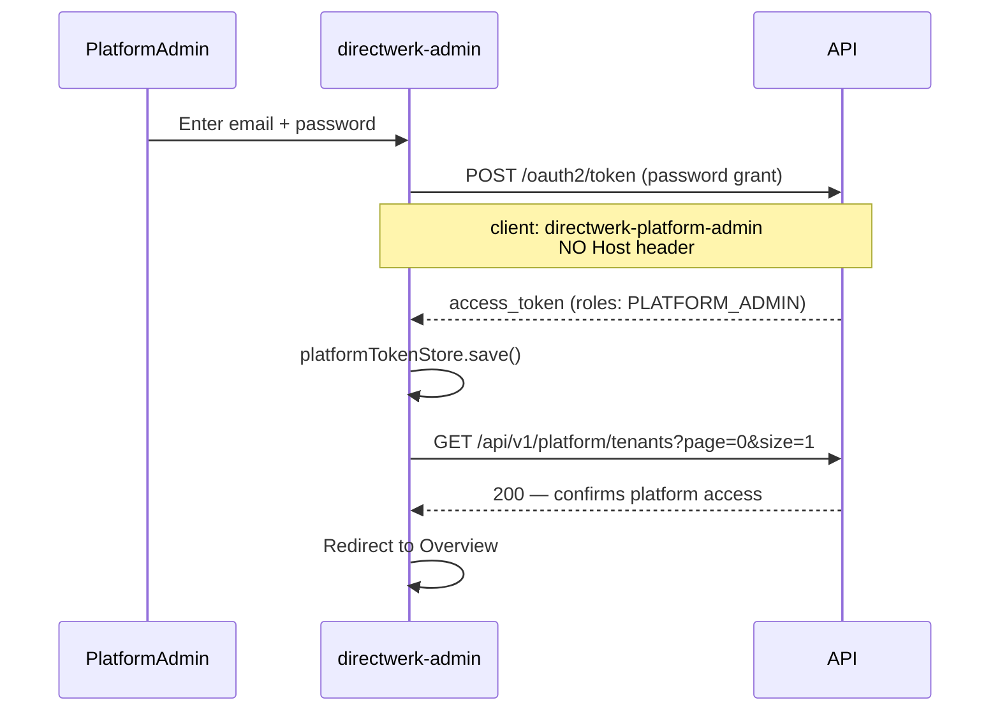

# Directwerk — `directwerk-admin` Implementation Guide

Companion to [`README.md`](../README.md) § Platform Superadmin Dashboard and
[`poc-alpha-setup.md`](poc-alpha-setup.md). This document is the **step-by-step engineering guide**
for building the platform operations console at `projects/directwerk/directwerk-admin/`.

| Document | Purpose |
|----------|---------|
| [`README.md`](../README.md) § Platform Superadmin Dashboard | Product-level spec |
| [`user-backend-implementation.md`](user-backend-implementation.md) | Spring Security backend this app consumes |
| [`directwerk-studio-implementation.md`](directwerk-studio-implementation.md) | Tenant dashboard (contrast — different auth boundary) |
| **This document** | **How to scaffold and implement** `directwerk-admin` |
| [`http/`](../http/) | Executable API acceptance criteria |

**Status (2026-08):** Implemented at `projects/directwerk/directwerk-admin/`, promoted from the
former `example-admin` application. The application code and
[`ui-system.md`](ui-system.md) are authoritative where this original scaffold guide differs.
**Prerequisite:** Phase A backend complete — platform API routes and `01-platform-auth.http` green.

---

## 1. Goals and constraints

### What we are building

A **Next.js 16 platform operations console** for internal `PLATFORM_ADMIN` users to:

- Create and manage tenants (suspend/reactivate)
- Activate/deactivate feature modules and apply presets
- Invite tenant admins and platform admins
- View platform audit log

### Hard constraints

| Rule | Rationale |
|------|-----------|
| **Fixed platform domain** | `admin.{platform}.de` — no tenant `Host` header |
| **Platform API only** | `/api/v1/platform/**` — never tenant-scoped routes |
| **OAuth2 client `directwerk-platform-admin`** | Separate from tenant frontend client |
| **Invite-only accounts** | No public registration for `PLATFORM_ADMIN` |
| **No per-tenant theming** | Consistent ops UI — not whitelabel |
| **Shared UI system** | Tailwind CSS v4 and `@directwerk/ui`, consistent with studio and web |

### What directwerk-admin is not

| Misconception | Reality |
|---------------|---------|
| Tenant creator dashboard | That is `directwerk-studio` (`TENANT_ADMIN` / `EDITOR`) |
| Subscriber management | Tenant admins manage subscribers in studio v3 |
| Public-facing | Internal platform team only |

---

## 2. Architecture overview

```mermaid
flowchart LR
    subgraph browser [Platform admin browser]
        Login[Login page]
        Dashboard[Dashboard shell]
    end

    subgraph admin [directwerk-admin Next.js]
        Auth[platformTokenStore]
        Api[platformApi client]
        Guard[PlatformAuthGuard]
    end

    subgraph backend [Spring Boot API]
        OAuth[/oauth2/token]
        Platform[/api/v1/platform/*]
    end

  subgraph db [(PostgreSQL)]

    Login --> OAuth
    Dashboard --> Api
    Api --> Platform
    Platform --> db
```

### Auth boundary vs `directwerk-studio`

| Concern | `directwerk-admin` | `directwerk-studio` |
|---------|-----------------|------------------|
| Domain | `admin.{platform}.de` | `studio.{tenant}.de` |
| OAuth client | `directwerk-platform-admin` | `directwerk-tenant-frontend` |
| JWT `tenant_id` | Absent / null | Required |
| `Host` header | **Not sent** | Required on every request |
| API base | `/api/v1/platform/` | `/api/v1/tenant/`, `/episodes`, etc. |
| Roles | `PLATFORM_ADMIN` only | `TENANT_ADMIN`, `EDITOR` |

Platform admin tokens **must not** access tenant routes like `GET /api/v1/me` — verified in
[`01-platform-auth.http`](../http/01-platform-auth.http).

---

## 3. Project scaffold

### 3.1 Create project (Phase 5)

```sh
cd projects
mkdir -p directwerk-admin
cd directwerk-admin
pnpm init
```

### 3.2 `package.json` dependencies

| Package | Purpose |
|---------|---------|
| `next@16`, `react@19`, `typescript` | Framework |
| `react-hook-form`, `zod` | Forms + validation |
| `date-fns` | Audit log timestamps |

Keep dependencies minimal — admin UI is data tables and forms, not rich editors.

### 3.3 Directory structure

```
projects/directwerk/directwerk-admin/
  package.json
  tsconfig.json
  next.config.ts
  app/
    layout.tsx
    globals.css
    (auth)/
      login/page.tsx
    (dashboard)/
      layout.tsx                    # PlatformShell + auth guard
      page.tsx                      # Overview
      tenants/
        page.tsx                    # Tenant list
        new/page.tsx                # Create tenant
        [id]/
          page.tsx                  # Tenant detail
          modules/page.tsx          # Module toggles
          users/page.tsx            # Tenant admin management
      admins/
        page.tsx                    # Platform admin users
      audit/
        page.tsx                    # Audit log viewer
  components/
    platform/
      PlatformShell.tsx
      SideNav.tsx
      DataTable.tsx                 # Paginated table with sort/filter
      ConfirmModal.tsx
      StatusBadge.tsx
    tenants/
      TenantForm.tsx
      TenantListFilters.tsx
      ModuleGrid.tsx
      ModulePresetButtons.tsx
      DependencyHint.tsx
    users/
      InviteUserModal.tsx
      UserRoleSelect.tsx
    audit/
      AuditLogTable.tsx
      AuditEventDetail.tsx
  lib/
    api/
      platformApi.ts
      usePlatformApi.ts
      types.ts
      tenants.ts
      modules.ts
      admins.ts
      audit.ts
    auth/
      platformTokenStore.ts
      platformRefresh.ts
      platformLogin.ts
    validation/
      schemas.ts
  middleware.ts                     # Optional route protection
  AGENTS.md
```

### 3.4 Environment variables

| Variable | Required | Purpose |
|----------|----------|---------|
| `NEXT_PUBLIC_PLATFORM_API_URL` | Yes | e.g. `https://api.publish.de` |

No tenant-specific env vars. Single fixed deployment.

`.env.local.example`:

```env
NEXT_PUBLIC_PLATFORM_API_URL=http://localhost:8080
NEXT_PUBLIC_OAUTH_CLIENT_ID=directwerk-platform-admin
# Server-side only:
# OAUTH_CLIENT_SECRET=directwerk-platform-admin-secret
```

---

## 4. Authentication

### 4.1 Login flow



Dev credentials: [`http/http-client.env.json`](../http/http-client.env.json).

### 4.2 `lib/auth/platformTokenStore.ts`

Same pattern as studio `tokenStore` but separate storage keys to avoid collision if both apps
run on localhost during development:

```typescript
const ACCESS_KEY = 'publish_admin_access'
const REFRESH_KEY = 'publish_admin_refresh'
```

### 4.3 `lib/auth/platformLogin.ts`

```typescript
export async function platformLogin(email: string, password: string) {
    const res = await fetch(`${getPlatformApiUrl()}/oauth2/token`, {
        method: 'POST',
        headers: {
            'Content-Type': 'application/x-www-form-urlencoded',
            Authorization: basicAuth(
                process.env.NEXT_PUBLIC_OAUTH_CLIENT_ID!,
                getOAuthClientSecret()
            ),
            // NO Host header — platform-scoped login
        },
        body: new URLSearchParams({
            grant_type: 'password',
            username: email,
            password,
            client_id: process.env.NEXT_PUBLIC_OAUTH_CLIENT_ID!,
        }),
    })
    if (!res.ok) throw new AuthError('INVALID_CREDENTIALS')
    const body = await res.json()
    platformTokenStore.save({
        accessToken: body.access_token,
        refreshToken: body.refresh_token,
    })
}
```

### 4.4 `PlatformAuthGuard`

Wrap `(dashboard)/layout.tsx`:

- Verify valid access token on mount
- Decode JWT and confirm `roles` includes `PLATFORM_ADMIN`
- Redirect to `/login` on failure
- Optional: `middleware.ts` for server-side route protection

### 4.5 Session policy

| Token | TTL (recommended) |
|-------|-------------------|
| Access token | 15 minutes |
| Refresh token | 7 days |

Refresh before expiry using same pattern as studio. Post-MVP: HttpOnly refresh cookie
instead of `sessionStorage` for hardened production deployment.

---

## 5. API client layer

### 5.1 `lib/api/platformApi.ts`

```typescript
export async function platformApi<T>(
    path: string,
    init: RequestInit = {},
): Promise<ApiResponse<T>> {
    const token = await getValidPlatformAccessToken()
    const res = await fetch(`${getPlatformApiUrl()}/api/v1/platform${path}`, {
        ...init,
        headers: {
            'Content-Type': 'application/json',
            Authorization: `Bearer ${token}`,
            // NO Host header
            ...init.headers,
        },
    })
    const json = await res.json()
    if (!res.ok) {
        throw new PlatformApiError(json.errors?.[0]?.code ?? 'UNKNOWN', json)
    }
    return json
}
```

All platform routes are under `/api/v1/platform/` — the client prepends this prefix.

### 5.2 Response envelope

Every response uses the standard wrapper:

```json
{
  "statusCode": 200,
  "statusMessage": "OK",
  "data": {},
  "errors": [],
  "metadata": { "page": 0, "size": 20, "totalElements": 42 }
}
```

Paginated list endpoints return pagination in `metadata`.

### 5.3 Error codes (admin-specific)

| Code | HTTP | UI behaviour |
|------|------|--------------|
| `MODULE_DEPENDENCY_MISSING` | 400/409 | Show dependency hint; block activation |
| `TENANT_SUSPENDED` | 403 | Badge on tenant detail |
| `VALIDATION_ERROR` | 400 | Inline form errors |
| `CANNOT_DEMOTE_LAST_ADMIN` | 409 | Toast with explanation |

---

## 6. Dashboard pages

### 6.1 Overview (`/`)

**Role:** `PLATFORM_ADMIN`

| Widget | API | MVP |
|--------|-----|-----|
| Tenant counts (active/suspended) | `GET /tenants?aggregate=status` or client-side count | Yes |
| Module adoption stats | `GET /modules` + tenant iteration | Post-MVP |
| Recent audit events | `GET /audit?size=10&sort=timestamp,desc` | Yes |
| Integration health alerts | TBD webhook health endpoint | Post-MVP |

Alpha MVP: tenant count cards + recent audit table.

### 6.2 Tenant list (`/tenants`)

| Feature | Implementation |
|---------|----------------|
| Table columns | Name, slug, status, primary domain, created date |
| Search | `?q=` query param (server-side) |
| Filters | Status (`ACTIVE`, `SUSPENDED`), module filter |
| Pagination | `?page=&size=` — use `metadata.totalElements` |
| Row actions | View detail, suspend/reactivate |

API: `GET /api/v1/platform/tenants`

### 6.3 Create tenant (`/tenants/new`)

Form fields:

| Field | Required | Notes |
|-------|----------|-------|
| Name | Yes | Display name |
| Slug | Yes | URL-safe; validated server-side |
| Primary domain | Yes | Initial `tenant_domains` row |
| Module preset | No | `FREE_PODCAST`, `PATREON_MIGRATOR`, `PRO`, `ENTERPRISE` |
| Invite tenant admin | No | Email + name → optional invite on create |

API: `POST /api/v1/platform/tenants`

```json
{
  "name": "My Podcast Show",
  "slug": "my-show",
  "primaryDomain": "podcasts.my-show.de",
  "modulePreset": "FREE_PODCAST",
  "inviteTenantAdmin": {
    "email": "creator@example.com",
    "name": "Jane Creator"
  }
}
```

On success → redirect to `/tenants/{id}`.

### 6.4 Tenant detail (`/tenants/[id]`)

Tabbed or sectioned layout:

| Section | Content | API |
|---------|---------|-----|
| Overview | Status, slug, domains, created date, stats | `GET /tenants/{id}` |
| Modules | Link to `/tenants/[id]/modules` | — |
| Users | Link to `/tenants/[id]/users` | — |
| Actions | Suspend / Reactivate buttons | `POST .../suspend`, `.../reactivate` |

**Suspend flow:** `<ConfirmModal>` → `POST /tenants/{id}/suspend` → update status badge.

### 6.5 Module management (`/tenants/[id]/modules`)

Primary screen for capability assignment.

| UI element | API | Behaviour |
|------------|-----|-----------|
| Module catalog | `GET /modules` | Full list with `depends_on` graph |
| Tenant activations | `GET /tenants/{id}/modules` | Current state |
| Toggle on | `POST /tenants/{id}/modules/{key}/activate` | Validate deps first |
| Toggle off | `DELETE /tenants/{id}/modules/{key}` | Show cascade warning |
| Preset buttons | `POST /tenants/{id}/modules/preset/{presetKey}` | Batch activate |

**`<ModuleGrid>` component:**

```typescript
interface ModuleGridProps {
    catalog: ModuleDescriptor[]       // from GET /modules
    active: string[]                  // from GET /tenants/{id}/modules
    onToggle: (key: string, enable: boolean) => Promise<void>
}
```

- Grey out modules whose dependencies are missing
- Show `<DependencyHint>` — e.g. "Requires SUBSCRIPTION"
- On deactivate: confirm dialog listing cascaded modules (from API error or client-side graph)

**Presets:**

| Preset | Modules |
|--------|---------|
| `FREE_PODCAST` | `DIGITAL_CONTENT`, `PODCAST`, `PODCAST_RSS`, `WHITELABEL` |
| `PATREON_MIGRATOR` | FREE_PODCAST + `SUBSCRIPTION`, `PATREON_SYNC` |
| `PRO` | FREE_PODCAST + `SUBSCRIPTION`, `FEED_BUILDER`, `STRIPE_BILLING` |
| `ENTERPRISE` | PRO + `PATREON_SYNC`, `STEADY_SYNC`, `ANALYTICS` |

### 6.6 Tenant users (`/tenants/[id]/users`)

Manage publisher-side accounts — **not** subscribers.

| Action | API |
|--------|-----|
| List | `GET /tenants/{id}/users` |
| Invite | `POST /tenants/{id}/users/invite` — `{ email, role: TENANT_ADMIN \| EDITOR }` |
| Update role | `PATCH /tenants/{id}/users/{userId}` |
| Remove | `DELETE /tenants/{id}/users/{userId}` |

Table: email, name, roles, status, last login.

### 6.7 Platform admins (`/admins`)

| Action | API |
|--------|-----|
| List | `GET /admins` |
| Invite | `POST /admins/invite` — `{ email, name }` |
| Revoke | `DELETE /admins/{userId}` |

Invite-only — never expose registration. Post-MVP: MFA requirement badge.

### 6.8 Audit log (`/audit`)

| Column | Source |
|--------|--------|
| Timestamp | `timestamp` |
| Actor | `actorEmail` or `actorUserId` |
| Action | `MODULE_ACTIVATED`, `TENANT_CREATED`, `USER_INVITED`, etc. |
| Tenant | `tenantId` + name (nullable for platform actions) |
| Details | JSON expandable row |

API: `GET /audit?page=&size=&tenantId=&action=&actor=`

Filters in toolbar; paginated table. Retain 12 months minimum (backend concern).

---

## 7. Shared UI components

### 7.1 `DataTable`

Reusable paginated table:

```typescript
interface DataTableProps<T> {
    columns: ColumnDef<T>[]
    data: T[]
    totalElements: number
    page: number
    pageSize: number
    onPageChange: (page: number) => void
    loading?: boolean
}
```

### 7.2 `ConfirmModal`

Used for destructive actions:

- Suspend tenant
- Deactivate module (with cascade list)
- Revoke platform admin
- Delete tenant user

### 7.3 `StatusBadge`

| Status | Color |
|--------|-------|
| `ACTIVE` | Green |
| `SUSPENDED` | Red |
| `INVITED` | Amber |
| `DISABLED` | Grey |

---

## 8. Security checklist

| Rule | Implementation |
|------|----------------|
| No `Host` header | `platformApi` never sets `Host` |
| Platform routes only | Client hardcoded to `/api/v1/platform/` prefix |
| Role check | JWT must contain `PLATFORM_ADMIN` |
| CORS | Backend allow-lists `admin.{platform}.de` only |
| No tenant data leakage | List endpoints paginated; no cross-tenant shortcuts in UI |
| Audit visibility | All mutating actions logged server-side |
| Secrets | OAuth client secret server-side only |
| Logout | Clear token store; redirect to `/login` |
| Post-MVP MFA | Enforce on backend; UI shows setup prompt |

---

## 9. Testing

### Unit / component tests

| Component | Tests |
|-----------|-------|
| `ModuleGrid` | Disables modules with missing deps |
| `ConfirmModal` | Calls onConfirm; cancels correctly |
| `TenantForm` | Validates slug format |

### Manual E2E (against local backend)

Using seed from [`http/http-client.env.json`](../http/http-client.env.json):

1. Login as `platform-admin@directwerk.local`
2. List tenants — see `alpha-show-a`, `alpha-show-b`
3. Create tenant with `FREE_PODCAST` preset
4. Activate `PODCAST` on tenant B — verify probe would pass
5. Try activate `FEED_BUILDER` without deps — see `MODULE_DEPENDENCY_MISSING` error
6. Invite tenant admin — verify membership in DB
7. Suspend tenant — verify status badge
8. View audit log — see `TENANT_CREATED`, `MODULE_ACTIVATED` events

### HTTP harness cross-check

Run platform files before UI work:

```
01-platform-auth → 02-platform-tenants → 03-platform-modules → 04-platform-users
```

---

## 10. Deployment

| Concern | Value |
|---------|-------|
| Project | `projects/directwerk/directwerk-admin/` |
| Stack | Next.js 16, React 19, TypeScript, CSS Modules |
| Host | `admin.{platform-domain}.de` |
| API target | `https://api.{platform-domain}.de` |
| Coolify | Separate app from API and `directwerk-web` / `directwerk-studio` |
| Theming | Fixed platform UI — no `site-config` bootstrap |

### Routing (production)

| Host | Target |
|------|--------|
| `admin.{platform}.de` | `directwerk-admin` container |
| `api.{platform}.de` | Spring Boot API |
| `api.{platform}.de/api/v1/platform/*` | Platform routes |

---

## 11. Implementation sequence

Execute after Phase A backend is green:

| Step | Task | Verify |
|------|------|--------|
| 1 | Scaffold Next.js project + `AGENTS.md` | `pnpm dev` runs |
| 2 | Login page + `platformLogin` | Manual login with seed admin |
| 3 | `platformApi` client + token refresh | API call succeeds |
| 4 | `PlatformShell` + side nav | Layout renders |
| 5 | Tenant list page | `GET /tenants` populates table |
| 6 | Create tenant form | `POST /tenants` + redirect |
| 7 | Tenant detail + suspend/reactivate | Status updates |
| 8 | Module grid + presets | `03-platform-modules.http` scenarios work in UI |
| 9 | Tenant users invite/manage | `04-platform-users.http` |
| 10 | Platform admins page | Invite + revoke |
| 11 | Audit log viewer | `GET /audit` paginated |
| 12 | Overview dashboard widgets | Counts + recent audit |

**MVP scope:** Steps 1–10. Full audit views and health widgets are post-MVP.

---

## 12. Implementation checklist

### Scaffold + auth

- [x] Next.js 16 project under `projects/directwerk/directwerk-admin/`
- [ ] `AGENTS.md` with build commands
- [ ] Login page
- [ ] `platformTokenStore` + refresh logic
- [ ] `PlatformAuthGuard`
- [ ] `platformApi` client

### Tenant management

- [ ] Tenant list with search, filter, pagination
- [ ] Create tenant form with preset selector
- [ ] Tenant detail page
- [ ] Suspend / reactivate actions

### Module management

- [ ] Module catalog fetch
- [ ] `ModuleGrid` with dependency hints
- [ ] Activate / deactivate with cascade confirmation
- [ ] Preset buttons

### User management

- [ ] Tenant users list + invite modal
- [ ] Role patch + remove
- [ ] Platform admins list + invite + revoke

### Audit + overview

- [ ] Audit log table with filters
- [ ] Overview tenant count widgets
- [ ] Recent audit events widget

### Production readiness

- [ ] `NEXT_PUBLIC_PLATFORM_API_URL` documented
- [ ] Coolify deploy config
- [ ] CORS verified with backend team
- [ ] No secrets in client bundle

---

## 13. Related reading

- Product spec: [`README.md` § Platform Superadmin Dashboard](../README.md#platform-superadmin-dashboard)
- Backend auth: [`user-backend-implementation.md`](user-backend-implementation.md)
- Tenant dashboard contrast: [`directwerk-studio-implementation.md`](directwerk-studio-implementation.md)
- Alpha backend: [`poc-alpha-setup.md`](poc-alpha-setup.md)
- HTTP tests: [`http/01-platform-auth.http`](../http/01-platform-auth.http),
  [`http/02-platform-tenants.http`](../http/02-platform-tenants.http),
  [`http/03-platform-modules.http`](../http/03-platform-modules.http),
  [`http/04-platform-users.http`](../http/04-platform-users.http)

---

*Last updated: 2026-07-17*
