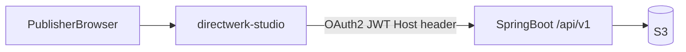
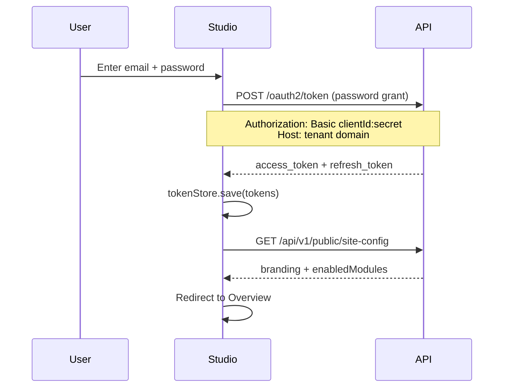
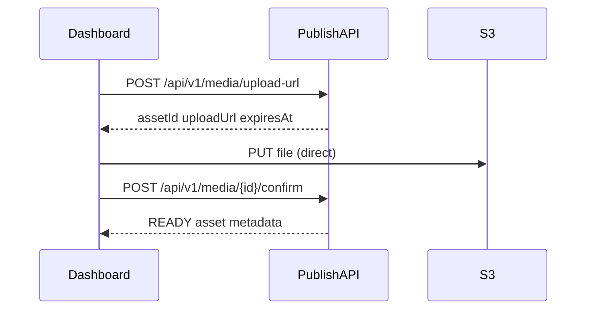

# Directwerk — `directwerk-studio` Implementation Guide

Companion to [`directwerk-studio.md`](directwerk-studio.md) (product overview) and
[`README.md`](platform-design.md) (full platform design). This document is the **single implementation
spec** for the creator dashboard at `directwerk-studio/` — product context, screen-by-screen
UI spec, API mappings, scaffold, auth, and phased checklist.

| Document | Purpose |
|----------|---------|
| [`directwerk-studio.md`](directwerk-studio.md) | What studio is — audience, journeys, three-app model |
| **This document** | **How to build** `directwerk-studio` — screens, API mappings, scaffold, checklist |
| [`content-creation-implementation.md`](content-creation-implementation.md) | Content backend services, libraries, workflow engine |
| [`publication-desks-model.md`](publication-desks-model.md) | Write desk vs Podcast desk — shared rails, typed editors |
| [`user-backend-implementation.md`](user-backend-implementation.md) | Spring Security backend this app consumes |
| [`poc-alpha-setup.md`](poc-alpha-setup.md) § Phase B | When to start studio relative to backend |
| [`asset-storage.md`](asset-storage.md) | Upload, confirm, S3 layout, asset retrieval |

**Status (2026-08):** Usable MVP at `directwerk-studio/` on `@directwerk/ui`. Write and
Podcast desks, media library, products/subscribers/grants, and `directwerk-web` subscriber feeds/account
are shipped. Backend articles API and site-config desk metadata remain the contract.
**Prerequisite:** Phase A backend complete — all [`Directwerk/http/`](../Directwerk/http/) files green.

**The dashboard is a consumer of the REST API** — same contract customer-built frontends use. No
private BFF shortcuts, no direct database access.

---

## What this is (and is not)

| App / area | Audience | Scope |
|------------|----------|-------|
| **`directwerk-studio`** (this doc) | `TENANT_ADMIN`, `EDITOR` | One tenant — content, assets, team, subscribers, products |
| `directwerk-admin` | `PLATFORM_ADMIN` | All tenants — create/suspend, module toggles, invite tenant admins |
| `directwerk-web` subscriber portal | `SUBSCRIBER` | Own account — feeds, access, checkout (not publisher ops) |
| `directwerk-web` public site | `GUEST` | Marketing, free episodes, pricing |



**Location:** `directwerk-studio/` — dedicated publisher app (shipped). Agencies may replace it
with a custom frontend against the same API.

**Tenant resolution:** Dashboard runs on the tenant domain (`https://alpha-a.localhost/studio` or
`https://studio.alpha-show.de`). Every API call sends `Host` + JWT with `tenant_id` claim.

---

## Roles in the dashboard

| Capability | `EDITOR` | `TENANT_ADMIN` |
|------------|----------|----------------|
| Create/edit/publish podcast content | Yes | Yes |
| Upload and attach assets | Yes | Yes |
| View subscriber list (read-only) | Optional — default no | Yes |
| Manage subscription products | No | Yes |
| Invite/remove editors | No | Yes |
| Branding, domains, integrations | No | Yes |
| Formats & categories taxonomy | No | Yes |

`TENANT_ADMIN` inherits all `EDITOR` screens. UI should not duplicate nav entries — show one
"Content" section with role-appropriate actions.

---

## Goals and constraints

### What we are building

A **Next.js 16 creator dashboard** where non-technical German podcasters:

- Log in on their tenant domain
- Manage branding, domains, and team (Studio v0)
- Upload media and publish podcast episodes (Studio v1–v2)
- Manage subscribers and products (Studio v3 — shipped; live billing when Stripe keys are set)

### Hard constraints

| Rule | Rationale |
|------|-----------|
| **100% via `/api/v1/`** | Same contract agencies use — no BFF bypass |
| **OAuth2 JWT** | Client `directwerk-tenant-frontend`; stateless `Authorization` header |
| **`Host` header on every request** | Tenant resolution; must match JWT `tenant_id` |
| **Bootstrap from `site-config`** | Branding theme + `enabledModules[]` nav gating |
| **No secrets in frontend** | Stripe/Patreon/ESP keys server-only |
| **German UI first** | i18n when studio ships |
| **Tailwind v4 + `@directwerk/ui`** | Shared shadcn primitives and theme tokens — see [`ui-system.md`](ui-system.md) |

### What studio is not

- Not a subscriber-facing site → `directwerk-web`
- Not platform ops → `directwerk-admin`
- Not a full CMS → typed CRUD + workflow only

---

## Dashboard areas (feature map)

High-level navigation. Items hidden when the backing module is not in `enabledModules[]` from
`GET /api/v1/public/site-config`.

| Nav item | Primary role | Module gate | Purpose |
|----------|--------------|-------------|---------|
| **Studio** (`/`) | Both | — | Overview, desk chooser, drafts queue |
| **Schreiben → Start / Beiträge / Bonusdateien** | Editor+ | `DIGITAL_CONTENT`, Write desk | Write desk authoring |
| **Podcast → Start / Folgen / Import / Sendungen / Formate / Feeds** | Editor+ | `PODCAST`, Podcast desk | Podcast desk authoring + RSS import + setup |
| **Verwaltung → Medien → Bibliothek** | Editor+ | `DIGITAL_CONTENT` or `PODCAST` | All tenant assets — upload, browse, archive |
| **Verwaltung → Organisation → Kategorien** | Editor+ | `DIGITAL_CONTENT` | Category taxonomy (shared axis); `/manage/categories` |
| **Verwaltung → Abos → Zahlungen / Produkte / Freischaltungen / Abonnenten** | Tenant admin | `SUBSCRIPTION` | Subscriber accounts, products, manual grants |
| **Verwaltung → Team → Mitglieder** | Tenant admin | — | Editors and tenant admins — invite, roles |
| **Verwaltung → Einstellungen → Branding / Domains / E-Mail-Vorlagen / Stripe** | Tenant admin | `WHITELABEL`, `EMAIL_NOTIFY` | Tenant branding, domains, email templates, Stripe |

---

## Phased delivery

Maps dashboard features to backend implementation phases. **Studio v1/v2 desks have shipped** as a
usable MVP (media + podcast/article publish + subscriber ops). Alpha originally shipped API-only;
the dashboard is no longer a scaffold.

| Phase | Dashboard deliverable | Backend dependency |
|-------|----------------------|-------------------|
| **Alpha** | None (API exercised via [`../Directwerk/http/`](../Directwerk/http/)) | Tenancy, auth, module probes, `MediaAsset` schema |
| **MVP — Studio v0** | Settings + Team | `/api/v1/tenant/*` branding, domains, users |
| **MVP — Studio v1** | Media library | Phase 2c upload/confirm per [`asset-storage.md`](asset-storage.md) |
| **MVP — Studio v2** | Podcast content + publication | Phase 3 series/episodes, publish workflow |
| **Post-MVP — Studio v3** | Subscribers + products + integrations | Phase 4b/6/8 `SUBSCRIPTION`, Stripe, Patreon/Steady |
| **Post-MVP — Studio v4** | Digital bonus library (articles shipped in v2) | `DigitalPublication` |
| **Post-MVP** | Analytics, email campaigns | `ANALYTICS`, `EMAIL_NOTIFY` modules |

### MVP success (dashboard)

A tenant admin can complete this flow entirely in the dashboard (or equivalent API calls):

1. Log in on tenant domain → land on Overview
2. Upload cover image and episode audio in **Media library**
3. Create a **Podcast series**, then an **episode** (draft) — attach audio + cover from library
4. **Publish** episode → visible on `GET /api/v1/public/episodes`
5. Invite an **editor**; editor can publish but cannot change branding
6. *(Post-MVP v3)* Create a **Supporter** LEVEL product and see a subscriber's active product

---

## Architecture overview

```mermaid
flowchart TB
    subgraph browser [Tenant domain browser]
        Login[Login page]
        Shell[StudioShell layout]
        Pages[Feature pages]
    end

    subgraph studio [directwerk-studio Next.js]
        Auth[tokenStore + refresh]
        ApiClient[useTenantApi hook]
        ModuleGate[ModuleGate component]
        Upload[directToS3 helper]
    end

    subgraph backend [Spring Boot API]
        SiteConfig[GET /public/site-config]
        OAuth[/oauth2/token]
        TenantAPI[/tenant/* /episodes /media]
    end

    subgraph s3 [S3 EU]
        Bucket[pre-signed PUT]
    end

    Login --> OAuth
    Shell --> SiteConfig
    Pages --> ApiClient
    ApiClient --> TenantAPI
    Upload --> Bucket
    Upload --> TenantAPI
```

### Deployment URLs

| Pattern | Example |
|---------|---------|
| Subdomain | `https://studio.mein-podcast.de` |
| Path-based | `https://mein-podcast.de/studio` |

Traefik routes tenant domain to the `directwerk-studio` Coolify app. API may be same-origin
(`/api` proxy) or `https://api.{platform}.de`.

---

## Project scaffold

### Create project (Phase B.1)

```sh
cd projects
mkdir -p directwerk-studio
cd directwerk-studio
pnpm init
```

### `package.json` dependencies

| Package | Purpose |
|---------|---------|
| `next@16`, `react@19`, `typescript` | Framework |
| `react-hook-form`, `zod`, `@hookform/resolvers` | Forms + validation |
| `@tiptap/react`, `@tiptap/starter-kit`, `@tiptap/extension-link` | Show notes (limited HTML) |
| `@uiw/react-md-editor`, `react-markdown`, `remark-gfm` | Articles (post-MVP) |
| `slugify`, `date-fns` | Slug suggestion, scheduling |
| `sanitize-html` | Client preview only — server sanitizes authoritatively |

Dev: `vitest`, `@testing-library/react` for component tests.

Full library rationale and backend deps: [`content-creation-implementation.md`](content-creation-implementation.md).

### Directory structure

```
directwerk-studio/
  package.json
  tsconfig.json
  next.config.ts
  app/
    layout.tsx
    globals.css
    (auth)/
      login/page.tsx
    (studio)/
      layout.tsx                        # StudioShell — auth guard + site-config
      page.tsx                          # Overview
      media/
        page.tsx
        [assetId]/page.tsx
      content/
        podcasts/
          page.tsx
          series/[seriesId]/page.tsx
          episodes/
            new/page.tsx
            [episodeId]/page.tsx
        articles/                       # post-MVP
      audience/
        team/page.tsx
        subscribers/page.tsx            # post-MVP
      monetization/
        products/page.tsx               # post-MVP
        integrations/page.tsx           # post-MVP
      settings/
        branding/page.tsx
        domains/page.tsx
      manage/
        formats/page.tsx
        categories/page.tsx
  components/
    studio/       StudioShell, SideNav, DeskSwitcher, ModuleGate, AuthGuard
    publication/  PublicationStatusBadge, PublicationWorkflowActions, SchedulePicker, AccessPolicySelect
    editors/      ShowNotesEditor, MarkdownEditor, SlugField
    media/        MediaLibrary, MediaPickerModal, UploadDropzone, UploadProgress
    forms/        FormField, ErrorToast
  lib/
    api/          client.ts, useTenantApi.ts, types.ts, media.ts, episodes.ts, team.ts, branding.ts
    auth/         tokenStore.ts, refresh.ts, login.ts
    upload/       directToS3.ts
    validation/   schemas.ts
    site/         getTenantHost.ts, getApiBaseUrl.ts, useSiteConfig.ts
  AGENTS.md
```

### Environment variables

Studio is **host-based** — no per-tenant env vars at deploy time.

| Variable | Required | Purpose |
|----------|----------|---------|
| `NEXT_PUBLIC_API_URL` | Yes | API base, e.g. `https://api.publish.de` or empty for same-origin `/api` proxy |
| `NEXT_PUBLIC_OAUTH_CLIENT_ID` | Yes | `directwerk-tenant-frontend` |
| `OAUTH_CLIENT_SECRET` | Server-only | For token exchange route handler if using Next.js proxy |

`.env.local.example`:

```env
NEXT_PUBLIC_API_URL=http://localhost:8080
NEXT_PUBLIC_OAUTH_CLIENT_ID=directwerk-tenant-frontend
# OAUTH_CLIENT_SECRET=directwerk-tenant-frontend-secret
```

---

## Authentication

### Login flow



### Token storage

Use in-memory cache for hot path; `sessionStorage` for tab refresh survival.
**Never** store tokens in URL query params or `localStorage` (XSS persistence).

Refresh access token before expiry (JWT `exp` claim minus 60s buffer). On refresh failure, clear
store and redirect to `/login`.

### Login page

- Email + password form; `POST /oauth2/token` with `grant_type=password`
- Handle `401` → "E-Mail oder Passwort falsch"
- No registration link for editors — invite-only for `EDITOR`/`TENANT_ADMIN`
  (subscribers register on `directwerk-web`)

### AuthGuard and role guards

Wrap `(studio)/layout.tsx` — verify valid token on mount; redirect to `/login` on failure.

| Route prefix | Minimum role |
|--------------|--------------|
| `/settings/*`, `/audience/team`, `/monetization/*` | `TENANT_ADMIN` |
| `/content/*`, `/media` | `EDITOR` or `TENANT_ADMIN` |

Read roles from `GET /api/v1/me` on shell mount. API is authoritative — UI guards are convenience only.

---

## API client layer

Every request uses the standard JSON envelope and sends `Authorization`, `Host`, and
`Content-Type: application/json`.

`useTenantApi()` wraps the client with loading/error state, toast mapping for
`FEATURE_NOT_ENABLED`, `VALIDATION_ERROR`, `TENANT_MISMATCH`, and redirect on `SESSION_EXPIRED`.

`useSiteConfig()` — called once in `StudioShell` — applies CSS variables from `data.branding` and
feeds `enabledModules[]` to `<ModuleGate>` and `<SideNav>`.

| Code | UI behaviour |
|------|--------------|
| `FEATURE_NOT_ENABLED` | Toast + link to contact support |
| `VALIDATION_ERROR` | Inline field errors from `errors[].field` |
| `TENANT_MISMATCH` | Force logout + error page |
| `ENTITLEMENT_DENIED` | Rare in studio — show generic error |

---

## Core components

| Component | Purpose |
|-----------|---------|
| `StudioShell` | Sidebar, top bar, branding CSS variables |
| `DeskSwitcher` | Write desk ↔ Podcast desk toggle for hybrid creators |
| `SideNav` | Two-zone sidebar: desk authoring (active desk only) + **Verwaltung** shared rails |
| `ModuleGate` | Renders children only when module in `enabledModules[]` |
| `PublicationStatusBadge` | `DRAFT` / `SCHEDULED` / `PUBLISHED` / `ARCHIVED` |
| `PublicationWorkflowActions` | Publish, schedule, unpublish buttons |
| `SchedulePicker` | Datetime → ISO UTC |
| `AccessPolicySelect` | FREE vs PAID + level sort order |
| `SlugField` | Auto-suggest from title; server validates uniqueness |
| `MediaPickerModal` | Pick asset from library |
| `UploadDropzone` | upload-url → S3 PUT → confirm |

Editor configuration (TipTap, Markdown) and backend sanitization:
[`content-creation-implementation.md` § 5](content-creation-implementation.md#5-frontend-implementation-directwerk-studio).

---

## Screen-by-screen spec

### 1. Overview (home)

**Role:** `EDITOR+` · **Module:** none

| Widget | Data source | Notes |
|--------|-------------|-------|
| Draft episodes count | `GET /api/v1/episodes?status=DRAFT` | Link to filtered episode list |
| Scheduled releases | `GET /api/v1/episodes?status=SCHEDULED` | Next 7 days |
| Recent publishes | `GET /api/v1/episodes?status=PUBLISHED&sort=publishedAt,desc&size=5` | |
| Storage summary | `GET /api/v1/media?aggregate=size` *(API TBD)* | Total bytes, asset count by type |
| Module badges | `site-config.enabledModules` | Grey out nav for disabled modules |
| Integration status | `GET /api/v1/tenant/integrations/status` *(API TBD)* | Stripe connected?, last Patreon sync |

Alpha: omit Overview UI; optional static "modules enabled" debug card for dev.

---

### 2. Audience → Team

**Role:** `TENANT_ADMIN` · **Module:** none · **Alpha API:** yes

Manage publisher-side accounts (`EDITOR`, `TENANT_ADMIN`). **Not** subscriber self-registration.

| Screen | Actions |
|--------|---------|
| **Team list** | Paginated table: email, name, roles, status, last login |
| **Invite user** | Email, role (`EDITOR` or `TENANT_ADMIN`); show invite link in dev |
| **User detail** | Change roles, deactivate, resend invite |
| **Safeguards** | Cannot remove last `TENANT_ADMIN`; cannot demote self if sole admin |

| Action | Method | Path |
|--------|--------|------|
| List team | GET | `/api/v1/tenant/users` |
| Invite | POST | `/api/v1/tenant/users/invite` |
| Update roles / status | PATCH | `/api/v1/tenant/users/{userId}` |

Filter: `?role=EDITOR` — subscribers excluded from this list by default.

---

### 3. Audience → Subscribers

**Role:** `TENANT_ADMIN` · **Module:** `SUBSCRIPTION` · **Phase:** post-MVP v3

| Screen | Actions |
|--------|---------|
| **Subscriber list** | Search by email; filter by product, status, billing source |
| **Subscriber detail** | Profile, active products, external identities, default private feed URL (read-only) |
| **Manual grant** | Assign `MANUAL` subscription to a product |
| **Revoke access** | End manual subscription or flag account `DISABLED` |
| **Export** | CSV of emails + product (post-MVP; GDPR-aware) |

| Action | Method | Path |
|--------|--------|------|
| List subscribers | GET | `/api/v1/tenant/subscribers` |
| Subscriber detail | GET | `/api/v1/tenant/subscribers/{userId}` |
| Grant manual subscription | POST | `/api/v1/tenant/subscribers/{userId}/subscriptions` |
| Revoke | DELETE | `/api/v1/tenant/subscribers/{userId}/subscriptions/{subscriptionId}` |
| Sync trigger | POST | `/api/v1/tenant/integrations/sync` |

Subscribers **self-register** via `POST /api/v1/auth/register`. Editors do **not** access subscriber
PII by default (configurable post-MVP).

---

### 4. Monetization → Products

**Role:** `TENANT_ADMIN` · **Module:** `SUBSCRIPTION` · **Phase:** post-MVP v3

| Screen | Actions |
|--------|---------|
| **Product list** | Cards: name, type, price, active, Stripe sync state |
| **Create / edit product** | Name, slug, description, price, billing interval, sort order (LEVEL) |
| **PACKAGE access rules** | Visual rule builder: series, formats, categories, digital assets |
| **Sync to Stripe** | `POST .../sync-stripe` |
| **Archive product** | Soft-disable; existing subscriptions honored until period end |

| Action | Method | Path |
|--------|--------|------|
| CRUD products | CRUD | `/api/v1/products` |
| Access rules | CRUD | `/api/v1/products/{id}/access-rules` |
| Stripe sync | POST | `/api/v1/products/{id}/sync-stripe` |

Public pricing cards read `GET /api/v1/public/products` — dashboard edits the same entities.

**Open polish:** sort LEVEL products by `sortOrder` on the list with visible tier badges; live Stripe
Checkout depends on Connect onboarding (see [`payment.md`](payment.md)).

---

### 5. Monetization → Integrations

**Role:** `TENANT_ADMIN` · **Modules:** per integration · **Phase:** post-MVP v3

| Integration | Module | Dashboard UI |
|-------------|--------|--------------|
| Stripe Connect | `STRIPE_BILLING` | Connect account status, onboarding link |
| Patreon | `PATREON_SYNC` | OAuth connect, campaign picker, last sync time |
| Steady | `STEADY_SYNC` | API key / OAuth, publication mapping, last sync |

| Action | Method | Path |
|--------|--------|------|
| Stripe onboard | POST | `/api/v1/tenant/stripe/onboard` |
| Patreon OAuth start | GET | `/api/v1/tenant/integrations/patreon/authorize` |
| Steady OAuth start | GET | `/api/v1/tenant/integrations/steady/authorize` |
| Force resync | POST | `/api/v1/tenant/integrations/sync` |

---

### 6. Media library

**Role:** `EDITOR+` · **Module:** `DIGITAL_CONTENT` · **Phase:** MVP v1 (Phase 2c backend)

| Screen | Actions |
|--------|---------|
| **Library grid / table** | Thumbnail, filename, type, size, visibility, status, linked content |
| **Folders** | Create/rename/move/delete (max depth 8, names unique per parent); move assets and folders; delete moves contents up or deletes them (typed confirm); uploads land in the open folder; `?folderId=&recursive=` / `?unassignedOnly=` list filters |
| **Upload** | Drag-drop → pre-signed PUT flow (optional `folderId` assigns at creation) |
| **Asset detail** | Metadata, preview URL, replace file, archive |
| **Filters** | Type, status, visibility, unlinked orphans, subfolder inclusion |
| **Bulk archive** | Soft-delete unused staging assets |

Upload sequence:



| Step | API | UI behaviour |
|------|-----|--------------|
| Request slot | `POST /api/v1/media/upload-url` | Validate mime/size client-side; show progress |
| Upload bytes | Pre-signed PUT to S3 | Progress bar; retry on 403/expired URL |
| Confirm | `POST /api/v1/media/{id}/confirm` | Poll until `READY` or show error |
| Preview | `GET /api/v1/media/{id}/preview-url` | Inline audio/image for editors |

Rules from [`asset-storage.md`](asset-storage.md): keys under `{tenant_slug}/staging/` until confirm;
never expose stable URLs for `PRIVATE` assets; orphan `PENDING` uploads older than 24h show delete action.

---

### 7. Content → Podcasts

**Role:** `EDITOR+` · **Module:** `PODCAST` · **Phase:** MVP v2

#### 7a. Series (shows)

| Screen | Actions |
|--------|---------|
| **Series list** | Title, slug, status, episode count, cover thumbnail |
| **Create / edit series** | Title, slug, description, language, iTunes category, cover from media library |
| **Publish series** | `DRAFT` → `PUBLISHED` |

| Action | Method | Path |
|--------|--------|------|
| CRUD series | CRUD | `/api/v1/series` |

#### 7b. Episodes

| Screen | Actions |
|--------|---------|
| **Episode list** | Filter by series, status, access policy |
| **Episode editor** | Title, slug, show notes (TipTap → sanitized server-side), episode number, series |
| **Media** | Attach `audio_asset_id` from library or upload inline; optional cover |
| **Access** | `FREE` vs `PAID`; `required_level_sort_order` when PAID |
| **Taxonomy** | Multi-select formats and categories |
| **Workflow** | Save draft, schedule, publish now, unpublish, archive |

| Action | Method | Path |
|--------|--------|------|
| CRUD episodes | CRUD | `/api/v1/episodes` |
| Publish now | POST | `/api/v1/episodes/{id}/publish` |
| Schedule | POST | `/api/v1/episodes/{id}/schedule` |
| Unpublish | POST | `/api/v1/episodes/{id}/unpublish` *(TBD)* |

**Episode editor notes:**

- Debounced `PUT` every 30s for `DRAFT` episodes (autosave); disable full autosave when `PUBLISHED`
- Publish validation: title, `audioAssetId` (`READY`), series selected
- On publish: show public URL snippet (`/public/episodes/{slug}`)

#### Publication workflow (UI)

| Status | Dashboard affordances |
|--------|----------------------|
| `DRAFT` | Edit all fields; **Publish now** or **Schedule** |
| `SCHEDULED` | Show countdown; **Cancel schedule** → back to draft |
| `PUBLISHED` | Limited edit (title/notes); **Unpublish** or **Archive** |
| `ARCHIVED` | Read-only; restore to draft (post-MVP) |

---

### 8. Content → Articles

**Role:** `EDITOR+` · **Module:** `DIGITAL_CONTENT` · **Phase:** shipped (Studio v2)

Editorial scope: [`content-platform-strategy.md`](content-platform-strategy.md).

| Screen | Actions |
|--------|---------|
| **Article list** | Title, slug, status, published date |
| **Article editor** | Title, slug, body (Markdown), hero image, SEO description |
| **Access** | `FREE` vs `PAID` |
| **Publish workflow** | Same states as episodes |

| Action | Method | Path |
|--------|--------|------|
| CRUD articles | CRUD | `/api/v1/articles` |
| Publish | POST | `/api/v1/articles/{id}/publish` |

Reuse `<PublicationStatusBadge>`, schedule picker, and publish modal across podcasts and articles.

---

### 9. Content → Digital files

**Role:** `EDITOR+` · **Modules:** `DIGITAL_CONTENT`, `SUBSCRIPTION` · **Phase:** post-MVP v4

| Screen | Actions |
|--------|---------|
| **File list** | Title, linked document asset, access policy, status |
| **Create** | Pick `DOCUMENT` asset; set PACKAGE rule or LEVEL threshold |
| **Publish** | Same workflow states as episodes |

| Action | Method | Path |
|--------|--------|------|
| CRUD | CRUD | `/api/v1/digital-publications` *(planned)* |

Subscribers see entitled files via `GET /api/v1/me/downloads`.

---

### 10. Settings

**Role:** `TENANT_ADMIN` · **Module:** `WHITELABEL` (branding/domains) · **Alpha API:** yes

#### Branding

| Field | API |
|-------|-----|
| Site name, tagline | `GET/PUT /api/v1/tenant/branding` |
| Logo, favicon | Media library asset ids |
| Primary/secondary colors | JSON on branding resource |
| Social links | JSON |

Form: `react-hook-form` + `zod` schema mirroring server validation.

#### Domains

| Action | API |
|--------|-----|
| List domains | `GET /api/v1/tenant/domains` |
| Add domain | `POST /api/v1/tenant/domains` |
| Set primary | `PATCH /api/v1/tenant/domains/{id}` *(TBD)* |

#### Taxonomy (formats & categories)

**Module:** Formats are `PODCAST`-gated, categories are `DIGITAL_CONTENT`-gated. Used by episodes,
articles, and the feed builder.

| Action | Method | Path |
|--------|--------|------|
| CRUD formats | CRUD | `/api/v1/formats` |
| CRUD categories | CRUD | `/api/v1/categories` |

Category tree UI for `parent_id` hierarchy. Formate ship under `/podcast/formats` (podcast setup);
categories under `/manage/categories` (Organisation). Abos stay under `/manage/products` and
`/manage/grants` — not a `/settings/taxonomy` route.

---

## Frontend architecture

### API-first rules

1. **100% via `/api/v1/`** — same endpoints integrators use
2. **Bootstrap from `site-config`** — branding theme + `enabledModules` nav gating
3. **OAuth2** — `directwerk-tenant-frontend` client; token refresh before expiry
4. **Error codes** — surface structured codes in toasts
5. **Optimistic UI sparingly** — publication and upload flows wait for server confirmation

### Composition patterns

| Pattern | Use |
|---------|-----|
| Shared `useTenantApi()` hook | Auth header + `Host` + token refresh |
| `<ModuleGate module="PODCAST">` | Hide nav and route segments |
| `<PublicationWorkflowActions>` | Publish/schedule buttons fed by status prop |
| `<MediaPickerModal>` | Reused in episode, series, article, branding |
| Layout via App Router `layout.tsx` | No shared page class components |

### Module-aware navigation example

```json
{
  "enabledModules": ["DIGITAL_CONTENT", "PODCAST", "WHITELABEL"]
}
```

| Nav item | Visible? |
|----------|----------|
| Media library | Yes |
| Podcasts | Yes |
| Subscribers | No (`SUBSCRIPTION` missing) |
| Products | No |
| Articles | Yes |

API still returns `403 FEATURE_NOT_ENABLED` if user deep-links — UI gating is convenience only.

---

## Phased implementation steps

### Phase B — Studio v0 (Settings + Team)

**Backend dependency:** Phase A green (`/api/v1/tenant/*`).

| Step | Page | API | Verify |
|------|------|-----|--------|
| B.1 | Scaffold + login | `/oauth2/token` | Admin can log in |
| B.2 | `StudioShell` + `site-config` | `GET /public/site-config` | Branding applied |
| B.3 | Settings → Branding | `GET/PUT /tenant/branding` | Colors persist |
| B.4 | Settings → Domains | `GET/POST /tenant/domains` | Domain added |
| B.5 | Audience → Team | `GET/POST/PATCH /tenant/users` | Editor invited |

### Phase C — Studio v1 (Media library)

**Backend dependency:** Phase 2c upload/confirm.

| Step | Feature | API |
|------|---------|-----|
| C.1 | `UploadDropzone` | upload-url → S3 PUT → confirm |
| C.2 | Media grid | `GET /media` with filters |
| C.3 | Asset preview | `GET /media/{id}/preview-url` |
| C.4 | `MediaPickerModal` | Reused in episode editor |

### Phase D — Studio v2 (Podcast MVP)

**Backend dependency:** Phase 3 series/episodes.

| Step | Feature | API |
|------|---------|-----|
| D.1 | Series list + CRUD | `/api/v1/series` |
| D.2 | Episode editor | `/api/v1/episodes` |
| D.3 | Show notes (TipTap) | `PUT /episodes/{id}` |
| D.4 | Publish workflow | `POST /episodes/{id}/publish`, `/schedule` |
| D.5 | Taxonomy manager | `/api/v1/formats`, `/api/v1/categories` |
| D.6 | Overview widgets | Draft count, scheduled list |

### Phase E+ — Studio v3/v4 (post-MVP)

| Phase | Features | Module gates |
|-------|----------|--------------|
| v3 | Subscribers, products, Stripe/Patreon/Steady | `SUBSCRIPTION`, billing modules |
| v4 | Articles, digital bonus files | `DIGITAL_CONTENT` |
| Post-MVP | Notify subscribers checkbox | `EMAIL_NOTIFY` |

---

## Security

| Rule | Implementation |
|------|----------------|
| Tenant isolation | JWT `tenant_id` must match `Host`; never send another tenant's host |
| Role enforcement | Route guards for `TENANT_ADMIN`-only sections; API is authoritative |
| Subscriber PII | Mask emails in list for non-admin roles; audit manual grants |
| Upload | Mime/size allow-lists enforced server-side |
| CSRF | Stateless JWT in `Authorization` header — no cookie session for API |
| Secrets | Stripe/Patreon keys never in frontend — OAuth redirects only |
| HTML XSS | Server OWASP sanitizer; client `sanitize-html` for preview only |
| Logout | Clear token store + redirect to `/login` |

---

## Testing

### Component tests (Vitest)

| Component | Tests |
|-----------|-------|
| `ModuleGate` | Renders children when module enabled; hidden otherwise |
| `PublicationWorkflowActions` | Correct buttons per status |
| `SlugField` | Suggests slug from title |
| `UploadDropzone` | Calls upload-url on valid file |

### Manual E2E (MVP)

1. Login as `admin-a@alpha-show.local`
2. Update branding color → verify `site-config` reflects change
3. Invite editor → login as editor → access `/content/podcasts`, not `/settings/branding`
4. Upload MP3 → confirm → attach to episode → publish
5. Verify `GET /api/v1/public/episodes` on tenant A host

Backend content tests: [`content-creation-implementation.md` § 8](content-creation-implementation.md#8-testing-strategy).

---

## Deployment

| Concern | Value |
|---------|-------|
| Project | `directwerk-studio/` |
| Stack | Next.js 16, React 19, TypeScript, Tailwind v4, `@directwerk/ui` |
| Host | `studio.{tenant-domain}` or `{tenant-domain}/studio` |
| Coolify | Separate app — **Build Pack: Dockerfile**, `directwerk-studio/Dockerfile`, repo root base directory, port **3003** (see [Docker & Coolify](/install/docker-and-coolify)) |
| Build | `pnpm build` from project directory |
| i18n | German UI strings in `lib/i18n/de.ts` |

---

## Implementation status (2026-08)

Most checklist items below shipped in the MVP. Remaining gaps: live Stripe money in production,
`EMAIL_NOTIFY` send-on-publish, analytics widgets, and polish (module-gated SideNav labels).

### Studio v0 — shipped

- [x] Next.js scaffold + `README.md` / `AGENTS.md`
- [x] Login page + OAuth2 token storage
- [x] `AuthGuard` + `StudioShell`
- [x] `site-config` bootstrap + branding theme (`BrandTheme`)
- [x] `ModuleGate` + `SideNav`
- [x] Branding editor (`GET/PUT /tenant/branding`)
- [x] Domain list/add (`GET/POST /tenant/domains`)
- [x] Team list, invite, role patch
- [x] Role-based route guards for settings

### Studio v1 — shipped

- [x] `tenantApi` client + hooks
- [x] Media upload (pre-signed PUT via API route proxy)
- [x] Media library grid + filters (`/media`)
- [x] `MediaLibraryPicker` for episode/article attachments

### Studio v2 (MVP) — shipped

- [x] Series CRUD UI
- [x] Episode editor + show notes
- [x] Publication workflow actions
- [x] Format/category taxonomy manager
- [x] Overview queue widgets

### Studio v3+ — mostly shipped

- [x] Products CRUD + PACKAGE rule builder
- [x] Subscriber list + detail + manual grant
- [x] Stripe connect UI (live checkout when keys configured)
- [x] Article editor (Write desk)
- [ ] Patreon/Steady connect flows (backend partial)
- [ ] Digital publications desk (backend partial)
- [ ] Notify subscribers on publish (`EMAIL_NOTIFY`)

---

## Related reading

- Product overview: [`directwerk-studio.md`](directwerk-studio.md)
- Content backend: [`content-creation-implementation.md`](content-creation-implementation.md)
- Backend auth: [`user-backend-implementation.md`](user-backend-implementation.md)
- Studio scaffold: [`directwerk-studio-implementation.md`](directwerk-studio-implementation.md)
- Asset upload/confirm: [`asset-storage.md`](asset-storage.md)
- Platform superadmin (separate app): [`directwerk-admin-implementation.md`](directwerk-admin-implementation.md)

---

*Last updated: 2026-08-28*
