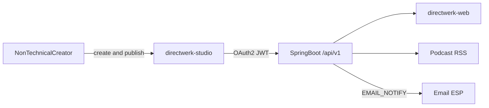
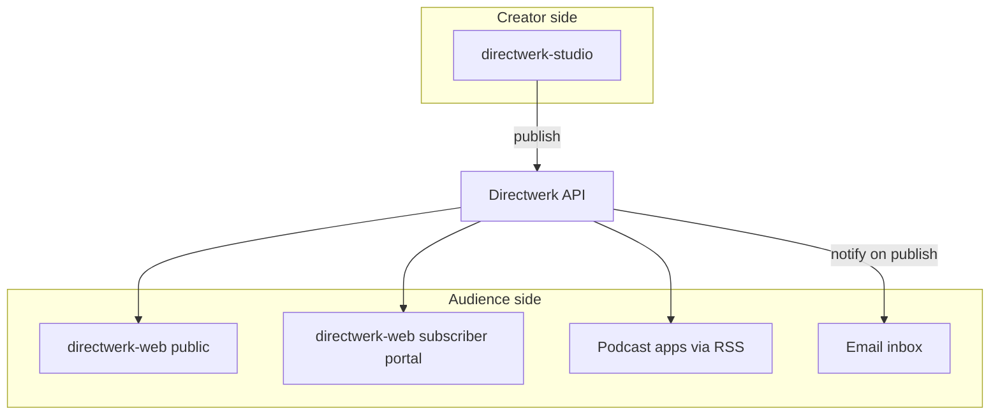
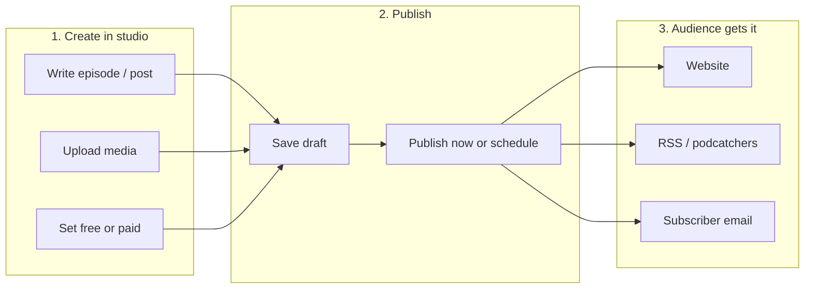

# Directwerk — `directwerk-studio` (Creator Dashboard)

Companion to [`README.md`](../README.md) (full platform design). This document defines **`directwerk-studio`**
— the **primary creator-facing app** for non-technical podcasters and digital publishers who create
content, manage members, and publish to their domain **without touching APIs or external tools**.

| Document | Purpose |
|----------|---------|
| [`README.md`](../README.md) | Full platform design — entities, APIs, phases |
| **This document** | What `directwerk-studio` is, who it serves, creator journeys |
| [`directwerk-studio-implementation.md`](directwerk-studio-implementation.md) | **Implementation guide** — screens, API mappings, scaffold, auth, checklist |
| [`content-creation-implementation.md`](content-creation-implementation.md) | Content backend — libraries, services, workflow engine |
| [`content-platform-strategy.md`](content-platform-strategy.md) | Blog/newsletter scope — publication platform, not a CMS |
| [`publication-desks-model.md`](publication-desks-model.md) | Shared Publication rails + Write desk vs Podcast desk |
| [`asset-storage.md`](asset-storage.md) | Media upload, S3 layout, entitlement-gated delivery |
| [`ghost-positioning.md`](ghost-positioning.md) | Competitive positioning vs Ghost |

**Status (2026-08):** Usable MVP on `@directwerk/ui`. Studio desks (Write + Podcast), media library,
products/subscribers, and the `directwerk-web` subscriber loop (account, feeds, catalog) are shipped.
Remaining work is live Stripe money, email notify, and analytics — not a greenfield scaffold.
Bonusdateien use PACKAGE `DIGITAL_ASSET` rules plus `GET /api/v1/me/downloads`.
See [`directwerk-studio-implementation.md` § Phased delivery](directwerk-studio-implementation.md#phased-delivery).

---

## What `directwerk-studio` is

**`directwerk-studio`** is the tenant **publisher back-office** — a web app where creators and their
editors log in on their own domain and run the show:

- Upload audio and images
- Create and publish podcast episodes, blog posts, and bonus files
- Set free vs paid access
- Manage subscribers and subscription products
- Connect Stripe, Patreon, or Steady
- Configure branding and custom domains
- Notify subscribers when something new ships (post-MVP)

Creators **never need to know the REST API exists**. Studio is a consumer of the same `/api/v1/`
contract that agencies and integrators use — API-first is an **architecture** choice, not a
user-facing requirement.

### What it is not

| Misconception | Reality |
|---------------|---------|
| A full CMS like Ghost Admin | **Publisher ops** — structured content + workflow, not block editor or themes |
| A subscriber-facing site | Subscribers use **`directwerk-web`** (or a custom frontend) — not studio |
| Platform superadmin console | That is **`directwerk-admin`** (`PLATFORM_ADMIN` only) |
| Optional “for developers only” | **Default path** for primary target audience — see [Primary audience](#primary-audience) |

---

## Primary audience

Our **primary buyer** is a **non-technical German creator** (podcaster, newsletter writer, or both)
who wants:

- One place to create podcast, blog, and member content
- Their own domain and branding
- Paid memberships without Patreon/Steady lock-in
- EU-friendly hosting and GDPR posture

They expect a product that **just works** — log in, create, publish — similar to Substack or Ghost,
not a headless API they wire up with Zapier.

| Audience | Primary app | Pitch |
|----------|-------------|-------|
| **Non-technical creators** (default) | `directwerk-studio` + `directwerk-web` | “Create everything in one dashboard on your domain” |
| **Agencies / developers** | REST API + optional custom frontend | “Headless publications + entitlements; bring your editor” |

Editorial tiers B–D in [`content-platform-strategy.md`](content-platform-strategy.md) (external API,
Strapi sync, Ghost hybrid) are **integrator paths** — documented for power users, not the default
creator experience.

---

## The three apps (how they fit together)

| App | Path (example) | Audience | Role |
|-----|----------------|----------|------|
| **`directwerk-studio`** | `https://studio.mein-podcast.de` or `https://mein-podcast.de/studio` | `EDITOR`, `TENANT_ADMIN` | **Create and publish** — back-office |
| **`directwerk-web`** | `https://mein-podcast.de` | `GUEST`, `SUBSCRIBER` | **Consume** — public site, pricing, login, subscriber portal |
| **`directwerk-admin`** | `https://admin.{platform}.de` | `PLATFORM_ADMIN` | **Operate platform** — tenants, modules (internal only) |

**Bundled default:** New tenants get `directwerk-studio` + `directwerk-web` on their domain. Custom
frontends remain supported for agencies — they replace `directwerk-web`, not the entitlement engine.

**Planned location:** `projects/directwerk-studio/` (dedicated app) **or** `/studio/**` routes inside
`projects/directwerk-web/`. Prefer a dedicated app when a customer wants publisher tools without the
public marketing site on the same deployable. See
[`directwerk-studio-implementation.md` § What this is](directwerk-studio-implementation.md#what-this-is-and-is-not).

---

## Creator journey (non-technical default)

### The loop creators experience

> **Create in studio → hit Publish → it appears on my site, in inboxes, and in podcatchers.**

They do not export Markdown, configure webhooks, or call REST endpoints.

### Podcast (MVP)

| Step | Creator does in studio | What happens automatically |
|------|--------------------------|----------------------------|
| 1 | Upload cover + audio in **Media library** | Files land in tenant S3 (`staging/` → `public/` or `private/` on publish) |
| 2 | **Content → Podcasts** → create series | Series record in PostgreSQL |
| 3 | Create episode — attach audio, write show notes | Episode `DRAFT` |
| 4 | Set access: free or paid (Supporter tier) | `access_policy` + LEVEL sort order |
| 5 | Click **Publish** | `published_at` set; RSS caches invalidated; episode on public API |
| 6 | *(Post-MVP)* Check **Notify subscribers** | `EMAIL_NOTIFY` sends via connected ESP |

### Blog / articles (post-MVP, Studio v4)

| Step | Creator does in studio | What happens automatically |
|------|--------------------------|----------------------------|
| 1 | **Content → Articles** → write in Markdown editor (paste from Google Docs OK) | Article `DRAFT` |
| 2 | Pick hero image from media library | `hero_asset_id` linked |
| 3 | Set free vs paid | Same entitlement model as episodes |
| 4 | Click **Publish** | Article on `/api/v1/public/articles`; full body gated on `/me/articles` |
| 5 | Check **Notify subscribers** | Email with title, excerpt, link (paid: teaser + gated link) |

### Newsletter

Newsletter is **not a separate app** creators log into. It is a **checkbox on publish**:

1. Connect ESP once in **Settings → Integrations** (Mailgun or Buttondown — post-MVP native wiring)
2. On every publish: optional **“Send newsletter to subscribers”**
3. Directwerk API fires domain event → ESP sends to free/paid segments

**Non-technical creators must not need Zapier.** Outbound webhooks (Phase 1 of email) are for
integrators; native `EMAIL_NOTIFY` in studio (Phase 2) is the creator product. See
[`content-platform-strategy.md` § Email](content-platform-strategy.md#email--newsletter-integration-strategy).

---

Dashboard navigation, roles, screen-by-screen API mappings, and workflow states:
[`directwerk-studio-implementation.md`](directwerk-studio-implementation.md).

---

## Editorial UX (what creators get)

Studio ships **Tier A — minimal editor** by default
([`content-platform-strategy.md` § Tier A](content-platform-strategy.md#tier-a--studio-editor-default--what-we-ship)):

| Include | Exclude |
|---------|---------|
| Markdown editor with live preview (articles) | Drag-and-drop block layout |
| Sanitized HTML for episode show notes | Inline collaborative editing |
| Title, slug, excerpt, hero image picker | Version history beyond draft/published |
| Access policy + schedule/publish buttons | Custom shortcodes / embed plugins |
| Paste from Google Docs | Competing with Notion/Substack editor |

**Honest tradeoff:** We do not ship Ghost Admin’s polished block editor. For blog-first creators
who live in the writing UI, document Ghost hybrid (Tier D) — do not pretend studio matches Ghost.

---

Phased delivery, MVP success criteria, and implementation checklist:
[`directwerk-studio-implementation.md`](directwerk-studio-implementation.md).

---

## Product priorities (studio-first)

If non-technical creators are the primary buyer, ship in this order:

| Priority | Rationale |
|----------|-----------|
| **Studio v2 (podcast)** before advanced API features | Creators need a UI on day one |
| **`directwerk-web` as default tenant site** | They need a public website without hiring an agency |
| **Native `EMAIL_NOTIFY` in studio** before outbound-only webhooks | “Publish + email subscribers” must be one click |
| **Articles in studio v4** with paste-from-Docs | Blog without Notion/Zapier |
| Tier B–D (API, Strapi, Ghost) | Power-user / agency upsell — not MVP |

---

## Technical constraints (for implementers)

Studio follows the same rules as any API consumer — 100% via `/api/v1/`, OAuth2 JWT on tenant
domain, bootstrap from `site-config`, German UI first, Next.js 16 + CSS Modules. Full scaffold,
auth, and architecture: [`directwerk-studio-implementation.md`](directwerk-studio-implementation.md).

---

## Messaging

| Audience | Lead with | Avoid |
|----------|-----------|-------|
| **German podcaster + newsletter** | “Create podcast, posts, and members in one dashboard — on your domain” | “Headless API”; “write where you like” |
| **Developer / agency** | “Same REST API studio uses — build your own frontend” | “Replace WordPress” |
| **Steady/Patreon migrator** | “One membership backend for audio and written posts” | “We built a CMS” |

**Elevator pitch (creators):** Create everything in one dashboard — podcast, posts, members — on
your own domain. We handle paywalls, private feeds, and subscriber emails.

**Elevator pitch (integrators):** Directwerk is the membership and delivery layer — structured
publications, entitlements, headless JSON. Bring your editor and frontend.

---

## Related reading

- Implementation guide: [`directwerk-studio-implementation.md`](directwerk-studio-implementation.md)
- Content vs CMS strategy: [`content-platform-strategy.md`](content-platform-strategy.md)
- Public + subscriber site: [`README.md` § Reference Frontend (directwerk-web)](../README.md#reference-frontend-directwerk-web)
- Ghost comparison: [`ghost-positioning.md`](ghost-positioning.md)
- Alpha backend: [`poc-alpha-setup.md`](poc-alpha-setup.md)

---

*Last updated: 2026-07-16*
