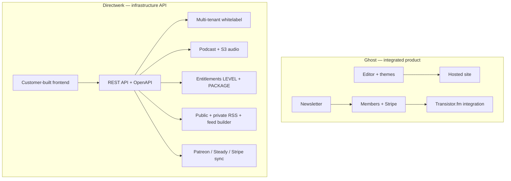
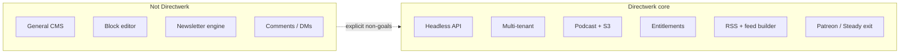

# Directwerk vs Ghost — Positioning

Companion to [`README.md`](platform-design.md) (full product design). This document answers a recurring
strategic question: **are we rebuilding Ghost, and if not, how do we position Directwerk against it?**

| Document | Purpose |
|----------|---------|
| [`README.md`](platform-design.md) | Full platform design — entities, APIs, phases |
| [`poc-alpha-setup.md`](poc-alpha-setup.md) | Alpha POC implementation blueprint |
| [`content-platform-strategy.md`](content-platform-strategy.md) | Blog + newsletter without building a CMS (“German Substack” framing) |
| [`product-naming.md`](product-naming.md) | Public product name — criteria, shortlist, and naming history |
| **This document** | Competitive positioning vs [Ghost](https://ghost.org/) and related products |

**Short answer:** No — we are not rebuilding Ghost. Directwerk is **whitelabel podcast membership
infrastructure** sold as an API. Ghost is an **integrated publishing product** (blog, newsletter,
memberships) with podcast as a secondary channel via third-party hosting. Overlap exists in
“members-only content + RSS,” but the buyer, architecture, and go-to-market are different.

**Status (2026-08):** Alpha through RSS, entitlements, and reference UIs are shipped. This doc
guides product positioning — not a feature-parity checklist against Ghost.

---

## One-line positioning

| Product | One-liner |
|---------|-----------|
| **Ghost** | Open-source CMS for professional publishers — website, newsletter, and paid memberships in one app |
| **Directwerk** | API-first, multi-tenant whitelabel infrastructure — tenants bring brand and frontend; we provide podcast content, entitlements, private RSS, and Patreon/Steady/Stripe plumbing |

**Directwerk in a sentence for customers:** *“Own your podcast membership stack on your domain — without renting Patreon, Steady, or a closed CMS.”* (from [`README.md` § Intro](platform-design.md#intro))

---

## What each product optimizes for

| Dimension | Ghost | Directwerk |
|-----------|-------|---------|
| **Primary buyer** | Individual creator or small team publishing a site + newsletter | **Non-technical creator** (default) or agency/platform operator who needs **their own** frontend |
| **Product shape** | Monolithic app (admin UI + member portal + themes) | **API + bundled apps** (`directwerk-studio`, `directwerk-web`); custom frontends for agencies |
| **Deployment model** | One Ghost instance per publication (self-host or Ghost(Pro)) | **Multi-tenant SaaS** — many isolated tenants on one deployment |
| **Content center of gravity** | **Blog and newsletter**; podcast is an add-on | **Podcast episodes**; articles are post-MVP optional |
| **Podcast hosting** | Delegated to [Transistor.fm](https://transistor.fm/) via official integration — Ghost syncs member access | **First-class** — audio in tenant-scoped S3, RSS generated by our API |
| **Frontend** | Ghost themes + Portal (built-in) | Customer builds (or we ship per-deal reference UI) |
| **Membership billing** | Stripe Connect native; Patreon via API/Zapier workarounds | Stripe Connect **plus** first-class Patreon/Steady OAuth, webhooks, dual-run migration |
| **Private podcast feeds** | Per-member unique feed via Transistor sync | Per-subscriber `feedToken` URL + optional **feed builder** (format/category filters) |
| **Open source** | Yes (MIT) | No (private monorepo SaaS) |
| **Maturity** | Production, large install base | Design spec + alpha POC plan |

---

## Feature overlap (and where we diverge)

### Where we overlap

Both products address creators who want to monetize an audience:

| Capability | Ghost | Directwerk |
|------------|-------|---------|
| Paid memberships / tiers | Native (free + paid tiers) | `SUBSCRIPTION` module — LEVEL (tier ladder) + PACKAGE (scoped bundles) |
| Stripe Connect | Native, 0% Ghost fee | Planned (`STRIPE_BILLING` module) |
| Private podcast for members | Via Transistor — tier-based access, per-member feed URLs | Native — entitlement engine + per-subscriber feeds |
| Public discovery feed | Site + public content | Public free RSS (`FREE` episodes only) for directories |
| Custom domain + branding | Themes, logo, colors | `WHITELABEL` module — domains, `site-config`, tenant branding |
| Member self-service | Ghost Portal | Subscriber API (`/api/v1/me/*`) — UI-agnostic |

Overlap is real for **“I run a membership and want a private podcast feed.”** That is one slice of
Directwerk’s surface area, not the whole product.

### Where Directwerk is intentionally different (our moat)

These are **design goals**, not shipped features yet — see implementation phases in
[`README.md`](platform-design.md) and [`poc-alpha-setup.md`](poc-alpha-setup.md).

| Differentiator | Why it matters vs Ghost |
|----------------|-------------------------|
| **API-first** | Agencies and technical creators integrate into existing sites/apps; no Ghost theme constraints |
| **Multi-tenant platform** | We operate one platform; onboard many creators with isolation — Ghost is one site per install |
| **Patreon / Steady migration** | Dual-run sync, shadow users, unified entitlements across billing sources — Ghost treats Patreon as external |
| **Feed builder** | Subscribers compose custom RSS by format/category (e.g. “Interviews only”) — Ghost/Transistor offers tier-based show access, not subscriber-defined feed composition |
| **PACKAGE products** | Season passes, format-only SKUs, category-scoped access — beyond simple tier ladders |
| **Per-asset entitlements** | Private audio signed per episode per request — no prefix-wide S3 access ([`asset-storage.md`](asset-storage.md)) |
| **Modular features per tenant** | `PODCAST`, `FEED_BUILDER`, `PATREON_SYNC` toggled per tenant — one codebase, flexible packaging |
| **EU-first hosting** | Hetzner/Bunny S3, Coolify on Hetzner — aligned with EU publisher DPAs |

### Where Ghost is ahead (do not chase blindly)

| Ghost strength | Directwerk stance |
|----------------|----------------|
| Editor, themes, newsletter delivery | **Non-goal** for MVP — integrate via webhooks/email provider later; not a Ghost-style CMS |
| Polished member Portal out of the box | Ship **reference** `directwerk-web` per deal; API remains contract |
| Open source + self-host | Different business model — we sell managed whitelabel infrastructure |
| 0% platform fee on Stripe | Competitive pressure on pricing, not architecture — document our SaaS fee model separately |
| Mature podcast UX via Transistor | They outsourced hosting; we **own** the pipeline — higher build cost, more control |
| Comments, recommendations, analytics | Explicitly **out of scope** — see [Non-Goals](#what-we-explicitly-do-not-build) |

---

## Are we rebuilding Ghost?

**No.** Rebuilding Ghost would mean:

- A general-purpose block editor and theme system
- Built-in email newsletter as primary distribution
- Single-tenant CMS with admin UI as the product
- Plugin/integration marketplace
- Blog-first content model with podcast bolted on

Directwerk’s README already rejects that shape:

- **“The product is the API.”** — [`README.md` § API as Primary Product](platform-design.md#api-as-primary-product)
- **Non-goal:** “Shipping a mandatory bundled UI for every tenant — API is sufficient”
- **Non-goal:** “Replacing Patreon/Steady community features (comments, DMs, polls)”
- **Non-goal:** “Built-in email marketing” (post-MVP webhooks only)
- **Primary content:** podcast series/episodes at MVP; `ARTICLE` is post-MVP

What we **are** building is closer to **membership + podcast distribution infrastructure** — a
layer Ghost partially covers through Ghost + Transistor, but without multi-tenancy, migration
tooling, feed builder, or headless integration as first-class concerns.

---

## Competitive landscape (broader than Ghost)

Ghost is the closest **conceptual** analogue when someone asks “why not use an existing CMS?”
Other products solve adjacent problems:

| Product | Overlap with Directwerk | Key difference |
|---------|---------------------|----------------|
| **[Ghost](https://ghost.org/)** | Memberships, optional private podcast | Blog/newsletter-first; podcast via Transistor; single site |
| **[Patreon](https://www.patreon.com/)** / **[Steady](https://steadyhq.com/)** | Tiers, member audio | Closed platform; we are the **exit ramp** with dual-run sync |
| **[Transistor](https://transistor.fm/)** | Private podcast feeds, member sync | Podcast host only — no CMS, no multi-tenant whitelabel platform |
| **[Memberful](https://memberful.com/)** / **[Gumroad](https://gumroad.com/)** | Paid access | Not podcast-native; no RSS entitlement engine |
| **[Supercast](https://www.supercast.com/)** / **[Glow](https://glow.fm/)** | Paid podcast feeds | Single-product podcast paywalls; not whitelabel API infrastructure |
| **WordPress + membership plugins** | Self-hosted, flexible | Fragile integrations; not API-first multi-tenant SaaS |

**Positioning wedge:** Patreon/Steady migrators and EU podcast publishers who need **custom frontends,
custom domains, and API control** — not bloggers who want a turnkey site.

---

## When to recommend Ghost vs Directwerk

Use this internally for sales, support, and build prioritization.

### Choose Ghost (or suggest it to a prospect)

- Creator wants a **beautiful website + newsletter** with minimal engineering
- Podcast is **secondary** to written content; happy to use Transistor (+ extra subscription)
- Single brand, no agency white-labeling multiple shows
- Open source / self-host matters
- Needs shipping **today**, not a platform on a roadmap

### Choose Directwerk

- **Podcast is the product** — audio workflow, RSS, and entitlements are core
- Migrating from **Patreon or Steady** with dual-run billing during transition
- Customer (or agency) will **build or already has** a custom frontend
- **Multiple tenants** on one platform (network, agency, franchise model)
- Needs **feed builder** — subscribers pick formats/categories for their podcatcher feed
- Needs **PACKAGE** access (season pass, one show, one format) beyond tier ladders
- **EU data residency** and owned S3 pipeline are requirements
- Integration into an existing app or stack via documented REST API

### Hybrid (possible, not a strategy)

A tenant *could* use Ghost for marketing/blog and Directwerk for podcast membership API — two systems,
two bills, integration burden. **Not a default recommendation.** If blog is essential, Ghost wins;
if podcast membership infrastructure is essential, Directwerk wins. Pick a primary system of record.

---

## What we explicitly do not build (vs Ghost parity)

From [`README.md` § Non-Goals (MVP)](platform-design.md#non-goals-mvp) — still valid for positioning:

| Out of scope | Rationale |
|--------------|-----------|
| Ghost-style theme marketplace | API-first; customers own UX |
| Native newsletter / email marketing | Post-MVP webhooks; use Mailgun/etc. |
| Comments, DMs, polls (Patreon community) | Different product category |
| General-purpose block editor | `directwerk-studio` is ops UI, not a CMS editor |
| Mandatory bundled tenant UI | Reference apps only |
| Mobile native apps | Podcast apps consume RSS |
| Live streaming / webinars | Not publishing infrastructure |
| Course booking | Belongs in [`projects/courses/`](../../courses/) |

**Articles / blogs:** Listed as post-MVP (`ARTICLE` publication type in
[`directwerk-studio-implementation.md`](directwerk-studio-implementation.md)). If we add them, treat as **lightweight
show notes or companion pages** — not competing with Ghost’s editor and newsletter loop. Editorial
and newsletter strategy: [`content-platform-strategy.md`](content-platform-strategy.md).

---

## Build strategy: what makes sense now

Given pre-implementation status, prioritize capabilities Ghost **cannot** easily offer, not
feature-parity with Ghost Admin.

### Phase alignment (highest differentiation first)

| Priority | Capability | vs Ghost |
|----------|------------|----------|
| **P0 — Alpha** | Multi-tenant isolation, auth, module gates | Ghost has no multi-tenant model |
| **P1 — MVP** | Podcast CRUD, S3 audio, publish workflow, public free RSS | Core loop without Transistor |
| **P2 — Post-MVP** | Private per-subscriber feeds, entitlement engine, LEVEL/PACKAGE products | Matches Transistor+Ghost, plus PACKAGE rules |
| **P3 — Differentiation** | Feed builder, Patreon/Steady dual-run sync | **No Ghost equivalent** |
| **P4 — Convenience** | `directwerk-studio` v0–v2 + `directwerk-web` as bundled default | Approaches Ghost’s “it just works” UX for creators |
| **Defer** | Full article CMS, email campaigns, theme system | Ghost’s home turf |

### Principles for future decisions

1. **Do not benchmark sprint planning against Ghost’s changelog** — benchmark against Patreon exit
   journeys and API integrator needs.
2. **Protect the API contract** — every Ghost-like convenience in `directwerk-studio` must call the
   same `/api/v1/` routes customers use.
3. **Podcast + entitlements + RSS before articles** — articles are optional seasoning, not the meal.
4. **Migration modules are strategic** — `PATREON_SYNC` / `STEADY_SYNC` are acquisition features Ghost
   does not optimize for.
5. **Reference UI is sales acceleration, not the product** — per [`README.md` § Reference Frontends](platform-design.md#reference-frontends).

---

## Messaging cheat sheet

| Audience | Lead with | Avoid saying |
|----------|-----------|--------------|
| **Podcaster leaving Patreon** | “Keep your members, your domain, and your RSS — migrate on your timeline” | “We’re like Ghost” |
| **Agency / platform operator** | “Multi-tenant API — one backend, many whitelabel frontends” | “CMS replacement” |
| **Developer integrator** | “OpenAPI, module flags, predictable error codes, headless entitlements” | “Install our theme” |
| **EU publisher** | “EU S3, tenant isolation, you own subscriber relationships via Stripe Connect” | “All-in-one website builder” |

**Elevator pitch (internal):** Directwerk is **whitelabel podcast membership infrastructure** — not a
Ghost competitor, but a **headless alternative to Patreon + Transistor + custom glue** for creators
who outgrew closed platforms.

---

## Open questions (revisit as we ship)

| # | Question | Notes |
|---|----------|-------|
| 1 | Do we need a minimal **marketing site generator** (not full CMS) for tenants without a frontend? | `site-config` + static `directwerk-web` may suffice |
| 2 | **Newsletter for new episode alerts** — build vs integrate (Mailgun, Buttondown)? | Ghost’s strength; integrate — see [`content-platform-strategy.md`](content-platform-strategy.md) |
| 3 | **Pricing model** vs Ghost’s 0% Stripe fee | Business decision; document in go-to-market plan |
| 4 | **Transistor as optional backend** instead of self-hosted S3? | Would reduce build scope but weakens “own your stack” story — likely no |
| 5 | **Show notes as rich text** without becoming a blog platform | Episode-scoped HTML sanitization only |

---

## Related reading

- Product goals and non-goals: [`README.md` § Overview](platform-design.md#overview)
- API-first principles: [`README.md` § API as Primary Product](platform-design.md#api-as-primary-product)
- Patreon/Steady migration: [`README.md` § Patreon and Steady Onboarding](platform-design.md#patreon-and-steady-onboarding)
- Feed builder: [`README.md` § Feed Builder](platform-design.md#feed-builder)
- Private RSS and entitlements: [`asset-storage.md`](asset-storage.md)
- Publisher dashboard (ops UI, not CMS): [`directwerk-studio-implementation.md`](directwerk-studio-implementation.md)
- Content vs CMS strategy (blog/newsletter): [`content-platform-strategy.md`](content-platform-strategy.md)
- Product naming: [`product-naming.md`](product-naming.md)
- Alpha implementation scope: [`poc-alpha-setup.md`](poc-alpha-setup.md)
- Ghost: [ghost.org](https://ghost.org/) · [Memberships docs](https://docs.ghost.org/members) · [Transistor integration](https://ghost.org/changelog/transistor/)

---

*Last updated: 2026-07-16*
