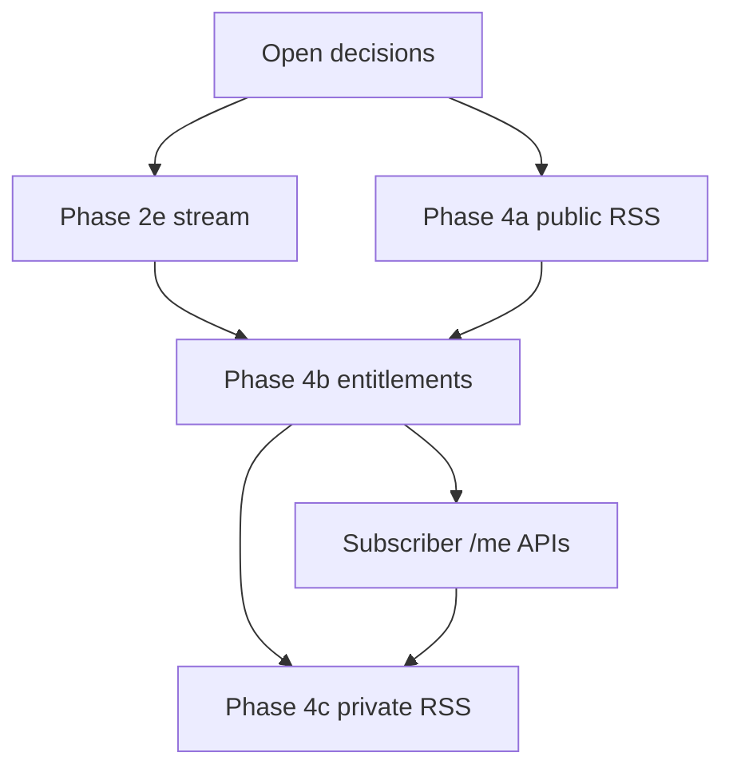

# Phase 2e · 4 · 4b — Implementation Plan

Companion to [`poc-alpha-setup.md`](poc-alpha-setup.md), [`asset-storage.md`](asset-storage.md),
[`Directwerk/directwerk-podcast/README.md`](../Directwerk/directwerk-podcast/README.md), and
[`README.md`](../README.md).

**Status:** Shipped (2026-07-20, commit `5bdf7786`). Phase 2e (episode stream), 4a (public RSS), 4b
(real LEVEL/PACKAGE entitlements), and 4c (private subscriber RSS) are all implemented — this plan is
kept as a historical reference for the slices/decisions below.

| Phase | Name | Goal |
|-------|------|------|
| **2e** | Episode stream | `GET /api/v1/me/episodes/{slug}/stream` → 302 |
| **4** | RSS (`PODCAST_RSS`) | Public FREE feeds + private subscriber feeds |
| **4b** | Entitlements | Real LEVEL/PACKAGE `hasAccess` + subscriber `/me/*` |

---

## Current baseline (do not re-build)

| Area | State | Key paths |
|------|-------|-----------|
| Media upload / promote / private preview | Done (2c/2d) | `UploadService`, `AssetAccessService`, `MediaController` |
| Podcast series / episodes / formats / categories / publish | Done (Phase 3) | `directwerk-podcast`, `V28`, `PublicPodcastController` |
| `EntitlementApi` | Done (4b) — `EntitlementApiAdapter` (`@Primary`) replaces the fail-closed stub | `EntitlementApiAdapter`, `ProductAccessRuleService`, `EntitlementService` |
| LEVEL products + manual grants + `/me/access` | Done | `SubscriptionProduct`, `Subscription`, `EntitlementService` |
| `ProductAccessRule`, PACKAGE evaluation, `/me/episodes`, feeds | Done (4b/4c) | `V30__product_access_rules.sql`, `MeEpisodeController`, `MeFeedController` |
| `PODCAST_RSS` module catalog row | Present | `V3__create_feature_modules.sql`, `ModulePreset.FREE_PODCAST` |
| RSS generation / `SubscriberFeed` | Done (4a/4c) | `RssFeedController`, `RssFeedService`, `RssXmlBuilder`, `V31__subscriber_feeds.sql` |

Next Flyway version: **`V29`** (after `V28__create_podcast_content.sql`).

---

## Recommended sequence



| Order | Slice | Why |
|-------|-------|-----|
| 0 | Lock open decisions | Slug route + feed tenant resolution block coding |
| 1 | **Phase 2e** | FREE stream works now; PAID fails closed until 4b |
| 2 | **Phase 4a** (public RSS) | Independent of entitlements; FREE CDN enclosures only |
| 3 | **Phase 4b** | Real `hasAccess` + PACKAGE rules; unlocks paid stream |
| 4 | **Phase 4c** (private RSS) | Needs 4b; signed enclosures + token feeds |

**Do not** wait for Studio UI. These phases are API-first; Studio v3 consumes 4b later.

---

## Open decisions (resolve before coding)

### D1 — Episode slug in stream URL

Docs say `GET /api/v1/me/episodes/{slug}/stream`. DB uniqueness is `(series_id, slug)` only
(`V28`), so `{slug}` alone can be ambiguous across series.

| Option | Pros | Cons |
|--------|------|------|
| **A. Nested path** `/me/series/{seriesSlug}/episodes/{episodeSlug}/stream` | Matches DB uniqueness; clear | Diverges from README path |
| **B. Tenant-wide unique episode slug** | Keeps flat README path | Migration + create/update validation |
| **C. Flat path + 409 if ambiguous** | Minimal schema change | Awkward client UX |

**Recommendation: B** — enforce unique `(tenant_id, slug)` on episodes (partial unique index on
`PUBLISHED`+`DRAFT`+`SCHEDULED`, or full unique). Aligns public catalog and stream URLs.
Update `EpisodeService` create/update + `V29` if needed for 2e.

### D2 — Feed URL tenant resolution

Docs: `/feeds/{tenantSlug}/podcast.xml`. Today `TenantContextFilter` resolves tenant from
**Host**, and `/feeds/**` is a public path.

**Recommendation:** Resolve tenant from `{tenantSlug}` in the feed controller; require it matches
`TenantContext` from Host when Host is a verified tenant domain; allow slug-only resolution for
podcatcher URLs that do not send a custom Host (or always require Host and treat slug as
assertion). Prefer: **Host wins; path slug must equal `tenant.slug` or return 404**.

### D3 — Feed token storage

**Recommendation:** Store **raw** token in DB for MVP (unguessable 128+ bit URL-safe random),
unique globally. Hashing would break feed URL lookup without a token id prefix. Rotate on
password reset + explicit rotate endpoint. Never log tokens.

### D4 — RSS GUID

**Recommendation:** Derive stable GUID without a new column:
`urn:directwerk:episode:{tenantSlug}:{episodeId}` (or `https://{primaryHost}/episodes/{slug}`).
Add `rss_guid` column only if external directory re-import needs override later.

### D5 — Module graph for `EntitlementApi`

`directwerk-digital` owns `EntitlementApi`; real checks need podcast episode metadata +
subscription products. Podcast must not create a cycle into subscription.

**Recommendation:** Keep `EntitlementApi` in digital; replace `FailClosedEntitlementApi` with an
**app-level** `@Primary` adapter in `directwerk-app` that calls subscription + podcast services.
Do not make `directwerk-subscription` depend on `directwerk-podcast`.

---

## Phase 2e — Episode stream

### Goal

Authenticated subscribers get a **302** to play audio. Never proxy bytes through Spring.

### Endpoint

```
GET /api/v1/me/episodes/{slug}/stream
Authorization: Bearer <JWT>
Host: <tenant domain>
```

| Case | Response |
|------|----------|
| FREE + `PUBLISHED` + READY audio | `302` → public CDN URL |
| PAID + `SUBSCRIPTION` off | `403 FEATURE_NOT_ENABLED` |
| PAID + entitled (after 4b) | `302` → private pre-signed GET (TTL = API, ~1h) |
| PAID + not entitled (stub or real deny) | `403 ENTITLEMENT_DENIED` |
| Missing / not published | `404 EPISODE_NOT_FOUND` |
| No JWT | `401` |
| Cross-tenant | `403 TENANT_MISMATCH` |
| `PODCAST` off | `403 FEATURE_NOT_ENABLED` |

### Implementation slices

| # | Deliverable | Notes |
|---|-------------|-------|
| 2e.1 | Resolve D1 (slug uniqueness) | Migration + service validation if option B |
| 2e.2 | `SubscriberEpisodeQueryService` (podcast) | Find `PUBLISHED` episode by tenant + slug; load audio asset |
| 2e.3 | `MeEpisodeController` in `directwerk-app` | `@RequiresModule(PODCAST)`; PAID also requires `SUBSCRIPTION` before asset resolve |
| 2e.4 | Wire `AssetAccessApi.resolveDownloadUrl` | Reuse existing public CDN / private presign; do not add a second presigner |
| 2e.5 | Tests | Unit + controller tests for FREE 302, PAID deny, module gates, 404 |
| 2e.6 | HTTP harness | `http/20-episode-stream.http` |

### Module / security rules

From [`asset-storage.md`](asset-storage.md):

- Episode stream: `DIGITAL_CONTENT` + `PODCAST`
- Paid stream: above + `SUBSCRIPTION` (**before** entitlement check)
- Gate order: ModuleGate → load episode → FREE path or PAID path → `AssetAccessService`

`AssetAccessService` today cannot see `Episode.accessPolicy`. **Controller/service must** check
policy and `SUBSCRIPTION` before calling `resolveDownloadUrl` for PAID. Do not weaken the fail-closed
stub.

### Acceptance (2e alone)

- [ ] FREE published episode streams with 302 CDN `Location`
- [ ] PAID returns `FEATURE_NOT_ENABLED` or `ENTITLEMENT_DENIED` (never a private URL with stub)
- [ ] Draft/scheduled never stream
- [ ] Cross-tenant Host/JWT rejected
- [ ] No signed URL in logs

### Out of scope for 2e

- Real LEVEL/PACKAGE grants (4b)
- RSS (4)
- `/me/episodes` list (4b)
- Studio UI

---

## Phase 4 — RSS (`PODCAST_RSS`)

Split into **4a public** (now) and **4c private** (after 4b).

### Phase 4a — Public FREE feeds

#### Endpoints

| Method | Path | Content |
|--------|------|---------|
| GET | `/feeds/{tenantSlug}/podcast.xml` | All `PUBLISHED` + `FREE` episodes (tenant) |
| GET | `/feeds/{tenantSlug}/{seriesSlug}.xml` | Same, one series |

Auth: none (tokenless). Module: `PODCAST_RSS` (implies `PODCAST`). If module off → `404` (do not leak
feed existence with empty XML unless product prefers empty channel — **prefer 404**).

#### Channel / item (RSS 2.0 + iTunes)

Use series (or tenant default series) metadata from Phase 3: title, description, language,
iTunes category, cover art CDN URL, `atom:link rel="self"`.

Items: title, description / `content:encoded` (already sanitized HTML), `pubDate`, stable `guid`,
`enclosure` (CDN URL, length, type), `itunes:duration`, `itunes:episode`.

**Enclosures:** FREE audio only — public CDN URL from `S3PublicUrlBuilder`. Never sign private
objects into public feeds.

#### Slices

| # | Deliverable | Notes |
|---|-------------|-------|
| 4a.1 | `RssFeedService` in `directwerk-podcast` (or `…podcast.rss`) | Build XML string; escape correctly |
| 4a.2 | `RssFeedController` in `directwerk-app` | `text/xml` / `application/rss+xml`; D2 tenant check |
| 4a.3 | `@RequiresModule(PODCAST_RSS)` or explicit gate | Same pattern as other modules |
| 4a.4 | Extend `PublicSiteConfigService` | Add `publicRssUrl` (and optional per-series URLs) |
| 4a.5 | ETag / `Cache-Control` | Weak ETag from max(`published_at`, series `updated_at`) |
| 4a.6 | Publish hook | Replace stub log in `PublicationWorkflowService` with cache version bump / event |
| 4a.7 | Tests + `http/21-public-rss.http` | FREE only; PAID omitted; module off → 404 |

#### Acceptance (4a)

- [ ] Public feed validates as RSS 2.0 with iTunes namespace
- [ ] Only FREE published episodes appear
- [ ] Enclosure URLs are public CDN, not pre-signed
- [ ] `PODCAST_RSS` off → 404
- [ ] Wrong `{tenantSlug}` vs Host → 404

### Phase 4c — Private subscriber feeds (after 4b)

#### Schema (`V30` or next after 4b migrations)

```sql
-- subscriber_feeds
id, tenant_id, user_id, feed_token (unique), title, is_default, created_at, updated_at
UNIQUE (tenant_id, user_id) WHERE is_default = true  -- one default per member
```

Custom feeds (`CustomFeed`) stay **Phase 7** — do not implement format/category builder here.

#### Endpoints

| Method | Path | Auth |
|--------|------|------|
| GET | `/feeds/{tenantSlug}/u/{feedToken}.xml` | Feed token (no JWT) |
| GET | `/api/v1/me/feeds` | JWT — list default feed URL |
| POST | `/api/v1/me/feeds/default/rotate-token` | JWT |

Auto-create default `SubscriberFeed` on first ACTIVE subscription grant (and optionally on
subscriber registration if product wants empty feed early — **prefer on first grant**).

#### Enclosure signing

Extend `AssetAccessApi`:

```java
URL resolveDownloadUrl(MediaAsset asset, DirectwerkUserPrincipal principal);
URL resolveRssEnclosureUrl(MediaAsset asset, Long subscriberUserId); // TTL = RSS (~24h)
```

Private feed generator:

1. Resolve feed by token → tenant + user
2. Load published episodes
3. Keep only `hasAccess(user, episode)`
4. Per entitled episode: public CDN if FREE, else `resolveRssEnclosureUrl`
5. Omit non-entitled episodes entirely (no lock placeholders)

Principal for RSS: build a minimal internal caller identity from feed owner user id — do **not**
skip `EntitlementApi`.

#### Slices

| # | Deliverable |
|---|-------------|
| 4c.1 | Flyway + `SubscriberFeed` entity / repo |
| 4c.2 | Token create / rotate service (128+ bit) |
| 4c.3 | Private feed XML generation reusing 4a builder |
| 4c.4 | RSS TTL on `AssetAccessService` |
| 4c.5 | Hook: create feed on subscription activate |
| 4c.6 | Rotate token on password reset |
| 4c.7 | Tests + `http/22-private-rss.http` |

#### Acceptance (4c)

- [ ] Entitled PAID episodes get 24h signed enclosure URLs
- [ ] Non-entitled episodes omitted
- [ ] Token rotate invalidates old URL
- [ ] Tokens never logged
- [ ] Rate-limit note for later hardening (Phase 10) — optional soft limit now

### Explicitly deferred from Phase 4

| Item | When |
|------|------|
| `CustomFeed` / feed builder UI+API | Phase 7 |
| `EMAIL_NOTIFY` on publish | Post-MVP |
| Directory submission helpers (Apple/Spotify) | Ops / docs only |

---

## Phase 4b — Entitlements + subscriber portal API

### Goal

Replace fail-closed content access with union of ACTIVE **LEVEL** and **PACKAGE** products.
Expose subscriber list APIs that Studio v3 and `publish-web` will consume.

### Schema

Suggested migrations (adjust numbers if 2e/4a already used them):

| Migration | Contents |
|-----------|----------|
| `V29__…` | Episode tenant-wide slug uniqueness (if D1=B) and/or stream-related indexes |
| `V3x__product_access_rules.sql` | `product_access_rules` |
| `V3y__subscriber_feeds.sql` | With 4c (can ship in same PR as private RSS) |

`product_access_rules`:

| Column | Notes |
|--------|-------|
| `id` | PK |
| `tenant_id` | Denormalized for filters + write guards |
| `product_id` | FK → `subscription_products` |
| `scope_type` | `ALL_PODCASTS`, `PODCAST_SERIES`, `FORMAT`, `CATEGORY`, `DIGITAL_ASSET`, `FEED_BUILDER` |
| `scope_id` | Nullable when type has no target |
| `effect` | `GRANT` only for MVP |
| `created_at` | |

Validate `scope_id` belongs to same tenant (series/format/category/asset).

### `hasAccess` algorithm

```
activeProducts(user, tenant) =
  Subscription WHERE status=ACTIVE AND (ends_at IS NULL OR ends_at > now())

hasAccess(user, episode) =
  episode.status == PUBLISHED AND (
    episode.access_policy == FREE
    OR any product in activeProducts grants:
         LEVEL:  product.sort_order >= coalesce(episode.required_level_sort_order, 0)
         PACKAGE: any ProductAccessRule GRANT matches:
           ALL_PODCASTS
           OR PODCAST_SERIES AND scope_id = episode.series_id
           OR FORMAT AND scope_id IN episode.format_ids
           OR CATEGORY AND scope_id IN episode.category_ids
  )

hasDigitalAssetAccess(user, mediaAssetId) =
  FREE digital publication OR PACKAGE rule DIGITAL_ASSET OR (CONTENT+episode via hasAccess)
```

Also enforce format-level gates if `Format.required_level_sort_order` is set (podcast README):
subscriber max LEVEL must meet format requirement **in addition to** episode rules when evaluating
PACKAGE/LEVEL visibility for tagged formats — document exact AND/OR in service Javadoc and tests.

### App adapter

```
directwerk-app
  EntitlementApiAdapter implements EntitlementApi  @Primary
    → SubscriptionEntitlementService (new or extend EntitlementService)
    → EpisodeRepository / PublicPodcastQueryService helpers
```

Remove or demote `FailClosedEntitlementApi` to `@ConditionalOnMissingBean` for library tests.

### Product admin API extensions

| Change | Detail |
|--------|--------|
| Create/update product | Accept `offeringType` `LEVEL` \| `PACKAGE` (today LEVEL-only) |
| Rules CRUD | `GET/PUT /api/v1/tenant/products/{id}/rules` (replace-all or granular) |
| Validation | PACKAGE must have ≥1 rule; LEVEL ignores rules |
| Public catalog | Already lists products — include offering type; do not expose internal rule IDs if unused |

### Subscriber `/me/*` (backend)

| Endpoint | 4b scope |
|----------|----------|
| `GET /api/v1/me/access` | Extend: max LEVEL + package product ids/slugs (keep existing LEVEL summary) |
| `GET /api/v1/me/subscriptions` | Active/canceled products + source |
| `GET /api/v1/me/episodes` | Paginated entitled published episodes; FREE audio CDN URL; PAID no raw key — client uses stream |
| `GET /api/v1/me/episodes/{slug}/stream` | Upgrade 2e: entitled PAID → 302 signed URL |
| `GET /api/v1/me/downloads` | Empty list OK until `DigitalPublication` ships; or minimal stub |
| `GET /api/v1/me/feeds` | Ship with 4c |
| Custom feed CRUD | **Phase 7 — skip** |

### Slices

| # | Deliverable |
|---|-------------|
| 4b.1 | `ProductAccessRule` entity, repo, migration, tenant validation |
| 4b.2 | Product API: PACKAGE + rules CRUD |
| 4b.3 | `SubscriptionEntitlementService.hasAccess` / `hasDigitalAssetAccess` + tests |
| 4b.4 | `EntitlementApiAdapter` `@Primary` in app |
| 4b.5 | `/me/subscriptions`, `/me/episodes` controllers + DTOs |
| 4b.6 | Re-test 2e PAID happy path |
| 4b.7 | HTTP harness `http/23-entitlements.http` (+ extend 11/12 product files) |
| 4b.8 | Docs: update `poc-alpha-setup` Phase G checkboxes; subscription README |

### Acceptance (4b)

- [ ] LEVEL 2 subscriber streams episode requiring level ≤2; denied for level 3
- [ ] PACKAGE + `FORMAT` grants matching tagged episodes only
- [ ] PACKAGE + `CATEGORY` / `PODCAST_SERIES` / `ALL_PODCASTS` covered by tests
- [ ] Revoked subscription → next stream `ENTITLEMENT_DENIED` (old URLs die via TTL)
- [ ] Tenant without `SUBSCRIPTION` → paid stream `FEATURE_NOT_ENABLED` (not entitlement deny)
- [ ] Cross-tenant product/rules impossible via write guards + Hibernate filter

### Out of scope for 4b

| Item | When |
|------|------|
| Stripe / Patreon / Steady sync | Phases 6 / 8 |
| `DigitalPublication` full CRUD | Post-MVP / later content |
| Studio v3 UI | Frontend track |
| Feed builder | Phase 7 |
| Shadow-user claim | Post-alpha auth |

---

## Cross-cutting engineering rules

1. **API-first** — every slice ships HTTP harness scenarios before Studio.
2. **Security** — no raw user input in S3 keys; never log pre-signed URLs or feed tokens; strict `===` N/A (Java); validate path slugs against allow-list charset.
3. **Tenant isolation** — `TenantContext` + Hibernate `tenantFilter` + explicit `tenant_id` on writes.
4. **Module gates** — `@RequiresModule` / `ModuleGateApi` before business logic.
5. **Presign ownership** — only `AssetAccessService` calls `S3Presigner`.
6. **Tests live in `directwerk-app`** — same pattern as podcast/subscription today.
7. **No bytes through API** — 302 / enclosure URLs only.

---

## Suggested PR breakdown

| PR | Title | Contains |
|----|-------|----------|
| 1 | `feat(directwerk): Phase 2e episode stream` | D1 + stream endpoint + `20-*.http` |
| 2 | `feat(directwerk): Phase 4a public RSS feeds` | Public XML + site-config URL + `21-*.http` |
| 3 | `feat(directwerk): Phase 4b product access rules + hasAccess` | Rules schema + adapter + `/me/subscriptions` + `/me/episodes` |
| 4 | `feat(directwerk): Phase 4c private subscriber RSS` | `SubscriberFeed` + signed enclosures + rotate + `22-*.http` |

PRs 1 and 2 can proceed in parallel after D1/D2 are decided. PR 4 depends on PR 3.

---

## Verification matrix

| Scenario | 2e | 4a | 4b | 4c |
|----------|----|----|----|----|
| FREE stream 302 CDN | ✓ | | | |
| PAID stream deny (stub) | ✓ | | | |
| PAID stream 302 signed | | | ✓ | |
| Public RSS FREE only | | ✓ | | |
| Public RSS omits PAID | | ✓ | | |
| LEVEL grant | | | ✓ | |
| PACKAGE FORMAT grant | | | ✓ | |
| Private feed entitled PAID enclosure | | | | ✓ |
| Token rotate | | | | ✓ |

---

## Doc updates when implementing

- [`poc-alpha-setup.md`](poc-alpha-setup.md) — mark Phase F/G steps; refresh “Next step after alpha”
- [`Directwerk/directwerk-podcast/README.md`](../Directwerk/directwerk-podcast/README.md) — move 2e/RSS out of “deferred”
- [`Directwerk/directwerk-subscription/README.md`](../Directwerk/directwerk-subscription/README.md) — PACKAGE + `hasAccess`
- [`asset-storage.md`](asset-storage.md) — note RSS TTL API method when added
- This document — checkboxes → done per PR

---

## Studio / frontend (informational)

Not part of this backend plan, but unblocked by it:

| Frontend | Needs |
|----------|-------|
| Studio v2 (podcast UI) | Phase 3 API — already available |
| Studio v3 (products / subscribers) | Phase 4b rules + subscription APIs |
| `publish-web` catalog | Public podcast API (done) + stream (2e) + RSS link (4a) |
| Podcatchers | Phase 4a/4c feed URLs |

---

*Last updated: 2026-07-20*
