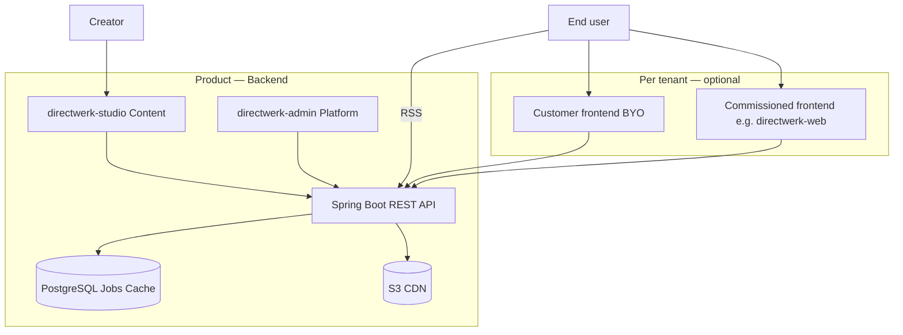
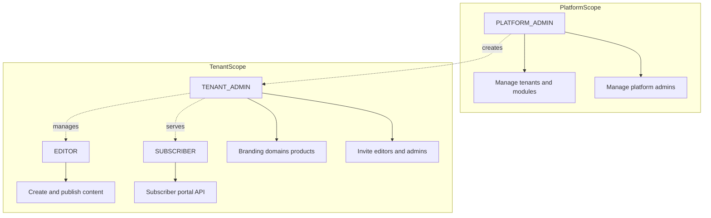
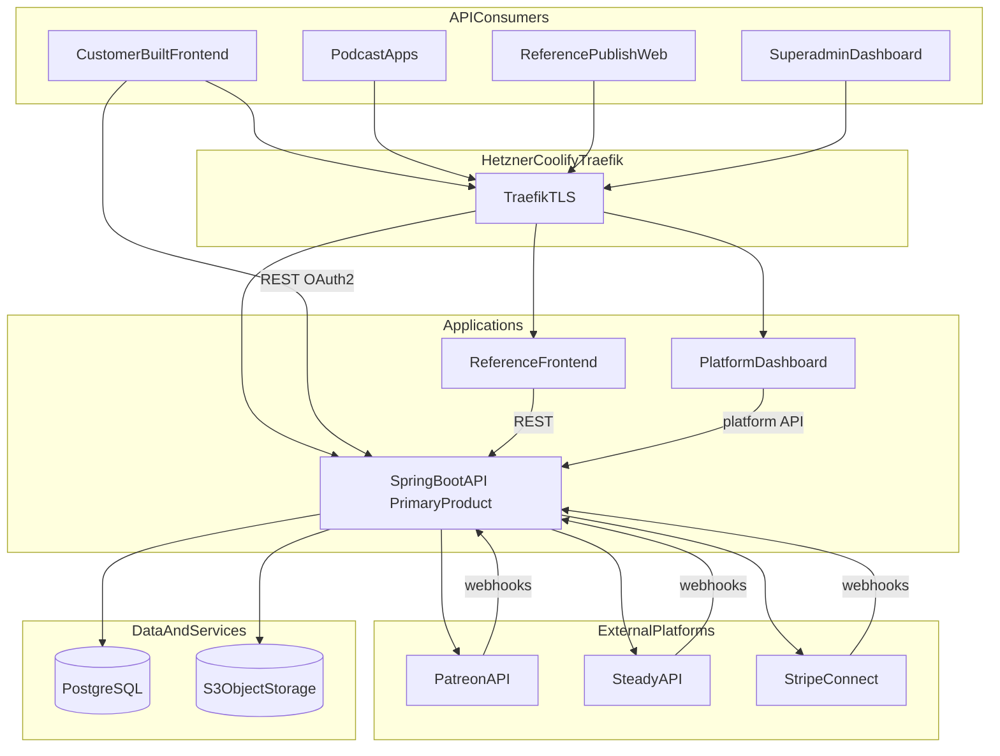
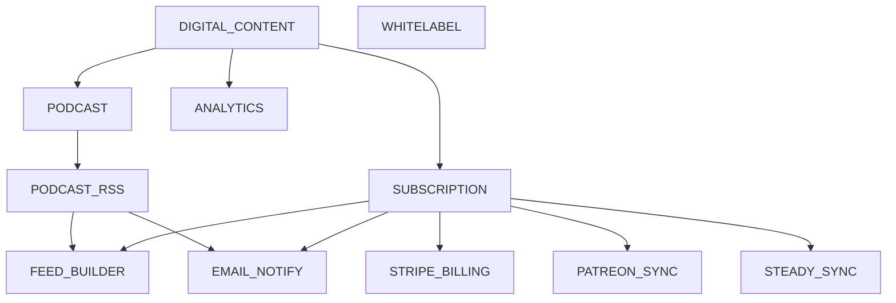
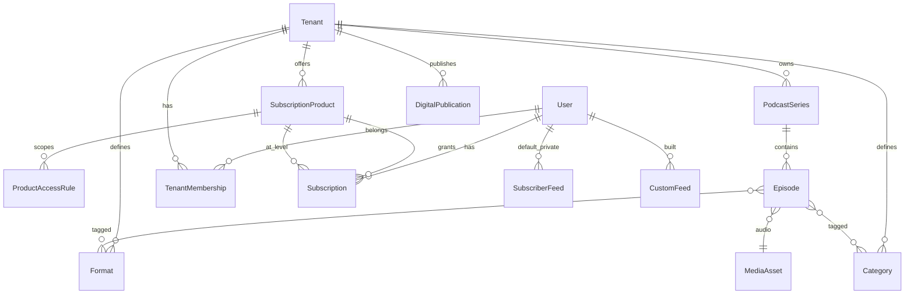
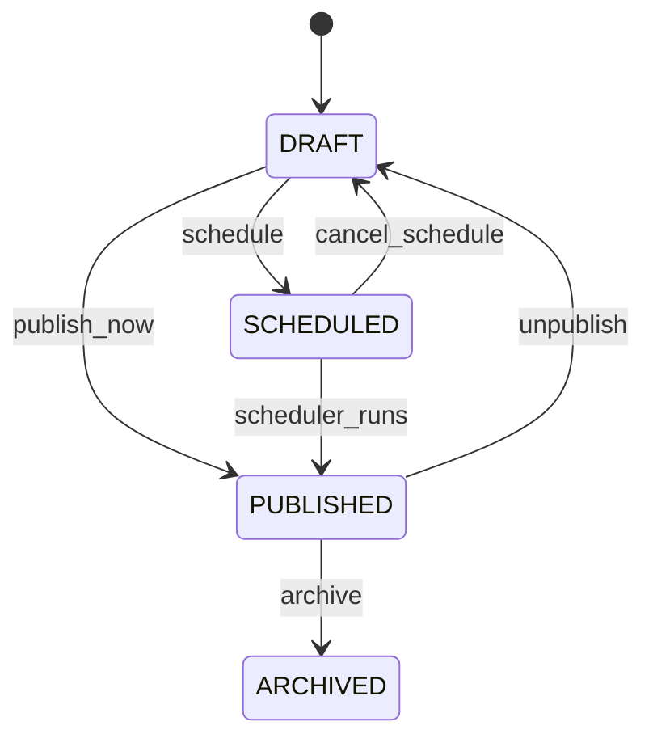

# Directwerk — Platform Design Specification

Detailed product and architecture reference for the Directwerk whitelabel publisher platform.
For a quick overview and how to run the repo, see the root [`README.md`](../README.md).
Implementation guides and doc status: [README.md](README.md).

**Status (2026-08):** Alpha backend, studio, web, RSS, entitlements, and Stripe scaffold are
shipped. Unchecked items in [Implementation Checklist](#implementation-checklist) are historical
planning — see [`poc-alpha-setup.md`](poc-alpha-setup.md) for what actually landed.

---

## Documentation

Internal index: [`docs/README.md`](README.md). Public site: [`directwerk-docs/`](../directwerk-docs/).

| Topic | Doc |
|-------|-----|
| Run / deploy | [`Directwerk/docs/build-and-deploy.md`](../Directwerk/docs/build-and-deploy.md) |
| Multi-tenancy | [`Directwerk/docs/multi-tenancy.md`](../Directwerk/docs/multi-tenancy.md) |
| Asset storage | [`asset-storage.md`](asset-storage.md) |
| Entitlements | [`content-subscriptions-and-entitlements.md`](content-subscriptions-and-entitlements.md) |
| Payments | [`payment.md`](payment.md) |
| Auth | [`user-backend-implementation.md`](user-backend-implementation.md) |
| HTTP harness | [`poc-alpha-setup.md`](poc-alpha-setup.md) |

Regenerate public API docs after controller changes:

```sh
./Directwerk/gradlew :directwerk-app:exportOpenApi
pnpm --filter directwerk-docs build
```

---

## Overview

### Intro

**Directwerk** is an API-first, multi-tenant whitelabel platform for podcast creators and digital
publishers who want to own their stack — content, subscribers, and distribution — instead of
renting it from Patreon, Steady, or a closed CMS.

**Primary audience:** non-technical German creators (podcasters, newsletter writers) who create
content in **`directwerk-studio`**, publish to their domain, and reach audiences via **`directwerk-web`**,
RSS, and subscriber email — without APIs or external tools. Agencies and custom frontends integrate
via the same REST contract.

Creators onboard as **tenants** with their own domain and branding. End users register, subscribe
to tenant-defined products, and consume podcasts via RSS in their own podcatcher — or through the
subscriber portal on `directwerk-web`. We handle auth, entitlements, asset storage, and billing
plumbing; tenants own the brand and (optionally) customize the public site.

**The product is the backend** — multi-tenant platform, REST API, **`directwerk-studio`** (content
management), **`directwerk-admin`** (platform ops), plus database, jobs, cache, S3, and CDN. Per tenant,
the **end-customer frontend** is optional: we build it on commission (e.g. `directwerk-web`) or the
customer brings their own — both connect to the same API. Non-technical creators use **`directwerk-studio`**
out of the box; audiences reach content via the tenant frontend, RSS, or email.



### Elevator pitch

> Fully **multi-tenant / whitelabel** — with optional per-customer frontends.
>
> **The product is the backend:**
> - **Studio** — creator content management (`directwerk-studio`)
> - **Admin dashboard** — platform operations (`directwerk-admin`)
> - **Infrastructure** — database, jobs, cache, S3 asset storage, CDN
> - **API** — REST for everything (content, entitlements, billing, feeds)
>
> **End-customer frontend:** Per tenant, either **built for them** (e.g. `directwerk-web`) or **they
> bring their own** — both integrate via the same API contract.

| Layer | What we ship | Who uses it |
|-------|--------------|-------------|
| **Backend (the product)** | API, Studio, Admin, PostgreSQL, jobs, cache, S3, CDN | Creators (Studio), platform team (Admin), all frontends (API) |
| **End-customer frontend (optional per tenant)** | Commissioned site or customer-built UI | Subscribers, visitors, checkout |

**One-liner (DE):** *Multi-Tenant-Whitelabel-Backend für digitales Publishing — Studio, Admin, API
und Infrastruktur inklusive; Endkunden-Frontend pro Kunde optional (Auftrag oder BYO).*

**One-liner (EN):** *Multi-tenant whitelabel publishing backend — Studio, admin, API, and
infrastructure included; end-customer frontend optional per tenant (commissioned or BYO).*

#### Required features (hard scope)

These must exist for the platform to function — MVP foundation plus the core publishing loop:

| # | Feature | Why it's required |
|---|---------|-------------------|
| 1 | **Multi-tenant whitelabel** | Isolated tenants, custom domains, branding — the business model |
| 2 | **Module system** | Enable capabilities per tenant without forking deployments |
| 3 | **User accounts & role hierarchy** | `SUBSCRIBER` → `EDITOR` → `TENANT_ADMIN` → `PLATFORM_ADMIN` via Spring Security |
| 4 | **Digital content + S3 hosting** | All assets in tenant-scoped object storage; public vs private enforcement |
| 5 | **REST API + OpenAPI** | Every capability exposed as a versioned HTTP contract — no UI-only workflows |
| 6 | **Podcast content management** | Series, episodes, formats, categories — primary content type at launch |
| 7 | **Publish workflow** | Draft, schedule, publish, archive — shared across content types |

#### Optional addons (enable per tenant, later phases)

Tenants activate these via the module system as they grow — not required for MVP:

| Addon | Module(s) | What it unlocks |
|-------|-----------|-----------------|
| **Public + private RSS** | `PODCAST_RSS` | Free discovery feed + per-subscriber private feeds |
| **Subscription products** | `SUBSCRIPTION` | LEVEL (tier ladder) and PACKAGE (scoped access) products |
| **Feed builder** | `FEED_BUILDER` | Subscribers compose custom RSS by format |
| **Stripe billing** | `STRIPE_BILLING` | Checkout, Customer Portal, Connect payouts |
| **Patreon migration** | `PATREON_SYNC` | Import members, dual-run sync, shadow-user claim |
| **Steady migration** | `STEADY_SYNC` | Same for Steady publishers |
| **Digital bonus files** | `DIGITAL_CONTENT` + `SUBSCRIPTION` | PDFs, ebooks behind package rules |
| **Platform superadmin UI** | `directwerk-admin` | Full ops console (MVP: minimal tenant/module CRUD) |
| **Reference creator dashboard** | `directwerk-studio` | Default publisher back-office for non-technical creators |
| **Reference whitelabel UI** | `directwerk-web` | Default public site + subscriber portal — agencies may replace |
| **Articles, video, ebooks** | `DIGITAL_CONTENT` extensions | Additional publication types |
| **One-time purchases** | `STRIPE_BILLING` | Single episode / file sales |
| **Platform SaaS billing** | Post-MVP | Tenants pay us; modules tied to platform plan |
| **Email notifications** | Post-MVP | New episode alerts via Mailgun |
| **Outbound webhooks** | Post-MVP | Tenant automation hooks |
| **GDPR export/delete** | Post-MVP | Compliance hardening |

**Stack (planned):** Java 21 · Spring Boot 4.1.0 · Gradle 9.x · Flyway 12+ · PostgreSQL 19 (beta) ·
S3-compatible object storage · Stripe Connect · Patreon/Steady API sync

| Component | Version | Notes |
|-----------|---------|-------|
| Spring Boot | **4.1.0** | Spring Framework 7.x; Jakarta EE 11 baseline |
| Gradle | **9.x** (8.14+ min) | Required by Spring Boot 4.1 Gradle plugin |
| Flyway | **12+** | Via `spring-boot-starter-flyway` BOM (SB 4.1 ships 12.4.0) |
| PostgreSQL | **19 (beta)** | Dev: `postgres:19beta1-alpine`; production TBD at GA |
| Java | **21** | Spring Boot 4.1 supports JDK 17–26; we target 21 |

**Reference frontends:** Next.js 16 — `directwerk-studio` (creator dashboard), `directwerk-web` (public +
subscriber site), `directwerk-admin` (platform ops)

**Package:** `de.pnnit.directwerk`

**Status:** Alpha backend in active development. Multi-tenant Spring Boot app, module gates, storage
plumbing, podcast content (series/episodes/formats), episode streaming, public + private subscriber
RSS, and real LEVEL/PACKAGE entitlements are implemented — see
[poc-alpha-setup.md](poc-alpha-setup.md) and
[`poc-alpha-setup.md`](poc-alpha-setup.md) for what's shipped vs.
open. Still design-only: Stripe/Patreon/Steady billing, `EMAIL_NOTIFY`, articles, and the
`directwerk-admin`/`directwerk-web` reference frontends. Full doc index: [Documentation](#documentation).

### MVP Scope

The **MVP** is the platform foundation tenants and integrators need before paid distribution
features (RSS, subscriptions, billing sync) ship. Everything else in this document builds on
these four pillars.

#### MVP pillars

| # | Pillar | MVP delivers | Implementation phase |
|---|--------|--------------|----------------------|
| 1 | **Multi-tenant** | Tenant isolation, whitelabel domains, branding, `TenantContext` via `Host` + JWT | Phase 1 |
| 2 | **Module system** | Runtime gating per tenant (`FeatureModule`, `TenantModuleActivation`, `@RequiresModule`) | Phase 1 |
| 3 | **User accounts & roles** | Spring Security; subscriber → editor → tenant admin → superadmin | Phase 1 + 4b |
| 4 | **Digital content + S3** | Upload, store, publish, serve assets via S3-compatible storage | Phase 2–3 |

#### MVP role model



| Role | Scope | MVP capabilities |
|------|-------|------------------|
| `SUBSCRIBER` | Single tenant | Register/login, view public content; portal APIs when modules active |
| `EDITOR` | Single tenant | Create, edit, schedule, publish digital content |
| `TENANT_ADMIN` | Single tenant | Editor capabilities + branding, domains, formats/categories |
| `PLATFORM_ADMIN` | Platform (no tenant) | Create/suspend tenants, activate modules, invite tenant admins |

#### MVP vs full platform

| Area | MVP (ship first) | Post-MVP |
|------|------------------|----------|
| Tenancy & whitelabel | Yes | — |
| Module activations | Yes | Platform SaaS billing tied to modules |
| Spring Security + roles | Yes | Shadow-user claim (Patreon import) |
| S3 content pipeline | Yes | Video-on-demand |
| Podcast CRUD | Yes | Articles, ebooks |
| Public + private RSS | No | Phase 4 |
| Subscription products | No | Phase 4b/8 |
| Feed builder | No | Phase 7 |
| Stripe / Patreon / Steady | No | Phase 6/8 |
| `directwerk-admin` dashboard | Minimal API (alpha) | Full audit, health views |
| `directwerk-studio` creator dashboard | Studio v0–v2 with podcast publish | Subscribers, products, articles |
| `directwerk-web` public + subscriber site | Bundled default for creators (may trail Studio v2 slightly) | Feed builder UI, full portal |

#### Alpha POC (before MVP content)

The **alpha slice** ([poc-alpha-setup.md](poc-alpha-setup.md)) proves pillars 1–3 plus
storage **plumbing** in one runnable backend — **no** podcast CRUD, upload endpoints, RSS, or UI yet.

| Alpha delivers | Deferred to post-alpha |
|----------------|------------------------|
| Multi-tenant isolation (`Host` + JWT, row-level guards) | Full upload/confirm pipeline (Phase 2c) |
| Module catalog, presets, dependency/cascade rules | Podcast series/episodes (Phase 3) |
| Spring Security (OAuth2 AS + RS, all five roles) | Real entitlements LEVEL/PACKAGE (Phase 4b) |
| `MediaAsset` schema + S3 beans + `AssetAccessApi` stub | `directwerk-studio` / `directwerk-web` UI |
| Platform + tenant admin API surface | Private signed URLs, RSS feeds |

Alpha success = all [`Directwerk/http/*.http`](../Directwerk/http/) scenarios green against local dev seed.

#### MVP implementation phases

0. **Alpha** — [poc-alpha-setup.md](poc-alpha-setup.md): bootstrap, tenancy, auth, modules, storage foundation, HTTP harness
1. **Phase 1** — *(folded into alpha)* Gradle, Flyway V1–V5, OpenAPI, vertical slice layout
2. **Phase 2** — Digital content: pre-signed upload/confirm, `AssetAccessService`, **Studio v1** media library
3. **Phase 3** — Podcast: series, episodes, formats, categories, publish workflow, **Studio v2**
4. **Studio v0** — Settings + team UI (can parallel Phase 2 once alpha API is green)
5. **Phase 4** — Public + private RSS feeds
6. **Phase 4b** — Subscription products, `EntitlementService`, subscriber `/me/*` APIs
7. **Phase 5** — `directwerk-admin` superadmin UI (alpha ships platform API only)
8. **Phase 6** — Patreon/Steady onboarding + dual-run sync
9. **Phase 7** — Feed builder
10. **Phase 8** — Stripe Connect billing
11. **Phase 9** — `directwerk-web` default tenant site + subscriber portal
12. **Post-MVP** — Articles, `EMAIL_NOTIFY`, analytics, `CMS_SYNC` integrator tier

Phases 4–8 are **post-MVP** for a podcast-only creator loop; **Studio v2 + directwerk-web** are the
creator-facing MVP per [directwerk-studio.md](directwerk-studio.md).

#### MVP success criteria

- [ ] Two tenants on one deployment with zero cross-tenant data leakage
- [ ] Superadmin creates tenant, activates `DIGITAL_CONTENT` + `PODCAST`, invites tenant admin
- [ ] Tenant admin uploads audio via pre-signed URL; asset lands in correct S3 prefix
- [ ] Editor publishes episode; public metadata available via `GET /api/v1/public/episodes`
- [ ] Subscriber registers on tenant domain; JWT contains correct `tenant_id` and `ROLE_SUBSCRIBER`
- [ ] Module disabled → API returns `403 FEATURE_NOT_ENABLED`
- [ ] `GET /api/v1/public/site-config` returns branding + `enabledModules`

### Goals

Full-platform goals (MVP + post-MVP addons):

1. **API as the product** — complete REST surface for every feature; no capability requires our UI
2. **Podcast-first** — episode ingest, scheduling, publish, and RSS distribution are the core loop
3. **Patreon/Steady onboarding** — import creators, products, and subscribers; sync or migrate membership
4. **Dual feed model** — public free feed + private per-subscriber feed URL (unguessable token)
5. **Feed builder** — subscribers self-compose custom RSS feeds by selecting formats/categories
6. **Multi-tenant whitelabel** — custom domains, branding, and isolated tenant data
7. **Subscription management** — recurring access via subscription products (LEVEL + PACKAGE); Stripe primary billing
8. **Modular features** — selectively enable capability bundles per tenant
9. **Platform dashboard** — web UI for superadmins to manage tenants, modules, and tenant admins
10. **Documented integration** — OpenAPI spec, versioned endpoints, predictable error contracts for customer-built frontends
11. **S3-only assets** — all files in tenant-scoped object storage; public vs private visibility enforced at key prefix and URL layer

### Non-Goals (MVP)

Items below are **post-MVP** or explicitly out of scope for the initial release. See [MVP vs full platform](#mvp-vs-full-platform).

- Public/private RSS feeds, subscription products, feed builder, Stripe/Patreon/Steady — post-MVP phases
- Advanced non-podcast publication types (articles, ebooks, video-on-demand UI)
- Live streaming / webinar hosting
- Built-in email marketing (integrate via webhooks later)
- Mobile native apps (podcast apps consume RSS)
- Replacing Patreon/Steady community features (comments, DMs, polls)
- Shipping a mandatory bundled UI for every tenant — API is sufficient for agencies; **`directwerk-studio` + `directwerk-web` are the default** for non-technical creators
- Course booking / slot management (belongs in [`projects/courses/`](../courses/))

### Open Decisions

Record decisions here before implementation begins.

| # | Decision | Recommended | Alternative | Chosen |
|---|----------|-------------|-------------|--------|
| 1 | Project placement | Dedicated `directwerk/` monorepo | Extend `projects/courses/` | **`directwerk/`** |
| 2 | Tenant payouts | Stripe Connect | Platform Stripe account + manual settlement | TBD |
| 3 | Tenant-facing UI | **`directwerk-studio` + `directwerk-web` bundled default**; API for agencies/custom frontends | API-only; customer builds everything | **Bundled default** |
| 4 | Superadmin dashboard | **Separate app** (`directwerk-admin/`) | Section inside directwerk-web | **Separate app** |
| 5 | Publisher admin for tenants | **`directwerk-studio`** (default); API for integrators | Customer builds via API only | **`directwerk-studio`** |
| 6 | Premium distribution | **Per-subscriber private feed URL** (token) + public free-only feed | Signed enclosure URLs in public feed | **Private feeds** |
| 7 | Patreon/Steady during migration | **Dual-run sync** — OAuth + webhook membership sync while billing transitions | Big-bang cutover with CSV import only | TBD |
| 8 | Format vs category | **Format** = episode content type (Interview, Bonus); **Category** = optional second axis (Season, Topic) | Single tagging dimension only | TBD |
| 9 | Custom feed limit | Max 5 custom feeds per subscriber | Unlimited | TBD |
| 10 | Module implementation | **Runtime gating** in single monolith (`@RequiresModule` + DB activations) | Separate deployable per module | **Runtime gating** |
| 11 | Multiple active subscriptions | **Cumulative (union)** — combined access from all active products | Exclusive single product | **Union** |
| 12 | User accounts | **Spring Security** — Authorization Server + Resource Server in monolith | Custom JWT stack | **Spring Security** |
| 13 | CMS / editorial | **Publication platform + integrate ESP** — not a block-editor CMS | Build full CMS; Ghost as default backend | **Integrate** — see [content-platform-strategy.md](content-platform-strategy.md) |
| 14 | Public product name | **Directwerk** (see [product-naming.md](product-naming.md)) | Keep “Publish” as codename only; **Eigenplatz** as backup | **Directwerk** |

---

## Requirements

### Functional

1. **Creator onboarding** — sign up tenant, connect Patreon and/or Steady OAuth, optional Stripe Connect
2. **Migration import** — pull subscription products, member list, and historical metadata from Patreon/Steady
3. **Membership sync** — keep subscriber status in sync during dual-run (webhooks + periodic poll)
4. **Episode management** — CRUD podcast episodes; assign formats/categories and access level
5. **Media upload** — all files in S3-compatible storage; tenant-scoped; public vs subscription-private
6. **Publishing** — draft, schedule, publish; slug uniqueness per tenant
7. **Public free RSS** — tenant/series feed with `FREE` episodes only (for Apple Podcasts / Spotify discovery)
8. **Private subscriber RSS** — one default private feed URL per subscriber (all entitled episodes)
9. **Feed builder** — subscriber creates named custom feeds by selecting formats/categories (self-service)
10. **Entitlement engine** — episode inclusion in any feed filtered by subscription product access
11. **Subscriptions** — LEVEL and PACKAGE products (Stripe primary; Patreon/Steady mapped during migration)
12. **Stripe webhooks** — idempotent billing events; Patreon/Steady webhook handlers for membership changes
13. **Subscriber portal API** — feed URLs, feed builder CRUD, subscription status (UI-agnostic)
14. **Publisher API** — episode management, analytics endpoints (UI-agnostic)
15. **Complete OpenAPI documentation** — every public, subscriber, and publisher endpoint documented
16. **Machine-readable site config** — `site-config` for customer frontends to bootstrap branding and modules
17. **Subscriber registration** — end users register per tenant via Spring Security; global account with tenant membership
18. **Subscription products** — tenants define LEVEL (tier ladder) or PACKAGE (scoped access) products
19. **Entitlement portal** — subscribers see what they can access via `GET /api/v1/me/access`
20. **Customer-built frontends** — tenants integrate via API for catalog, checkout, feed builder, billing self-service (see [End-User Journey](#end-user-journey-example-project-x))

### Non-Functional

1. **Tenant isolation** — no cross-tenant data leakage (DB + cache + **S3 key prefix per tenant**)
2. **Availability** — stateless API; horizontal scaling behind Traefik
3. **Performance** — paginated APIs; cached RSS; CDN for public media
4. **Security** — OWASP-aligned; secrets in env vars; webhook signature verification
5. **Observability** — structured logs, Actuator health, metrics (Micrometer)
6. **Compliance** — GDPR-friendly data export/delete hooks (Post-MVP hardening)
7. **Backup** — automated PostgreSQL backups (align with [`deployment/configs.md`](../../deployment/configs.md))
8. **API stability** — versioned paths (`/api/v1/`); breaking changes only in new major version
9. **Integrator experience** — consistent JSON envelope, stable error codes, OpenAPI export, example flows in docs

---

## Architecture

### System Overview



### Component Responsibilities

| Component | Role | Required? |
|-----------|------|-----------|
| **Spring Boot API** (`Directwerk/`) | **Core backend** — business logic, feeds, billing, entitlements, jobs, cache | Yes |
| **`directwerk-studio`** | Creator content management — part of the backend product | Yes (shipped with platform) |
| **`directwerk-admin`** | Platform superadmin operations | Yes (for platform team) |
| **PostgreSQL, S3, CDN** | Database, asset storage, public media delivery | Yes |
| **End-customer frontend** | Per tenant: commissioned (`directwerk-web`) or customer-built (BYO) | Optional per tenant |
| **Podcast apps** | Consume RSS feeds directly — no custom UI needed | External |

### Request Flows

Flows below are **API-centric** — any step marked "UI" is one possible consumer; customers may
implement their own.

**Subscriber adds custom feed (API flow)**

1. Subscriber authenticates → `POST /oauth2/token` → JWT
2. `GET /api/v1/me/feeds` — list existing feeds
3. `GET /api/v1/public/formats` — available formats for feed builder
4. `POST /api/v1/me/feeds` — create custom feed with `{ title, formatIds }`
5. Response includes `feedUrl: "https://feeds.client-a.de/u/{token}.xml"`
6. Subscriber pastes URL into podcast app (no platform UI required)

**Public discovery feed**

1. Anyone (or podcast directories) fetches `GET /feeds/client-a/podcast.xml`
2. Response contains **free episodes only** — no paid audio enclosures
3. Paid episodes may appear as entries with teaser description and upsell link (optional)

**Patreon/Steady dual-run**

1. Creator connects Patreon OAuth during onboarding
2. Platform imports products → maps to internal `SubscriptionProduct` entities
3. Patreon `members:pledge:create` webhook → upsert `Subscription` + refresh private feed access
4. Creator gradually moves new members to Stripe; Patreon sync continues until disconnected

### End-User Journey (Example: Project X)

**Project X** is a podcast creator onboarded to the platform. They built their own branded frontend at
`projectx.de` using **only the publish REST API** (no bundled UI required). You are a listener who
discovers their show.

#### Actors

| Actor | Role |
|-------|------|
| **You** (end user) | Listener / subscriber |
| **Project X frontend** | Customer-built site at `projectx.de` — calls `/api/v1/` on the platform |
| **Directwerk API** | Spring Boot monolith — auth, content, billing, RSS, entitlements |
| **Your podcatcher** | Apple Podcasts, Overcast, etc. — consumes RSS URLs |

#### Journey (step by step)

```mermaid
sequenceDiagram
    participant You
    participant Frontend as ProjectXFrontend
    participant API as PublishAPI
    participant Stripe
    participant Podcatcher

    You->>Frontend: Visit projectx.de
    Frontend->>API: GET /api/v1/public/site-config
    Frontend->>API: GET /api/v1/public/episodes
    API-->>Frontend: Free episodes + locked paid episodes metadata
    Frontend-->>You: Show catalog; link to public RSS

    You->>Podcatcher: Subscribe to public RSS URL
    Note over Podcatcher: Free episodes only

    You->>Frontend: Browse subscription levels
    Frontend->>API: GET /api/v1/public/products
    API-->>Frontend: LEVEL products with pricing
    Frontend-->>You: Supporter / Producer tiers

    You->>Frontend: Register account
    Frontend->>API: POST /api/v1/auth/register
    Frontend->>API: POST /oauth2/token
    API-->>Frontend: JWT

    You->>Frontend: Subscribe to Supporter level
    Frontend->>API: POST /api/v1/checkout/sessions
    API-->>You: Redirect to Stripe Checkout
    You->>Stripe: Pay
    Stripe->>API: Webhook subscription.created
    API->>API: Create Subscription + default private feed

    You->>Frontend: Open subscriber portal
    Frontend->>API: GET /api/v1/me/access
    Frontend->>API: GET /api/v1/me/feeds
    Frontend->>API: GET /api/v1/me/downloads
    API-->>Frontend: Entitled episodes, feed URLs, digital files
    Frontend-->>You: Your access dashboard

    You->>Frontend: Build custom RSS feed
    Frontend->>API: POST /api/v1/me/feeds
    Note over API: include_categories selected
    API-->>Frontend: Unique feed URL with token
    Frontend-->>You: Copy RSS link

    You->>Podcatcher: Add custom private feed URL
    Podcatcher->>API: GET /feeds/projectx/u/{token}.xml
    API-->>Podcatcher: Entitled episodes matching category filter

    You->>Frontend: Manage subscription
    Frontend->>API: POST /api/v1/billing/portal
    API-->>You: Stripe Customer Portal
```

#### Step 1 — Discovery (anonymous)

You visit `projectx.de`. Project X's frontend bootstraps from the platform:

| API call | Purpose |
|----------|---------|
| `GET /api/v1/public/site-config` | Branding, active modules, public RSS URL |
| `GET /api/v1/public/episodes` | Episode list with `accessPolicy` (`FREE` / `PAID`) and `requiredLevel` metadata |
| `GET /feeds/projectx/podcast.xml` | **Public free RSS** — only `FREE` episodes; usable in any podcatcher for discovery |

Paid episodes appear in the frontend catalog as **locked** (title, description, artwork) but have no
playable audio or enclosure until you subscribe.

#### Step 2 — Choose a subscription level

Project X offers **LEVEL** products (e.g. "Supporter" €5/mo, "Producer" €15/mo). Frontend loads
`GET /api/v1/public/products` and displays pricing cards with what each level unlocks.

You pick **Supporter**.

#### Step 3 — Register and subscribe (platform-handled)

1. **Register:** `POST /api/v1/auth/register` (email + password, tenant resolved from `Host: projectx.de`)
2. **Login:** `POST /oauth2/token` → JWT stored by Project X frontend
3. **Checkout:** `POST /api/v1/checkout/sessions` with `{ "productId": <supporter> }` → Stripe Checkout
4. **Webhook:** `customer.subscription.created` → platform creates `Subscription` + default private feed

All account and billing mechanics run on **our platform**; Project X frontend only orchestrates API calls.

#### Step 4 — Subscriber portal ("what can I access?")

| API call | What you see |
|----------|--------------|
| `GET /api/v1/me/access` | Summary: active products, entitled series/formats/categories, episode count |
| `GET /api/v1/me/subscriptions` | Active level(s), billing source, renewal date |
| `GET /api/v1/me/feeds` | Default private feed URL + any custom feeds |
| `GET /api/v1/me/episodes` | Paginated entitled episodes (stream URLs gated server-side) |
| `GET /api/v1/me/downloads` | Entitled digital files with download links |

Frontend renders a **"Your access"** dashboard — entirely driven by API responses, no hardcoded entitlements.

Example `GET /api/v1/me/access` response:

```json
{
  "activeProducts": [
    {"slug": "supporter", "name": "Supporter", "offeringType": "LEVEL", "sortOrder": 1}
  ],
  "entitledEpisodeCount": 42,
  "entitledSeries": [{"slug": "main-show", "title": "Project X Podcast"}],
  "entitledCategories": [{"slug": "interviews", "name": "Interviews"}],
  "feeds": {"default": "https://projectx.de/feeds/projectx/u/abc…xml", "customCount": 1},
  "downloadsCount": 3
}
```

#### Step 5 — Feed builder (custom RSS for podcatcher)

1. `GET /api/v1/public/categories` — categories available to your level
2. You select categories (e.g. "Interviews", "Season 3")
3. `POST /api/v1/me/feeds` with `{ "title": "My Interviews", "includeCategories": [3, 7] }`
4. API returns unique URL: `https://projectx.de/feeds/projectx/u/{feedToken}.xml`

`EntitlementService` ensures the feed never includes episodes above your subscription level.

#### Step 6 — Self-service subscription management

| Action | API |
|--------|-----|
| View invoices / update card | `POST /api/v1/billing/portal` → Stripe Customer Portal |
| Check status | `GET /api/v1/me/subscriptions` |
| Upgrade level | New checkout session for higher `productId` (or portal plan change) |

On cancel → grace period → private/custom feeds stop serving paid enclosures.

#### What Project X built vs what the platform provides

| Concern | Owner |
|---------|-------|
| Branded website UI | **Project X** (customer frontend) |
| Auth, billing, entitlements, RSS generation | **Platform API** |
| Stripe Connect payouts | **Platform** (Project X's connected account) |
| Episode CMS | **Platform API** (Project X admin uses API or their own admin UI) |
| Feed builder UX | **Project X frontend** (thin client over `/api/v1/me/feeds`) |
| Digital content library UI | **Project X frontend** (over `/api/v1/me/downloads`) |

This is the **API-first** model: Project X is the reference pattern for how any onboarded tenant integrates.

---

## API as Primary Product

The Spring Boot API is what we sell and deliver. Every feature — episode CRUD, feed builder,
subscription checks, module gating — must be fully operable via HTTP without a first-party UI.

### Design Principles

| Principle | Implementation |
|-----------|----------------|
| **Complete surface** | If a feature exists, it has API endpoints — no UI-only workflows |
| **Headless by default** | Business logic in services; controllers are thin; no server-rendered tenant pages in API |
| **Versioned contract** | `/api/v1/` today; breaking changes only in `/api/v2/` with deprecation period |
| **Documented** | OpenAPI 3 spec generated from code; published as integration artifact |
| **Predictable errors** | Machine-readable `code` field (e.g. `FEATURE_NOT_ENABLED`, `ENTITLEMENT_DENIED`) |
| **Tenant context via API** | Verified `Host` header; JWT `tenant_id` cross-check on authenticated tenant routes |
| **Module-aware responses** | `site-config` and error responses tell integrators which modules are active |

### API Consumers

| Consumer | Auth | Typical use |
|----------|------|-------------|
| **Customer publisher frontend** | OAuth2 JWT (`TENANT_ADMIN`, `EDITOR`) | Episode editor, format manager, release workflow |
| **`directwerk-studio`** (default) | Same as above | Primary creator dashboard — see [directwerk-studio.md](directwerk-studio.md) |
| **Customer subscriber frontend** | OAuth2 JWT (`SUBSCRIBER`) | Feed builder, feed URL display, account |
| **Customer marketing site** | None + `Host` | `GET /api/v1/public/*` for show info, free episodes, pricing |
| **Podcast apps** | Feed token in URL | `GET /feeds/...` — RSS only |
| **Patreon / Steady / Stripe** | Webhook signatures | Inbound membership and payment events |
| **Reference `directwerk-web`** | Same as above | Our optional implementation |

### Reference Frontends

`directwerk-studio/`, `directwerk-web/`, and `directwerk-admin/` are **not** the
API contract — they prove it works and ship the **default creator experience**. See
[directwerk-studio.md](directwerk-studio.md) for the creator dashboard in detail.

| App | Purpose | When to build |
|-----|---------|---------------|
| `directwerk-studio` | **Creator dashboard** — create, publish, manage members (primary audience) | MVP Studio v0–v2 |
| `directwerk-web` | **Public site + subscriber portal** — marketing, pricing, feeds, checkout | MVP / Phase 9 |
| `directwerk-admin` | Internal platform operations | Once for our team |

**Default tenant onboarding:** Deploy `directwerk-studio` + `directwerk-web` on the tenant domain.
Creators use studio; audiences use the public site and subscriber portal.

**Per-customer frontend workflow (agencies):**

1. Customer (or we on their behalf) builds a frontend against `/api/v1/` — replaces `directwerk-web`
2. Frontend uses `GET /api/v1/public/site-config` for branding and `enabledModules`
3. OAuth2 for publisher (`directwerk-studio` or custom) and subscriber flows
4. Deploy on tenant's domain; Traefik routes `/api` and `/feeds` to Spring Boot
5. Custom UI, custom UX — API contract stays stable. **`directwerk-studio` can still be the publisher UI.**

### Tenant Integration

Deliverables for API integrators (included in every tenant onboarding):

| Artifact | Description |
|----------|-------------|
| **OpenAPI spec** | `GET /v3/api-docs` or checked-in `openapi.yaml` per release |
| **Integration guide** | Auth flow, tenant resolution, module checks, feed URLs |
| **Example flows** | cURL or HTTPie recipes: publish episode, create feed, checkout |
| **Webhook docs** | Outbound events (Post-MVP) for customer automation |
| **Sandbox tenant** | Staging environment with test Patreon/Stripe credentials |

**CORS:** Per-tenant allow-list of frontend origins, configured in platform dashboard when
customer domain is registered.

**Rate limits:** Documented per API key / per tenant; return `429` with `Retry-After`.

**No private/undocumented endpoints** — if `directwerk-web` uses it, it's in OpenAPI and available to customers.

---

## Multi-Tenancy and Whitelabel

Reuse the **shared-database, row-level `tenant_id` isolation** pattern from
[`projects/courses/README.md`](../courses/README.md). Do **not** share the courses domain model.

### Tenant Resolution

| Context | Resolution method |
|---------|-------------------|
| Public API / RSS | `Host` → **verified** `tenant_domains.host` |
| Authenticated tenant API | `Host` (request tenant) + Spring Security `principal.tenantId` (membership) must match; DB ACTIVE membership re-check |
| Platform API | No tenant context (`/api/v1/platform/**`) |
| Stripe webhooks | Metadata on session/subscription (`tenant_id`) — planned |
| Background jobs | `QueueJob.tenantId` → `TenantContext` in `QueueWorker` |

**Not used:** `X-Tenant-Id` header (do not add client-supplied tenant switching). Multi-membership users login per Host to get the matching token.

Implementation details: [`Directwerk/docs/multi-tenancy.md`](../Directwerk/docs/multi-tenancy.md).

### Branding and Domains

| Entity | Fields |
|--------|--------|
| `Tenant` | `id`, `slug`, `name`, `status`, `stripe_connect_account_id`, `created_at` |
| `TenantDomain` | `tenant_id`, `host` (unique), `is_primary`, `verified`, `verification_token`, `verified_at` |
| `TenantBranding` | `tenant_id`, `logo_url`, `favicon_url`, `primary_color`, `secondary_color`, `font_family`, `footer_html`, `social_links` (JSON) |

Domain verification: DNS TXT (`directwerk-verify=<token>`) before an added host serves traffic.
Bootstrap primary domains are trusted (`verified=true`). Local/HTTP harness may use token body verify when
`directwerk.security.allow-token-domain-verification=true`.

### Data Isolation

1. Every tenant-owned table has `tenant_id NOT NULL`
2. `TenantContext` (ThreadLocal) set per request and per queue job
3. Hibernate `tenantFilter` on `TenantOwned` entities + `TenantWriteGuardListener` on write
4. S3 keys **always** prefixed by tenant: `{tenant_slug}/...` — validate with `TenantAssetKeys`
5. Cache keys include tenant id / host as appropriate
6. Isolation tests: `TenantHibernateFilterIT`, `TenantContextFilterTest`, `http/15-multi-tenant-isolation.http`

### Roles and Permissions

| Role | Scope | Capabilities |
|------|-------|--------------|
| `PLATFORM_ADMIN` | Global | Manage tenants, platform config |
| `TENANT_ADMIN` | Tenant | Users, branding, domains, Stripe onboarding, all content |
| `EDITOR` | Tenant | Create/edit/publish content |
| `SUBSCRIBER` | Tenant | Manage private feed URLs, feed builder, subscription status |
| `GUEST` | Tenant | Access public free feed only |

Enforce with `@PreAuthorize` and method-level checks. Never rely on client-side gating alone.

---

## Feature Modules

Tenants receive only the capabilities they need. Features are packaged as **modules** — logical
bundles of API endpoints, services, and UI surfaces — activated per tenant by platform admins
(or automatically via platform SaaS billing, Post-MVP).

This follows the `FeatureModule` / `TenantModuleActivation` pattern from
[`projects/courses/README.md`](../courses/README.md), adapted for the publisher domain.

### Design Principles

| Principle | Decision |
|-----------|----------|
| Deployment model | **Single Spring Boot monolith** at MVP — modules are runtime gates, not separate JARs |
| Gating layer | AOP `@RequiresModule` on controllers/services + explicit checks in feed generators |
| Default posture | **Fail closed** — disabled module → HTTP 403 `FEATURE_NOT_ENABLED` |
| Caching | `@Cacheable("tenantModules")` keyed by `tenantId`; invalidate on activation change |
| Code organization | Package per module under `de.pnnit.directwerk.modules.{name}` — always compiled, conditionally reachable |
| Frontend | `site-config` returns `enabledModules[]`; UI hides unavailable nav and routes |

**Why not separate deployables per module?** Per-tenant toggles need runtime resolution. Separate
services add network hops, deployment complexity, and cross-module transactions (e.g. subscription
activation creating a private feed). A monolith with strict module boundaries in code is the right
MVP trade-off. Extract to services later if a module needs independent scaling.

### Module Catalog

Seed `feature_modules` via Flyway. Each module has a stable `module_key` (SCREAMING_SNAKE).

Modules form a **capability hierarchy**: `DIGITAL_CONTENT` is the foundation for all content and
media; vertical modules (podcast, RSS, feed builder) stack on top.

| module_key | Name | Description | MVP |
|------------|------|-------------|-----|
| `DIGITAL_CONTENT` | Digital Content | Media upload, publish workflow, content storage — **foundation for all content** | Yes (base) |
| `PODCAST` | Podcast | Series, episodes, formats, categories (podcast vertical) | Yes |
| `PODCAST_RSS` | Podcast RSS | Public free feeds + per-subscriber private feeds | Yes |
| `FEED_BUILDER` | Feed Builder | Subscriber custom RSS feeds by format | Yes |
| `SUBSCRIPTION` | Subscriptions | Products, entitlements, subscriber portal | Yes |
| `STRIPE_BILLING` | Stripe Billing | Stripe Connect checkout + Customer Portal | Yes |
| `PATREON_SYNC` | Patreon Sync | OAuth import, membership webhooks | Yes |
| `STEADY_SYNC` | Steady Sync | API import, subscription webhooks | Yes |
| `WHITELABEL` | Whitelabel | Custom domains, branding, themed frontend | Yes |
| `ANALYTICS` | Analytics | Downloads, subscriber metrics | Post-MVP |
| `EMAIL_NOTIFY` | Email Notifications | New episode alerts to subscribers | Post-MVP |

`DIGITAL_CONTENT` is **mandatory** — every tenant gets it on creation. It cannot be deactivated.
All other modules are optional and respect the dependency chain below.

**Storage:** S3 upload, `MediaAsset`, and media library endpoints require `DIGITAL_CONTENT` (always
on). Episode streams require `PODCAST`; paid private presign paths require `SUBSCRIPTION`. Full
endpoint matrix: [asset-storage § Module gating](gatingasset-storage.md#module-gating).

**What lives in `DIGITAL_CONTENT` vs `PODCAST`:**

| Concern | Module |
|---------|--------|
| S3 media upload, asset metadata | `DIGITAL_CONTENT` |
| Draft / schedule / publish workflow | `DIGITAL_CONTENT` |
| Generic `Publication` entity primitives | `DIGITAL_CONTENT` |
| Podcast series, episodes, formats, categories | `PODCAST` |
| RSS feed generation | `PODCAST_RSS` |
| Custom subscriber feeds | `FEED_BUILDER` |

Post-MVP article/ebook/video types are added to `DIGITAL_CONTENT` without a new module.

### Module Dependencies

Dependencies are enforced in `ModuleActivationService` — cannot activate a module without its prerequisites.



| Module | Requires | Rationale |
|--------|----------|-----------|
| `PODCAST` | `DIGITAL_CONTENT` | Episodes need media upload and publish workflow |
| `PODCAST_RSS` | `PODCAST` | Feeds distribute podcast episodes |
| `FEED_BUILDER` | `PODCAST_RSS`, `SUBSCRIPTION` | Custom feeds filter entitled podcast episodes |
| `SUBSCRIPTION` | `DIGITAL_CONTENT` | Monetization gates access to published content |
| `STRIPE_BILLING` | `SUBSCRIPTION` | Stripe implements subscription billing |
| `PATREON_SYNC` | `SUBSCRIPTION` | Patreon memberships map to subscription products |
| `STEADY_SYNC` | `SUBSCRIPTION` | Steady subscriptions map to products |
| `ANALYTICS` | `DIGITAL_CONTENT` | Tracks content consumption |
| `EMAIL_NOTIFY` | `PODCAST_RSS`, `SUBSCRIPTION` | Notifies subscribers of new feed items |
| `WHITELABEL` | — | Independent; domains/branding only |

**Deactivation cascades** (dependents disabled first):

| Deactivate | Also disables |
|------------|---------------|
| `PODCAST` | `PODCAST_RSS`, `FEED_BUILDER`, `EMAIL_NOTIFY` |
| `PODCAST_RSS` | `FEED_BUILDER`, `EMAIL_NOTIFY` |
| `SUBSCRIPTION` | `FEED_BUILDER`, `STRIPE_BILLING`, `PATREON_SYNC`, `STEADY_SYNC`, `EMAIL_NOTIFY` |
| `DIGITAL_CONTENT` | **Not allowed** — core module |

### Data Model

#### FeatureModule

| Column | Type | Notes |
|--------|------|-------|
| `id` | BIGINT PK | |
| `module_key` | VARCHAR | Unique, e.g. `PODCAST_RSS` |
| `name` | VARCHAR | Human-readable |
| `description` | TEXT | |
| `is_core` | BOOLEAN | `true` for `DIGITAL_CONTENT` — cannot deactivate |
| `depends_on` | JSONB | Array of `module_key` strings |
| `sort_order` | INT | Admin UI display |
| `active` | BOOLEAN | Platform-wide kill switch (disable module for all tenants) |

#### TenantModuleActivation

| Column | Type | Notes |
|--------|------|-------|
| `id` | BIGINT PK | |
| `tenant_id` | BIGINT FK | |
| `module_id` | BIGINT FK | |
| `is_active` | BOOLEAN | Default true |
| `activated_at` | TIMESTAMPTZ | |
| `deactivated_at` | TIMESTAMPTZ | Nullable |
| `activated_by` | BIGINT FK | Platform admin user id |
| `source` | ENUM | `MANUAL`, `ONBOARDING`, `BILLING` |

Unique constraint: `(tenant_id, module_id)`.

### Backend Implementation

Runtime gating lives in `ModuleGateService`, `@RequiresModule`, and Flyway seed `V3`. See
[`asset-storage.md` § Module gating](asset-storage.md#module-gating) and module controllers in
`directwerk-app`.

### Frontend Integration

`GET /api/v1/public/site-config` includes:

```json
{
  "tenant": { "slug": "my-show", "name": "My Show" },
  "enabledModules": ["DIGITAL_CONTENT", "PODCAST", "PODCAST_RSS", "SUBSCRIPTION", "FEED_BUILDER", "PATREON_SYNC"],
  "branding": { ... }
}
```

Next.js (`directwerk-web/`) uses `enabledModules` to:

- Show/hide nav items (Feed Builder, Pricing, Integrations)
- Guard routes (`/account/feeds` requires `FEED_BUILDER`)
- Skip rendering unavailable sections (no dead links)

Never rely on frontend alone — API returns 403 if module disabled.

### Platform Admin API

See [Platform Superadmin Dashboard](#platform-superadmin-dashboard) for the full API and UI spec.
Summary endpoints used by module management:

| Method | Path | Role | Description |
|--------|------|------|-------------|
| GET | `/api/v1/platform/modules` | PLATFORM_ADMIN | List all modules + dependencies |
| GET | `/api/v1/platform/tenants/{id}/modules` | PLATFORM_ADMIN | Tenant's active modules |
| POST | `/api/v1/platform/tenants/{id}/modules/{moduleKey}/activate` | PLATFORM_ADMIN | Activate module |
| DELETE | `/api/v1/platform/tenants/{id}/modules/{moduleKey}` | PLATFORM_ADMIN | Deactivate (cascades dependents) |

Tenant onboarding preset example — "Patreon podcast migrator":

```
DIGITAL_CONTENT + PODCAST + PODCAST_RSS + SUBSCRIPTION + PATREON_SYNC + WHITELABEL
```

### Activation Rules

| Event | Modules activated |
|-------|-------------------|
| Tenant created | `DIGITAL_CONTENT` (automatic) |
| Onboarding wizard: "Patreon podcast" | Patreon migrator preset (see above) |
| Onboarding wizard: "Free podcast only" | `DIGITAL_CONTENT`, `PODCAST`, `PODCAST_RSS`, `WHITELABEL` |
| Platform admin manual | Any valid combination respecting dependencies |
| Platform SaaS billing (Post-MVP) | Module activation tied to platform subscription tier |

---

## Patreon and Steady Onboarding

See [`patreon-steady-integration.md`](patreon-steady-integration.md).

---

## Content Model

Content primitives (media, publish workflow) belong to the **`DIGITAL_CONTENT`** module.
Podcast-specific entities (series, episodes, formats) belong to the **`PODCAST`** module and
require `DIGITAL_CONTENT` to be active.

Podcast episodes are the primary content unit at MVP. Each episode belongs to a **PodcastSeries** (tenant
may have one or many series) and is tagged with **formats** and optional **categories**.

### Publication Types

| Type | Module | MVP | Description |
|------|--------|-----|-------------|
| `PODCAST_SERIES` | `PODCAST` | Yes | Show container — cover art, description, default access level |
| `ARTICLE` | `DIGITAL_CONTENT` | Post-MVP | Blog / show notes page |
| `EBOOK` | `DIGITAL_CONTENT` | Post-MVP | Downloadable bonus material |
| `VIDEO` | `DIGITAL_CONTENT` | Post-MVP | Video bonus content |

### Entities

#### PodcastSeries (Publication with type PODCAST_SERIES)

| Column | Type | Notes |
|--------|------|-------|
| `id` | BIGINT PK | |
| `tenant_id` | BIGINT FK | NOT NULL |
| `slug` | VARCHAR | Unique per tenant |
| `title` | VARCHAR | Show name |
| `description` | TEXT | Show description |
| `cover_asset_id` | BIGINT FK | MediaAsset |
| `language` | CHAR(2) | e.g. `de` |
| `itunes_category` | VARCHAR | Apple Podcasts category |
| `default_required_level_sort_order` | INT | Default LEVEL sort_order for new episodes |
| `status` | ENUM | DRAFT, PUBLISHED |
| `created_at`, `updated_at` | TIMESTAMPTZ | |

#### Episode

| Column | Type | Notes |
|--------|------|-------|
| `id` | BIGINT PK | |
| `tenant_id` | BIGINT FK | |
| `series_id` | BIGINT FK | PodcastSeries |
| `episode_number` | INT | Display order |
| `slug` | VARCHAR | Unique per series |
| `title` | VARCHAR | |
| `description` | TEXT | Show notes (HTML, sanitized) |
| `audio_asset_id` | BIGINT FK | MediaAsset |
| `duration_seconds` | INT | |
| `access_policy` | ENUM | FREE, PAID |
| `required_level_sort_order` | INT | Nullable; minimum LEVEL sort_order when PAID |
| `status` | ENUM | DRAFT, SCHEDULED, PUBLISHED, ARCHIVED |
| `published_at` | TIMESTAMPTZ | |
| `scheduled_at` | TIMESTAMPTZ | |
| `created_at`, `updated_at` | TIMESTAMPTZ | |

#### Format (tenant-defined content type for feed builder)

| Column | Type | Notes |
|--------|------|-------|
| `id` | BIGINT PK | |
| `tenant_id` | BIGINT FK | |
| `slug` | VARCHAR | e.g. `interview`, `bonus` |
| `name` | VARCHAR | Display: "Interview", "Bonus Episode" |
| `description` | TEXT | Optional |
| `required_level_sort_order` | INT | Optional; format only visible to LEVEL+ subscribers |
| `sort_order` | INT | UI ordering |
| `active` | BOOLEAN | |

Examples: `Interview`, `Solo`, `Listener Q&A`, `Bonus`, `Uncut`.

#### Category (optional second axis)

| Column | Type | Notes |
|--------|------|-------|
| `id` | BIGINT PK | |
| `tenant_id` | BIGINT FK | |
| `slug` | VARCHAR | e.g. `season-2`, `politics` |
| `name` | VARCHAR | Display name |
| `parent_id` | BIGINT FK | Nullable; hierarchical categories |
| `active` | BOOLEAN | |

#### EpisodeFormat / EpisodeCategory (join tables)

| Table | Columns |
|-------|---------|
| `episode_formats` | `episode_id`, `format_id` |
| `episode_categories` | `episode_id`, `category_id` |

An episode may have **multiple formats** and **multiple categories** (e.g. Format: Bonus + Category: Season 3).

#### SubscriptionProduct (replaces Tier — what tenants sell)

| Column | Type | Notes |
|--------|------|-------|
| `id` | BIGINT PK | |
| `tenant_id` | BIGINT FK | |
| `slug` | VARCHAR | Unique per tenant |
| `name` | VARCHAR | e.g. "Supporter", "Producer", "All Access Package" |
| `description` | TEXT | Public marketing copy |
| `offering_type` | ENUM | `LEVEL` (cumulative ladder) or `PACKAGE` (explicit scopes) |
| `sort_order` | INT | **LEVEL only** — higher = more access |
| `price_cents` | INT | |
| `currency` | CHAR(3) | Default EUR |
| `billing_interval` | ENUM | MONTH, YEAR (ONE_TIME post-MVP) |
| `stripe_product_id` | VARCHAR | Nullable |
| `stripe_price_id` | VARCHAR | Nullable |
| `external_platform` | ENUM | PATREON, STEADY, STRIPE, MANUAL |
| `external_product_id` | VARCHAR | Patreon tier id, Steady plan id |
| `active` | BOOLEAN | |

**LEVEL** products behave like traditional tiers: episodes with `required_level_sort_order <= subscriber's max active LEVEL sort_order` are accessible.

**PACKAGE** products use `ProductAccessRule` rows for scoped access (specific podcasts, formats, digital files).

#### ProductAccessRule (PACKAGE scoping)

| Column | Type | Notes |
|--------|------|-------|
| `id` | BIGINT PK | |
| `product_id` | BIGINT FK | |
| `scope_type` | ENUM | See table below |
| `scope_id` | BIGINT FK | Nullable depending on type |
| `effect` | ENUM | `GRANT` (MVP) |

| scope_type | Meaning | scope_id |
|------------|---------|----------|
| `ALL_PODCASTS` | Every published episode in tenant | null |
| `PODCAST_SERIES` | One show | `series_id` |
| `FORMAT` | Episodes tagged with format | `format_id` |
| `CATEGORY` | Episodes tagged with category | `category_id` |
| `DIGITAL_ASSET` | Standalone file (bonus PDF, ebook) | `media_asset_id` or `digital_publication_id` |
| `FEED_BUILDER` | Unlocks custom feed creation | null |

#### DigitalPublication (bonus files)

| Column | Type | Notes |
|--------|------|-------|
| `id` | BIGINT PK | |
| `tenant_id` | BIGINT FK | |
| `slug` | VARCHAR | Unique per tenant |
| `title` | VARCHAR | |
| `asset_id` | BIGINT FK | MediaAsset (DOCUMENT type) |
| `access_policy` | ENUM | FREE, PAID |
| `status` | ENUM | DRAFT, PUBLISHED |

#### User (global account)

| Column | Type | Notes |
|--------|------|-------|
| `id` | BIGINT PK | |
| `email` | VARCHAR | Unique globally |
| `password_hash` | VARCHAR | BCrypt via Spring Security `PasswordEncoder` only |
| `email_verified_at` | TIMESTAMPTZ | Nullable |
| `status` | ENUM | ACTIVE, PENDING_VERIFICATION, DISABLED |

#### TenantMembership (user ↔ tenant)

| Column | Type | Notes |
|--------|------|-------|
| `id` | BIGINT PK | |
| `user_id` | BIGINT FK | |
| `tenant_id` | BIGINT FK | Unique pair with user_id |
| `roles` | JSONB / join table | SUBSCRIBER, EDITOR, TENANT_ADMIN |
| `joined_at` | TIMESTAMPTZ | |

#### ExternalIdentity (Patreon/Steady/Stripe link)

| Column | Type | Notes |
|--------|------|-------|
| `id` | BIGINT PK | |
| `user_id` | BIGINT FK | |
| `tenant_id` | BIGINT FK | |
| `platform` | ENUM | PATREON, STEADY, STRIPE |
| `external_id` | VARCHAR | Platform-specific member/customer id |

> **Deprecated:** `Tier` entity — replaced by `SubscriptionProduct` with `offering_type = LEVEL`.
> Migration maps existing `tier_id` references to `product_id`.

#### MediaAsset

See [Media Storage and Asset Access](#media-storage-and-asset-access) for S3 layout, upload, and URL rules.

| Column | Type | Notes |
|--------|------|-------|
| `id` | BIGINT PK | |
| `tenant_id` | BIGINT FK | Must match S3 key prefix |
| `s3_key` | VARCHAR | `{tenant_slug}/public\|private\|staging/...` |
| `visibility` | ENUM | `PUBLIC`, `PRIVATE` |
| `status` | ENUM | `PENDING`, `READY`, `ARCHIVED` |
| `asset_type` | ENUM | `AUDIO`, `IMAGE`, `VIDEO`, `DOCUMENT` |
| `mime_type` | VARCHAR | Allow-list per asset_type |
| `file_size_bytes` | BIGINT | |
| `checksum_sha256` | VARCHAR | Verified on confirm |
| `original_filename` | VARCHAR | |
| `episode_id` | BIGINT FK | Nullable; set when attached to episode |
| `created_at` | TIMESTAMPTZ | |

**Rule:** All asset bytes in S3 only — never PostgreSQL BLOBs or local filesystem.

#### SubscriberFeed (default private feed per user)

| Column | Type | Notes |
|--------|------|-------|
| `id` | BIGINT PK | |
| `tenant_id` | BIGINT FK | |
| `user_id` | BIGINT FK | One default per user per tenant |
| `feed_token` | VARCHAR | Unguessable UUID; unique globally |
| `title` | VARCHAR | Default: "{Show name} — Full Feed" |
| `is_default` | BOOLEAN | true for auto-created feed |
| `created_at` | TIMESTAMPTZ | |

Issued on first subscription activation. Token rotated on security event (password reset, explicit revoke).

#### CustomFeed (feed builder — user-created)

| Column | Type | Notes |
|--------|------|-------|
| `id` | BIGINT PK | |
| `tenant_id` | BIGINT FK | |
| `user_id` | BIGINT FK | Owner |
| `feed_token` | VARCHAR | Unguessable; unique globally |
| `title` | VARCHAR | User-chosen name, e.g. "My Interviews" |
| `include_formats` | JSONB | Array of `format_id` (OR logic) |
| `include_categories` | JSONB | Array of `category_id` (OR logic); empty = all |
| `match_mode` | ENUM | `ANY` (format OR category), `ALL` (must match both axes) |
| `created_at`, `updated_at` | TIMESTAMPTZ | |

### Relationships



### Publication Workflow



On transition to `PUBLISHED`:

1. Set `published_at` if null
2. Invalidate RSS caches: public feed, all affected subscriber/custom feeds
3. Optionally notify subscribers (Post-MVP email)

### Media Storage and Asset Access

See [`asset-storage.md`](asset-storage.md) — S3 layout, upload flow, public vs private URLs,
entitlement-gated presign.

## Podcast and RSS

See [`Directwerk/docs/rss-feed-storage.md`](../Directwerk/docs/rss-feed-storage.md) and
[`content-subscriptions-and-entitlements.md`](content-subscriptions-and-entitlements.md).

---

## Feed Builder

Shipped — custom feeds via `SubscriberFeed`, format filters, token URLs. Operator guide:
[`content-subscriptions-and-entitlements.md`](content-subscriptions-and-entitlements.md).

---

## Payments and Billing

See [`payment.md`](payment.md) — Stripe Connect status, checkout, webhooks.

---

## API Design

The API is the **authoritative product interface**. This section defines the contract all consumers
(customer frontends, reference apps, podcast apps via RSS) depend on.

### Conventions

- Base path: `/api/v1/`
- Standard wrapper (from courses spec):

```json
{
  "statusCode": 200,
  "statusMessage": "OK",
  "data": { },
  "errors": [],
  "metadata": { "page": 0, "size": 20, "total": 100 }
}
```

- Pagination: `?page=0&size=20&sort=publishedAt,desc`
- Errors: appropriate HTTP status + `errors` array with field-level detail
- OpenAPI 3 + Swagger UI at `/swagger-ui.html` — **required deliverable**, not optional tooling
- Export `openapi.yaml` in CI artifact per release tag
- Validate all input with Bean Validation (`@Valid`, `@NotBlank`, etc.)

### Error contract (for integrators)

```json
{
  "statusCode": 403,
  "statusMessage": "Forbidden",
  "data": null,
  "errors": [
    {
      "code": "FEATURE_NOT_ENABLED",
      "message": "Module FEED_BUILDER is not active for this tenant",
      "field": null
    }
  ],
  "metadata": {}
}
```

Standard error codes: `FEATURE_NOT_ENABLED`, `ENTITLEMENT_DENIED`, `MODULE_DEPENDENCY_MISSING`,
`TENANT_SUSPENDED`, `VALIDATION_ERROR`, `RATE_LIMITED`.

### API surface summary

| Audience | Base path | Auth |
|----------|-----------|------|
| Public (headless CMS data) | `/api/v1/public/*` | `Host` header |
| Subscriber | `/api/v1/me/*` | OAuth2 JWT |
| Publisher | `/api/v1/episodes`, `/series`, `/formats`, etc. | OAuth2 JWT + role |
| Platform ops | `/api/v1/platform/*` | `PLATFORM_ADMIN` JWT |
| Feeds | `/feeds/*` | None or feed token |
| Webhooks (inbound) | `/api/v1/webhooks/*` | Provider signature |

### Public API

| Method | Path | Auth | Description |
|--------|------|------|-------------|
| GET | `/api/v1/public/site-config` | Host | Branding, show info, **enabledModules** |
| GET | `/api/v1/public/series` | Host | Podcast series list |
| GET | `/api/v1/public/episodes` | Host | Episode catalog with `accessPolicy` + lock metadata |
| GET | `/api/v1/public/series/{slug}/episodes` | Host | Episodes for series (free + locked metadata) |
| GET | `/api/v1/public/formats` | Host | Format list (for marketing / feed builder) |
| GET | `/api/v1/public/categories` | Host | Category list |
| GET | `/api/v1/public/products` | Host | Active subscription products + pricing |
| GET | `/api/v1/public/products/{slug}` | Host | Single product detail |

### Publisher API

| Method | Path | Role | Description |
|--------|------|------|-------------|
| CRUD | `/api/v1/series` | EDITOR+ | Podcast series management |
| CRUD | `/api/v1/episodes` | EDITOR+ | Episode management |
| POST | `/api/v1/episodes/{id}/publish` | EDITOR+ | Publish now |
| POST | `/api/v1/episodes/{id}/schedule` | EDITOR+ | Schedule release |
| CRUD | `/api/v1/formats` | TENANT_ADMIN | Define feed-builder formats |
| CRUD | `/api/v1/categories` | TENANT_ADMIN | Define categories |
| CRUD | `/api/v1/products` | TENANT_ADMIN | Subscription products (LEVEL + PACKAGE) |
| CRUD | `/api/v1/products/{id}/access-rules` | TENANT_ADMIN | PACKAGE access scopes |
| POST | `/api/v1/products/{id}/sync-stripe` | TENANT_ADMIN | Create/update Stripe Product+Price |
| POST | `/api/v1/media/upload-url` | EDITOR+ | Pre-signed audio upload |
| POST | `/api/v1/media/{id}/confirm` | EDITOR+ | Confirm upload |
| GET | `/api/v1/tenant/integrations/patreon/authorize` | TENANT_ADMIN | Start Patreon OAuth |
| GET | `/api/v1/tenant/integrations/steady/authorize` | TENANT_ADMIN | Start Steady OAuth |
| POST | `/api/v1/tenant/integrations/sync` | TENANT_ADMIN | Force membership resync |
| POST | `/api/v1/tenant/stripe/onboard` | TENANT_ADMIN | Stripe Connect onboarding |
| GET/PUT | `/api/v1/tenant/branding` | TENANT_ADMIN | Branding |
| CRUD | `/api/v1/tenant/domains` | TENANT_ADMIN | Domain management |

### Auth API

| Method | Path | Auth | Description |
|--------|------|------|-------------|
| POST | `/api/v1/auth/register` | Host | Create user + tenant membership |
| POST | `/oauth2/token` | Client creds | Login (password grant) or refresh token |
| POST | `/api/v1/auth/claim` | Host | Shadow user claim (Patreon/Steady migration) |
| POST | `/api/v1/auth/forgot-password` | Host | Request password reset email |
| POST | `/api/v1/auth/reset-password` | Host | Reset password with token |
| GET | `/api/v1/me` | JWT | Current user profile |

### Subscriber API

| Method | Path | Auth | Description |
|--------|------|------|-------------|
| GET | `/api/v1/me/access` | JWT | Entitlement summary ("what can I access") |
| GET | `/api/v1/me/subscriptions` | JWT | All active products + billing source |
| GET | `/api/v1/me/episodes` | JWT | Paginated entitled episodes |
| GET | `/api/v1/me/downloads` | JWT | Entitled digital files |
| GET | `/api/v1/me/feeds` | JWT | Default + custom feed URLs |
| POST | `/api/v1/me/feeds` | JWT | Create custom feed (feed builder) |
| PUT | `/api/v1/me/feeds/{id}` | JWT | Update title/format selection |
| PUT | `/api/v1/me/feeds/{id}/enabled` | JWT | Disable/enable an owned feed |
| POST | `/api/v1/me/feeds/{id}/rotate-token` | JWT | Rotate a custom feed token |
| DELETE | `/api/v1/me/feeds/{id}` | JWT | Delete custom feed |
| GET | `/api/v1/me/feeds/preview` | JWT | Preview by formatIds |
| GET | `/api/v1/me/feeds/{id}/preview` | JWT | Preview episode count |
| POST | `/api/v1/me/feeds/default/rotate-token` | JWT | Rotate default private feed token |
| GET | `/api/v1/me/episodes/{slug}/stream` | JWT | 302 to signed S3 URL if entitled |

### Platform API

Full endpoint list in [Platform Superadmin Dashboard — Dashboard API Endpoints](#dashboard-api-endpoints).

### Billing API

| Method | Path | Auth | Description |
|--------|------|------|-------------|
| POST | `/api/v1/checkout/sessions` | JWT / anonymous | Start Stripe Checkout for `productId` |
| POST | `/api/v1/billing/portal` | JWT | Stripe Customer Portal |
| POST | `/api/v1/webhooks/stripe` | Stripe sig | Stripe events |
| POST | `/api/v1/webhooks/patreon` | Patreon sig | Patreon membership events |
| POST | `/api/v1/webhooks/steady` | Steady sig | Steady subscription events |

### Feed API

| Method | Path | Auth | Description |
|--------|------|------|-------------|
| GET | `/feeds/{tenantSlug}/podcast.xml` | None | Public free feed |
| GET | `/feeds/{tenantSlug}/{seriesSlug}.xml` | None | Series public free feed |
| GET | `/feeds/{tenantSlug}/u/{feedToken}.xml` | Token | Private or custom subscriber feed |

---

## Authentication and Authorization

See [`user-backend-implementation.md`](user-backend-implementation.md) and
[`Directwerk/docs/multi-tenancy.md`](../Directwerk/docs/multi-tenancy.md).

---

## Reference Frontend (directwerk-web)

See [`directwerk-web/README.md`](../directwerk-web/README.md) and
[`content-subscriptions-and-entitlements.md`](content-subscriptions-and-entitlements.md).

---

## Reference Frontend (directwerk-studio)

See [`directwerk-studio.md`](directwerk-studio.md) and
[`directwerk-studio-implementation.md`](directwerk-studio-implementation.md).

---

## Platform Superadmin Dashboard

See [`directwerk-admin-implementation.md`](directwerk-admin-implementation.md).

---

## Security

Apply monorepo [security rules](../../.cursor/rules/security-global-base.mdc) and courses security checklist:

1. No raw user input in SQL, file paths, or shell commands
2. Parameterized queries / JPA only
3. Pre-signed S3 uploads with content-type, size, and **tenant-scoped key** constraints
4. Private assets (`{tenant}/private/`) never served without entitlement check + signed URL
5. Sanitize HTML in show notes before RSS `content:encoded` and storage
6. Stripe webhook signature verification mandatory
7. Rate limit `/api/v1/checkout/sessions` and auth endpoints
8. CORS: allow-list tenant domains per environment
9. No secrets in repo; Coolify env injection
10. Do not log tokens, passwords, webhook card data, PII, or **pre-signed S3 URLs**
11. `enabledModules` in `site-config` for frontend gating
12. Module dependency validation on activate/deactivate
13. `AssetAccessService` is the only path to generate download URLs — no direct S3 key exposure in API

---

## Database and Migrations

- **PostgreSQL 19 (beta)**, database name `publishdb`
- **Flyway 12+** for all schema changes (version managed by Spring Boot BOM); `ddl-auto: validate` in production
- Migration naming: `V{n}__description.sql`
- Indexes: all `tenant_id` columns; `(tenant_id, slug)` unique; `published_at`; `stripe_*` ids

### Initial migration outline

**Alpha POC** uses a smaller set first — see Flyway migrations in `directwerk-app/src/main/resources/db/migration/`.
(V1–V5 + `R__alpha_dev_seed.sql`). Merge with the full outline below when implementing post-alpha phases.

- `V1__create_tenants.sql` — tenants, tenant_domains, tenant_branding
- `V2__create_users_and_memberships.sql` — users, tenant_memberships, external_identities
- `V3__create_feature_modules.sql` — feature_modules (seed with dependency graph), tenant_module_activations
- `V4__create_digital_content.sql` — media_assets, digital_publications, publication workflow tables
- `V5__create_podcast.sql` — series, episodes, formats, categories
- `V6__create_subscription_products.sql` — subscription_products, product_access_rules, subscriptions, subscriber_feeds
- `V7__create_custom_feeds.sql` — custom_feeds (feed builder)
- `V8__create_integrations.sql` — external_oauth_tokens, processed_webhook_events
- `V9__create_manual_entitlements.sql` — optional manual entitlements
- `V10__create_platform_audit.sql` — platform_audit_events

See [Flyway](#flyway) for full integration guide, configuration, development workflow, and examples.

---

## Local Development

See [`Directwerk/docs/build-and-deploy.md`](../Directwerk/docs/build-and-deploy.md) and
[`poc-alpha-setup.md`](poc-alpha-setup.md) (HTTP harness).

---

## Deployment

See [`Directwerk/docs/build-and-deploy.md`](../Directwerk/docs/build-and-deploy.md) § production / Coolify.

---

## CI/CD

[`.github/workflows/ci.yml`](../.github/workflows/ci.yml) runs on push/PR to `main`:

- `pnpm install --frozen-lockfile`
- `pnpm test` — Vitest across workspace packages
- `pnpm typecheck`
- `pnpm build` — all Next.js apps (placeholder API URLs)

Backend tests run locally via `./gradlew test` from `Directwerk/` (PostgreSQL via Compose).
Add a Gradle job to CI when you want API tests on every PR.

---

## Testing Strategy

| Layer | Tool | Focus |
|-------|------|-------|
| Unit | JUnit 5 + Mockito | `EntitlementService`, `RssFeedService`, `CustomFeedService`, `FormatFilter` |
| Integration | Testcontainers (PostgreSQL) | Repositories, tenant isolation, feed generation |
| API | MockMvc / WebTestClient | Feed endpoints, feed builder CRUD, episode publish |
| Webhooks | Stripe/Patreon test fixtures | Idempotency, subscription sync, feed token issuance |
| Contract | OpenAPI snapshot | API stability |

**Critical test scenarios:**

### End-user journey (Project X)

1. Anonymous user sees free episodes + locked paid metadata on `GET /public/episodes`
2. Public RSS contains only FREE episodes; paid episodes absent
3. Register on projectx.de → JWT scoped to projectx tenant only
4. Subscribe to "Supporter" LEVEL → default private feed created; `GET /me/access` reflects entitlements
5. Custom feed with category filter → podcatcher fetch returns only entitled matching episodes
6. `POST /billing/portal` opens Stripe self-service; cancel revokes paid feed after grace
7. Customer frontend never bypasses API — all entitlement checks server-side

### Entitlement and access

8. Tenant A subscriber cannot access Tenant B private feed token
9. PACKAGE "Podcast A only" → private feed contains only series A episodes
10. Two active PACKAGE subscriptions → union access (cumulative)
11. LEVEL sort_order 2 includes episodes requiring sort_order 1
12. Patreon import creates shadow user → claim link → `/oauth2/token` login → private feed works
13. Invalid/expired JWT rejected by Resource Server on `/api/v1/me/**`
14. Digital file in PACKAGE rule → appears in `/me/downloads`; absent without subscription
15. Checkout for PACKAGE product → webhook creates `Subscription` with correct `product_id`

### RSS and feeds

16. Default private feed includes all entitled episodes for subscriber level
17. Custom feed with formats `[Interview]` excludes `Bonus` episodes
18. Custom feed never includes episodes above subscriber's level (entitlement filter)
19. Patreon `members:pledge:create` webhook creates subscription + default private feed
20. Subscription cancel revokes private feed after grace period
21. Feed token rotation invalidates old URL immediately
22. `match_mode=ALL` requires both format and category match
23. Format with `required_level_sort_order` hidden from feed builder for lower-level subscribers

### Modules and assets

24. Activating `FEED_BUILDER` without `SUBSCRIPTION` returns `DependencyNotActiveException`
25. Deactivating `SUBSCRIPTION` cascades to `FEED_BUILDER` and billing modules
26. Request to `PODCAST_RSS` endpoint with module disabled returns 403 `FEATURE_NOT_ENABLED`
27. `site-config` returns only active modules for tenant
28. Cannot activate `PODCAST` without `DIGITAL_CONTENT`; cannot activate `FEED_BUILDER` without `PODCAST_RSS`
29. Private S3 asset URL without entitlement returns 403; cross-tenant asset key rejected
30. FREE episode audio lands under `{tenant}/public/`; PAID episode audio under `{tenant}/private/`
31. RSS private feed enclosures use signed URLs only; URLs expire and differ per feed fetch

---

## Implementation Checklist

**Historical** — alpha through feed builder shipped (2026-08). Current status:
[`poc-alpha-setup.md`](poc-alpha-setup.md), [`README.md`](../README.md#status-2026-08).

---

## Flyway

Schema migrations live in `directwerk-app/src/main/resources/db/migration/`. Flyway runs on startup;
Hibernate `ddl-auto: validate` only.

See [`Directwerk/docs/build-and-deploy.md`](../Directwerk/docs/build-and-deploy.md) for local reset
and env vars. Never edit applied migrations — add `V{n+1}__...sql` instead.

---

## Relationship to Existing Projects

Directwerk is a standalone monorepo. Patterns (multitenancy, Flyway, OAuth2) were informed by prior
work but do not share code or schema with other repositories.

---

