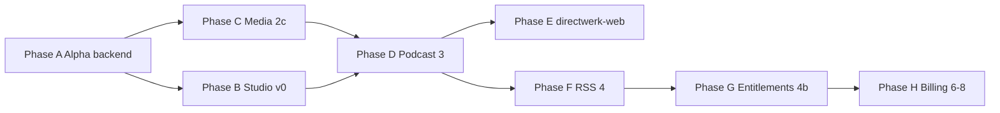
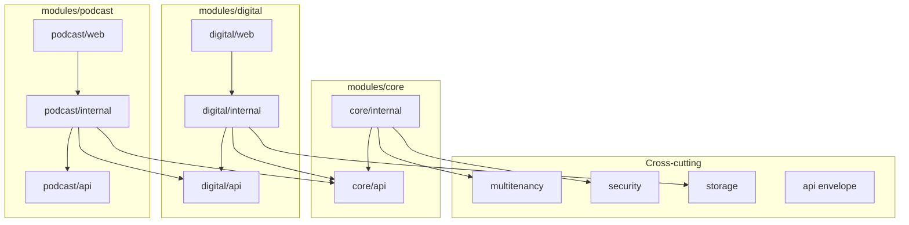
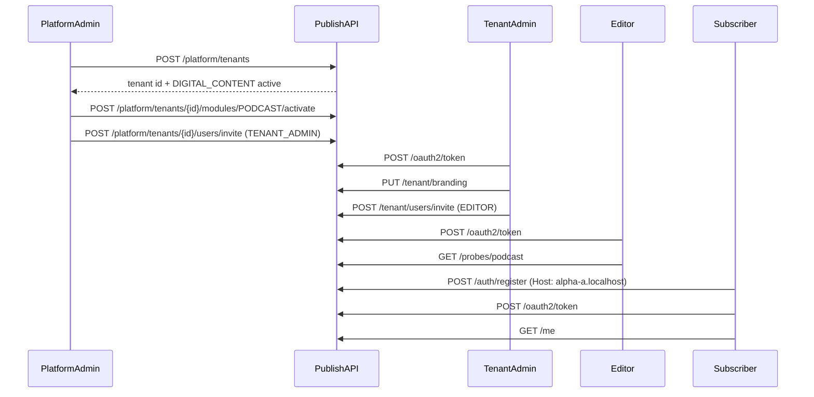

# Directwerk — Alpha / Proof-of-Concept Setup

Companion to [`README.md`](../README.md) (full platform design spec). This document defines the
**alpha POC slice** — the smallest runnable backend that proved tenancy, auth, module gates, and
storage before reference frontends shipped. **Historical reference** — the full stack is now shipped;
use it for local API setup and HTTP harness order.

| Document | Purpose |
|----------|---------|
| [`README.md`](../README.md) | Full product design — entities, phases, post-MVP addons |
| [`user-backend-implementation.md`](user-backend-implementation.md) | Spring Security / user account step-by-step guide |
| [`directwerk-studio-implementation.md`](directwerk-studio-implementation.md) | Studio implementation — screens, scaffold, auth, checklist |
| [`directwerk-admin-implementation.md`](directwerk-admin-implementation.md) | Platform admin dashboard step-by-step guide |
| [`asset-storage.md`](asset-storage.md) | S3 layout, upload/retrieve flows, `AssetAccessService`, EU providers |
| [`phase-2e-4-4b-implementation.md`](phase-2e-4-4b-implementation.md) | **Next backend plan** — stream (2e), RSS (4), entitlements (4b) |
| [`content-platform-strategy.md`](content-platform-strategy.md) | Blog/newsletter scope — publication platform, not a CMS |
| [`product-naming.md`](product-naming.md) | Public product name strategy |
| [`directwerk-studio.md`](directwerk-studio.md) | Creator dashboard — primary non-technical UX |
| **This document** | Alpha implementation blueprint + manual API test harness |

**Status (2026-08):** Phases A–G are shipped (backend, studio, web, RSS, entitlements, Stripe
scaffold). Use this doc for local setup and HTTP harness order — not as a greenfield backlog.

---

## Recommended work sequence

Ordered path from **zero code** to **creator-ready MVP**. Each step should be completable and
verifiable before starting the next. Checkboxes in [Implementation checklist (alpha)](#implementation-checklist-alpha)
map to **Phase A** below.



### Phase A — Alpha backend (completed)

**Goal:** Runnable Spring Boot app; all [`Directwerk/http/*.http`](../Directwerk/http/) files green. **No UI.**

| Step | What to do | Verify |
|------|------------|--------|
| A.1 | Scaffold Gradle 9 + Spring Boot 4.1.0; `docker-compose.dev.yml` (PostgreSQL only); `.env.local.example` for `S3_*` | `./gradlew build` compiles |
| A.2 | Flyway V1–V5 + `R__alpha_dev_seed.sql`; JSON response envelope + `GlobalExceptionHandler` | `./gradlew flywayMigrate` |
| A.3 | Package layout: `modules/{core,digital,podcast}/{api,internal,web}`; ArchUnit dependency rules | ArchUnit test passes |
| A.4 | `TenantContext`, resolver, filter, Hibernate `tenantFilter` + write guard | `15-multi-tenant-isolation.http` |
| A.5 | OAuth2 Authorization Server + Resource Server; register/login/reset; five roles | `05-tenant-auth.http`, `10-role-enforcement.http` |
| A.6 | `ModuleGateApi` + `ModuleActivationApi`; presets, deps, cascade; `@RequiresModule` | `03-platform-modules.http`, `08-module-probes.http` |
| A.7 | Platform + tenant controllers (tenants, modules, branding, domains, users) | `02`, `04`, `06`, `07` HTTP files |
| A.8 | S3 beans (Hetzner/Bunny dev bucket); `MediaAsset` + `AssetAccessApi` stub; `EntitlementApi` no-op | Storage integration test |
| A.9 | `platform_audit_events` on mutating platform actions | Manual check or test |
| A.10 | Run full HTTP harness in order (see [Recommended run order](#recommended-run-order)) | All scenarios pass |

**Stop when:** [Alpha success criteria](#alpha-success-criteria) are all checked.

---

### Phase B — Studio v0 (settings + team)

**Goal:** Non-technical tenant admin can manage branding, domains, and team in a browser.

**Depends on:** Phase A green.

| Step | What to do | Doc reference |
|------|------------|---------------|
| B.1 | Create `directwerk-studio/` — Next.js 16, login on tenant domain, OAuth2 token storage | [`directwerk-studio-implementation.md` § Frontend](directwerk-studio-implementation.md#frontend-architecture) |
| B.2 | Bootstrap from `GET /api/v1/public/site-config` — theme + `ModuleGate` nav | [`directwerk-studio.md`](directwerk-studio.md) |
| B.3 | Settings: branding editor, domain list/add | [`directwerk-studio-implementation.md` § Settings](directwerk-studio-implementation.md#10-settings) |
| B.4 | Team: list, invite editor, role patch | [`directwerk-studio-implementation.md` § Team](directwerk-studio-implementation.md#2-audience--team) |

**Verify:** Tenant admin completes flows without HTTP client.

---

### Phase C — Media upload (Phase 2c)

**Goal:** Editor uploads audio/images via pre-signed PUT; assets appear in API as `READY`.

**Depends on:** Phase A. Can parallel Phase B.

**Status:** Backend API + HTTP harness **shipped** (C.1, C.2, C.4). Studio media UI (C.3) **shipped**
(`/media`, upload, `MediaLibraryPicker`).

| Step | What to do | Doc reference |
|------|------------|---------------|
| C.1 | [x] `UploadService` — upload-url, confirm, promote `staging/` → `public\|private/` | [`asset-storage.md` § Upload flow](asset-storage.md#upload-flow) |
| C.2 | [x] `MediaController` — list, preview-url (signed for private) | [`content-creation-implementation.md` § 4.2](content-creation-implementation.md#42-rest-endpoints-publisher) |
| C.3 | [x] Studio v1: media library, upload, picker | [`content-creation-implementation.md` § 5](content-creation-implementation.md#5-frontend-implementation-directwerk-studio) |
| C.4 | [x] Add `17-media-upload.http` to harness | [`Directwerk/http/`](../Directwerk/http/) |

**Verify:** Upload MP3 → confirm → `GET` preview returns URL; cross-tenant denied
(`17-media-upload.http`). Studio: upload from `/media` and attach via picker in episode editor.

---

### Phase D — Podcast content (Phase 3) — MVP creator loop

**Goal:** Creator publishes an episode entirely in studio; public API lists it.

**Depends on:** Phase C (audio assets). Studio v0 (B) should exist.

| Step | What to do | Doc reference |
|------|------------|---------------|
| D.1 | [x] Flyway `V28__create_podcast_content.sql` — series, episodes, formats, categories | [`Directwerk/directwerk-podcast/README.md`](../Directwerk/directwerk-podcast/README.md) |
| D.2 | [x] CRUD controllers + `PublicationWorkflowService` + `HtmlSanitizer` | [`content-creation-implementation.md` § 4.1](content-creation-implementation.md#41-core-services) |
| D.3 | [x] Publish / schedule endpoints; asset promotion on publish | [`asset-storage.md`](asset-storage.md) |
| D.4 | [x] Studio v2: series list, episode editor, workflow actions, taxonomy | [`directwerk-studio-implementation.md` § Podcasts](directwerk-studio-implementation.md#7-content--podcasts) |
| D.5 | [x] Add `19-podcast-content.http` | [`Directwerk/http/`](../Directwerk/http/) |

**Verify:** [MVP success in directwerk-studio.md](directwerk-studio.md#mvp-success-creator-can-complete-without-api-knowledge).

---

### Phase E — Default public site (`directwerk-web`)

**Goal:** Visitors see published episodes on tenant domain; subscribers can register/login.

**Depends on:** Phase D (public episodes exist).

| Step | What to do | Doc reference |
|------|------------|---------------|
| E.1 | Scaffold `directwerk-web/` — `site-config` branding, episode list/detail | [README § directwerk-web](../README.md#reference-frontend-directwerk-web) |
| E.2 | Register/login flows via same OAuth2 client | README Auth API |
| E.3 | Subscriber portal shell (`/me/*`) — stub until Phase G | README Subscriber API |

---

### Phase F — RSS (Phase 4)

**Goal:** Free public feed + per-subscriber private feed URLs.

**Plan:** [`phase-2e-4-4b-implementation.md`](phase-2e-4-4b-implementation.md) (4a public → 4c private after 4b).

| Step | What to do |
|------|------------|
| F.1 | `PODCAST_RSS` module — public `podcast.xml` (FREE episodes only) |
| F.2 | `SubscriberFeed` — default private feed per user (`feedToken`) |
| F.3 | RSS enclosures via `AssetAccessService` — one signed URL per entitled episode |

---

### Phase G — Entitlements + products (Phase 4b)

**Goal:** LEVEL/PACKAGE products; gated streams and `/me/episodes`.

**Plan:** [`phase-2e-4-4b-implementation.md`](phase-2e-4-4b-implementation.md).

| Step | What to do |
|------|------------|
| G.1 | `SubscriptionProduct`, `ProductAccessRule`, real `EntitlementService` |
| G.2 | Private signed URLs for PAID episodes |
| G.3 | Studio v3: products, subscriber list, manual grants |

See [`asset-storage.md` § Group entitlements](asset-storage.md#group-entitlements-level-vs-package).

---

### Phase H — Billing integrations (Phases 6 + 8)

**Goal:** Stripe Connect checkout; Patreon/Steady dual-run sync.

| Step | What to do |
|------|------------|
| H.1 | [x] `STRIPE_BILLING` — Connect onboard, checkout, webhooks — see [`payment.md`](payment.md) |
| H.2 | [ ] `PATREON_SYNC` / `STEADY_SYNC` — OAuth, shadow users, entitlement mapping — see [`patreon-steady-integration.md`](patreon-steady-integration.md) |
| H.3 | `directwerk-admin` minimal UI for platform ops (Phase 5) |

---

### Phase I — Post-MVP (after creator MVP ships)

| Step | What to do | Doc reference |
|------|------------|---------------|
| I.1 | Feed builder (`FEED_BUILDER`) | README Feed Builder |
| I.2 | Articles + Markdown editor (Studio v4) | [`content-platform-strategy.md`](content-platform-strategy.md) |
| I.3 | `EMAIL_NOTIFY` — native ESP in studio | [`content-creation-implementation.md` § 6](content-creation-implementation.md#6-newsletter-implementation) |
| I.4 | Public product name decision | [`product-naming.md`](product-naming.md) |

---

### What to work on this week (if starting fresh)

1. **A.1–A.2** — project scaffold + migrations + seed data
2. **A.3–A.4** — tenancy (highest risk; prove isolation early)
3. **A.5** — Spring Security end-to-end
4. **A.6–A.7** — modules + platform/tenant APIs
5. **A.8–A.10** — S3 plumbing + full HTTP harness

Do **not** start `directwerk-studio` or podcast CRUD until **Phase A** checklist is complete.

---

**Alpha delivers:**

1. **Full multi-tenant** — shared DB, row-level `tenant_id`, `Host` + JWT resolution, cross-tenant rejection
2. **Module-based features** — vertical slices (`api` / `internal` / `web`), `ModuleGateApi`, `@RequiresModule`
3. **Composition-first codebase** — small reusable `api/` interfaces; no shared controller/service base classes
4. **Full Spring Security account handling** — OAuth2 Authorization Server + Resource Server, all five roles
5. **Storage foundation** — Hetzner/Bunny S3 client beans, `MediaAsset` schema, `AssetAccessApi` (see below)
6. **JetBrains HTTP Client** — [`../Directwerk/http/`](../Directwerk/http/) files to exercise every alpha flow locally

**Alpha explicitly defers:** Full upload/confirm pipeline, podcast CRUD, real entitlements (LEVEL /
PACKAGE), private signed URLs, RSS feeds, subscriptions, Stripe/Patreon/Steady, `directwerk-admin` UI,
`directwerk-web` UI, and `directwerk-studio` tenant dashboard (see
[`directwerk-studio-implementation.md`](directwerk-studio-implementation.md) — alpha ships **API only**; Studio v0 targets
the same `/api/v1/tenant/*` routes once alpha is green).

Full storage behaviour is specified in [`asset-storage.md`](asset-storage.md). Alpha ends with the
**plumbing** in place so Phase 2 starts at upload flows, not provider wiring.

### How this doc relates to recent additions

| Addition | What alpha adopts now | What stays deferred |
|----------|----------------------|---------------------|
| [`asset-storage.md`](asset-storage.md) — Hetzner/Bunny EU S3, no MinIO | Dev bucket wiring, `MediaAsset` schema, `AssetAccessApi` fail-closed stub | Upload/confirm (2c), signed private URLs (2d–2e), [group entitlements](asset-storage.md#group-entitlements-level-vs-package) (Phase 4b) |
| [`directwerk-studio-implementation.md`](directwerk-studio-implementation.md) — publisher back-office | API routes that Studio v0 will consume (`/tenant/branding`, `/tenant/domains`, `/tenant/users`) | Any Next.js UI in `directwerk-studio/` |
| Modular architecture (#197) | Vertical slices (`api` / `internal` / `web`), `ModuleGateApi` + `ModuleActivationApi` split | Extracting modules to separate deployables |
| README module catalog + presets | Full `feature_modules` seed, dependency graph, onboarding presets (`FREE_PODCAST`, etc.) | Billing modules beyond activation toggles |

**Naming note:** [`README.md`](../README.md) uses `ModuleService` for the runtime gate. In alpha code,
split responsibilities into **`ModuleGateApi`** (read-only: `isEnabled`, `enabledModuleKeys`) and
**`ModuleActivationApi`** (mutations: activate, deactivate, presets, cascade). Both live in
`modules/core/internal/`; consumers depend on the interfaces only.

---

## Architecture: separated modules, composition, reusable APIs

Alpha is a single deployable, but the **code must read like independent modules** with explicit
boundaries and small, composable APIs. Future phases add modules without rewriting core — extract
to services later only if scaling demands it.

### Composition before inheritance

| Prefer | Avoid |
|--------|-------|
| Constructor-injected collaborators (`private final TenantQueryApi tenantQuery`) | Deep class hierarchies (`BaseController`, `AbstractTenantService`) |
| Small focused interfaces in `{module}/api/` | “God” services that know every domain |
| Records / plain DTOs for HTTP and cross-module contracts | Shared mutable base entities with behaviour |
| Delegation and Spring AOP for cross-cutting concerns (`@RequiresModule`, Hibernate tenant filter) | Subclassing to reuse security, tenancy, or module checks |
| `Optional` / explicit exceptions from service methods | `null` returns or implicit side effects |

**Rule:** If reuse needs inheritance, extract an interface and compose it instead. Controllers never
extend other controllers; services never extend other services for behaviour — only for rare JPA
`MappedSuperclass` column sets when unavoidable (prefer embeddables).

### Module boundaries (vertical slices)

Each capability lives in a **vertical slice** under `de.pnnit.directwerk.modules.{name}`:

```
modules/{name}/
  api/          # Public Java contracts — other modules may depend ONLY on this package
  internal/     # Entities, repositories, service impls — module-private
  web/          # REST controllers + HTTP-scoped request/response records
```

**Cross-cutting packages** (not feature modules):

| Package | Role |
|---------|------|
| `multitenancy/` | `TenantContext`, resolver, filters — no domain logic |
| `security/` | OAuth2, principals, role helpers |
| `storage/` | S3 client beans, URL builders — no entitlement logic |
| `api/` | Shared HTTP envelope, pagination metadata, global `@ControllerAdvice` |
| `config/` | Spring `@Configuration` only |

Feature modules **do not** import each other's `internal/` or `web/` packages. They call each other
only through `api/` interfaces (or shared kernel APIs listed below).

### Dependency rules (enforce in reviews)



| From | May import | Must not import |
|------|------------|-----------------|
| `{module}/web/` | Same module `internal/`, `api/`, `api/` envelope, `security` principals | Other modules' `internal/` or `web/` |
| `{module}/internal/` | Same module `api/`, `modules/core/api/`, `multitenancy`, `storage` | Other feature modules' `internal/` |
| `{module}/api/` | JDK, validation annotations only | Spring Web, JPA entities, repositories |
| `modules/core/` | `multitenancy`, `security` | `modules/digital`, `modules/podcast` internals |
| `controller/platform/`, `controller/tenant/` | `modules/core/api/`, module `api/` surfaces | Module `internal/` directly |

**Platform controllers** (`controller/platform/`, `controller/tenant/`) orchestrate kernel APIs; they
do not reach into feature-module repositories.

### Reusable internal APIs (alpha)

Cross-module collaboration uses **narrow interfaces** in `{module}/api/`. Implementations live in
`{module}/internal/` and are registered as Spring beans implementing the interface.

| Interface | Module | Responsibility | Alpha consumers |
|-----------|--------|----------------|-----------------|
| `TenantQueryApi` | `core` | Resolve tenant by id, slug, host; read branding summary | `digital`, public controllers |
| `TenantAdminApi` | `core` | Create tenant, domains, branding updates | platform controllers |
| `ModuleGateApi` | `core` | `isEnabled(tenantId, moduleKey)`, `enabledModuleKeys(tenantId)`, `isEnabledForCurrentTenant(moduleKey)` | All gated modules, `site-config` |
| `ModuleActivationApi` | `core` | Activate/deactivate with dependency checks | platform module endpoints |
| `UserAccountApi` | `core` | Register, load principal, password reset | auth, invites |
| `TenantMembershipApi` | `core` | Roles per tenant, invite flows | tenant user endpoints |
| `AssetAccessApi` | `digital` | `resolveDownloadUrl(asset, principal)` — fail closed | probes, future media routes |
| `MediaAssetQueryApi` | `digital` | Tenant-scoped asset lookup by id | entitlement stub, tests |

Example — podcast probe composes digital + core, does not subclass them:

```java
// modules/podcast/internal/PodcastProbeService.java
@Service
@RequiredArgsConstructor
class PodcastProbeService {

    private final ModuleGateApi moduleGate;
    // Phase 3: private final EpisodeQueryApi episodes;

    ProbeStatus statusForCurrentTenant() {
        if (!moduleGate.isEnabledForCurrentTenant("PODCAST")) {
            throw new ModuleNotEnabledException("PODCAST");
        }
        return new ProbeStatus("PODCAST", "enabled");
    }
}
```

`ModuleGateApi` is the only dependency on module activation logic — not `ModuleActivationService`
or repositories.

### REST API layering (thin controllers)

HTTP adapters stay thin; reusable behaviour lives in services behind `api/` interfaces.

| Layer | Responsibility | Example |
|-------|----------------|---------|
| `web` controller | HTTP mapping, `@Valid`, status codes, `ResponseEntity` | `DigitalContentProbeController` |
| `api` interface | Stable contract for other modules / tests | `AssetAccessApi` |
| `internal` service | Business rules, transactions, repository access | `AssetAccessService` implements `AssetAccessApi` |
| `internal` repository | Persistence only | `MediaAssetRepository` |

Controllers return the shared envelope via a small helper (composition):

```java
@RestController
@RequestMapping("/api/v1/probes/digital")
@RequiredArgsConstructor
class DigitalContentProbeController {

    private final ModuleGateApi moduleGate;
    private final ResponseFactory responses; // api/response/ResponseFactory

    @GetMapping
    @PreAuthorize("hasAnyRole('EDITOR','TENANT_ADMIN')")
    @RequiresModule("DIGITAL_CONTENT")
    ProbeResponse probe() {
        if (!moduleGate.isEnabledForCurrentTenant("DIGITAL_CONTENT")) {
            throw new ModuleNotEnabledException("DIGITAL_CONTENT");
        }
        return new ProbeResponse("DIGITAL_CONTENT", "enabled");
    }
}
```

No shared `BaseRestController` — inject `ResponseFactory` where needed.

### Module registration (alpha)

`ModuleGateApi` reads activations from DB today. Optional alpha enhancement: modules self-describe
probe routes via a `ModuleDescriptor` record registered at startup (composition registry), so
`site-config` and OpenAPI stay in sync without hard-coded module lists in core.

---

## Alpha success criteria

When alpha is complete, a developer can run the stack locally and verify:

- [x] Two tenants (`alpha-show-a`, `alpha-show-b`) on one deployment with **zero cross-tenant leakage**
- [x] **Module boundaries** — Gradle modules + ArchUnit tenancy/auth rules (folder layout evolved from original `api/internal/web` sketch)
- [x] **Composition** — no `BaseController` / `BaseService`; digital contracts via `modules.digital.api`
- [x] Platform admin creates tenants (with optional `modulePreset`), suspends/reactivates, activates modules, applies presets, invites tenant admins
- [x] Module dependency enforcement — activating `FEED_BUILDER` without prerequisites → `400/409` with `code: MODULE_DEPENDENCY_MISSING`
- [x] Module deactivation cascades dependents (e.g. deactivate `PODCAST` → `PODCAST_RSS`, `FEED_BUILDER` disabled)
- [x] Mutating platform actions write `platform_audit_events` (V4 migration); list via `GET /api/v1/platform/audit`
- [x] Users register per tenant; JWT contains correct `tenant_id` and role claims
- [x] `PLATFORM_ADMIN` → `/api/v1/platform/**` only; tenant roles cannot access platform routes
- [x] `TENANT_ADMIN` can invite `EDITOR` and manage tenant branding/domains
- [x] `EDITOR` can call publisher-scoped stub endpoints; `SUBSCRIBER` cannot
- [x] Module disabled → `403` with `code: FEATURE_NOT_ENABLED`
- [x] `GET /api/v1/public/site-config` returns branding + `enabledModules[]` resolved via `Host`
- [x] Storage config + conditional `S3Client` / health indicator (`directwerk.storage.enabled=true` + credentials)
- [x] `media_assets` table exists (V25); row-level `tenant_id` guard rejects cross-tenant asset lookup
- [x] Storage `EntitlementApi` stub returns `false` for paid content (group rules deferred to Phase 4b)
- [ ] All scenarios pass via JetBrains HTTP Client ([`../Directwerk/http/`](../Directwerk/http/)) — operator run against local seed

---

## Alpha vs asset storage phases

[`asset-storage.md`](asset-storage.md) owns the full storage design. This table maps **alpha** to
subsequent implementation phases:

| Concern | Alpha (this doc) | [`asset-storage.md`](asset-storage.md) phase |
|---------|------------------|-----------------------------------------------|
| Hetzner/Bunny dev bucket (`directwerk-dev`) | Yes — via `.env.local` | 2a (same providers in staging/prod) |
| `S3StorageProperties`, `S3Client`, `S3Presigner` | Beans wired, dev profile | 2a |
| `MediaAsset` entity + Flyway | Minimal schema (`tenant_id`, `s3_key`, `visibility`, `scope`, `status`) | 2b (`V4__create_digital_content.sql`) |
| Pre-signed PUT upload + confirm | **No** — stub `UploadService` interface only | 2c |
| `AssetAccessService` | Class exists; **public** CDN URLs only; private → `403` via stub | 2d, 2e |
| `EntitlementService` | No-op stub (`hasAccess` → false for paid content) | 2d stub; real logic Phase 4b |
| Group entitlements (LEVEL / PACKAGE) | **No** | [Group entitlements](asset-storage.md#group-entitlements-level-vs-package) + README |
| Episode stream / RSS signing | **No** | 2e, Phase 4 |
| Probe endpoints | `/api/v1/probes/digital` tests module gate only | Replace with `/api/v1/media/*` in 2c |

**Flyway numbering note:** Alpha uses `V4__alpha_audit.sql` (platform audit) and
`V5__create_media_assets.sql` (storage foundation) because audit ships in the POC slice.
[`asset-storage.md`](asset-storage.md) phase **2b** refers to the same `MediaAsset` table under
`V4__create_digital_content.sql` in the post-alpha numbering — do not create duplicate tables; merge
migration files when implementing Phase 2 if versions diverge.

**Key layout** (fixed in alpha — do not invent alternate paths):

```
{bucket}/{tenant_slug}/public|private|staging|user/...
```

See [Key layout and asset scopes](asset-storage.md#key-layout-and-asset-scopes).

---

## Local environment

### Prerequisites

| Tool | Version |
|------|---------|
| JDK | 21+ |
| Gradle | 9.x |
| Docker | PostgreSQL 19 only (S3: Hetzner or Bunny dev bucket via `.env.local`) |

### Start dependencies

> **Current runbook:** use [`../Directwerk/docs/build-and-deploy.md`](../Directwerk/docs/build-and-deploy.md)
> (`compose.yaml` = Postgres + Mailpit, profile `local`). The commands below are the historical
> alpha sketch; prefer the Directwerk guide.

```sh
cd Directwerk
cp .env.example .env
docker compose up -d
./gradlew :directwerk-app:bootRun
```

| Service | URL |
|---------|-----|
| API | `http://localhost:8080` |
| Swagger UI | `http://localhost:8080/swagger-ui.html` |
| Actuator health | `http://localhost:8080/actuator/health` |
| Mailpit UI | `http://127.0.0.1:8025` |

S3 is **not** in Docker. Configure a dev bucket on [Hetzner Object Storage](asset-storage.md#recommended-hetzner-object-storage) or [Bunny.net](asset-storage.md#alternative-bunnynet-storage-s3-compatible) and set `S3_*` env vars per [`asset-storage.md` § Dev profile](asset-storage.md#dev-profile-application-devyml).

Copy `.env.local.example` → `.env.local` (gitignored) with at minimum:

| Variable | Purpose |
|----------|---------|
| `S3_ENDPOINT` | Provider endpoint (region-specific) |
| `S3_BUCKET` | Dev bucket name (`directwerk-dev`) |
| `S3_ACCESS_KEY` | Hetzner access key or Bunny zone name |
| `S3_SECRET_KEY` | Hetzner secret key or Bunny zone password |
| `S3_PUBLIC_CDN_BASE_URL` | CDN/base URL for `{tenant}/public/` assets |

CI unit tests mock `S3Client` / `S3Presigner` — no network calls. Optional nightly integration job
may use the dev bucket with CI-injected credentials ([`asset-storage.md` § Dev / local / CI](asset-storage.md#dev--local--ci)).

### Dev tenant hosts

Alpha seeds two tenants with local domains (mapped via `/etc/hosts` or JetBrains `Host` header):

```hosts
127.0.0.1 alpha-a.localhost alpha-b.localhost
::1       alpha-a.localhost alpha-b.localhost
```

| Tenant slug | Primary domain | Purpose |
|-------------|----------------|---------|
| `alpha-show-a` | `alpha-a.localhost` | Primary test tenant |
| `alpha-show-b` | `alpha-b.localhost` | Isolation / cross-tenant tests |

Platform admin login uses the API host directly (`localhost:8080`) — no tenant `Host` header.

### Seed data (Flyway `R__alpha_dev_seed.sql` or `dev` profile runner)

| Entity | Value |
|--------|-------|
| Platform admin | `platform-admin@directwerk.local` / `ChangeMe-Platform-Admin!` |
| Tenant A admin (pre-invited) | `admin-a@alpha-show.local` / `ChangeMe-Tenant-Admin!` |
| Tenant B admin | `admin-b@alpha-show.local` / `ChangeMe-Tenant-Admin!` |
| Tenant A editor (pre-invited) | `editor@alpha-show.local` / `ChangeMe-Editor!` |
| Tenant A subscriber (register via HTTP) | `subscriber@alpha-show.local` / `ChangeMe-Subscriber!` |

Seed credentials match [`Directwerk/http/http-client.env.json`](../Directwerk/http/http-client.env.json). Tenant A starts
with `DIGITAL_CONTENT` + `PODCAST` active (for probe tests); tenant B starts with
`DIGITAL_CONTENT` only (for dependency / isolation tests).

> Passwords are **dev-only**. Never use these in staging or production.

---

## Package layout (alpha scope)

Vertical slices with explicit `api` / `internal` / `web` layers. See
[Architecture](#architecture-separated-modules-composition-reusable-apis) for dependency rules.

```
src/main/java/de/pnnit/publish/
  api/
    response/Response.java, ResponseFactory.java, ErrorDetail.java
    exception/GlobalExceptionHandler.java
  config/
    OpenApiConfig.java
    CacheConfig.java
  security/
    AuthorizationServerConfig.java
    ResourceServerConfig.java
    SecurityFilterChainConfig.java
    PublishUserDetailsService.java
    PublishUserPrincipal.java
    JwtTenantCustomizer.java
    PlatformAdminAuthenticationConverter.java
    SecurityUtils.java
  multitenancy/
    TenantContext.java
    TenantResolver.java
    TenantContextFilter.java
    TenantHibernateFilterEnabler.java / TenantWriteGuardListener.java
    TenantNotFoundException.java
  storage/
    S3StorageProperties.java
    S3ClientConfig.java
    S3PublicUrlBuilder.java
  modules/
    core/
      api/
        TenantQueryApi.java
        TenantAdminApi.java
        ModuleGateApi.java
        ModuleActivationApi.java
        UserAccountApi.java
        TenantMembershipApi.java
      internal/
        entity/Tenant.java, TenantDomain.java, TenantBranding.java
        entity/FeatureModule.java, TenantModuleActivation.java
        entity/User.java, TenantMembership.java, PlatformAdmin.java
        service/TenantQueryService.java          # implements TenantQueryApi
        service/TenantAdminService.java          # implements TenantAdminApi
        service/ModuleGateService.java           # implements ModuleGateApi
        service/ModuleActivationService.java     # implements ModuleActivationApi
        service/UserAccountService.java          # implements UserAccountApi
        service/TenantMembershipService.java     # implements TenantMembershipApi
        service/PlatformAuditService.java        # writes platform_audit_events
        aspect/ModuleProtectionAspect.java
        annotation/RequiresModule.java
        repository/...
      web/
        PublicSiteConfigController.java
        AuthController.java
        MeController.java
    digital/                                    # DIGITAL_CONTENT module
      api/
        AssetAccessApi.java
        MediaAssetQueryApi.java
        UploadApi.java                            # interface — impl Phase 2c
        EntitlementApi.java                       # interface — stub Phase 4b
      internal/
        entity/MediaAsset.java
        service/AssetAccessService.java           # implements AssetAccessApi
        service/MediaAssetQueryService.java
        service/UploadServiceStub.java
        service/EntitlementServiceStub.java
        repository/MediaAssetRepository.java
      web/
        DigitalContentProbeController.java
    podcast/                                    # PODCAST module (probe only in alpha)
      api/
        PodcastProbeApi.java                    # optional; or inline in internal for alpha
      internal/
        service/PodcastProbeService.java
      web/
        PodcastProbeController.java
  controller/
    platform/                                     # orchestrates core/api only
      PlatformTenantController.java
      PlatformModuleController.java
      PlatformUserController.java
      PlatformAdminController.java
    tenant/
      TenantBrandingController.java
      TenantDomainController.java
      TenantUserController.java
```

**Alpha simplification:** `podcast/api/` may be omitted if the probe is a single controller method —
but `podcast/internal` must still not import `digital/internal` (use `ModuleGateApi` + future
`EpisodeQueryApi` from `digital/api` or `podcast/api`).

Probe controllers return `200 { "module": "PODCAST", "status": "enabled" }` when the module is
active — enough to test gating without building full content pipelines.

---

## Asset storage foundation (alpha)

Implement the items below so Phase 2 can focus on upload/confirm flows per
[`asset-storage.md`](asset-storage.md). Alpha does **not** expose working upload endpoints yet.

### Principles (from asset storage doc)

| Rule | Alpha enforcement |
|------|-------------------|
| All bytes in S3 — never DB BLOBs | `MediaAsset` stores metadata + `s3_key` only |
| Keys start with `{tenant_slug}/` | Validate in repository + `AssetAccessService` |
| Private assets never get stable public URLs | `AssetAccessService` returns `403` for `visibility=PRIVATE` until Phase 2d |
| Per-asset access later — not prefix grants | No `ListObjects` API; no subscriber media routes in alpha |
| EU providers everywhere | Hetzner or Bunny dev bucket locally; `S3StorageProperties.provider` = `hetzner` or `bunny` |

### `MediaAsset` (alpha migration `V25__create_media_assets.sql`)

> **Note:** Early drafts called this `V5__create_media_assets.sql`. V5 was used for domain timestamps;
> media assets ship as **V25** in `directwerk-app`.

Minimum columns aligned with [`asset-storage.md`](asset-storage.md#mediaasset-fields-storage-relevant):

| Column | Notes |
|--------|-------|
| `id`, `tenant_id` | FK tenants; index on `tenant_id` |
| `s3_key` | Unique per `(tenant_id, s3_key)` |
| `visibility` | `PUBLIC`, `PRIVATE` |
| `scope` | `TENANT_PUBLIC`, `CONTENT`, `USER`, `SYSTEM` |
| `asset_type` | `AUDIO`, `IMAGE`, `VIDEO`, `DOCUMENT` |
| `status` | `PENDING`, `READY`, `ARCHIVED` |
| `owner_user_id` | Nullable; required when `scope = USER` |
| `episode_id` | Nullable — wired in Phase 3 |

Defer `mime_type`, `checksum_sha256`, `file_size_bytes` to Phase 2b if preferred; include if
cheap.

### `EntitlementApi` (alpha stub)

Real LEVEL / PACKAGE logic lives in [`asset-storage.md` § Group entitlements](asset-storage.md#group-entitlements-level-vs-package)
and README subscription entities — **not** in S3 prefixes. Target interface:
[`asset-storage.md` § Entitlement API contract](asset-storage.md#entitlement-api-contract-storage-layer).

**Alpha today:** [`EntitlementService`](../Directwerk/directwerk-subscription/src/main/java/de/pnnit/directwerk/modules/subscription/service/EntitlementService.java)
implements LEVEL summary only (`resolveAccess`, `hasLevelAtLeast`). `hasAccess(contentId)` and
`ProductAccessRule` are **Phase 4b**. Storage uses [`FailClosedEntitlementApi`](../Directwerk/directwerk-digital/src/main/java/de/pnnit/directwerk/modules/digital/service/FailClosedEntitlementApi.java):

```java
// FailClosedEntitlementApi.java — implements EntitlementApi
@Override
public boolean hasAccess(Long tenantId, Long userId, Long episodeId) {
    return false; // fail closed until Phase 4b
}

@Override
public boolean hasDigitalAssetAccess(Long tenantId, Long userId, Long mediaAssetId) {
    return false; // fail closed until Phase 4b
}
```

`AssetAccessService` routes private `CONTENT` assets to the matching entitlement check before
signing. The required tenant module gate check runs BEFORE any entitlement API call:

1. **Module gate check first** — Return `403 FEATURE_NOT_ENABLED` when the `SUBSCRIPTION` module (for paid episode-linked assets) or `PODCAST` module (for all episode-linked assets) is disabled
2. **Episode-linked audio** (`asset.episodeId != null`) → `entitlementApi.hasAccess(tenantId, userId, episodeId)`
3. **Standalone digital files** (`asset.episodeId == null`, e.g. bonus PDF) →
  `entitlementApi.hasDigitalAssetAccess(tenantId, userId, mediaAssetId)`

All paths must pass the module gate check and entitlement check before `S3Presigner.presignGet()`. The alpha stub returns `false`
for both entitlement methods — private assets always return `403 ENTITLEMENT_DENIED` after module checks pass.

### `AssetAccessApi` (alpha behaviour)

`AssetAccessService` in `modules/digital/internal/` implements `AssetAccessApi`:

```java
@Override
public URL resolveDownloadUrl(MediaAsset asset, PublishUserPrincipal principal) {
    assertTenantMatch(asset);
    if (asset.getVisibility() == Visibility.PUBLIC) {
        return publicUrlBuilder.cdnUrl(asset.getS3Key());
    }
    if (asset.getScope() == AssetScope.CONTENT) {
        // Module gate check BEFORE entitlement
        if (asset.getEpisodeId() != null) {
            moduleGateService.requireModule(asset.getTenantId(), "PODCAST");
            // For paid content, also require SUBSCRIPTION module
            Episode episode = episodeRepository.findById(asset.getEpisodeId()).orElseThrow();
            if (episode.getAccessPolicy() != AccessPolicy.FREE) {
                moduleGateService.requireModule(asset.getTenantId(), "SUBSCRIPTION");
            }
        }
        boolean entitled = asset.getEpisodeId() != null
                ? entitlementApi.hasAccess(asset.getTenantId(), principal.getUserId(), asset.getEpisodeId())
                : entitlementApi.hasDigitalAssetAccess(
                        asset.getTenantId(), principal.getUserId(), asset.getId());
        if (!entitled) {
            throw new EntitlementDeniedException(asset.getId());
        }
    }
    // Alpha: other private scopes and presign wiring land in Phase 2d
    throw new EntitlementDeniedException(asset.getId());
}
```

Integration test: seed a `PUBLIC` asset for tenant A; verify tenant B principal cannot load the row
or resolve URL via `AssetAccessApi` (inject interface, not concrete class).

### Dev bucket setup

Create bucket `directwerk-dev` once in Hetzner Console or Bunny dashboard (enable S3 compatibility
on Bunny at zone creation). Lifecycle rule for `*/staging/*` deferred to Phase 2c.

`docker-compose.dev.yml` runs **PostgreSQL only** — no object-storage container.

### Alpha storage test scenarios

1. Application starts with `spring.profiles.active=dev` and connects to Hetzner/Bunny dev bucket
2. `MediaAsset` insert with `s3_key = alpha-show-a/public/images/test.jpg` respects `tenant_id`
3. Cross-tenant read of `MediaAsset` by id → empty or 404
4. `resolveDownloadUrl` for `PUBLIC` asset returns CDN/base URL from dev bucket
5. `resolveDownloadUrl` for `PRIVATE` asset → `403 ENTITLEMENT_DENIED` (stub)

HTTP tests for upload (`17-media-upload.http`) ship with **Phase 2c**, not alpha.

---

## Multi-tenancy (alpha)

Follow the shared-database, row-level isolation pattern from
[`projects/courses/README.md`](../../courses/README.md).

### Resolution matrix

| Request type | Tenant resolution | Validation |
|--------------|-------------------|------------|
| `/api/v1/public/**` | `Host` → `tenant_domains.host` | No JWT required |
| `/api/v1/auth/register` | `Host` | Membership created for resolved tenant |
| `/oauth2/token` | Optional `Host` or `tenant_id` in login context | Membership must exist for tenant |
| Authenticated tenant API | JWT claim `tenant_id` | Must match `Host` when both present |
| `/api/v1/platform/**` | **No tenant** — `TenantContext` cleared | `PLATFORM_ADMIN` only |

### TenantContext lifecycle

```java
// TenantContextFilter — after JWT authentication, before controllers
Long jwtTenantId = extractTenantId(authentication);
if (requestPath.startsWith("/api/v1/platform/")) {
    TenantContext.clear();
} else if (isPublicPath(requestPath)) {
    tenantResolver.resolveFromHost(request).ifPresent(t -> TenantContext.setTenantId(t.getId()));
} else {
    Tenant tenant = tenantResolver.resolveFromHost(request)
        .orElseThrow(() -> new TenantNotFoundException(request.getServerName()));
    if (jwtTenantId != null && !jwtTenantId.equals(tenant.getId())) {
        throw new TenantMismatchException();
    }
    TenantContext.setTenantId(tenant.getId());
}
// finally block: TenantContext.clear()
```

### Row-level guards

Every tenant-owned table includes `tenant_id NOT NULL`. Isolation is enforced by:

1. Explicit service/repository methods (`findByIdAndTenantId…`)
2. Hibernate `tenantFilter` on `TenantOwned` entities (enabled when `TenantContext` is set)
3. `TenantWriteGuardListener` on persist/update
4. Integration tests (`TenantHibernateFilterIT`, `http/15-multi-tenant-isolation.http`)

See [`../Directwerk/docs/multi-tenancy.md`](../Directwerk/docs/multi-tenancy.md).

### Alpha API surface (tenancy)

| Method | Path | Auth | Description |
|--------|------|------|-------------|
| GET | `/api/v1/public/site-config` | `Host` | Branding + `enabledModules` |
| GET | `/api/v1/tenant/branding` | `TENANT_ADMIN` | Current tenant branding |
| PUT | `/api/v1/tenant/branding` | `TENANT_ADMIN` | Update branding (`primaryColor`, `secondaryColor`, `logoUrl`, `siteTitle`, `footerHtml`) |
| GET | `/api/v1/tenant/domains` | `TENANT_ADMIN` | List domains |
| POST | `/api/v1/tenant/domains` | `TENANT_ADMIN` | Add domain |
| GET | `/api/v1/tenant/users` | `TENANT_ADMIN` | List tenant members |
| POST | `/api/v1/tenant/users/invite` | `TENANT_ADMIN` | Invite editor or admin |
| PATCH | `/api/v1/tenant/users/{userId}` | `TENANT_ADMIN` | Change role; cannot demote last admin |
| GET | `/api/v1/platform/tenants` | `PLATFORM_ADMIN` | List all tenants (paginated) |
| POST | `/api/v1/platform/tenants` | `PLATFORM_ADMIN` | Create tenant (+ optional `modulePreset`) |
| GET | `/api/v1/platform/tenants/{id}` | `PLATFORM_ADMIN` | Tenant detail |
| POST | `/api/v1/platform/tenants/{id}/suspend` | `PLATFORM_ADMIN` | Suspend tenant |
| POST | `/api/v1/platform/tenants/{id}/reactivate` | `PLATFORM_ADMIN` | Reactivate tenant |
| GET | `/api/v1/platform/modules` | `PLATFORM_ADMIN` | Full module catalog + `depends_on` |
| GET | `/api/v1/platform/tenants/{id}/modules` | `PLATFORM_ADMIN` | Tenant active modules |
| POST | `/api/v1/platform/tenants/{id}/modules/{moduleKey}/activate` | `PLATFORM_ADMIN` | Activate (validates deps) |
| DELETE | `/api/v1/platform/tenants/{id}/modules/{moduleKey}` | `PLATFORM_ADMIN` | Deactivate + cascade |
| POST | `/api/v1/platform/tenants/{id}/modules/preset/{presetKey}` | `PLATFORM_ADMIN` | Apply preset bundle |
| GET | `/api/v1/platform/tenants/{id}/users` | `PLATFORM_ADMIN` | List tenant users (platform view) |
| POST | `/api/v1/platform/tenants/{id}/users/invite` | `PLATFORM_ADMIN` | Invite tenant admin |
| GET | `/api/v1/platform/admins` | `PLATFORM_ADMIN` | List platform admins |
| POST | `/api/v1/platform/admins/invite` | `PLATFORM_ADMIN` | Invite platform admin |

Tenant admin routes above are the **Studio v0** backend surface per
[`directwerk-studio-implementation.md` § Phased delivery](directwerk-studio-implementation.md#phased-delivery).

---

## Feature modules (alpha)

Runtime gating in a single monolith — modules are **not** separate deployables, but each module is a
**separate vertical slice** with an `api/` contract. See
[Architecture](#architecture-separated-modules-composition-reusable-apis).

### Seed modules (Flyway `V3`)

Seed the **full MVP catalog** from README [Module Catalog](../README.md#module-catalog) — alpha
exercises activation, dependencies, presets, and gating even when a module has no probe endpoint yet.

| module_key | is_core | depends_on | Alpha probe / behaviour |
|------------|---------|------------|-------------------------|
| `DIGITAL_CONTENT` | true | `[]` | `GET /api/v1/probes/digital` |
| `PODCAST` | false | `["DIGITAL_CONTENT"]` | `GET /api/v1/probes/podcast` |
| `PODCAST_RSS` | false | `["PODCAST"]` | *(deferred — no RSS in alpha)* |
| `FEED_BUILDER` | false | `["PODCAST_RSS", "SUBSCRIPTION"]` | Dependency tests only ([`03-platform-modules.http`](../Directwerk/http/03-platform-modules.http)) |
| `SUBSCRIPTION` | false | `["DIGITAL_CONTENT"]` | Activation toggle only |
| `STRIPE_BILLING` | false | `["SUBSCRIPTION"]` | Activation toggle only |
| `PATREON_SYNC` | false | `["SUBSCRIPTION"]` | Activation toggle only |
| `STEADY_SYNC` | false | `["SUBSCRIPTION"]` | Activation toggle only |
| `WHITELABEL` | false | `[]` | Branding/domains routes (always compiled; gated where applicable) |
| `ANALYTICS` | false | `["DIGITAL_CONTENT"]` | Seed row; platform kill-switch `active=false` until post-MVP |
| `EMAIL_NOTIFY` | false | `["PODCAST_RSS", "SUBSCRIPTION"]` | Seed row; platform kill-switch `active=false` until post-MVP |

On tenant creation, `DIGITAL_CONTENT` is auto-activated. Platform admin activates others via
`/api/v1/platform/tenants/{id}/modules/{moduleKey}/activate` or a preset.

### Onboarding presets (alpha)

Presets bundle module activations for common onboarding paths (see README
[Dashboard API](../README.md#modules)). Alpha HTTP tests use `FREE_PODCAST`:

| Preset | Modules activated |
|--------|-------------------|
| `FREE_PODCAST` | `DIGITAL_CONTENT`, `PODCAST`, `PODCAST_RSS`, `WHITELABEL` |
| `PATREON_MIGRATOR` | `FREE_PODCAST` modules + `SUBSCRIPTION`, `PATREON_SYNC` |
| `PRO` | `FREE_PODCAST` + `SUBSCRIPTION`, `FEED_BUILDER`, `STRIPE_BILLING` |
| `ENTERPRISE` | `PRO` + `PATREON_SYNC`, `STEADY_SYNC`, `ANALYTICS` |

`POST /tenants` accepts optional `"modulePreset": "FREE_PODCAST"`. Presets validate dependencies
before activation; partial failures roll back the batch.

### Deactivation cascades

When deactivating a module, `ModuleActivationApi` disables **dependents first** (see README
[Deactivation cascades](../README.md#module-dependencies)):

| Deactivate | Also disables |
|------------|---------------|
| `PODCAST` | `PODCAST_RSS`, `FEED_BUILDER`, `EMAIL_NOTIFY` |
| `PODCAST_RSS` | `FEED_BUILDER`, `EMAIL_NOTIFY` |
| `SUBSCRIPTION` | `FEED_BUILDER`, `STRIPE_BILLING`, `PATREON_SYNC`, `STEADY_SYNC`, `EMAIL_NOTIFY` |
| `DIGITAL_CONTENT` | **Rejected** — `CannotDeactivateCoreModuleException` |

### ModuleGateApi + aspect

Implement gating as specified in README [Feature Modules](../README.md#feature-modules) — alpha code
uses `ModuleGateApi` / `ModuleActivationApi` instead of a monolithic `ModuleService`:

- `ModuleGateService` implements `ModuleGateApi` in `modules/core/internal/`
- `ModuleActivationService` implements `ModuleActivationApi` — activate, deactivate, presets, cascade
- `@Cacheable("tenantModules")` on `enabledModuleKeys(tenantId)` inside `ModuleGateService`
- Other modules depend on `ModuleGateApi` only — not on `ModuleActivationService` or repositories
- `ModuleProtectionAspect` delegates to `ModuleGateApi` → `ModuleNotEnabledException` → HTTP 403:

```json
{
  "statusCode": 403,
  "statusMessage": "Forbidden",
  "data": null,
  "errors": [{ "code": "FEATURE_NOT_ENABLED", "message": "Module PODCAST is not active for this tenant", "field": null }],
  "metadata": {}
}
```

- `SecurityUtils.isPlatformAdmin()` bypasses module checks (support/debug only)

### Alpha test scenarios (modules)

1. Tenant A with only `DIGITAL_CONTENT` → probe `/probes/digital` = 200, `/probes/podcast` = 403
2. Activate `PODCAST` on tenant A → `/probes/podcast` = 200
3. Activate `FEED_BUILDER` on tenant B (no `PODCAST_RSS` / `SUBSCRIPTION`) → `400/409` with `MODULE_DEPENDENCY_MISSING`
4. Apply `FREE_PODCAST` preset on new tenant → `PODCAST`, `PODCAST_RSS`, `WHITELABEL` active
5. Activate `PODCAST` without `DIGITAL_CONTENT` → `DependencyNotActiveException` (should be impossible — core always on)
6. Deactivate `DIGITAL_CONTENT` → rejected (`CannotDeactivateCoreModuleException`)
7. Deactivate `PODCAST` → cascades to `PODCAST_RSS`; `/probes/podcast` = 403 again
8. Re-activate `PODCAST` after probe test → `/probes/podcast` = 200 ([`08-module-probes.http`](../Directwerk/http/08-module-probes.http))

---

## Spring Security — full account handling (alpha)

**All auth via Spring Security.** No custom JWT utilities, no parallel auth stack.

### Architecture

| Component | Starter / class | Responsibility |
|-----------|-----------------|----------------|
| Authorization Server | `spring-boot-starter-oauth2-authorization-server` | `/oauth2/token`, JWT signing, refresh tokens |
| Resource Server | `spring-boot-starter-oauth2-resource-server` | Validate JWT on protected routes |
| UserDetailsService | `PublishUserDetailsService` | Load `User` + roles for current tenant |
| Principal | `PublishUserPrincipal` | `userId`, `email`, `tenantId`, `GrantedAuthority` list |
| Password hashing | `BCryptPasswordEncoder` (strength 12) | Registration, login, reset |
| Method security | `@EnableMethodSecurity` | `@PreAuthorize("hasRole('TENANT_ADMIN')")` |

### Role model

| Role | Spring authority | Scope | Alpha capabilities |
|------|------------------|-------|-------------------|
| `PLATFORM_ADMIN` | `ROLE_PLATFORM_ADMIN` | Global (no tenant) | Platform CRUD, module activation, platform admin invite |
| `TENANT_ADMIN` | `ROLE_TENANT_ADMIN` | Single tenant | Branding, domains, invite editors, all editor capabilities |
| `EDITOR` | `ROLE_EDITOR` | Single tenant | Publisher probe endpoints, content prep (stubs) |
| `SUBSCRIBER` | `ROLE_SUBSCRIBER` | Single tenant | `/api/v1/me/**`, register/login |
| `GUEST` | *(unauthenticated)* | Single tenant | Public endpoints only |

Roles are stored per `TenantMembership` (tenant-scoped) except `PLATFORM_ADMIN` which lives in
`platform_admins` (global).

A user may hold **multiple roles** on one membership (e.g. `TENANT_ADMIN` + `EDITOR`) — uncommon
but supported via JSONB `roles[]` or `tenant_membership_roles` join table.

### Data model (alpha migrations)

**`users`** — global account (one email, many tenant memberships):

| Column | Notes |
|--------|-------|
| `email` | Unique globally |
| `password_hash` | BCrypt; nullable only for shadow users (post-alpha) |
| `status` | `ACTIVE`, `PENDING_VERIFICATION`, `DISABLED` |

**`tenant_memberships`**:

| Column | Notes |
|--------|-------|
| `user_id`, `tenant_id` | Unique pair |
| `roles` | JSONB array: `["SUBSCRIBER"]`, `["EDITOR"]`, `["TENANT_ADMIN"]` |
| `status` | `ACTIVE`, `INVITED`, `DISABLED` |

**`platform_admins`**:

| Column | Notes |
|--------|-------|
| `user_id` | FK → users |
| `granted_at`, `granted_by` | Audit |

### OAuth2 clients (alpha)

Register two first-party clients in `AuthorizationServerConfig`:

| client_id | Use | Grant types |
|-----------|-----|-------------|
| `directwerk-tenant-frontend` | Tenant-domain logins | `password`, `refresh_token` |
| `directwerk-platform-admin` | Superadmin dashboard / HTTP tests | `password`, `refresh_token` |

JWT access token claims:

```json
{
  "sub": "42",
  "email": "user@example.com",
  "tenant_id": 1,
  "roles": ["TENANT_ADMIN", "EDITOR"],
  "iss": "http://localhost:8080",
  "aud": "directwerk-api"
}
```

Platform admin tokens **omit** `tenant_id` (or set `null`) and include `"roles": ["PLATFORM_ADMIN"]`.

### Auth endpoints (alpha)

| Method | Path | Auth | Description |
|--------|------|------|-------------|
| POST | `/api/v1/auth/register` | `Host` | Create user + `SUBSCRIBER` membership |
| POST | `/oauth2/token` | Client basic auth | Password grant / refresh |
| POST | `/api/v1/auth/forgot-password` | `Host` | Queue reset email (log token in dev) |
| POST | `/api/v1/auth/reset-password` | `Host` | Set new password, revoke refresh tokens |
| GET | `/api/v1/me` | JWT | Profile + roles for current tenant |

Registration flow:

1. Resolve tenant from `Host`
2. Validate email/password (`@Valid`, min length, breach check post-alpha)
3. `userAccountService.register(email, password, tenantId)` → `User` + `TenantMembership(ROLE_SUBSCRIBER)`
4. Return `201` — client obtains token via `/oauth2/token`

### Protected route policy (alpha)

| Path pattern | Rule |
|--------------|------|
| `/api/v1/public/**`, `/actuator/health`, `/swagger-ui/**`, `/v3/api-docs/**` | `permitAll` |
| `/oauth2/token`, `/.well-known/**` | Authorization Server public |
| `/api/v1/platform/**` | `hasRole('PLATFORM_ADMIN')` |
| `/api/v1/tenant/**` | `hasRole('TENANT_ADMIN')` |
| `/api/v1/probes/**` | `hasAnyRole('EDITOR','TENANT_ADMIN')` + `@RequiresModule` |
| `/api/v1/me/**` | `authenticated` |
| `/api/v1/media/**` | **Not exposed in alpha** — add in Phase 2c with `@RequiresModule("DIGITAL_CONTENT")` |

### Account management flows (alpha)



#### Platform admin invites tenant admin

`POST /api/v1/platform/tenants/{id}/users/invite`:

```json
{ "email": "creator@example.com", "name": "Jane Creator", "role": "TENANT_ADMIN" }
```

- Creates `User` if new (random temp password or invite token — email post-alpha)
- Creates `TenantMembership` with `status=INVITED`, `roles=["TENANT_ADMIN"]`
- Alpha: return invite token in response body for HTTP tests

#### Tenant admin invites editor

`POST /api/v1/tenant/users/invite`:

```json
{ "email": "editor@example.com", "role": "EDITOR" }
```

#### Role changes

`PATCH /api/v1/tenant/users/{userId}` — `TENANT_ADMIN` only; cannot demote last admin.

`PATCH /api/v1/platform/tenants/{tenantId}/users/{userId}` — `PLATFORM_ADMIN` override.

### Security rules (alpha)

1. Platform admin accounts created **invite-only** — never via public registration
2. Registration always assigns `SUBSCRIBER` only
3. `tenant_id` in JWT must match resolved tenant on tenant-scoped routes
4. Refresh tokens revoked on password reset
5. Rate-limit `/oauth2/token` and `/api/v1/auth/register` (bucket per IP + email)
6. Never log passwords, tokens, or reset links in production

---

## Database migrations (alpha)

| Version | File | Contents |
|---------|------|----------|
| V1 | `V1__create_tenants.sql` | `tenants`, `tenant_domains`, `tenant_branding` |
| V2 | `V2__create_users_and_memberships.sql` | `users`, `tenant_memberships`, `platform_admins` |
| V3 | `V3__create_feature_modules.sql` | `feature_modules` (full MVP catalog seed), `tenant_module_activations` |
| V4 | `V4__alpha_audit.sql` | `platform_audit_events` — write on every mutating platform action |
| V5 | `V5__create_media_assets.sql` | `media_assets` — see [Asset storage foundation](#asset-storage-foundation-alpha) |
| R | `R__alpha_dev_seed.sql` | Dev tenants, platform admin, editor, sample branding, module activations |

Platform audit events follow README [Platform Superadmin Dashboard](../README.md#platform-superadmin-dashboard)
(`action`, `actor_user_id`, `tenant_id`, `details` JSON). Alpha requires writes on create/suspend/
module toggle/invite — `GET /api/v1/platform/audit` is optional in alpha but recommended.

---

## API response wrapper

All JSON responses use the standard envelope from README:

```json
{
  "statusCode": 200,
  "statusMessage": "OK",
  "data": { },
  "errors": [],
  "metadata": {}
}
```

### Standard error codes (alpha)

Structured `errors[].code` values integrators and HTTP tests rely on:

| Code | HTTP | When |
|------|------|------|
| `FEATURE_NOT_ENABLED` | 403 | Module inactive for tenant ([`08-module-probes.http`](../Directwerk/http/08-module-probes.http)) |
| `MODULE_DEPENDENCY_MISSING` | 400/409 | Activate module without prerequisites ([`03-platform-modules.http`](../Directwerk/http/03-platform-modules.http)) |
| `ENTITLEMENT_DENIED` | 403 | Private asset without subscription (alpha stub) |
| `TENANT_MISMATCH` | 403 | JWT `tenant_id` ≠ resolved `Host` tenant |
| `TENANT_NOT_FOUND` | 404 | Unknown `Host` on tenant-scoped route |

Additional storage codes (`ASSET_NOT_FOUND`, `UPLOAD_VALIDATION_FAILED`, etc.) ship with Phase 2c+
per [`asset-storage.md` § Error codes](asset-storage.md#error-codes).

---

## Publisher dashboard (deferred)

Alpha proves the **backend contract** that [`directwerk-studio-implementation.md`](directwerk-studio-implementation.md)
will consume. No UI ships in alpha — all flows run through [`../Directwerk/http/`](../Directwerk/http/).

| Dashboard phase | Backend in alpha? | Key routes |
|-----------------|-------------------|------------|
| Studio v0 — Settings + Team | **Yes** | `/api/v1/tenant/branding`, `/tenant/domains`, `/tenant/users` |
| Studio v1 — Media library | Partial — schema only | `MediaAsset` + S3 beans; upload REST in Phase 2c |
| Studio v2 — Podcast content | No | Phase 3 series/episodes |
| Studio v3 — Subscribers + products | No | Phase 4b/6/8 `SUBSCRIPTION`, billing integrations |

When implementing `directwerk-studio/`, follow directwerk-studio-implementation rules: **same REST API** as
customer-built frontends, OAuth2 JWT on tenant domain, `site-config.enabledModules[]` for nav gating.

---

## JetBrains HTTP Client test harness

Manual API documentation and regression tests live in [`../Directwerk/http/`](../Directwerk/http/).

### File map

Canonical list: [`Directwerk/http/00-index.http`](../Directwerk/http/00-index.http) (27 scenario
files, `01-health` through `27-custom-feeds`). Credentials:
[`http-client.private.env.json`](../Directwerk/http/http-client.private.env.example.json) (copy from
example; match `Directwerk/.env`).

| File | Covers |
|------|--------|
| [`01-health.http`](../Directwerk/http/01-health.http) | Actuator smoke |
| [`02-oauth2.http`](../Directwerk/http/02-oauth2.http) | Token endpoint |
| [`03-auth.http`](../Directwerk/http/03-auth.http) | Register, login, password reset |
| [`06-platform-tenants.http`](../Directwerk/http/06-platform-tenants.http) | Tenant CRUD |
| [`17-media-upload.http`](../Directwerk/http/17-media-upload.http) | Pre-signed upload + confirm |
| [`19-podcast-content.http`](../Directwerk/http/19-podcast-content.http) | Series, episodes, publish |
| [`21-public-rss.http`](../Directwerk/http/21-public-rss.http) | Public RSS (run before 22) |
| [`22-private-rss.http`](../Directwerk/http/22-private-rss.http) | Private subscriber RSS |
| [`23-entitlements.http`](../Directwerk/http/23-entitlements.http) | LEVEL/PACKAGE rules |
| [`26-stripe-billing.http`](../Directwerk/http/26-stripe-billing.http) | Stripe Connect (optional keys) |

### Running tests

1. Open `Directwerk/http/` in IntelliJ IDEA or WebStorm
2. Copy `http-client.private.env.example.json` → `http-client.private.env.json` and set passwords
3. Select environment **`dev`** in the HTTP Client gutter
4. Run files in the order listed in [`00-index.http`](../Directwerk/http/00-index.http)

Scripts use `> ` response handlers to chain tokens across files.

### Recommended run order

See the ordered table in [`00-index.http`](../Directwerk/http/00-index.http). Do not run
`21-public-rss.http` and `22-private-rss.http` concurrently against the same tenant.

---

## Implementation checklist (alpha)

Status refreshed **2026-08** against `Directwerk/`. Package layout uses **Gradle
modules** (`directwerk-core`, `directwerk-digital`, `directwerk-subscription`, …) rather than the
original `{module}/api|internal|web` folders — behaviour matches; paths differ.

### Bootstrap

- [x] Gradle 9 + Spring Boot 4.1.0 project under `Directwerk/`
- [x] Compose Postgres (+ Mailpit) — no MinIO; Hetzner/Bunny via `directwerk.storage.*` / `S3_*`
- [x] `.env.example` documents storage / `S3_*` vars (see [`asset-storage.md`](asset-storage.md))
- [x] Flyway migrations + local seed (`R__alpha_dev_seed.sql`); `media_assets` = **V25**
- [x] `api/response/` envelope + `GlobalExceptionHandler` with standard error codes
- [x] OpenAPI 3 + Swagger UI (`springdoc`)

### Architecture (modules + composition)

- [x] Multi-module Gradle layout; digital APIs under `modules.digital.api`
- [x] Storage contracts: `AssetAccessApi`, `EntitlementApi`, `MediaAssetQueryApi`, `UploadApi`
- [x] No `BaseController` / `BaseService` — shared behaviour via services + AOP
- [x] ArchUnit: multi-tenancy + authorization package rules (`architecture/`)
- [x] Integration / unit tests call APIs and services (not peer repositories from controllers)

### Multi-tenancy

- [x] `TenantContext`, resolver, `TenantContextFilter`
- [x] Hibernate `tenantFilter` + write guard + isolation tests (`TenantHibernateFilterIT`)
- [x] `PublicSiteConfigController`

### Modules

- [x] `FeatureModule`, `TenantModuleActivation` + catalog seed (V3)
- [x] `ModuleGateService` + `ModuleManagementService` (presets, deps, cascade)
- [x] `@RequiresModule` aspect
- [x] Platform module endpoints
- [x] Probe controllers `/api/v1/probes/digital`, `/podcast`
- [x] `platform_audit_events` writes + `GET /api/v1/platform/audit`

### Spring Security

- [x] OAuth2 Authorization Server + Resource Server
- [x] `DirectwerkUserDetailsService`, `DirectwerkUserPrincipal`, JWT tenant customizer
- [x] `AuthController` — register, accept-invite, forgot/reset, verify-email
- [x] `MeController` (+ `/me/access`)
- [x] Platform admin + tenant user invite endpoints
- [x] Role / security probe HTTP harness + tests

### HTTP harness

- [x] [`Directwerk/http/*.http`](../Directwerk/http/) covers shipped controllers (run locally against seed)
- [ ] Full ordered harness green in every environment (manual operator check)

### Storage foundation (A.8)

- [x] Dev bucket documented; `DIRECTWERK_STORAGE_*` / `S3_*` in `.env.example`
- [x] `directwerk.storage` properties; conditional `S3Client` / `S3Presigner`; `S3PublicUrlBuilder`
- [x] `MediaAsset` entity + `V25__create_media_assets.sql` in `directwerk-app`
- [x] `AssetAccessApi` + `AssetAccessService` — public CDN URL; private fail-closed
- [x] `EntitlementApi` fail-closed stub (`FailClosedEntitlementApi`)
- [x] Tests: `AssetAccessServiceTest` (public / fail-closed), `MediaAssetIsolationIT`

### Ahead of original alpha (already shipped)

- Products CRUD + manual subscriptions + `GET /me/access` (LEVEL summary)
- Platform job queue API + email pipeline
- Domain verification APIs

### Phase 2c / 2d status (post-alpha — already shipped)

Upload, confirm, private delivery, and editor preview are **not** alpha A.8 scope (see
[Alpha vs asset storage phases](#alpha-vs-asset-storage-phases)). They shipped early and match
[Phase C](#phase-c--media-upload-phase-2c) steps C.1, C.2, and C.4:

- [x] C.1 — `UploadApi` + `UploadService` — pre-signed PUT, confirm, promote (`/api/v1/media/**`)
- [x] C.2 — `MediaController` list / preview-url; private pre-signed GET via `AssetAccessService` (Phase 2d)
- [x] C.4 — `17-media-upload.http` (+ `UploadServiceTest`, private/preview `AssetAccessServiceTest`)
- [x] C.3 — Studio v1 media UI (`/media`, upload, picker)

---

## Next step after alpha

**Phase 2c / 2d** (media), **Phase 3** (podcast backend), and **Phase 2e / 4a / 4b / 4c** (episode
stream, public RSS, real entitlements, private subscriber RSS — see
[`phase-2e-4-4b-implementation.md`](phase-2e-4-4b-implementation.md)) are all shipped. Remaining
backend track:

1. **Real billing** — Stripe Connect shipped ([`payment.md`](payment.md)); Patreon/Steady dual-run next ([`patreon-steady-integration.md`](patreon-steady-integration.md))
2. **`EMAIL_NOTIFY`** send-on-publish (post-MVP)
3. **`DigitalPublication`** full CRUD
4. **Studio polish** — optional SideNav module gates, one-time product copy on web/pricing

Episode / RSS / entitlement HTTP fixtures live in [`../Directwerk/http/`](../Directwerk/http/)
(`20-episode-stream.http`, `21-public-rss.http`, …).

---

*Last updated: 2026-08-28*
