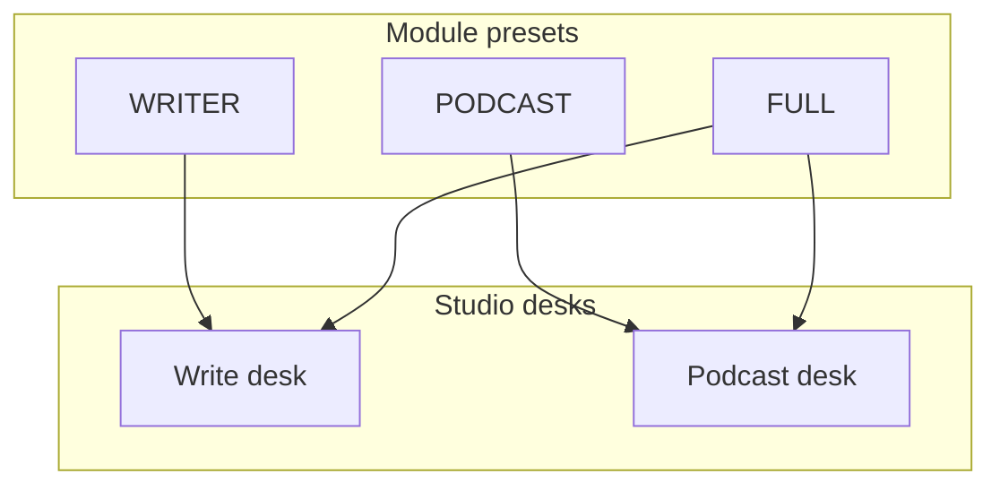
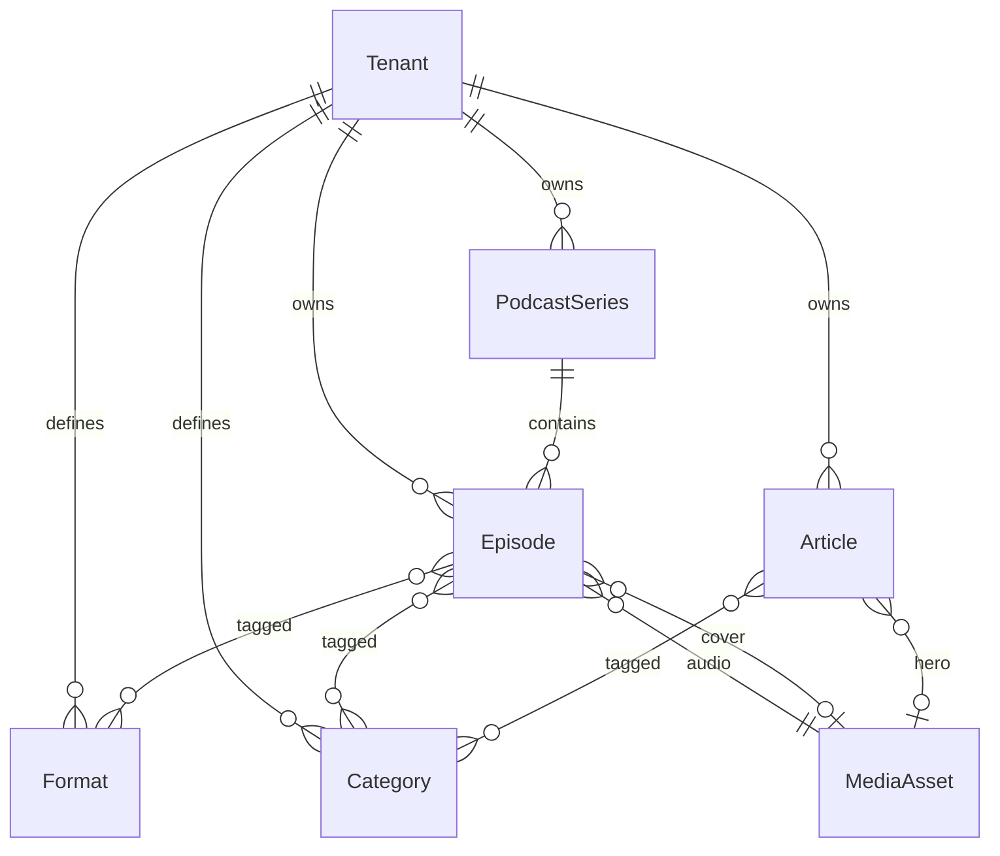

# Directwerk — Publication Model & Two Studio Desks

Companion to [`content-platform-strategy.md`](content-platform-strategy.md),
[`directwerk-studio.md`](directwerk-studio.md), and [`README.md`](platform-design.md) § Publication Types.

**Purpose:** Resolve the “are we a CMS / Substack / podcast host?” fog into one concrete domain
shape: **typed publications on shared rails**, with **two creator desks** in `directwerk-studio`.

**Status (2026-08):** Usable MVP — articles and episodes on shared publication rails, module presets
(`WRITER`, `PODCAST`, `FULL`), `studioHome`/`studioDesks` in site-config, and both `directwerk-studio`
desks plus the `directwerk-web` subscriber loop.

---

## Positioning sentence

> Directwerk is a **whitelabel paid publishing platform**: typed content (posts, episodes, files),
> membership entitlements, and delivery (site, RSS, email) on the tenant’s domain.

| Competitor frame | We win on | We do not chase |
|------------------|-----------|-----------------|
| Substack / Ghost | Domain ownership, EU, Patreon/Steady exit, PACKAGE rules, podcast RSS | Editor polish, discovery network, theme marketplace |
| Patreon + Podigee | Unified entitlements + private feeds + own domain | Community features, production DAWs |
| WordPress / Strapi | Publication + access + delivery, not page trees | Themes, plugins, block layout |

**Content management ≠ CMS.** We manage *what is published and who may access it*. We do not
manage page trees, themes, or layout builders.

---

## Two tenant archetypes

| Archetype | Primary desk | Modules on by default | Weekly authoring |
|-----------|--------------|----------------------|------------------|
| **Writer** | Write desk (Articles) | `DIGITAL_CONTENT`, `SUBSCRIPTION`, `EMAIL_NOTIFY`, `WHITELABEL` | Blog posts / paid essays |
| **Podcaster** | Podcast desk (Episodes) | `DIGITAL_CONTENT`, `PODCAST`, `PODCAST_RSS`, `SUBSCRIPTION`, `EMAIL_NOTIFY` | Episodes across Formate |
| **Hybrid** | Both desks | `DIGITAL_CONTENT`, `SUBSCRIPTION`, `EMAIL_NOTIFY`, `WHITELABEL`, `PODCAST`, `PODCAST_RSS` | Episodes + companion posts |

Studio navigation and empty states follow **enabled modules**, not a single “Content” CMS tree.



---

## Shared rails (the Publication pattern)

Every publishable unit shares the same **rails**. Type-specific fields live on the type entity.

### Conceptual contract

| Concern | Shared field / behaviour | Notes |
|---------|--------------------------|-------|
| Identity | `tenant_id`, `slug`, `title` | Slug uniqueness rules differ by type |
| Body | TipTap HTML (server-sanitized) | One richness ceiling — see [Authoring ceiling](#authoring-ceiling) |
| Media | Optional cover / hero via `MediaAsset` | Episodes also require audio |
| Access | `access_policy` (`FREE` \| `PAID`), optional `required_level_sort_order` | Same entitlement engine |
| Workflow | `DRAFT` → `SCHEDULED` → `PUBLISHED` → `ARCHIVED` | Same verbs: publish, schedule, unpublish, archive |
| Timestamps | `published_at`, `scheduled_at`, `created_at`, `updated_at` | |
| Notify | `PublishOptions.notifySubscribers` | Optional email delivery on publish (`EMAIL_NOTIFY`); same article, different channel |
| Taxonomy | Type-appropriate tags — see [Taxonomy](#taxonomy-formate-vs-categories-vs-tags) | |

### What is *not* shared

| Concern | Episode-only | Article-only | Series-only (show) |
|---------|--------------|--------------|--------------------|
| Parent container | `series_id` | — | — |
| Audio | `audio_asset_id`, `duration_seconds` | — | — |
| Episode number / type | `episode_number`, optional `episode_type` | — | — |
| RSS directory metadata | — | — | language, iTunes category, author, explicit, cover |
| Formate (feed builder axis) | `episode_formats` | — | — |
| SEO excerpt | optional later | `excerpt`, `seo_description` | — |

### Storage recommendation

**Keep separate tables** (`episodes`, planned `articles`) that implement the pattern. Do **not**
introduce a single polymorphic `publications` table for MVP/post-MVP.

Rationale:

- Podcast domain is already shipped as first-class entities
- Query paths differ (RSS needs FREE audio; articles need teaser vs full body)
- Avoids nullable-column soup and awkward joins
- Shared behaviour lives in services / workflow API / studio components, not one mega-table

Optional later: a read-model `publication_index` for Overview “all drafts” across types.



---

## Two studio desks

The studio sidebar has **two zones**:

1. **Desk zone** — authoring for the active desk only (`Schreiben` or `Podcast`), controlled by
   **`DeskSwitcher`** for hybrid tenants (`hasDesk('WRITE') && hasDesk('PODCAST')`). Single-desk
   tenants always see their desk group without switcher noise.
2. **Verwaltung zone** — shared admin rails separated by a visual divider: Medien (`/media`),
   Organisation (`/manage/categories`), Abos (`/manage/*`), Team (`/team`), Einstellungen
   (`/settings/*`). These persist regardless of which desk is active.

The top-level **Studio** entry (`/`) is neutral overview / desk chooser. On hybrid tenants the desk
zone defaults to Write when no path or session preference is set; `DeskSwitcher` and session storage
keep the choice consistent on shared routes like `/media`.

Desk-specific items never mix into Verwaltung; podcast setup (Sendungen, Formate, Feeds) lives in
one flat **Podcast** group rather than split create/setup sub-groups.

### 1. Podcast desk (Episodes) — podcast tenants

**Mental model:** “I’m shipping a Folge.”

**Primary nav:** **Podcast** → Start, Folgen, Sendungen, Formate, Feeds (single group; not mixed
with Abos or Verwaltung).

| Zone | Fields | Notes |
|------|--------|-------|
| Header | Title, status badge, Save / Publish | Autosave on `DRAFT` |
| Main | Show notes (TipTap HTML) | Paste-from-Docs first-class |
| Side — Media | Audio attach / replace, duration, preview | Block publish until `READY` |
| Side — Access | FREE / PAID + level | Visible, not buried |
| Side — Taxonomy | Formats (required ≥1 if configured), optional categories | Formate drive feed builder later |
| Side — Schedule | Publish now / schedule | Same workflow component |

**Series** is a **setup surface**, not weekly authoring: title, description, cover, language,
iTunes category, author/explicit (when added). After onboarding, live under Settings or a quiet
“Shows” list.

```text
┌─────────────────────────────────────────────────────────────┐
│  Folge 516 · DRAFT                      [Speichern] [Veröffentlichen ▼] │
├──────────────────────────────┬──────────────────────────────┤
│  Titel                       │  ZUGRIFF                      │
│  [Unser Megaprojekt: …     ] │  ○ Frei  ● Bezahlt (Supporter+)│
│                              │                               │
│  Folgennummer (optional)     │  FORMAT                       │
│  [516                      ] │  ☑ Hauptfolge  ☐ Bonus        │
│                              │                               │
│  Shownotes                   │  AUDIO                        │
│  ┌────────────────────────┐  │  [▶] 38 MB · 40:29 · READY    │
│  │ B I Link • Liste       │  │  [Ersetzen]                   │
│  │ (TipTap, Paste OK)     │  │                               │
│  └────────────────────────┘  │  ZEITPLAN                     │
│                              │  ○ Jetzt  ○ Planen […]        │
└──────────────────────────────┴──────────────────────────────┘
```

### 2. Write desk (Newsletter / Articles) — writer & Substack-like tenants

**Mental model:** “I’m writing a post” — a **newsletter issue** and a **blog post** are the same
publication; delivery differs (email inbox vs public site on the tenant domain).

**Gradle module:** `directwerk-newsletter` · **Feature gate:** `DIGITAL_CONTENT`

**Primary nav:** Content → Beiträge (Posts).

| Delivery channel | When | Notes |
|------------------|------|-------|
| **Web** | Always on publish | Public catalog, SEO, paid gating on full body |
| **Email** | Optional (`EMAIL_NOTIFY` + notify checkbox) | Excerpt/teaser + link, or full body in inbox — sent via `directwerk-email` |

Substack-style tenants use both channels; classic newsletter creators may lean on email-first UX
while the same `Article` entity backs the archive on their domain.

| Zone | Fields | Notes |
|------|--------|-------|
| Header | Title, status, Save / Publish | Same workflow chrome as episodes |
| Main | Body editor | **TipTap HTML** (same ceiling as show notes); server sanitizes and persists canonical HTML |
| Side — Access | FREE / PAID + level | Identical component |
| Side — Taxonomy | Categories / tags | **Not** Formate |
| Side — Media | Hero image from library | Optional |
| Side — SEO | Excerpt / SEO description | Cards + meta; email teaser source |
| Side — Schedule | Publish now / schedule | Same component |

```text
┌─────────────────────────────────────────────────────────────┐
│  Beitrag · DRAFT                        [Speichern] [Veröffentlichen ▼] │
├──────────────────────────────┬──────────────────────────────┤
│  Titel                       │  ZUGRIFF                      │
│  [Warum wir Patreon verlassen]│  ○ Frei  ● Bezahlt           │
│                              │                               │
│  Text                       │  TAGS / KATEGORIEN            │
│  ┌────────────────────────┐  │  Politik · Meta               │
│  │ TipTap (same ceiling)  │  │                               │
│  │                        │  │  TITELBILD                    │
│  │                        │  │  [Aus Mediathek]              │
│  └────────────────────────┘  │                               │
│                              │  AUSZUG (E-Mail / Karte)      │
│                              │  […]                          │
└──────────────────────────────┴──────────────────────────────┘
```

### Shared studio components (build once)

| Component | Used by |
|-----------|---------|
| `<PublicationStatusBadge>` | Both desks |
| `<PublicationWorkflowActions>` | Both desks |
| `<AccessPolicySelect>` | Both desks |
| `<SchedulePicker>` | Both desks |
| `<NotifySubscribersCheckbox>` | Both desks (module-gated) |
| `<ShowNotesEditor>` / TipTap | Episodes + articles (recommended) |
| `<MediaPickerModal>` / `<UploadDropzone>` | Both desks |
| `<FormatCategoryPicker>` | Episodes (formats+categories); articles (categories only) |

---

## Taxonomy: Formate vs categories vs tags

Do **not** collapse podcast Formate into blog tags. Same picker UX, different product jobs.

| Axis | Entity | Who uses it | Product job |
|------|--------|-------------|-------------|
| **Formate** | `Format` | Podcast tenants | Site sections, feed builder, PACKAGE `scope_type=FORMAT` |
| **Categories** | `Category` | Both (optional) | Seasons, topics, campaigns; PACKAGE `CATEGORY` |
| **Tags** (optional rename of flat categories) | Reuse `Category` or thin `Tag` | Writer tenants | Discovery / filters — not entitlement axes unless configured |

**Rules of thumb**

- Podcast weekly authoring: pick ≥1 **Format**; categories optional  
- Writer weekly authoring: pick **categories/tags**; Formate nav hidden  
- Entitlements: LEVEL on any publication; PACKAGE may scope series / format / category / asset  

---

## Authoring ceiling

One richness policy for all HTML bodies (show notes and posts):

| Allow | Deny |
|-------|------|
| Paragraphs, bold, italic, links | Block layout / columns |
| Bullet / ordered lists | Embeds, iframes, custom shortcodes |
| `h2`, `h3` | Inline scripts, arbitrary classes |
| Paste from Google Docs → cleaned HTML | Collaborative realtime editing (MVP) |

Server OWASP sanitizer is authoritative. Client TipTap is convenience.

**Deferred (not desk features):** chapter editor, transcript studio, theme builder, version history
beyond draft/published.

---

## Delivery channels (same engine, different pipes)

| Channel | Episodes | Articles | Files |
|---------|----------|----------|-------|
| Public web API | Metadata + free stream/download | Metadata + teaser if paid | Metadata |
| Gated `/me/*` | Stream / download when entitled | Full body when entitled | Download when entitled |
| Public RSS | FREE published only | — (or optional blog RSS later) | — |
| Private RSS | Entitled episodes | — | — |
| Email notify | Teaser + link | Teaser + link | Teaser + link |

Newsletter remains a **checkbox on publish**, not a third desk.

---

## Module presets (product packaging)

| Preset | Enables | Default studio home | Pitch |
|--------|---------|---------------------|-------|
| `WRITER` | `DIGITAL_CONTENT`, `SUBSCRIPTION`, `EMAIL_NOTIFY`, `WHITELABEL` | Write desk | "Substack on your domain" |
| `PODCAST` | `DIGITAL_CONTENT`, `PODCAST`, `PODCAST_RSS`, `SUBSCRIPTION`, `EMAIL_NOTIFY` | Podcast desk | "Membership podcast hosting" |
| `FULL` | `DIGITAL_CONTENT`, `SUBSCRIPTION`, `EMAIL_NOTIFY`, `WHITELABEL`, `PODCAST`, `PODCAST_RSS` | Overview with both | Hybrid creators |

`FEED_BUILDER`, billing sync modules, `ANALYTICS` remain optional add-ons.

---

## First-run journeys (authoring success)

### Writer — first paid post in one session

1. Land on Write desk (empty state: “Ersten Beitrag schreiben”)  
2. Title + body + FREE/PAID  
3. Publish → optional notify  
4. Post visible on `directwerk-web`; paid body gated on `/me/articles/{slug}`  

### Podcaster — first public episode in one session

1. Onboarding creates one **Series** (cover, language, category)  
2. Land on Podcast desk  
3. Upload audio inline → title → show notes → Format → FREE  
4. Publish → public RSS + site  

No Media-library-first requirement; library is for reuse.

---

## Implementation implications

### Backend (near-term)

| Item | Action |
|------|--------|
| Episode / series | Keep as-is; add thin RSS/directory fields when needed (author, explicit) |
| Article entity | Shipped — `articles` table, `/api/v1/articles`, public `/api/v1/public/articles` |
| Workflow | Shared service verbs; type-specific validators (audio required for episodes) |
| Entitlements | Already publication-agnostic via LEVEL/PACKAGE — `ARTICLE` scopes supported |
| Overview API | Optional cross-type “drafts awaiting publish” read model later |

### Studio (`directwerk-studio/` — usable MVP)

| Item | Status |
|------|--------|
| Nav | Desk-scoped nav (active desk groups only), `DeskSwitcher` for hybrid creators, module-gated rails |
| Editors | Shared TipTap `ShowNotesEditor` (H2/H3, lists, links, paste cleanup) + draft autosave |
| Copy | DE-first: *Beitrag* vs *Folge*; content-creation flow under `/podcast` |
| Components | Status badge, access policy, editor layout, EmptyState/PageHeader lists, media grid |
| API wiring | Auth + CRUD for articles, episodes, series, formats, media, products, grants |

### Explicit non-goals (this model)

- Polymorphic CMS `nodes` / page tree  
- Block editor / theme marketplace  
- Formate on articles  
- Chapters / transcripts as MVP authoring  

*(A separate “email-only” content type distinct from articles is not planned — web and email are
delivery channels for the same newsletter/article publication.)*

---

## Decision summary

| # | Decision | Choice |
|---|----------|--------|
| 1 | Product shape | Publication platform with two desks, not a CMS |
| 2 | Storage | Separate type tables + shared pattern (no polymorphic mega-table) |
| 3 | Writer vs podcaster | Module presets + different default home |
| 4 | Body format | TipTap HTML, one ceiling, for episodes and articles |
| 5 | Taxonomy | Formate = podcast axis; categories/tags = shared/light axis |
| 6 | Newsletter | **`directwerk-newsletter`** module: one written publication (`Article`); web + email are delivery channels; `EMAIL_NOTIFY` triggers send |
| 7 | Series | Setup / directory metadata, not weekly authoring |
| 8 | Rich production | Chapters/transcripts deferred; not part of desk v1 |

---

## Related docs

| Doc | Update note |
|-----|-------------|
| [`content-platform-strategy.md`](content-platform-strategy.md) | Strategy; this doc is the concrete desk/model split |
| [`directwerk-studio.md`](directwerk-studio.md) | Creator journeys — desks map to Content → Podcasts / Articles |
| [`directwerk-studio-implementation.md`](directwerk-studio-implementation.md) | Screen specs should reference Write vs Podcast desk |
| [`ghost-positioning.md`](ghost-positioning.md) | Still valid: not rebuilding Ghost Admin |
| [`README.md`](platform-design.md) § Publication Types | Keep type list; pattern described here |
