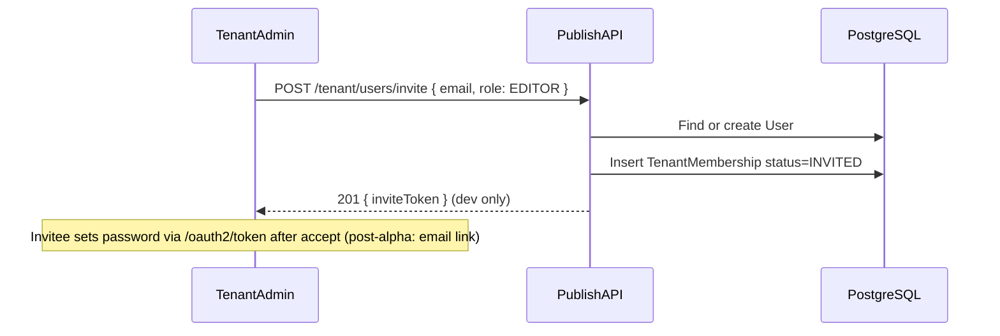

# Directwerk — User Backend & Spring Security Implementation Guide

Companion to [`README.md`](../README.md) and [`poc-alpha-setup.md`](poc-alpha-setup.md). This document
is the **step-by-step engineering guide** for implementing user accounts, authentication, authorization,
and account management in the Spring Boot backend (`projects/directwerk/`).

| Document | Purpose |
|----------|---------|
| [`README.md`](../README.md) § Authentication and Authorization | Product-level auth design |
| [`poc-alpha-setup.md`](poc-alpha-setup.md) § Spring Security | Alpha scope and checklist |
| **This document** | **How to implement** the user/security backend |
| [`directwerk-studio-implementation.md`](directwerk-studio-implementation.md) | Creator dashboard consuming this API |
| [`directwerk-admin-implementation.md`](directwerk-admin-implementation.md) | Platform admin dashboard consuming this API |
| [`Directwerk/http/`](../Directwerk/http/) | Executable acceptance criteria (controller-mapped harness) |

**Status (2026-07):** Implemented in `projects/directwerk/Directwerk/`. Controllers live under
`de.pnnit.directwerk.controller.*` (auth under `controller/auth/`). Public self-registration
creates `SUBSCRIBER` via `POST /api/v1/auth/register` (tenant from `Host`). Invited users set a
password via `POST /api/v1/auth/accept-invite`. Local profile exposes `inviteToken` /
`devResetToken` when `directwerk.account.expose-dev-tokens=true`.

---

## 1. Goals and non-goals

### Goals

- **Global user accounts** — one email, many `TenantMembership` rows across tenants
- **Five roles** — `PLATFORM_ADMIN`, `TENANT_ADMIN`, `EDITOR`, `SUBSCRIBER`, `GUEST`
- **OAuth2 Authorization Server + Resource Server** in one Spring Boot monolith
- **Stateless JWT** — no server-side sessions for API consumers
- **Tenant isolation** — Spring Security `principal.tenantId` must match `Host` on tenant-scoped routes; membership re-validated from DB
- **Invite flows** — platform admin invites tenant admins; tenant admin invites editors
- **Password lifecycle** — register, login, forgot/reset, refresh token revocation

### Non-goals (alpha)

- Shadow-user claim flow (`POST /api/v1/auth/claim`) — post-alpha Patreon/Steady migration
- MFA for `PLATFORM_ADMIN` — post-MVP
- Email delivery for invites/reset — alpha returns tokens in response body for HTTP tests
- Custom JWT libraries outside Spring Security — **forbidden**

---

## 2. Architecture overview

```mermaid
flowchart TB
    subgraph clients [First-party clients]
        Studio[directwerk-studio]
        Admin[directwerk-admin]
        Web[directwerk-web]
    end

    subgraph spring [Spring Boot monolith]
        AS[Authorization Server /oauth2/token]
        RS[Resource Server JWT validation]
        UDS[PublishUserDetailsService]
        UAS[UserAccountService]
        TMS[TenantMembershipService]
        TCF[TenantContextFilter]
    end

    subgraph db [(PostgreSQL)]
        Users[users]
        TM[tenant_memberships]
        PA[platform_admins]
    end

    Studio -->|password grant + Host| AS
    Admin -->|password grant| AS
    Web -->|password grant + Host| AS
    AS --> UDS
    AS --> Users
    Studio -->|Bearer JWT + Host| RS
    RS --> TCF
    RS --> UAS
    RS --> TMS
    UDS --> Users
    UDS --> TM
    UDS --> PA
```

### Security package layout

```
src/main/java/de/pnnit/publish/security/
  AuthorizationServerConfig.java      # OAuth2 clients, JWT signing keys
  ResourceServerConfig.java           # JWT validation, issuer/audience
  SecurityFilterChainConfig.java      # Path matchers, stateless sessions
  PublishUserDetailsService.java      # UserDetailsService implementation
  PublishUserPrincipal.java           # Custom principal record
  JwtTenantCustomizer.java            # Inject tenant_id + roles into JWT
  PlatformAdminAuthenticationConverter.java
  SecurityUtils.java                  # isPlatformAdmin(), currentUserId()
  RoleConstants.java                  # ROLE_* string constants
```

### Core module APIs (user domain)

```
modules/core/
  entity/User.java, TenantMembership.java, PlatformAdmin.java, InvitationToken.java
  service/UserAccountService.java, TenantInvitationService.java, InvitationAcceptanceService.java
  repository/...
controller/auth/
  AuthController.java         # /api/v1/auth/* (register, accept-invite, forgot/reset)
  MeController.java           # /api/v1/me, /me/access
```

Platform and tenant user management controllers live under `controller/platform/` and
`controller/tenant/`. All REST controllers are under `de.pnnit.directwerk.controller.*`.

---

## 3. Data model

### 3.1 Flyway migration `V2__create_users_and_memberships.sql`

```sql
CREATE TABLE users (
    id              BIGSERIAL PRIMARY KEY,
    email           VARCHAR(255) NOT NULL UNIQUE,
    password_hash   VARCHAR(255),                    -- nullable for shadow users (post-alpha)
    name            VARCHAR(255),
    status          VARCHAR(32) NOT NULL DEFAULT 'ACTIVE',
    created_at      TIMESTAMPTZ NOT NULL DEFAULT now(),
    updated_at      TIMESTAMPTZ NOT NULL DEFAULT now(),
    CONSTRAINT users_status_check CHECK (status IN ('ACTIVE', 'PENDING_VERIFICATION', 'DISABLED'))
);

CREATE TABLE tenant_memberships (
    id              BIGSERIAL PRIMARY KEY,
    user_id         BIGINT NOT NULL REFERENCES users(id),
    tenant_id       BIGINT NOT NULL REFERENCES tenants(id),
    roles           JSONB NOT NULL DEFAULT '["SUBSCRIBER"]',
    status          VARCHAR(32) NOT NULL DEFAULT 'ACTIVE',
    invited_at      TIMESTAMPTZ,
    last_login_at   TIMESTAMPTZ,
    created_at      TIMESTAMPTZ NOT NULL DEFAULT now(),
    updated_at      TIMESTAMPTZ NOT NULL DEFAULT now(),
    UNIQUE (user_id, tenant_id),
    CONSTRAINT tm_status_check CHECK (status IN ('ACTIVE', 'INVITED', 'DISABLED'))
);

CREATE INDEX idx_tenant_memberships_tenant ON tenant_memberships(tenant_id);
CREATE INDEX idx_tenant_memberships_user ON tenant_memberships(user_id);

CREATE TABLE platform_admins (
    id              BIGSERIAL PRIMARY KEY,
    user_id         BIGINT NOT NULL UNIQUE REFERENCES users(id),
    granted_at      TIMESTAMPTZ NOT NULL DEFAULT now(),
    granted_by      BIGINT REFERENCES users(id)
);
```

### 3.2 JPA entities

**`User`** — global account:

| Field | Type | Notes |
|-------|------|-------|
| `id` | `Long` | PK |
| `email` | `String` | Unique, lowercased on persist |
| `passwordHash` | `String` | BCrypt; nullable for shadow users |
| `name` | `String` | Optional display name |
| `status` | `UserStatus` enum | `ACTIVE`, `PENDING_VERIFICATION`, `DISABLED` |

**`TenantMembership`** — tenant-scoped roles:

| Field | Type | Notes |
|-------|------|-------|
| `userId`, `tenantId` | `Long` | Unique pair |
| `roles` | `Set<Role>` or JSONB | `SUBSCRIBER`, `EDITOR`, `TENANT_ADMIN` |
| `status` | `MembershipStatus` | `ACTIVE`, `INVITED`, `DISABLED` |

**`PlatformAdmin`** — global superadmin flag:

| Field | Type | Notes |
|-------|------|-------|
| `userId` | `Long` | FK → users |
| `grantedAt`, `grantedBy` | audit fields | |

### 3.3 Role model

| Role | Spring authority | Storage | Scope |
|------|------------------|---------|-------|
| `PLATFORM_ADMIN` | `ROLE_PLATFORM_ADMIN` | `platform_admins` table | Global |
| `TENANT_ADMIN` | `ROLE_TENANT_ADMIN` | `tenant_memberships.roles` | Per tenant |
| `EDITOR` | `ROLE_EDITOR` | `tenant_memberships.roles` | Per tenant |
| `SUBSCRIBER` | `ROLE_SUBSCRIBER` | `tenant_memberships.roles` | Per tenant |
| `GUEST` | *(none)* | N/A | Unauthenticated public routes |

**Rules:**

- Public registration always creates `SUBSCRIBER` only
- `PLATFORM_ADMIN` is invite-only — never via `/auth/register`
- A membership may hold multiple roles (e.g. `TENANT_ADMIN` + `EDITOR`)
- Cannot demote the last `TENANT_ADMIN` on a tenant

---

## 4. OAuth2 configuration

### 4.1 Gradle dependencies

```kotlin
implementation("org.springframework.boot:spring-boot-starter-oauth2-authorization-server")
implementation("org.springframework.boot:spring-boot-starter-oauth2-resource-server")
implementation("org.springframework.boot:spring-boot-starter-security")
```

### 4.2 Registered clients (alpha)

| `client_id` | Grant types | Audience |
|-------------|-------------|----------|
| `directwerk-tenant-frontend` | `password`, `refresh_token` | `directwerk-studio`, `directwerk-web` |
| `directwerk-platform-admin` | `password`, `refresh_token` | `directwerk-admin`, HTTP tests |

Dev secrets: [`Directwerk/http/http-client.env.json`](../Directwerk/http/http-client.env.json)
(+ private env example alongside it).

### 4.3 JWT claims

**Tenant-scoped token** (studio, web):

```json
{
  "sub": "42",
  "email": "admin-a@alpha-show.local",
  "tenant_id": 1,
  "roles": ["TENANT_ADMIN", "EDITOR"],
  "iss": "http://localhost:8080",
  "aud": "directwerk-api"
}
```

**Platform admin token** (`directwerk-admin`):

```json
{
  "sub": "1",
  "email": "platform-admin@directwerk.local",
  "roles": ["PLATFORM_ADMIN"],
  "iss": "http://localhost:8080",
  "aud": "directwerk-api"
}
```

`tenant_id` is **omitted or null** for platform admin tokens.

### 4.4 `JwtTenantCustomizer`

Implement `OAuth2TokenCustomizer<JwtEncodingContext>` to inject claims after authentication:

```java
@Component
@RequiredArgsConstructor
class JwtTenantCustomizer implements OAuth2TokenCustomizer<JwtEncodingContext> {

  private final PlatformAdminRepository platformAdmins;

  @Override
  public void customize(JwtEncodingContext context) {
    if (!OAuth2TokenType.ACCESS_TOKEN.equals(context.getTokenType())) {
      return;
    }
    Authentication auth = context.getPrincipal();
    if (!(auth.getPrincipal() instanceof PublishUserPrincipal principal)) {
      return;
    }
    context.getClaims().claim("email", principal.getEmail());
    if (principal.getTenantId() != null) {
      context.getClaims().claim("tenant_id", principal.getTenantId());
    }
    context.getClaims().claim("roles", principal.getRoleNames());
  }
}
```

### 4.5 `PublishUserDetailsService`

Load user + roles based on login context:

```java
@Service
@RequiredArgsConstructor
class PublishUserDetailsService implements UserDetailsService {

  private final UserRepository users;
  private final TenantMembershipRepository memberships;
  private final PlatformAdminRepository platformAdmins;
  private final TenantResolver tenantResolver;

  @Override
  public UserDetails loadUserByUsername(String email) {
    User user = users.findByEmailIgnoreCase(email)
        .orElseThrow(() -> new UsernameNotFoundException(email));

    // Platform admin client: check platform_admins table
    if (isPlatformAdminLogin()) {
      platformAdmins.findByUserId(user.getId())
          .orElseThrow(() -> new UsernameNotFoundException(email));
      return PublishUserPrincipal.platformAdmin(user);
    }

    // Tenant client: resolve tenant from Host header or request attribute
    Tenant tenant = tenantResolver.resolveCurrent()
        .orElseThrow(() -> new TenantNotFoundException("Host required for tenant login"));

    TenantMembership membership = memberships
        .findByUserIdAndTenantId(user.getId(), tenant.getId())
        .filter(m -> m.getStatus() == MembershipStatus.ACTIVE
            || m.getStatus() == MembershipStatus.INVITED)
        .orElseThrow(() -> new UsernameNotFoundException(email));

    return PublishUserPrincipal.tenantUser(user, tenant.getId(), membership.getRoles());
  }
}
```

### 4.6 `PublishUserPrincipal`

```java
public record PublishUserPrincipal(
    Long userId,
    String email,
    Long tenantId,                    // null for PLATFORM_ADMIN
    Collection<? extends GrantedAuthority> authorities
) implements UserDetails {

  static PublishUserPrincipal platformAdmin(User user) {
    return new PublishUserPrincipal(
        user.getId(),
        user.getEmail(),
        null,
        List.of(new SimpleGrantedAuthority("ROLE_PLATFORM_ADMIN"))
    );
  }

  static PublishUserPrincipal tenantUser(User user, Long tenantId, Set<Role> roles) {
    var authorities = roles.stream()
        .map(r -> new SimpleGrantedAuthority("ROLE_" + r.name()))
        .toList();
    return new PublishUserPrincipal(user.getId(), user.getEmail(), tenantId, authorities);
  }

  List<String> getRoleNames() {
    return authorities.stream()
        .map(GrantedAuthority::getAuthority)
        .map(a -> a.replace("ROLE_", ""))
        .toList();
  }

  @Override public String getPassword() { return null; }  // not used post-auth
  @Override public String getUsername() { return email; }
  @Override public boolean isAccountNonLocked() { return true; }
  @Override public boolean isCredentialsNonExpired() { return true; }
  @Override public boolean isEnabled() { return true; }
  @Override public boolean isAccountNonExpired() { return true; }
}
```

---

## 5. Protected route policy

Configure in `SecurityFilterChainConfig` — **stateless** (`SessionCreationPolicy.STATELESS`):

| Path pattern | Rule | Notes |
|--------------|------|-------|
| `/api/v1/public/**` | `permitAll` | Resolved via `Host` only |
| `/feeds/**` | `permitAll` | RSS feeds |
| `/actuator/health`, `/swagger-ui/**`, `/v3/api-docs/**` | `permitAll` | Dev/ops |
| `/oauth2/token`, `/.well-known/**` | `permitAll` | Authorization Server |
| `/api/v1/platform/**` | `hasRole('PLATFORM_ADMIN')` | No tenant context |
| `/api/v1/tenant/**` | `hasRole('TENANT_ADMIN')` | Branding, domains, team |
| `/api/v1/probes/**` | `hasAnyRole('EDITOR','TENANT_ADMIN')` | + `@RequiresModule` |
| `/api/v1/me/**` | `authenticated` | Subscriber portal |
| `/api/v1/media/**` | `hasAnyRole('EDITOR','TENANT_ADMIN')` | Phase 2c+ |
| `/api/v1/webhooks/**` | Custom filter | Signature verification, not JWT |

Method-level security: `@EnableMethodSecurity` + `@PreAuthorize` on service methods for
defence in depth.

---

## 6. API endpoints

### 6.1 Auth API (`AuthController`)

| Method | Path | Auth | Description |
|--------|------|------|-------------|
| POST | `/api/v1/auth/register` | `Host` header | Create user + `SUBSCRIBER` membership |
| POST | `/api/v1/auth/accept-invite` | Public | Set password for invited user / platform admin |
| POST | `/oauth2/token` | Client basic auth | Password grant / refresh (Spring AS) |
| POST | `/api/v1/auth/forgot-password` | Public | Queue reset token (`devResetToken` when expose-dev-tokens) |
| POST | `/api/v1/auth/reset-password` | Public | Set new password |
| POST | `/api/v1/auth/claim` | `Host` | Shadow user claim (post-alpha) |

**Registration flow:**

```java
@PostMapping("/api/v1/auth/register")
ResponseEntity<Response<RegisterResponse>> register(
    @Valid @RequestBody RegisterRequest body,
    HttpServletRequest request
) {
  Tenant tenant = tenantResolver.resolveFromHost(request)
      .orElseThrow(() -> new TenantNotFoundException(request.getServerName()));

  RegisterResult result = userAccountApi.register(
      body.email(), body.password(), body.name(), tenant.getId()
  );
  return responses.created(result);
}
```

`UserAccountService.register()`:

1. Normalize email to lowercase
2. Reject if user exists **without** membership on this tenant (return 409 with clear message)
3. Create `User` with `PasswordEncoder.encode(password)` if new
4. Create `TenantMembership(roles=[SUBSCRIBER], status=ACTIVE)`
5. Return `201` — client obtains token via `/oauth2/token`

**Password reset:**

1. `forgotPassword(email, tenantId)` — generate crypto-random token, store hashed with expiry
2. Dev profile: log token or return in `metadata.devResetToken`
3. `resetPassword(token, newPassword)` — validate token, update hash, revoke all refresh tokens

### 6.2 Profile API (`MeController`)

| Method | Path | Auth | Response |
|--------|------|------|----------|
| GET | `/api/v1/me` | JWT + `Host` | `{ email, name, roles[], tenantId }` |

Platform admin tokens **must not** access `/me` without tenant context — return `403`.

### 6.3 Tenant user management (`TenantUserController`)

Requires `ROLE_TENANT_ADMIN`. Base: `/api/v1/tenant/users`.

| Method | Path | Body | Description |
|--------|------|------|-------------|
| GET | `/` | — | List members (editors + admins; exclude subscribers) |
| POST | `/invite` | `{ email, role }` | Invite `EDITOR` or `TENANT_ADMIN` |
| PATCH | `/{userId}` | `{ roles?, status? }` | Update; cannot demote last admin |

### 6.4 Platform user management (`PlatformUserController`, `PlatformAdminController`)

Requires `ROLE_PLATFORM_ADMIN`. Base: `/api/v1/platform/`.

| Method | Path | Description |
|--------|------|-------------|
| GET | `/admins` | List platform admins |
| POST | `/admins/invite` | Invite platform admin |
| DELETE | `/admins/{userId}` | Revoke platform access |
| GET | `/tenants/{id}/users` | List tenant members (platform view) |
| POST | `/tenants/{id}/users/invite` | Invite tenant admin |
| PATCH | `/tenants/{tenantId}/users/{userId}` | Platform override of roles |

Every mutating platform action writes `platform_audit_events`.

---

## 7. Multi-tenancy integration

User/security code must cooperate with `TenantContextFilter`:

| Request type | Tenant resolution | JWT validation |
|--------------|-------------------|----------------|
| `/api/v1/public/**` | Verified `Host` → tenant (optional at filter; services may require) | None |
| `/api/v1/auth/register` | Verified `Host` → tenant | None |
| `/oauth2/token` (tenant client) | Verified `Host` → tenant (via `UserDetailsService`) | N/A (issues token) |
| `/oauth2/token` (platform client) | None | N/A |
| Authenticated tenant API | Verified `Host` + SecurityContext `principal.tenantId` must match; ACTIVE membership re-check | Required |
| `/api/v1/platform/**` | `TenantContext.clear()` | `PLATFORM_ADMIN` only |

**Tenant mismatch** — if SecurityContext principal tenant ≠ tenant resolved from `Host`:

```json
{
  "statusCode": 403,
  "errors": [{ "code": "TENANT_MISMATCH", "message": "Authenticated tenant membership does not match Host" }]
}
```

Isolation is enforced by Hibernate `tenantFilter` on `TenantOwned` entities (enabled when
`TenantContext` is set), `TenantWriteGuardListener` on persist/update,
`CurrentTenantMembershipService` (SecurityContext + DB), and explicit `findByIdAndTenantId`
service methods. Platform paths clear context so filters stay off.
See [`../Directwerk/docs/multi-tenancy.md`](../Directwerk/docs/multi-tenancy.md).

---

## 8. Service implementation details

### 8.1 `UserAccountApi` interface

```java
public interface UserAccountApi {
  RegisterResult register(String email, String password, String name, Long tenantId);
  Optional<User> findByEmail(String email);
  void requestPasswordReset(String email, Long tenantId);
  void resetPassword(String token, String newPassword);
}
```

### 8.2 `TenantMembershipApi` interface

```java
public interface TenantMembershipApi {
  InviteResult invite(Long tenantId, String email, Role role, Long invitedByUserId);
  void updateMembership(Long tenantId, Long userId, UpdateMembershipCommand cmd);
  Page<MembershipView> listMembers(Long tenantId, MembershipFilter filter, Pageable page);
  void assertNotLastAdmin(Long tenantId, Long userId, Set<Role> newRoles);
}
```

### 8.3 Invite flow



Alpha: return `inviteToken` in response `metadata` for HTTP test automation.

### 8.4 Password encoding

```java
@Bean
PasswordEncoder passwordEncoder() {
  return new BCryptPasswordEncoder(12);
}
```

Never log passwords, reset tokens, or refresh tokens. Rate-limit `/oauth2/token` and
`/api/v1/auth/register` per IP + email (bucket4j or Spring filter).

---

## 9. Configuration

### 9.1 `application.yml`

```yaml
spring:
  security:
    oauth2:
      authorizationserver:
        issuer: ${OAUTH2_ISSUER:http://localhost:8080}
      resourceserver:
        jwt:
          issuer-uri: ${OAUTH2_ISSUER:http://localhost:8080}

app:
  security:
    jwt-audience: directwerk-api
    access-token-ttl: 15m
    refresh-token-ttl: 7d
```

### 9.2 Environment variables (production)

| Variable | Purpose |
|----------|---------|
| `OAUTH2_ISSUER` | JWT issuer URL (`https://api.{platform}.de`) |
| `SPRING_DATASOURCE_*` | PostgreSQL connection |
| `APP_SECURITY_JWT_AUDIENCE` | JWT audience claim validation |

Signing keys: use Spring Authorization Server JWK set. In production, rotate via env-injected
RSA key pair — never commit private keys.

---

## 10. Testing strategy

### 10.1 Unit tests

| Class | Tests |
|-------|-------|
| `UserAccountService` | Register duplicate email, password encoding, reset token expiry |
| `TenantMembershipService` | Invite, last-admin guard, role update |
| `JwtTenantCustomizer` | Correct claims for tenant vs platform login |
| `PublishUserDetailsService` | Missing membership, disabled user, platform admin |

### 10.2 Integration tests (`@SpringBootTest`)

| Scenario | Assert |
|----------|--------|
| Register + login on tenant A | JWT contains `tenant_id` + `SUBSCRIBER` |
| Tenant A token on tenant B Host | `403 TENANT_MISMATCH` (`15-multi-tenant-isolation.http`) |
| Subscriber calls `/tenant/users` | `403` |
| Editor calls `/probes/podcast` | `200` when module active |
| Platform admin calls `/platform/tenants` | `200` |
| Platform admin calls `/me` | `403` |
| Tenant admin demotes self as sole admin | `409` or `400` |

### 10.3 HTTP harness (acceptance)

Canonical harness: [`Directwerk/http/`](../Directwerk/http/). Run in order after local seed
(`--spring.profiles.active=local`):

```
00-index → 01-health → 02-oauth2 → 03-auth → 04-me → 05-public
→ 06-platform-tenants → 07-platform-modules → 08-platform-admins
→ 09-platform-tenant-users → 10-tenant-admin → 11-tenant-products
→ 12-tenant-subscriptions → 13-module-probes → 14-security-probes
```

Onboarding path: platform login → create tenant (`adminEmail`) → `accept-invite` → tenant login
→ invite editor → `accept-invite` → subscriber `register` → `/me`.

| File | Controller / coverage |
|------|------------------------|
| [`02-oauth2.http`](../Directwerk/http/02-oauth2.http) | Password + refresh grants |
| [`03-auth.http`](../Directwerk/http/03-auth.http) | Register, accept-invite, forgot/reset |
| [`06-platform-tenants.http`](../Directwerk/http/06-platform-tenants.http) | Create tenant + optional first admin |
| [`08-platform-admins.http`](../Directwerk/http/08-platform-admins.http) | Platform admin invite |
| [`09-platform-tenant-users.http`](../Directwerk/http/09-platform-tenant-users.http) | Platform tenant user invite |
| [`10-tenant-admin.http`](../Directwerk/http/10-tenant-admin.http) | Tenant team invite |
| [`14-security-probes.http`](../Directwerk/http/14-security-probes.http) | Role probe endpoints |

---

## 11. Implementation sequence

Execute in this order within Phase A (alpha backend):

| Step | Task | Verify |
|------|------|--------|
| 1 | Flyway V2 migration + seed users | `./gradlew flywayMigrate` |
| 2 | JPA entities + repositories | Repository tests |
| 3 | `PasswordEncoder` bean + `UserAccountService` | Unit tests |
| 4 | `PublishUserPrincipal` + `PublishUserDetailsService` | Unit tests |
| 5 | `AuthorizationServerConfig` — register OAuth2 clients | Manual `/oauth2/token` |
| 6 | `JwtTenantCustomizer` | Decode JWT; check claims |
| 7 | `ResourceServerConfig` + `SecurityFilterChainConfig` | 401 on protected routes |
| 8 | `TenantContextFilter` integration | `05-public.http` / `14-security-probes.http` |
| 9 | `AuthController` — register, accept-invite, forgot/reset | `03-auth.http` |
| 10 | `MeController` | `04-me.http` |
| 11 | `TenantAdminController` — invite | `10-tenant-admin.http` |
| 12 | `PlatformAdminController` + tenant user invite | `08-platform-admins.http`, `09-platform-tenant-users.http` |
| 13 | `platform_audit_events` writes | Manual DB check (post-alpha wiring) |
| 14 | Full HTTP harness green | All `Directwerk/http/*.http` |

**Do not start `directwerk-studio` or `directwerk-admin` until steps 1–14 pass.**

---

## 12. Implementation checklist

### Data layer

- [ ] `V2__create_users_and_memberships.sql`
- [ ] `User`, `TenantMembership`, `PlatformAdmin` entities
- [ ] Repositories with tenant-scoped queries
- [ ] Dev seed users in `R__alpha_dev_seed.sql`

### Security core

- [ ] `AuthorizationServerConfig` with two OAuth2 clients
- [ ] `ResourceServerConfig` with issuer/audience validation
- [ ] `SecurityFilterChainConfig` — stateless, path matchers
- [ ] `PublishUserDetailsService`
- [ ] `PublishUserPrincipal`
- [ ] `JwtTenantCustomizer`
- [ ] `PlatformAdminAuthenticationConverter`
- [ ] `@EnableMethodSecurity`

### Services

- [ ] `UserAccountApi` + `UserAccountService`
- [ ] `TenantMembershipApi` + `TenantMembershipService`
- [ ] Last-admin safeguard
- [ ] Password reset token store (DB table or cache)
- [ ] Refresh token revocation on password reset

### Controllers

- [ ] `AuthController` — register, forgot, reset
- [ ] `MeController`
- [ ] `TenantUserController`
- [ ] `PlatformAdminController`
- [ ] `PlatformUserController`

### Cross-cutting

- [ ] `TenantContextFilter` JWT + Host cross-check
- [ ] `TENANT_MISMATCH` error code
- [ ] Rate limiting on auth endpoints
- [ ] Audit writes on platform mutations
- [ ] HTTP harness green

---

## 13. Related reading

- Alpha blueprint: [`poc-alpha-setup.md`](poc-alpha-setup.md)
- Studio frontend auth client: [`directwerk-studio-implementation.md` § Auth](directwerk-studio-implementation.md#4-authentication)
- Admin frontend auth: [`directwerk-admin-implementation.md` § Auth](directwerk-admin-implementation.md#4-authentication)
- Product auth design: [`README.md` § Authentication and Authorization](../README.md#authentication-and-authorization)

---

*Last updated: 2026-07-17*
